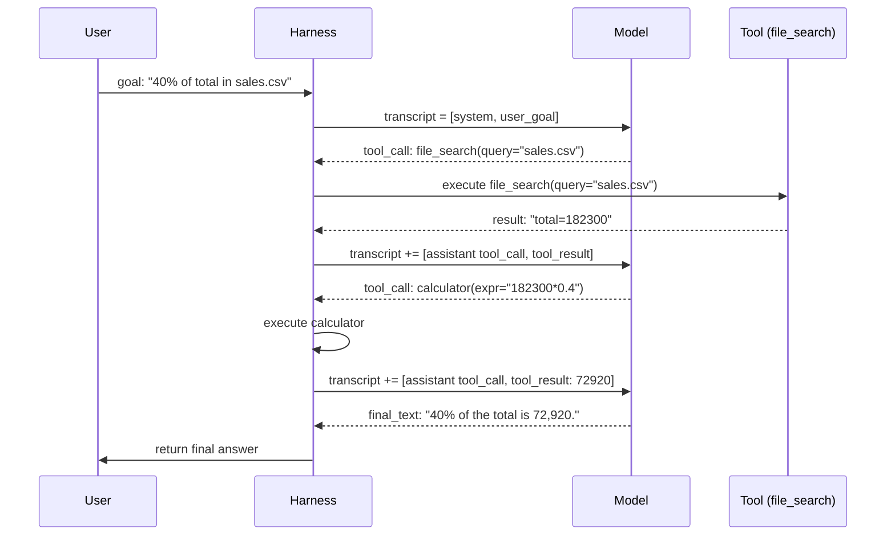

> **One-paragraph hook:** Every agent, regardless of framework, reduces to the same five-line loop: call the model, check whether it asked for a tool, run the tool if so, append the result, repeat. Everything that makes agents impressive or infuriating — emergent multi-step problem solving, runaway cost, infinite loops, context blowups — is a consequence of what happens inside that unglamorous `while` loop, not of anything mystical about the model.

## The mechanism

At its core, the loop is:

```
transcript = [system_prompt, user_goal]
for turn in range(max_iterations):
    response = model.call(transcript, tools=tool_schemas)
    transcript.append(response)
    if response.has_tool_calls:
        for call in response.tool_calls:
            result = execute(call.name, call.arguments)
            transcript.append(tool_result(call.id, result))
    else:
        return response.final_text   # model chose to stop
raise BudgetExceeded()
```

Four things are doing real work here. **Receive goal**: the transcript starts with a system prompt (role, tools, stopping rules) and a user goal. **Model emits reasoning + action**: the model either produces a tool call (structured — see [[Concept - Tool Use and Function Calling]]) or a final answer with no tool call. **Harness executes**: the harness, not the model, actually runs the requested function against the real world — the model only ever asked for it. **Append observation**: the tool's return value is appended to the transcript as a role-tagged message (`tool` in OpenAI's framing, a `tool_result` content block in Anthropic's), and the whole augmented transcript is sent back in on the next call. The loop repeats until a stop condition fires.

**Termination logic** is the single most consequential design decision in the whole system, because *nothing else in the loop naturally bounds it*. The model can, in principle, stop itself by emitting a turn with no tool calls — that's the "I'm done" signal. But you cannot trust an unbounded model to always do this promptly, so every production harness layers hard guardrails on top: a `max_iterations` cap (typically 10-50 depending on task complexity) and a token or wall-clock budget. Who owns the stop decision — the model's judgment, or the harness's hard limit — is the crux of the whole design, because get it wrong in either direction and you get a premature stop (harness cuts off a model mid-task) or a runaway loop (model never recognizes it's done, or worse, oscillates).

**Context accumulation** is the other structural fact that shapes everything downstream. The transcript is append-only across turns — system, user, assistant, and tool messages all pile up — so both the token count sent on every subsequent call and the dollar cost of the run grow with the number of turns already taken (see [[Concept - Context Engineering for Agents]] and [[Concept - KV Cache]] for why re-sending a growing prefix is expensive per token even before considering total volume). A 30-turn agent run is not 30 independent calls; it's a geometrically growing single call, since turn 30 re-transmits the content of turns 1-29.

## Architecture / walkthrough

Trace one full iteration end to end, using a two-tool agent (a calculator and a file-search tool) asked "what's 40% of the total in `sales.csv`":



Three model calls happened here, not one — each call sees the *entire* growing transcript, not just the newest message. The model's second call is what decides to invoke the calculator rather than eyeballing the arithmetic itself; that decision is entirely the model's, made fresh each turn based on everything accumulated so far. This is what "the LLM dynamically directs its own process" (the [[Concept - What Is an LLM Agent]] definition) looks like mechanically: the harness never told the model to call the calculator next — it only ran what the model asked for.

## In practice

Production harnesses converge on a few concrete numbers. `max_iterations` is commonly set in the 10-50 range: too low and legitimately multi-step tasks get cut off mid-way; too high and a misbehaving loop burns real money before anyone notices. Alongside the turn cap, a token budget (e.g., "abort past 200K cumulative tokens") and a wall-clock timeout are standard belt-and-suspenders limits, because a loop that stays under the iteration cap can still blow through cost or latency budgets if individual tool calls are slow or tool results are large.

**Prefix stability has a real dollar cost attached to it.** Because the transcript is append-only, an agent harness that never edits or reorders earlier messages keeps the token prefix byte-identical across calls — which is exactly what [[Concept - Prompt Caching]] needs to serve cache hits instead of recomputing the full prefill. Reordering messages, retroactively editing an earlier tool result, or compacting the transcript in a way that changes earlier bytes busts the cache and forces a full re-prefill, which on a long-running agent can be the difference between the run being cheap and the run being expensive. This is a non-obvious but load-bearing implementation constraint: whatever context-management strategy you use (see [[Concept - Context Engineering for Agents]]), append-only wins on cost even when a cleverer edit-in-place strategy would save tokens on paper.

## Failure modes

- **Infinite or oscillating loops**: the model repeats an identical failing tool call, or ping-pongs between two states, because the tool's error response gave it no new information to act on. Detection: log a hash of (tool name, arguments) per call and flag repeats; fix with an explicit "you have already tried this" injection or a hard loop-detector in the harness.
- **Premature giving-up**: the model emits a final answer before the task is actually done, usually because the stopping instruction in the system prompt was vague or the model mistook a partial result for a complete one. Detection: a verification step (see [[Concept - Reflection and Self-Correction]]) or a post-condition check on the final answer.
- **Context overflow mid-task**: the transcript grows past the model's context window before the task finishes, either truncating silently (losing early instructions) or erroring outright. Fix: compaction or sub-agent isolation before the window fills, not after.
- **Unhandled tool errors the model doesn't notice**: a tool call fails (exception, timeout, malformed response) and the harness returns something the model reads as a successful, if unusual, result — the model then reasons forward from a false premise for the rest of the run. Fix: tool wrappers must return errors as clearly-labeled, model-readable text, never swallow them or return ambiguous empty results (see [[Gotchas - Agents in Production]]).

## The non-obvious

Everyone treats prompt caching as a serving-layer optimization orthogonal to agent design; in practice it *is* agent design, because the append-only-transcript constraint it imposes shapes how you're allowed to do context management, memory writes, and error correction. A context-management strategy that looks smarter on a whiteboard — edit stale facts out of the middle of the transcript, say — can be a net loss in production the moment it busts the cache prefix on every turn of a long-running agent. The economically correct move is usually the structurally boring one: never touch history, only append, and offload anything that needs editing to an external scratchpad the model re-reads rather than a transcript it edits.

## Evolution

The loop's implementation has gone through four real generations. **Text-parsed ReAct (2022)**, from the original [[Concept - The ReAct Pattern]] paper, had the model emit `Thought:` / `Action:` / `Observation:` as plain text inside one generation stream, which the harness parsed with regex or string matching — brittle, and prone to the model drifting off the expected format. **Native structured function calling** (OpenAI's `functions` API, late 2023; Anthropic's `tool_use` blocks) replaced text parsing with a schema-constrained output the decoder is grammar-guided to produce (see [[Concept - Constrained Decoding]]), eliminating an entire class of parsing failure at a stroke. **Parallel tool calls** let a single model turn request several independent actions at once instead of one call per turn, cutting round-trip latency for embarrassingly parallel steps. Most recently, **interleaved extended-thinking + tool use** lets the model reason at length between tool calls rather than confining reasoning to a single upfront `Thought:` line, which matters for tasks where the right next action only becomes clear after reflecting on the previous observation. Each generation removed one specific failure mode of the previous one rather than reinventing the loop's basic shape — the five-line pseudocode at the top of this note has been stable since 2022; only what fills in `model.call()` has changed. The next evolution is already underway: frontier models increasingly internalize parts of the loop's judgment (when to stop, when to retry) rather than relying purely on harness-imposed rules — see [[Concept - Trained vs Prompted Agents]].

## Connections
- [[Concept - What Is an LLM Agent]] — the prerequisite definition: this note is the internals of the "loop" component that note only names.
- [[Concept - The ReAct Pattern]] — the seminal technique this loop's generation-1 implementation was built directly on, and whose thought/action/observation structure the loop still traces.
- [[Concept - Tool Use and Function Calling]] — the mechanism by which "harness executes" actually works: schemas in, structured calls out.
- [[Concept - Constrained Decoding]] — the decoder-level technique that made native structured tool calling possible, replacing the brittle text parsing of generation-1 ReAct.
- [[Concept - Context Engineering for Agents]] — the discipline of managing what the growing transcript contains, since the loop guarantees the transcript only grows.
- [[Concept - Agent Memory Systems]] — durable storage outside the transcript for facts the loop's append-only context can't hold indefinitely.
- [[Concept - Reflection and Self-Correction]] — the verification step that catches premature-stop failures the loop's own termination logic can't detect on its own.
- [[Gotchas - Agents in Production]] — the aggregated failure catalog this note's failure-modes section is a preview of.
- [[Concept - KV Cache]] — why re-sending a growing prefix on every turn is expensive per-token even before counting total call volume.
- [[Concept - Prompt Caching]] — the serving-layer mechanism that makes append-only transcript design a real cost lever, not just a cleanliness preference.
- [[Concept - Chain-of-Thought and Why It Works]] — the reasoning substrate behind the "thought" half of each loop iteration.
- [[Concept - Trained vs Prompted Agents]] — the frontier direction where models internalize loop judgment (stopping, retrying) that early implementations hardcoded into the harness.
- [[Snippet - A Minimal ReAct Loop]] — this note's pseudocode made concrete and runnable in ~50 lines against a real SDK.

## Sources
- Yao et al. (2022) — "ReAct: Synergizing Reasoning and Acting in Language Models." The paper that established the thought/action/observation interleaving this loop still traces, originally via text parsing.
- Anthropic (Dec 2024) — "Building Effective Agents." Frames the agent loop as the model dynamically directing tool use, and documents native structured tool calling as the successor to text-parsed actions.
