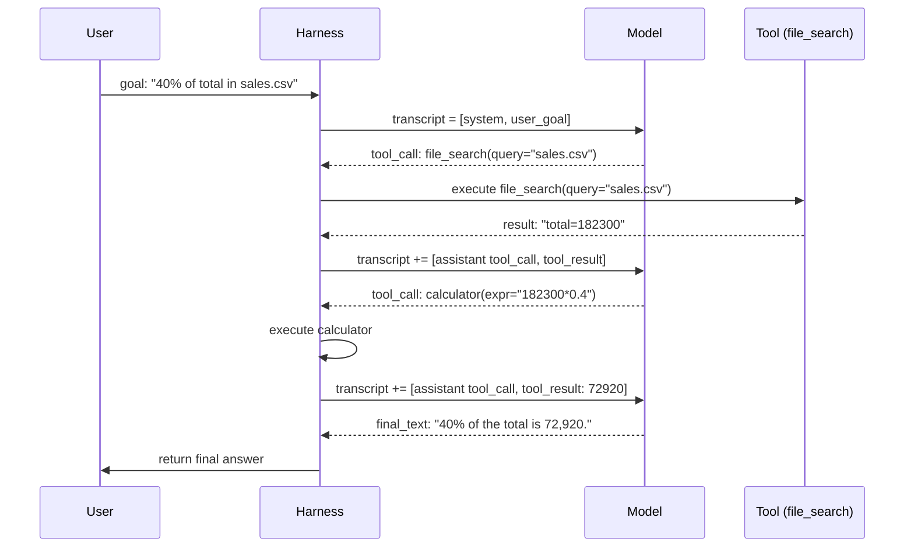

> **One-paragraph hook:** Every agent, whatever the framework, reduces to the same five-line loop: call the model, check whether it asked for a tool, run the tool if so, append the result, repeat. Everything that makes agents impressive or infuriating (multi-step problem solving, runaway cost, infinite loops, context blowups) comes out of that unglamorous `while` loop. There's nothing mystical about the model involved.

## The mechanism

At its core, the loop is:

```
transcript = [system_prompt, user_goal]
for turn in range(max_iterations):
    response = model.call(transcript, tools=tool_schemas)
    transcript.append(response)
    if response.has_tool_calls:
        for call in response.tool_calls:
            result = execute(call.name, call.arguments)
            transcript.append(tool_result(call.id, result))
    else:
        return response.final_text   # model chose to stop
raise BudgetExceeded()
```

Four steps do the work:

- **Receive goal.** The transcript starts with a system prompt (role, tools, stopping rules) and a user goal.
- **Model emits reasoning + action.** The model produces either a structured tool call (see [[Concept - Tool Use and Function Calling]]) or a final answer with no tool call.
- **Harness executes.** The harness runs the requested function against the real world. The model only asked for it.
- **Append observation.** The tool's return value goes onto the transcript as a role-tagged message (`tool` in OpenAI's framing, a `tool_result` content block in Anthropic's), and the whole augmented transcript is sent back on the next call.

The loop repeats until a stop condition fires.

**Termination logic** is the most consequential design decision in the system, because *nothing else in the loop bounds it*. The model can stop itself by emitting a turn with no tool calls; that's the "I'm done" signal. You can't trust an unbounded model to do this promptly, so every production harness adds hard guardrails: a `max_iterations` cap (typically 10-50 depending on task complexity) and a token or wall-clock budget. Who owns the stop decision, the model's judgment or the harness's hard limit, is the crux. Get it wrong one way and the harness cuts the model off mid-task. Get it wrong the other way and the loop runs away: the model never recognizes it's done, or worse, oscillates.

**Context accumulation** shapes everything else. The transcript is append-only across turns (system, user, assistant and tool messages all pile up), so the tokens sent on each later call and the dollar cost of the run both grow with the turns already taken (see [[Concept - Context Engineering for Agents]], and [[Concept - KV Cache]] for why re-sending a growing prefix is expensive per token before you even count total volume). A 30-turn agent run isn't 30 independent calls. It's one call that keeps growing, since turn 30 re-transmits the content of turns 1-29.

## Architecture / walkthrough

Here's one full run end to end, with a two-tool agent (a calculator and a file-search tool) asked "what's 40% of the total in `sales.csv`":



That's three model calls, and each one sees the *entire* growing transcript. On the second call the model decides to use the calculator instead of eyeballing the arithmetic. That decision is entirely the model's, made fresh each turn from everything accumulated so far. This is what "the LLM dynamically directs its own process" (the [[Concept - What Is an LLM Agent]] definition) looks like mechanically: the harness never told the model to call the calculator next. It only ran what the model asked for.

## In practice

Production harnesses converge on a few numbers. `max_iterations` is commonly 10-50. Too low and legitimately multi-step tasks get cut off; too high and a misbehaving loop burns real money before anyone notices. Alongside the turn cap, a token budget (e.g., "abort past 200K cumulative tokens") and a wall-clock timeout are standard belt-and-suspenders limits. A loop under the iteration cap can still blow the cost or latency budget if individual tool calls are slow or return large results.

**Prefix stability costs real money.** Because the transcript is append-only, a harness that never edits or reorders earlier messages keeps the token prefix byte-identical across calls. That's what [[Concept - Prompt Caching]] needs to serve cache hits instead of recomputing the full prefill. Reordering messages, retroactively editing an earlier tool result, or compacting in a way that changes earlier bytes busts the cache and forces a full re-prefill. On a long-running agent that can decide whether the run is cheap or expensive. It's an easy constraint to miss, and it matters: whatever context-management strategy you use (see [[Concept - Context Engineering for Agents]]), append-only wins on cost even when a cleverer edit-in-place scheme would save tokens on paper.

## Failure modes

- **Infinite or oscillating loops.** The model repeats an identical failing tool call, or ping-pongs between two states, because the tool's error gave it nothing new to act on. Detection: log a hash of (tool name, arguments) per call and flag repeats. Fix with an explicit "you have already tried this" injection or a hard loop detector in the harness.
- **Premature giving-up.** The model emits a final answer before the task is done, usually because the system prompt's stopping instruction was vague or the model took a partial result for a complete one. Detection: a verification step (see [[Concept - Reflection and Self-Correction]]) or a post-condition check on the final answer.
- **Context overflow mid-task.** The transcript outgrows the model's context window before the task finishes and either truncates silently (losing early instructions) or errors outright. Fix: compact or isolate into sub-agents before the window fills, not after.
- **Unhandled tool errors the model doesn't notice.** A tool call fails (exception, timeout, malformed response) and the harness returns something the model reads as a successful if unusual result. The model then reasons from a false premise for the rest of the run. Fix: tool wrappers must return errors as clearly labeled, model-readable text, and never swallow them or return ambiguous empty results (see [[Gotchas - Agents in Production]]).

## The non-obvious

People treat prompt caching as a serving-layer optimization separate from agent design. In practice it is agent design, because the append-only constraint it imposes limits how you can do context management, memory writes and error correction. A strategy that looks smarter on a whiteboard, like editing stale facts out of the middle of the transcript, can lose money in production once it busts the cache prefix on every turn of a long-running agent. The economical move is usually the boring one: never touch history, only append, and put anything that needs editing in an external scratchpad the model re-reads.

## Evolution

The loop's implementation has had four generations.

1. **Text-parsed ReAct (2022).** In the original [[Concept - The ReAct Pattern]] paper the model emitted `Thought:` / `Action:` / `Observation:` as plain text in one generation stream, and the harness parsed it with regex or string matching. Brittle, and the model tended to drift off the expected format.
2. **Native structured function calling** (OpenAI's `functions` API, late 2023; Anthropic's `tool_use` blocks). Text parsing gave way to schema-constrained output the decoder is grammar-guided to produce (see [[Concept - Constrained Decoding]]), which removed a whole class of parsing failure at once.
3. **Parallel tool calls.** One model turn can request several independent actions instead of one per turn, cutting round-trip latency for embarrassingly parallel steps.
4. **Interleaved extended thinking + tool use.** The model can reason at length between tool calls instead of in a single upfront `Thought:` line. That matters when the right next action only becomes clear after reflecting on the last observation.

Each generation fixed one failure mode of the previous one and kept the loop's shape. The five-line pseudocode at the top has been stable since 2022; only what fills in `model.call()` has changed. The next step is already underway: frontier models increasingly internalize parts of the loop's judgment (when to stop, when to retry) instead of relying purely on harness rules. See [[Concept - Trained vs Prompted Agents]].

## Connections
- [[Concept - What Is an LLM Agent]] — the prerequisite definition: this note is the internals of the "loop" component that note only names.
- [[Concept - The ReAct Pattern]] — the seminal technique this loop's generation-1 implementation was built directly on, and whose thought/action/observation structure the loop still traces.
- [[Concept - Tool Use and Function Calling]] — the mechanism by which "harness executes" actually works: schemas in, structured calls out.
- [[Concept - Constrained Decoding]] — the decoder-level technique that made native structured tool calling possible, replacing the brittle text parsing of generation-1 ReAct.
- [[Concept - Context Engineering for Agents]] — the discipline of managing what the growing transcript contains, since the loop guarantees the transcript only grows.
- [[Concept - Agent Memory Systems]] — durable storage outside the transcript for facts the loop's append-only context can't hold indefinitely.
- [[Concept - Reflection and Self-Correction]] — the verification step that catches premature-stop failures the loop's own termination logic can't detect on its own.
- [[Gotchas - Agents in Production]] — the aggregated failure catalog this note's failure-modes section is a preview of.
- [[Concept - KV Cache]] — why re-sending a growing prefix on every turn is expensive per-token even before counting total call volume.
- [[Concept - Prompt Caching]] — the serving-layer mechanism that makes append-only transcript design a real cost lever, not just a cleanliness preference.
- [[Concept - Chain-of-Thought and Why It Works]] — the reasoning substrate behind the "thought" half of each loop iteration.
- [[Concept - Trained vs Prompted Agents]] — the frontier direction where models internalize loop judgment (stopping, retrying) that early implementations hardcoded into the harness.
- [[Snippet - A Minimal ReAct Loop]] — this note's pseudocode made concrete and runnable in ~50 lines against a real SDK.

## Sources
- Yao et al. (2022) — "ReAct: Synergizing Reasoning and Acting in Language Models." The paper that established the thought/action/observation interleaving this loop still traces, originally via text parsing.
- Anthropic (Dec 2024) — "Building Effective Agents." Frames the agent loop as the model dynamically directing tool use, and documents native structured tool calling as the successor to text-parsed actions.
