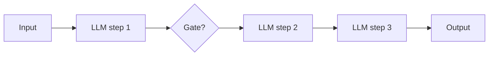
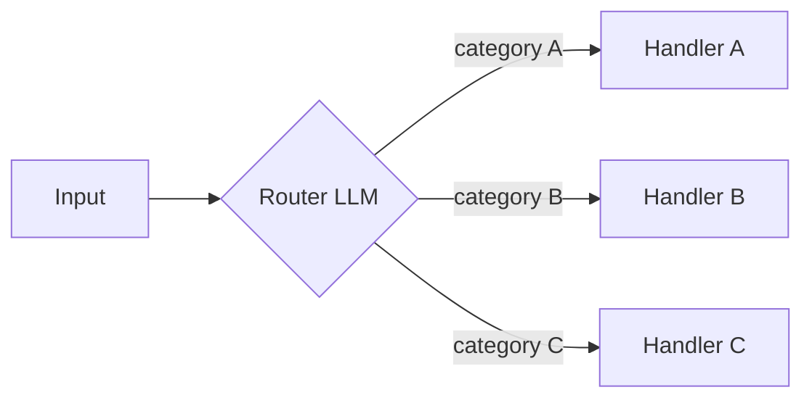
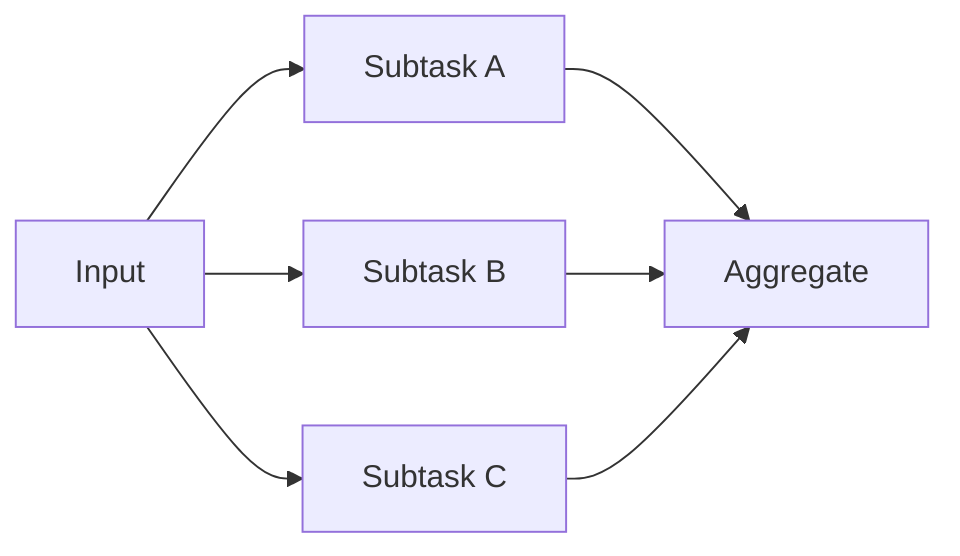
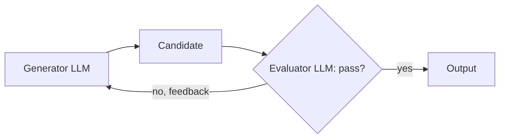

> **Problem:** most tasks that get built as autonomous agents don't need to be. They need predictable, debuggable orchestration with an LLM doing the reasoning at each fixed step. **Solution shape:** compose a small set of well-understood control-flow patterns around an augmented LLM, and reach for a full agent only when the control flow can't be predetermined.

## Context & forces

The taxonomy comes from Anthropic's "Building Effective Agents" (Dec 2024). It answers a tension every team building on LLMs runs into. Agents (see [[Concept - What Is an LLM Agent]]) are maximally flexible but pay a reliability tax: every autonomous step is a chance to go wrong, and the system gets harder to test, debug, and bound on latency and cost. Fixed code paths are the reverse. They're predictable and cheap to reason about, but only handle the task shapes their author anticipated.

Most real tasks sit in between. They have real structure (a known sequence of stages, a known set of input categories, a known way to check an output) that doesn't require handing control flow to the model, yet each stage still needs an LLM's judgment. These five patterns are the vocabulary for that middle ground. Each fixes the control flow in code and uses the LLM only for the step that needs language understanding or generation.

Under all five sits the **augmented LLM**: a single model call wired up with retrieval, tools and memory. Every pattern below composes augmented LLM calls, and none asks the model to decide *what happens next* in the control-flow sense. Your code makes that call.

## The pattern

**Prompt chaining.** Break the task into a fixed sequence of LLM steps, each feeding the next, with optional programmatic gates in between (e.g., validate step 2's output before running step 3). Use it when the task splits cleanly into stable subtasks that always run in the same order.

**Routing.** A classifier LLM call inspects the input and dispatches it to one of several specialized handlers, each tuned for its category. Use it for heterogeneous inputs that need different handling, beyond just a different prompt.

**Parallelization** comes in two shapes. *Sectioning* splits a task into independent subtasks, runs them concurrently, and stitches the results together (e.g., one call checks content safety while another drafts the response). *Voting* runs the same task N times, often with varied prompts or temperature, and aggregates. It trades tokens for reliability on tasks where any single call has meaningful variance.

**Evaluator-optimizer.** One LLM generates a candidate. A second LLM (or the same model as critic) checks it against explicit criteria and returns feedback, and the loop repeats until the evaluator accepts or a retry cap is hit. It only pays off when the evaluator has a real signal to check against; [[Concept - Reflection and Self-Correction]] explains why introspective self-grading without an external check tends to plateau or backslide.

## Implementation notes

Pick the most constrained pattern that solves the task and escalate only when you hit its ceiling: chaining before routing, routing before parallelization, any of the four before a full [[Deep Dive - The Agent Loop]] autonomous agent. If you've erred toward too little flexibility, the code keeps growing special cases for inputs the pattern wasn't built for. If you've erred toward too much, the "autonomous" agent executes the same five steps every run, and it should have been a chain. [[Concept - Task Decomposition and Planning]] covers how the "decompose into subtasks" half of chaining and parallelization gets designed once the task is more than a fixed list of stages. Evaluator-optimizer loops need an explicit stop condition (max retries, not just "until good") or they turn into an unbounded cost sink. That's the same iteration-cap discipline [[Deep Dive - The Agent Loop]] demands of any loop.

## Tradeoffs & when NOT to use

Every one of these patterns spends more tokens than a single raw call, and parallelization/voting multiplies cost linearly with fan-out (budgeting math in [[Concept - Cost Engineering for LLM Applications]]). Routing is wasted machinery when there's only one real input category. Chaining is wasted on a task that's one atomic step. Evaluator-optimizer does harm when the evaluator judges quality no better than the generator produced it: you pay for a loop that adds latency and no signal. And if the task's structure is unknown ahead of time and has to be discovered at runtime, none of the five fit. Escalate to [[Pattern - Orchestrator-Worker Agents]] or a full autonomous loop instead of forcing a fixed pattern onto it.

## Known uses

- **Prompt chaining** is the standard shape for structured content pipelines, e.g. an outline → draft → fact-check → polish document generator, gated at each stage.
- **Routing** is the standard shape for customer-support triage that sends a ticket to a billing handler, a technical handler, or human escalation based on an initial classification pass.
- **Parallelization (voting)** underlies self-consistency-style answer aggregation and multi-reviewer LLM code review, where several independent passes are reconciled instead of trusting any one.
- **Evaluator-optimizer** loops show up in coding assistants that generate a patch, run the tests as evaluator, and iterate. [[Breakdown - SWE-bench and SWE-agent]] shows this scaling into a full agent once the loop gets an environment in place of a static critic.

## Connections

- [[Concept - What Is an LLM Agent]] — these five patterns are exactly the workflow half of the workflow-vs-agent distinction that note draws; this pattern is what you reach for before escalating to that note's autonomous end of the ladder.
- [[Deep Dive - The Agent Loop]] — the fully autonomous scaffold these patterns are deliberately more constrained than; understanding the loop's reliability tax is why you'd prefer a fixed pattern when one fits.
- [[Pattern - Orchestrator-Worker Agents]] — the dynamic, runtime-decomposed escalation from parallelization's static sectioning, used when the split into subtasks can't be fixed in code ahead of time.
- [[Concept - Reflection and Self-Correction]] — the mechanism (and the sharp limits) behind why an evaluator-optimizer loop helps only when the evaluator has real external signal.
- [[Concept - Task Decomposition and Planning]] — the deeper design question of how a task actually gets split into the sequential or parallel subtasks that chaining and parallelization assume are already given.
- [[Deep Dive - RAG Architectures]] — the augmented LLM's retrieval half is usually a RAG pipeline; each pattern here composes that same augmented unit rather than reinventing retrieval per step.
- [[Concept - Cost Engineering for LLM Applications]] — every pattern here multiplies token spend versus a single call, and parallelization/voting multiplies it linearly with fan-out, so the pattern choice is directly a cost decision.

## Sources
- Anthropic (Dec 2024) — "Building Effective Agents." Source of this five-pattern taxonomy (augmented LLM, prompt chaining, routing, parallelization, evaluator-optimizer) and the design guidance to prefer the most constrained pattern that works.
