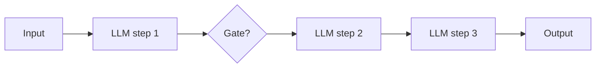
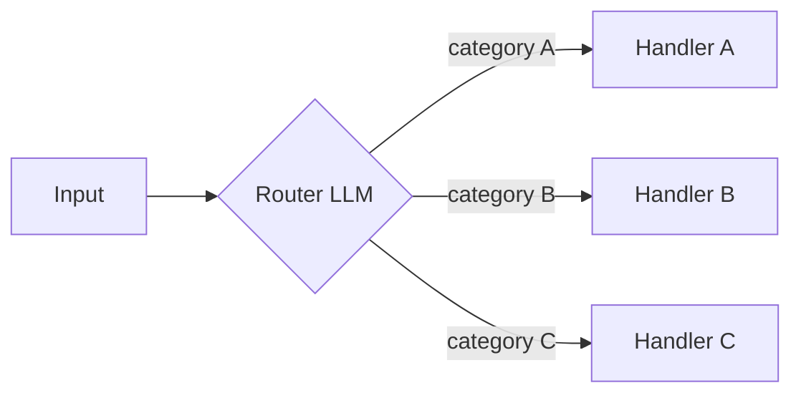
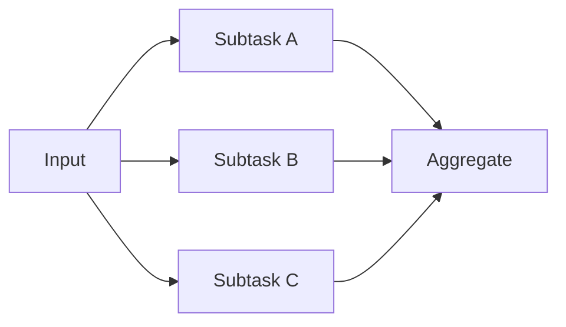
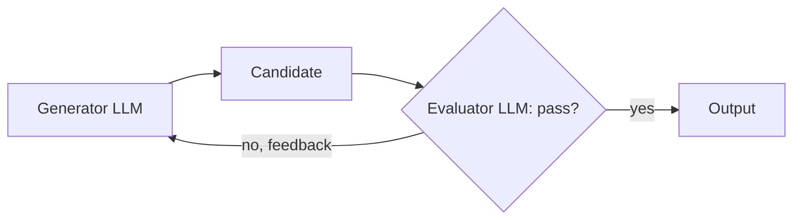

> **Problem:** most tasks that get built as autonomous agents don't need to be — they need predictable, debuggable orchestration with an LLM doing the reasoning at each fixed step. **Solution shape:** compose a small set of well-understood control-flow patterns around an augmented LLM, and reach for a full agent only when the control flow genuinely cannot be predetermined.

## Context & forces

The taxonomy comes from Anthropic's "Building Effective Agents" (Dec 2024), and it exists because of a tension every team building on LLMs hits: agents (see [[Concept - What Is an LLM Agent]]) are maximally flexible but pay a reliability tax — every autonomous step is a chance to go wrong, and the resulting system is harder to test, harder to debug, and harder to put a latency/cost bound on. Fixed code paths are the opposite: predictable and cheap to reason about, but they can only handle the shapes of task their author anticipated. Most real tasks fall in between — they have real structure (a known sequence of stages, a known set of input categories, a known way to check an output) that doesn't require ceding control flow to the model, but they still need an LLM's judgment at each stage. These five patterns are the vocabulary for that middle ground: each fixes the control flow in code and uses the LLM only for the step that genuinely needs language understanding or generation.

The base unit underneath all five is the **augmented LLM** — a single model call wired up with retrieval, tools, and memory. Every pattern below is a composition of augmented LLM calls; none of them require the model to decide *what happens next* in the control-flow sense — that decision is made by your code.

## The pattern

**Prompt chaining** — decompose a task into a fixed sequence of LLM steps, each one's output feeding the next, with optional programmatic gates in between (e.g., validate step 2's output before running step 3). Use it when the task splits cleanly into stable subtasks that always happen in the same order.

**Routing** — a classifier LLM call inspects the input and dispatches it to one of several specialized downstream handlers, each tuned for its own input category. Use it for heterogeneous inputs that need genuinely different handling, not just different prompts.

**Parallelization** has two distinct shapes. *Sectioning* splits a task into independent subtasks run concurrently and stitches the results together (e.g., one call checks content safety while another drafts the response). *Voting* runs the same task N times — often with varied prompts or temperature — and aggregates the results, trading tokens for reliability on tasks where any single call has meaningful variance.

**Evaluator-optimizer** — one LLM generates a candidate, a second LLM (or the same model in a critic role) evaluates it against explicit criteria and returns feedback, and the loop repeats until the evaluator accepts the output or a retry cap is hit. This only pays off when the evaluator has a real signal to check against — see [[Concept - Reflection and Self-Correction]] on why introspective self-grading without an external check tends to plateau or backslide.

## Implementation notes

Pick the most constrained pattern that solves the task, and only escalate when you hit its ceiling — chaining before routing, routing before parallelization, any of the four before a full [[Deep Dive - The Agent Loop]] autonomous agent. The tell that you've picked wrong in the *permissive* direction is a fixed pattern where the code keeps growing special cases to handle inputs the pattern wasn't built for; the tell in the *restrictive* direction is an agent whose "autonomy" is really executing the same five steps every single run, which means it should have been a chain. [[Concept - Task Decomposition and Planning]] is the deeper mechanics of how the "decompose into subtasks" half of chaining and parallelization actually gets designed once the task is more than a fixed list of stages. Evaluator-optimizer loops need an explicit stop condition (max retries, not just "until good") or they become an unbounded cost sink — the same iteration-cap discipline [[Deep Dive - The Agent Loop]] requires of any loop.

## Tradeoffs & when NOT to use

Every one of these patterns spends more tokens than a single raw call, and parallelization/voting in particular multiplies cost linearly with the fan-out — see [[Concept - Cost Engineering for LLM Applications]] for the budgeting math. Routing is wasted machinery on a task with only one real input category; chaining is wasted machinery on a task that's genuinely one atomic step; evaluator-optimizer is actively harmful when the evaluator can't judge quality better than the generator produced it, because you're paying for a loop that adds latency without adding signal. None of these five patterns should be reached for when the actual problem is that the task's structure is unknown ahead of time and genuinely has to be discovered at runtime — that's the signal to escalate to [[Pattern - Orchestrator-Worker Agents]] or a full autonomous loop instead of forcing a fixed pattern to fit.

## Known uses

- **Prompt chaining** is the standard shape for structured content pipelines — e.g., an outline-then-draft-then-fact-check-then-polish document generator, gated at each stage.
- **Routing** is the standard shape for customer-support triage systems that dispatch a ticket to a billing handler, a technical handler, or a human-escalation handler based on an initial classification pass.
- **Parallelization (voting)** underlies self-consistency-style answer aggregation and multi-reviewer LLM code review, where several independent passes are reconciled rather than trusted one at a time.
- **Evaluator-optimizer** loops are used in coding assistants that generate a patch, run it against tests as the evaluator, and iterate — the pattern [[Breakdown - SWE-bench and SWE-agent]] shows scaling into a full agent once the loop gets an environment instead of a static critic.

## Connections

- [[Concept - What Is an LLM Agent]] — these five patterns are exactly the workflow half of the workflow-vs-agent distinction that note draws; this pattern is what you reach for before escalating to that note's autonomous end of the ladder.
- [[Deep Dive - The Agent Loop]] — the fully autonomous scaffold these patterns are deliberately more constrained than; understanding the loop's reliability tax is why you'd prefer a fixed pattern when one fits.
- [[Pattern - Orchestrator-Worker Agents]] — the dynamic, runtime-decomposed escalation from parallelization's static sectioning, used when the split into subtasks can't be fixed in code ahead of time.
- [[Concept - Reflection and Self-Correction]] — the mechanism (and the sharp limits) behind why an evaluator-optimizer loop helps only when the evaluator has real external signal.
- [[Concept - Task Decomposition and Planning]] — the deeper design question of how a task actually gets split into the sequential or parallel subtasks that chaining and parallelization assume are already given.
- [[Deep Dive - RAG Architectures]] — the augmented LLM's retrieval half is usually a RAG pipeline; each pattern here composes that same augmented unit rather than reinventing retrieval per step.
- [[Concept - Cost Engineering for LLM Applications]] — every pattern here multiplies token spend versus a single call, and parallelization/voting multiplies it linearly with fan-out, so the pattern choice is directly a cost decision.

## Sources
- Anthropic (Dec 2024) — "Building Effective Agents." Source of this five-pattern taxonomy (augmented LLM, prompt chaining, routing, parallelization, evaluator-optimizer) and the design guidance to prefer the most constrained pattern that works.
