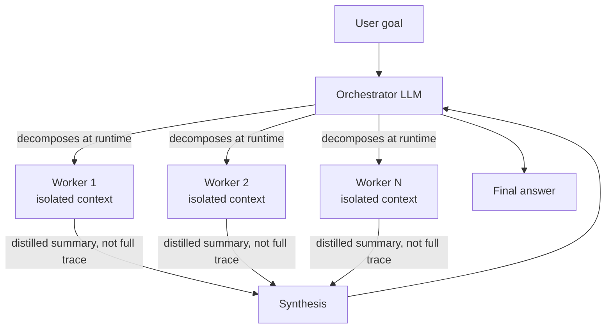

> **Problem:** An open-ended task (broad research, a wide document review, a large-codebase survey) has subtasks you can't enumerate in advance, and a single agent working through them serially drowns its context window in detail from all of them at once. **Solution shape:** a lead orchestrator LLM decides at runtime how many workers to spawn and what each one investigates. Each worker runs in its own isolated context, and the orchestrator synthesizes their distilled findings into one answer.

## Context & forces

Use this when a task splits into subtasks that are largely independent and read-heavy (parallel research questions, parallel document analyses) and don't need to share mutable state while they run. It's the runtime-decided counterpart to the *static* parallelization block in [[Pattern - Agentic Workflow Building Blocks]], which sections a task into a fixed, known set of parallel calls. Here the lead agent decides the decomposition on the fly. That's what makes it a multi-agent pattern and not a workflow with concurrency bolted on.

The forces pull three ways. Parallelism and clean context isolation cost coordination overhead and a real multiple of the token bill. A runtime-decided split is flexible, but you lose the single shared context that would let subtasks build on each other's intermediate findings. And synthesis quality is at risk when independently spawned workers duplicate effort or return contradictory conclusions with no shared state to reconcile against.

## The pattern

The orchestrator gets the goal, decides at runtime how to decompose it, and spawns N workers, each with a clean context window scoped to one subtask. Each worker runs its own [[Deep Dive - The Agent Loop]]-shaped trajectory and hands back a **distilled summary**, never its full trace. The orchestrator synthesizes the summaries into the final answer. It's map-reduce with LLM calls doing both the map and the reduce. [[Concept - Multi-Agent Orchestration]] places this in a broader survey of topologies, and [[Concept - Task Decomposition and Planning]] covers how the orchestrator decides where subtask boundaries go.

Context isolation is the main benefit. Instead of one enormous, ever-growing transcript, the system runs several small ones in parallel and pays the integration cost once, at synthesis. It's the multi-agent answer to the single-agent context-rot ceiling in [[Concept - Context Engineering for Agents]]: no compacting or offloading inside one window, because no window ever grows past one subtask's worth of content.

## Implementation notes

The orchestrator's prompt has to spell out how to delegate (what a well-scoped subtask boundary looks like) and how much effort to give each worker, scaled to task complexity. Ten workers for a two-fact lookup is pure token waste; one worker for a broad research question caps quality at single-agent levels. Workers must return summaries. Piping a worker's raw transcript back to the orchestrator fills the orchestrator's window with detail it didn't need and throws away the isolation benefit. Since an LLM decides the decomposition at runtime, expect some overlapping or redundant assignments; a light dedup/merge pass during synthesis catches most of them. Measure and cap tokens per full run, not per turn. The decomposition call, all N workers' complete trajectories, and the synthesis call all bill separately and add up fast.

## Tradeoffs & when NOT to use

The cost is large. Anthropic measured multi-agent systems of this shape burning roughly 15x the tokens of a single chat interaction, with token volume alone explaining roughly 80% of the performance variance across configurations. Weigh that against [[Concept - Cost Engineering for LLM Applications]] before adopting the pattern. It buys capability by spending more tokens, with no gain in efficiency per token.

It breaks down when subtasks share mutable state or write to a common artifact. Workers editing the same file, database row or document produce conflicting writes that no synthesis step can cleanly reconcile afterward. [[Decision - Single-Agent vs Multi-Agent]] frames this as the read-heavy-parallel versus write-heavy-shared-artifact split that decides whether to use the pattern at all. When the subtasks are few, known in advance, and don't need runtime judgment to define, use the fixed parallelization block in [[Pattern - Agentic Workflow Building Blocks]]. You get the same concurrency without paying for a second LLM to decide how to split the work.

## Known uses

- **Anthropic's internal multi-agent research system (2025).** A lead agent spins up parallel research subagents over the web and tools and synthesizes their findings. Reported to beat a single-agent baseline by roughly 90% on an internal research evaluation. [[Breakdown - Anthropic's Multi-Agent Research System]] has the full walkthrough, including the cost numbers above.
- **2025-era deep-research agents from OpenAI and Google** use the same orchestrator-plus-parallel-researchers shape for broad web research.
- **Large-scale document map-reduce pipelines.** A lead agent splits a large corpus into per-document or per-section worker passes and reduces the results. It's the fan-out/synthesize machinery of [[Deep Dive - RAG Architectures]], with LLM workers doing the fan-out in place of embedding-similarity retrieval.

## Connections

- [[Deep Dive - The Agent Loop]] — each worker executes an instance of the general observe-act loop, scoped down to a single subtask.
- [[Concept - Multi-Agent Orchestration]] — orchestrator-worker is one specific topology (lead plus isolated workers) within the broader survey of multi-agent coordination shapes.
- [[Breakdown - Anthropic's Multi-Agent Research System]] — the concrete, measured real-world instance of this pattern, including the ~90% win and ~15x cost numbers cited above.
- [[Decision - Single-Agent vs Multi-Agent]] — the go/no-go test (read-heavy-parallel vs write-heavy-shared-artifact) for whether to reach for this pattern at all.
- [[Pattern - Agentic Workflow Building Blocks]] — the fixed, pre-decomposed parallelization block this pattern generalizes into a runtime, LLM-decided decomposition.
- [[Concept - Context Engineering for Agents]] — worker context isolation is this pattern's answer to the single-agent context-rot problem.
- [[Concept - Task Decomposition and Planning]] — the mechanics of how the orchestrator actually decides the subtask split.
- [[Concept - Cost Engineering for LLM Applications]] — the ~15x token multiplier makes this pattern a cost-engineering decision as much as an architecture decision.
- [[Deep Dive - RAG Architectures]] — large-scale document map-reduce uses this pattern's fan-out/synthesize shape with LLM workers standing in for embedding retrieval.

## Sources
- Anthropic (2025) — "How we built our multi-agent research system." Source of the ~90% single-agent-beating result, the ~15x token multiplier, and the orchestrator-worker terminology used here.
- Cognition (2025) — "Don't Build Multi-Agents." The counter-evidence on write-conflict and coordination failure that bounds when this pattern is appropriate.
