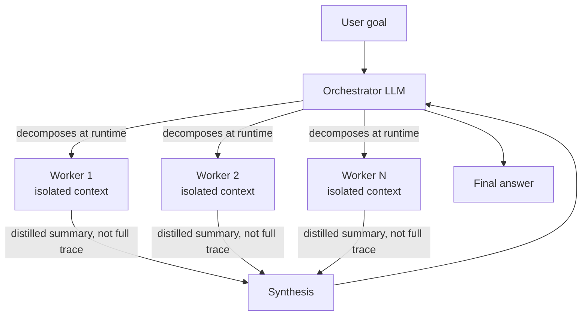

> **Problem:** An open-ended task — broad research, a wide document review, a large-codebase survey — has subtasks that can't be enumerated in advance, and a single agent working through all of them serially drowns its own context window in detail from every subtask at once. **Solution shape:** a lead orchestrator LLM decides at runtime how many workers to spawn and what each investigates, each worker runs in its own isolated context, and the orchestrator synthesizes their distilled findings into one answer.

## Context & forces

This pattern applies when a task decomposes into subtasks that are largely independent and read-heavy — parallel research questions, parallel document analyses — and don't need to share mutable state with each other while they run. It's the runtime-decided counterpart to the *static* parallelization block in [[Pattern - Agentic Workflow Building Blocks]], which sections a task into a fixed, pre-known set of parallel calls; orchestrator-worker instead lets the lead agent itself decide the decomposition on the fly, which is the piece that makes it a genuine multi-agent pattern rather than a workflow with concurrency bolted on.

The forces in tension: parallelism and clean context isolation versus coordination overhead and a real multiple of the token bill; the flexibility of a runtime-decided split versus losing the single shared context that would otherwise let subtasks build on each other's intermediate findings; and synthesis quality versus the risk that independently-spawned workers duplicate effort or return contradictory conclusions with no shared state to reconcile them against.

## The pattern

The orchestrator receives the goal, decides at runtime how to decompose it, and spawns N workers, each with its own clean context window scoped to one subtask. Each worker runs its own [[Deep Dive - The Agent Loop]]-shaped trajectory independently and returns a **distilled summary**, not its full trace, back to the orchestrator. The orchestrator synthesizes the summaries into the final answer — effectively map-reduce, but with LLM calls standing in for both the map and the reduce step. [[Concept - Multi-Agent Orchestration]] covers this as one instance of a broader topology survey; [[Concept - Task Decomposition and Planning]] covers the mechanics of how the orchestrator actually decides where the subtask boundaries go.

Context isolation is the load-bearing benefit, not a side effect: instead of managing one enormous, ever-growing transcript, the system runs several small ones in parallel and pays the integration cost once, at synthesis. This is the multi-agent answer to the single-agent context-rot ceiling that [[Concept - Context Engineering for Agents]] describes — rather than compacting or offloading within one window, the pattern sidesteps the problem by never letting any single window grow past one subtask's worth of content.

## Implementation notes

The orchestrator's prompt has to state explicitly both how to delegate — what actually constitutes a well-scoped subtask boundary — and how much effort to allocate per worker, scaled to task complexity: spawning ten workers for a two-fact lookup is pure token waste, and spawning one worker for a genuinely broad research question caps quality back down to single-agent levels. Workers must return summaries, not full traces; piping a worker's raw transcript back to the orchestrator defeats the entire isolation benefit, since the orchestrator's own window fills right back up with detail it didn't need. Because the decomposition is decided by an LLM at runtime rather than hardcoded, expect occasional overlapping or redundant worker assignments — a light dedup/merge pass during synthesis catches most of it. Token accounting should be measured and capped per full run, not per turn: the orchestrator's decomposition call, all N workers' complete trajectories, and the final synthesis call all bill separately and add up fast.

## Tradeoffs & when NOT to use

The cost is real and large: Anthropic measured multi-agent systems of this shape burning roughly 15x the tokens of a single chat interaction, with token volume alone explaining roughly 80% of the performance variance observed across configurations — a cost-engineering problem in its own right, worth weighing against [[Concept - Cost Engineering for LLM Applications]] before adopting the pattern. The pattern buys capability by spending tokens, not by being smarter per token spent.

It breaks down specifically when subtasks share mutable state or must write to a common artifact: workers editing the same file, the same database row, or the same document produce conflicting writes that no synthesis step can cleanly reconcile after the fact. [[Decision - Single-Agent vs Multi-Agent]] frames exactly this as the read-heavy-parallel versus write-heavy-shared-artifact split that decides whether to reach for this pattern at all. When the subtasks are few, well-known in advance, and don't require runtime judgment to define, prefer the fixed parallelization block in [[Pattern - Agentic Workflow Building Blocks]] instead — it captures the same concurrency benefit without paying for a second LLM's worth of judgment on how to split the work.

## Known uses

- **Anthropic's internal multi-agent research system (2025)** — a lead agent spins up parallel research subagents over the web and tools and synthesizes their findings; reported to beat a single-agent baseline by roughly 90% on an internal research evaluation. See [[Breakdown - Anthropic's Multi-Agent Research System]] for the full walkthrough, including the cost numbers cited above.
- **2025-era deep-research agents from OpenAI and Google** follow the same orchestrator-plus-parallel-researchers shape for broad web research tasks.
- **Large-scale document map-reduce pipelines**, where a lead agent splits a large corpus into per-document or per-section worker passes and reduces the results — the same fan-out/synthesize machinery as [[Deep Dive - RAG Architectures]], but with LLM workers standing in for embedding-similarity retrieval as the fan-out mechanism.

## Connections

- [[Deep Dive - The Agent Loop]] — each worker executes an instance of the general observe-act loop, scoped down to a single subtask.
- [[Concept - Multi-Agent Orchestration]] — orchestrator-worker is one specific topology (lead plus isolated workers) within the broader survey of multi-agent coordination shapes.
- [[Breakdown - Anthropic's Multi-Agent Research System]] — the concrete, measured real-world instance of this pattern, including the ~90% win and ~15x cost numbers cited above.
- [[Decision - Single-Agent vs Multi-Agent]] — the go/no-go test (read-heavy-parallel vs write-heavy-shared-artifact) for whether to reach for this pattern at all.
- [[Pattern - Agentic Workflow Building Blocks]] — the fixed, pre-decomposed parallelization block this pattern generalizes into a runtime, LLM-decided decomposition.
- [[Concept - Context Engineering for Agents]] — worker context isolation is this pattern's answer to the single-agent context-rot problem.
- [[Concept - Task Decomposition and Planning]] — the mechanics of how the orchestrator actually decides the subtask split.
- [[Concept - Cost Engineering for LLM Applications]] — the ~15x token multiplier makes this pattern a cost-engineering decision as much as an architecture decision.
- [[Deep Dive - RAG Architectures]] — large-scale document map-reduce uses this pattern's fan-out/synthesize shape with LLM workers standing in for embedding retrieval.

## Sources
- Anthropic (2025) — "How we built our multi-agent research system." Source of the ~90% single-agent-beating result, the ~15x token multiplier, and the orchestrator-worker terminology used here.
- Cognition (2025) — "Don't Build Multi-Agents." The counter-evidence on write-conflict and coordination failure that bounds when this pattern is appropriate.
