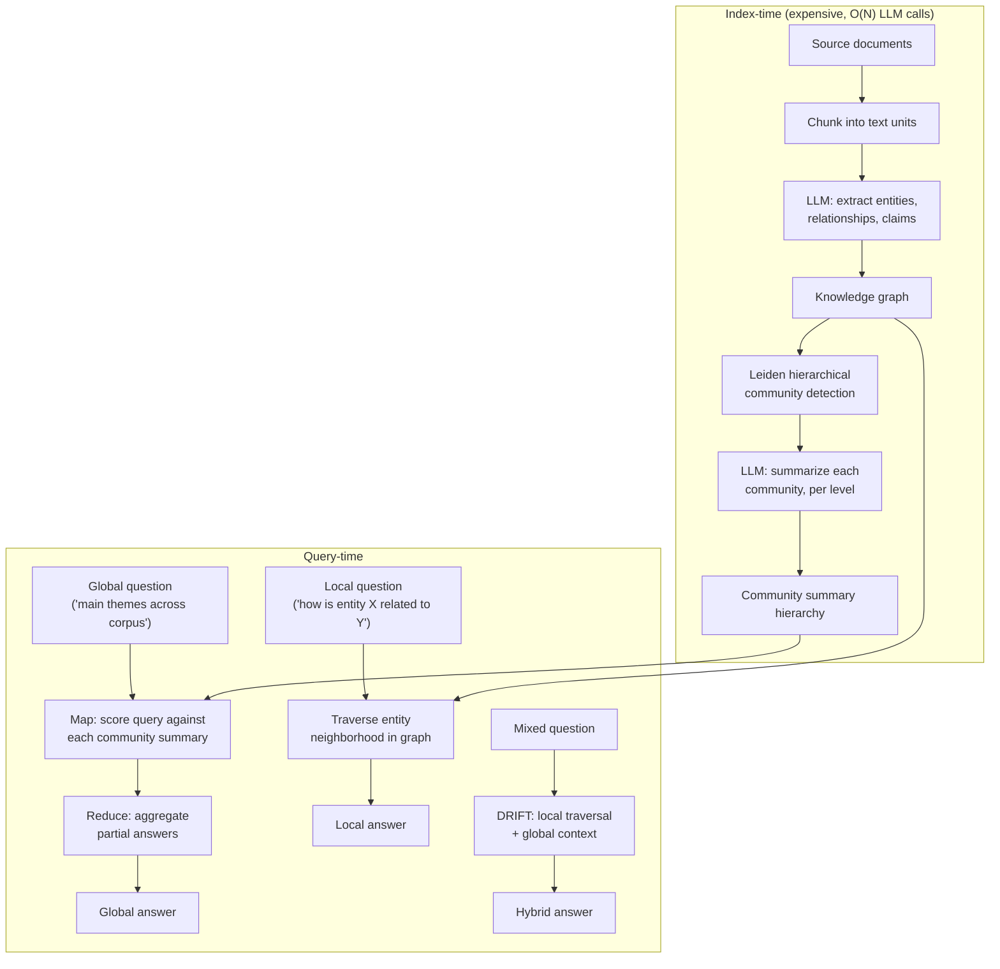

> Microsoft Research released GraphRAG in 2024 (Edge et al., "From Local to Global: A Graph RAG Approach to Query-Focused Summarization") and open-sourced the pipeline shortly after. It targets a class of question naive [[Concept - Retrieval-Augmented Generation|RAG]] can't answer by construction: "what are the main themes across this corpus," "how do these three entities relate," "summarize the overall sentiment." These are global, sensemaking questions. No single chunk holds the answer, so top-$k$ chunk retrieval has nothing good to fetch however well-tuned the retriever is. GraphRAG builds explicit structure at index time (a knowledge graph plus precomputed summaries at several levels of abstraction) so the query-time search has more than flat similarity to work with.

## The headline numbers

Index cost scales with corpus size in a way flat vector RAG's doesn't. Extraction runs one or more LLM calls per chunk across the *entire* corpus, $O(N)$ LLM calls for $N$ chunks, each pushing the full chunk text through an entity/relationship/claim extraction prompt. That's before any community detection or summarization. Community summarization then adds an LLM call per detected community per hierarchy level. It's typically far fewer calls than $N$, since thousands of extracted entities in a real corpus collapse into a few hundred communities across two to four levels, but it's still a real multiplier on top of extraction. This is the central quantitative fact about GraphRAG: indexing costs LLM calls that plain embed-and-index RAG never spends, and Microsoft's own follow-up (LazyGraphRAG, 2024) exists to cut that cost.

## How it actually works

**Indexing pipeline.** Source documents are chunked into text units (the strategies in [[Concept - Chunking Strategies]] apply). An LLM runs entity, relationship and claim/covariate extraction over each chunk. It pulls out structured relational facts and attributable claims as well as entities ("Company X acquired Company Y in 2023," sourced back to its chunk). The extractions accumulate into a knowledge graph over the whole corpus. The Leiden algorithm, a fast modularity-based hierarchical community-detection method, partitions that graph into nested communities: tight clusters of entities at a fine level, grouped into broader clusters at coarser levels. An LLM then writes a natural-language summary for every community at every level. The result is a multi-resolution index of "what this part of the corpus is about" that exists *before* anyone asks a query.

**Query modes.** *Global search* answers corpus-wide sensemaking questions with map-reduce. The map step scores the query against every community summary at a chosen hierarchy level; it's parallelizable and depends only on the number of communities, not corpus size. Partial answers come from the top-scoring summaries, and a reduce step merges them into one response. Individual chunks are never scanned or retrieved. *Local search* answers entity-specific questions by walking the entity's neighborhood in the graph: find the entity, pull its related entities, relationships and claims, and the chunks they trace back to. That's much closer to a classic knowledge-graph QA system. *DRIFT search* mixes the two, grounding an initial answer with local traversal and then pulling in global community context when the question needs broader synthesis.

## The clever parts

1. **Community summaries as precomputed multi-resolution answers.** Answering a global question by reasoning over the raw corpus at query time doesn't fit in a context window for anything beyond a small corpus. GraphRAG moves that reasoning to index time and caches the result as text. Query time becomes cheap relevance scoring over a small set of summaries.
2. **Leiden over naive clustering.** Leiden is a well-established, fast, modularity-optimizing graph algorithm that reliably produces well-connected, non-degenerate communities, and it's hierarchical for free. One clustering pass gives GraphRAG all its levels of abstraction, from fine local clusters up to broad corpus-wide themes, with no separate run per granularity.
3. **Claims and covariates on top of entities and edges.** Extracting structured, attributable claims alongside the graph adds evidence you can trace to source text. That's closer to a citation trail than a bag of entity co-occurrences.
4. **Map-reduce global search skips per-query corpus scanning.** The map step is parallel and its cost scales with the number of communities at the chosen level, not with corpus size. The expensive work of "understanding the whole corpus" happened once, at index time, and every later global query reuses it.
5. **DRIFT as an explicit local/global hybrid.** Many real questions are neither purely entity-specific nor purely corpus-wide. DRIFT doesn't force a single mode; it grounds a global-style answer in a local traversal.

## What it got wrong / what's dated

Index cost is the biggest practical objection, and it's a serious one. For large or fast-changing corpora, LLM extraction over every chunk (re-run, or patched incrementally into the graph, whenever documents change) is expensive and heavier to operate than vector RAG's cheap, embarrassingly parallel embed-and-upsert updates.

Extraction errors compound without any signal. A mis-resolved entity ("Bob Smith" and "Robert Smith" treated as two people, or two different people merged into one) propagates into the graph and into every community summary it touches, and nothing at query time tells you something upstream is wrong. Auditing extraction quality is an ongoing operational burden flat RAG doesn't have.

Staleness makes the cost worse. An incrementally updatable vector index absorbs changes locally, but a meaningfully changed corpus can force a re-run of community detection, because adding or removing entities and relationships can move community boundaries across the whole graph.

Microsoft's own LazyGraphRAG (2024) amounts to an admission of all this. It defers most of the expensive LLM extraction to query time, builds a lighter structure up front with cheap NLP techniques (noun-phrase extraction in place of LLM extraction), and does the expensive reasoning only for the query actually asked, at substantially lower indexing cost than full GraphRAG.

## What to steal

Three ideas transfer even if you never adopt the full pipeline:

- Pre-aggregate structure for the *global* question class your users actually ask, and stop trying to make flat top-$k$ retrieval answer questions it can't.
- Lightweight graph structure (even simple entity linking with no Leiden hierarchy) combined with ordinary vector retrieval measurably helps multi-hop questions that pure chunk similarity misses.
- Route. Most production query traffic is local/factoid, not global/sensemaking, so the best move is usually a router that sends the rare global question down a GraphRAG-style path and keeps everything else on a cheap flat index. Don't pay GraphRAG's indexing cost for a corpus whose query distribution doesn't need it.

That's the general selection judgment in [[Deep Dive - RAG Architectures]]: match architectural complexity to the real query distribution, not to the most sophisticated technique available. It's also the crux of [[Lore - The RAG Is Dead Debate]]. As context windows grow, GraphRAG's indexing overhead gets harder to justify for any corpus whose queries don't need global sensemaking.

## Connections
- [[Deep Dive - RAG Architectures]] — the down-link into the broader taxonomy this note's GraphRAG lineage sits within, alongside naive, advanced, and agentic RAG.
- [[Concept - Retrieval-Augmented Generation]] — the surface-level entry point GraphRAG departs from by adding explicit graph structure.
- [[Concept - Agentic Retrieval]] — DRIFT and multi-hop local traversal share control-flow shape with agentic retrieval's iterative retrieve-reason loops.
- [[Concept - Chunking Strategies]] — the text-unit boundaries that determine what an extraction pass sees per LLM call.
- [[Concept - RAG Evaluation]] — global-search answers (summaries of summaries) need different evaluation than single-fact retrieval; standard recall@k doesn't capture sensemaking quality.
- [[Concept - Tool Use and Function Calling]] — GraphRAG's local/global/DRIFT search modes are naturally exposed as distinct callable tools in an agent's toolset (Agents domain).
- [[Concept - Cost Engineering for LLM Applications]] — the index-time LLM-call cost is the dominant line item that makes or breaks a GraphRAG deployment (Production & Ops domain).
- [[Concept - Knowledge Distillation]] — LazyGraphRAG's shift from expensive LLM extraction to cheap NLP techniques is a cost-quality tradeoff in the same family as distilling an expensive teacher into a cheaper model (Post-Training domain).
- [[Deep Dive - The Agent Loop]] — the general orchestration machinery a GraphRAG-backed agent's query router and multi-hop traversal would run inside (Agents domain).
- [[Concept - Multi-Agent Orchestration]] — map-reduce global search over community summaries is structurally the same fan-out/aggregate pattern used in multi-agent orchestration (Agents domain).
- [[Lore - The RAG Is Dead Debate]] — the up-link into the tribal-knowledge-level argument over whether elaborate structure like GraphRAG is still worth its indexing cost as context windows grow.

## Sources
- Edge et al. (2024) — From Local to Global: A Graph RAG Approach to Query-Focused Summarization. Microsoft Research; introduces the extraction → Leiden community detection → hierarchical summarization → local/global search pipeline.
- Microsoft Research (2024) — LazyGraphRAG. Follow-up work deferring expensive LLM extraction to query time to cut indexing cost.
