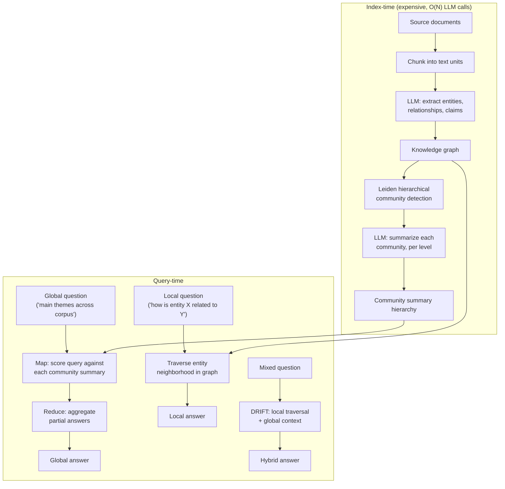

> Microsoft Research released GraphRAG in 2024 (Edge et al., "From Local to Global: A Graph RAG Approach to Query-Focused Summarization") and open-sourced the pipeline shortly after. It exists to answer a class of question naive [[Concept - Retrieval-Augmented Generation|RAG]] structurally cannot: "what are the main themes across this corpus," "how do these three entities relate," "summarize the overall sentiment" — global, sensemaking questions where no single chunk contains the answer, so top-$k$ chunk retrieval has nothing good to retrieve no matter how well-tuned the retriever is. GraphRAG's answer is to build explicit structure — a knowledge graph plus precomputed summaries at multiple levels of abstraction — at index time, so the query-time search has something better than flat similarity to work with.

## The headline numbers

Index-time cost scales with corpus size in a way flat vector RAG's does not: extraction runs one (or more) LLM calls per chunk across the *entire* corpus — $O(N)$ LLM calls for $N$ chunks, each processing the full chunk text against an entity/relationship/claim extraction prompt — before any community detection or summarization happens. Community summarization adds a further LLM call per detected community per hierarchy level, typically far fewer calls than $N$ since a real corpus of thousands of extracted entities collapses into a few hundred communities across two to four hierarchy levels, but still a real, non-trivial multiplier on top of extraction. This is the central quantitative fact about GraphRAG: indexing is expensive in LLM calls in a way that plain embed-and-index RAG simply is not, and that cost is why Microsoft's own follow-up work (LazyGraphRAG, 2024) exists specifically to cut it.

## How it actually works

**Indexing pipeline.** Source documents are chunked (using the same kinds of strategies covered in [[Concept - Chunking Strategies]]) into text units. An LLM then runs entity, relationship, and claim/covariate extraction over each chunk — not just "what entities appear here" but structured relational facts and attributable claims ("Company X acquired Company Y in 2023," sourced back to the originating chunk). These extractions accumulate into a knowledge graph across the whole corpus. The Leiden algorithm — a fast, modularity-based hierarchical community-detection method — partitions that graph into nested communities: tightly-connected clusters of entities at a fine-grained level, which themselves group into broader clusters at coarser levels. An LLM then writes a natural-language summary for every community at every level of the hierarchy, producing a multi-resolution index of "what this part of the corpus is about" that exists *before* any query is ever asked.

**Query modes.** *Global search* answers corpus-wide sensemaking questions via map-reduce: the query is scored for relevance against every community summary at a chosen hierarchy level (the map step, parallelizable and independent of corpus size beyond the number of communities), partial answers are generated from the top-scoring summaries, and a final reduce step aggregates those partial answers into one response — sidestepping the need to scan or retrieve individual chunks at all. *Local search* answers specific-entity questions by traversing the entity-centric neighborhood in the graph directly — find the entity, pull its related entities, relationships, and claims, and the chunks they trace back to — which is much closer to how a knowledge-graph QA system would work. *DRIFT search* hybridizes the two, using local graph traversal to ground an initial answer and then expanding into global community context when the question needs broader synthesis.

## The clever parts

1. **Community summaries as precomputed multi-resolution answers.** Instead of answering a global question by reasoning over the raw corpus at query time (impossible within a context window for anything beyond a small corpus), GraphRAG shifts that reasoning to index time and caches the result as text. Query time becomes cheap relevance-scoring over a small set of summaries instead of expensive reasoning over the whole corpus.
2. **Leiden over naive clustering.** Leiden is a well-established, fast, modularity-optimizing graph algorithm that reliably produces well-connected, non-degenerate communities and does so hierarchically for free — giving GraphRAG its multiple levels of abstraction (fine-grained local clusters up through broad corpus-wide themes) from one clustering pass rather than requiring separate clustering runs at each granularity.
3. **Claim and covariate extraction, not just entities and edges.** Extracting structured, attributable claims alongside the graph adds evidence that's directly traceable back to source text, giving GraphRAG something closer to a citation trail than a bag of entity co-occurrences.
4. **Map-reduce global search avoids per-query corpus scanning.** The map step is parallelizable and its cost scales with the number of communities selected at a given hierarchy level, not the size of the underlying corpus — the expensive part of "understanding the whole corpus" happened once, at index time, and every subsequent global query reuses it.
5. **DRIFT search as an explicit local/global hybrid.** Rather than forcing every query into one mode, DRIFT acknowledges that many real questions are neither purely entity-specific nor purely corpus-wide, and grounds a global-style answer in a local traversal starting point.

## What it got wrong / what's dated

The index cost is the single biggest practical objection, and it's not a minor one: for large or fast-changing corpora, running LLM-based extraction over every chunk (and re-running it, or incrementally patching the graph, whenever documents change) is expensive and operationally heavier than vector RAG's cheap, embarrassingly-parallel embed-and-upsert update model. Extraction errors compound silently — a mis-resolved entity (treating "Bob Smith" and "Robert Smith" as two different people, or the reverse, merging two genuinely different entities) propagates into the graph and into every community summary that entity touches, with no per-query signal that anything upstream is wrong; auditing extraction quality is a real, ongoing operational burden GraphRAG adds that flat RAG doesn't have. Staleness compounds the cost problem: unlike an incrementally-updatable vector index, a meaningfully-changed corpus can require re-running community detection, since adding or removing entities and relationships can shift community boundaries throughout the graph, not just locally. Microsoft's own LazyGraphRAG (2024) is a direct admission of this: it defers most of the expensive LLM-based extraction to query time, using cheap NLP techniques (noun-phrase extraction rather than LLM extraction) to build a lighter-weight structure up front and doing the expensive reasoning only for the specific query asked, at substantially reduced indexing cost compared to full GraphRAG.

## What to steal

Even without adopting the full pipeline, three ideas transfer directly to other RAG systems: pre-aggregating structure specifically for the *global* question class your users actually ask, rather than trying to force flat top-$k$ retrieval to answer questions it structurally can't; combining lightweight graph structure (even simple entity linking without a full Leiden hierarchy) with ordinary vector retrieval measurably helps multi-hop questions that pure chunk similarity misses; and routing — most production query traffic is local/factoid, not global/sensemaking, so the highest-leverage move is usually a router that sends the rare global question to a GraphRAG-style path and leaves everything else on a cheap flat-index path, rather than paying GraphRAG's indexing cost for a corpus whose query distribution doesn't need it. This selection judgment is the same one covered generally in [[Deep Dive - RAG Architectures]]: match architectural complexity to the actual query distribution, not to the most sophisticated available technique. It's also the crux of [[Lore - The RAG Is Dead Debate]]: as context windows grow, the case for paying GraphRAG's indexing overhead gets harder to make for any corpus whose queries don't actually need global sensemaking.

## Connections
- [[Deep Dive - RAG Architectures]] — the down-link into the broader taxonomy this note's GraphRAG lineage sits within, alongside naive, advanced, and agentic RAG.
- [[Concept - Retrieval-Augmented Generation]] — the surface-level entry point GraphRAG departs from by adding explicit graph structure.
- [[Concept - Agentic Retrieval]] — DRIFT and multi-hop local traversal share control-flow shape with agentic retrieval's iterative retrieve-reason loops.
- [[Concept - Chunking Strategies]] — the text-unit boundaries that determine what an extraction pass sees per LLM call.
- [[Concept - RAG Evaluation]] — global-search answers (summaries of summaries) need different evaluation than single-fact retrieval; standard recall@k doesn't capture sensemaking quality.
- [[Concept - Tool Use and Function Calling]] — GraphRAG's local/global/DRIFT search modes are naturally exposed as distinct callable tools in an agent's toolset (Agents domain).
- [[Concept - Cost Engineering for LLM Applications]] — the index-time LLM-call cost is the dominant line item that makes or breaks a GraphRAG deployment (Production & Ops domain).
- [[Concept - Knowledge Distillation]] — LazyGraphRAG's shift from expensive LLM extraction to cheap NLP techniques is a cost-quality tradeoff in the same family as distilling an expensive teacher into a cheaper model (Post-Training domain).
- [[Deep Dive - The Agent Loop]] — the general orchestration machinery a GraphRAG-backed agent's query router and multi-hop traversal would run inside (Agents domain).
- [[Concept - Multi-Agent Orchestration]] — map-reduce global search over community summaries is structurally the same fan-out/aggregate pattern used in multi-agent orchestration (Agents domain).
- [[Lore - The RAG Is Dead Debate]] — the up-link into the tribal-knowledge-level argument over whether elaborate structure like GraphRAG is still worth its indexing cost as context windows grow.

## Sources
- Edge et al. (2024) — From Local to Global: A Graph RAG Approach to Query-Focused Summarization. Microsoft Research; introduces the extraction → Leiden community detection → hierarchical summarization → local/global search pipeline.
- Microsoft Research (2024) — LazyGraphRAG. Follow-up work deferring expensive LLM extraction to query time to cut indexing cost.
