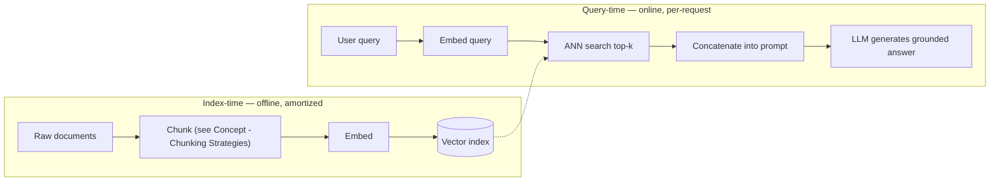

> **One-paragraph hook:** A pretrained LLM's knowledge is frozen at its training cutoff and baked into its weights — it cannot know about your internal wiki, yesterday's news, or the contract you uploaded five minutes ago. Retrieval-Augmented Generation fixes this without touching a single weight: fetch relevant text from an external corpus at request time and hand it to the model as context. It is the default answer to "the model doesn't know about our data," and it is also the single most over-claimed and under-engineered pattern in production LLM systems — the idea is simple, the execution is where almost everything goes wrong.

## The mechanism

The core loop is: embed the query, run approximate-nearest-neighbor [[Concept - Semantic Search]] against a pre-built index to pull the top-k passages, concatenate those passages into the prompt, and generate an answer conditioned on them. This is a deliberate substitute for **parametric recall** — the model reciting facts memorized into its weights during pretraining — with **non-parametric recall**, where the facts live in an external, inspectable, updatable store and the model's job is reduced to reading comprehension over whatever was retrieved.

The original RAG formulation (Lewis et al. 2020, Facebook AI) treated retrieval as a genuinely probabilistic step: a Dense Passage Retriever (DPR) produces a distribution over top-k documents $z$, and a BART generator's output distribution is marginalized over them:

$$p(y \mid x) = \sum_{z \in \text{top-}k} p_\eta(z \mid x)\, p_\theta(y \mid x, z)$$

Both the retriever and generator were differentiable and jointly fine-tuned. That architecture is now largely of historical interest. The RAG that dominates production in 2026 is architecturally simpler and decoupled: a frozen, off-the-shelf LLM plus a separately built [[Concept - Embedding Models|vector search]] index, glued together by prompt concatenation rather than marginalization. Nobody backprops through the retriever anymore; retrieval and generation are trained (if at all) independently, which trades a small amount of end-to-end optimality for enormously easier engineering — you can swap the retriever, the index, or the LLM independently.

This decoupling produces a hard split into two phases with very different cost and latency profiles:

Index-time work (chunking, embedding, indexing) happens once per document and is amortized across every future query against it. Query-time work (embed the query, search, generate) happens on every request and sits directly in the user-facing latency budget — this asymmetry is why RAG systems obsess over index quality (get it right once) far more than query-time cleverness (pay for it every time).

## In practice

RAG exists to solve five concrete problems that fine-tuning solves poorly or not at all: knowledge-cutoff staleness, private/proprietary corpora the model never saw in training, hallucination reduction via grounding in retrieved text, attribution (the answer can cite the exact source passage), and cost — indexing a document costs cents in embedding compute, versus the GPU-hours of a fine-tuning run to bake in the same fact, and the fact still won't be reliably recalled from weights afterward. This cost asymmetry is the crux of [[Decision - Fine-Tuning vs RAG vs Prompting]]: RAG is almost always the cheaper and more auditable way to add new or private knowledge, and fine-tuning is reserved for teaching behavior, format, or style rather than facts.

The load-bearing rule of thumb in this domain is: **retrieval is the bottleneck, not generation**. A frontier LLM given the right three paragraphs will produce an excellent answer; the same model given the wrong three paragraphs will produce a *confident* wrong answer, because nothing in the generation step signals "this context is irrelevant" — the model just does its job and answers from what it was handed. Teams that spend their tuning budget on prompt engineering the generator while running a mediocre retriever are optimizing the wrong stage; see [[Concept - RAG Evaluation]] for how to catch this by scoring retrieval and generation separately.

RAG is not universally the right tool. Skip it for reasoning-heavy tasks with no dependence on external facts (arithmetic, code logic, puzzle-solving — retrieval adds latency and noise, not signal), for corpora small enough to fit entirely in the context window (at which point you're paying embedding and index-maintenance cost for something a single prompt already solves), and for highly relational data where the answer depends on synthesizing across many documents rather than pulling isolated passages — that's the case that motivates graph-structured approaches like [[Breakdown - Microsoft GraphRAG]] instead of flat top-k retrieval.

## Failure modes

- **Garbage retrieval, confident output**: the generator has no mechanism to detect that its context is wrong or insufficient, so bad retrieval doesn't produce a visibly uncertain answer — it produces a fluent, wrong one. Detect this by evaluating retrieval recall/precision independently from answer quality, not by reading generated answers and guessing which stage failed.
- **Stale index**: documents change but embeddings and the index are not recomputed, so the system confidently serves outdated facts. This is an operations failure, not a modeling one, and it compounds silently until someone notices an answer citing a policy that changed six months ago.
- **Context stuffing without curation**: naively maximizing top-k "to be safe" adds distractor passages that measurably degrade answer quality rather than improving it — more retrieved text is not more signal, and irrelevant chunks compete for the model's attention with relevant ones, an effect closely related to [[Concept - Context Rot]] in long prompts generally.
- **Treating RAG as a hallucination cure**: it reduces one *class* of hallucination (missing knowledge) but does nothing about a model overriding correct retrieved context with its own parametric prior, or confidently synthesizing a plausible-sounding but unsupported claim on top of real context.

## The non-obvious

RAG does not fix hallucination — it relocates where hallucination becomes possible, and teams that ship RAG systems as a hallucination-elimination feature get burned by this within weeks. A model can retrieve the exactly correct passage and still answer wrong, either by ignoring it in favor of its parametric belief or by generating an unsupported elaboration on top of it. This is precisely why serious RAG evaluation is two-stage (retrieval metrics and generation faithfulness metrics scored separately) rather than a single end-to-end "did the answer sound right" check — and it's also why production RAG systems increasingly borrow agentic patterns (deciding whether to retrieve, re-querying on low confidence, described more generally under [[Concept - Agent Memory Systems]] and elaborated in [[Deep Dive - RAG Architectures]]) rather than running retrieval as a single unconditional step before every generation.

## Connections

- [[Deep Dive - RAG Architectures]] — the full taxonomy of naive, advanced, modular, and agentic RAG system designs that this note deliberately stays above.
- [[Concept - Semantic Search]] — the ANN retrieval mechanism that implements the "retrieve" half of the loop.
- [[Decision - Fine-Tuning vs RAG vs Prompting]] — the cost/use-case framework for when RAG beats baking knowledge into weights.
- [[Concept - Agent Memory Systems]] — retrieval used as an agent's long-term memory store is the same mechanism applied to a different consumer.
- [[Concept - Context Rot]] — explains why dumping more retrieved passages into the prompt has diminishing and eventually negative returns.
- [[Concept - Embedding Models]] — the component that turns text into the vectors semantic retrieval searches over.
- [[Concept - RAG Evaluation]] — how to detect whether a RAG failure is a retrieval problem or a generation problem.
- [[Concept - Chunking Strategies]] — the index-time decision that determines what units of text are even retrievable.
- [[Breakdown - Microsoft GraphRAG]] — the alternative architecture for corpora where flat top-k retrieval structurally cannot answer the question.

## Sources

- Lewis et al. (2020) — Retrieval-Augmented Generation for Knowledge-Intensive NLP Tasks. The original RAG paper: DPR retriever + BART generator with retrieval marginalized as a latent variable.
- Guu et al. (2020) — REALM: Retrieval-Augmented Language Model Pretraining. Contemporary work that pulled retrieval into pretraining itself rather than inference-time augmentation.
