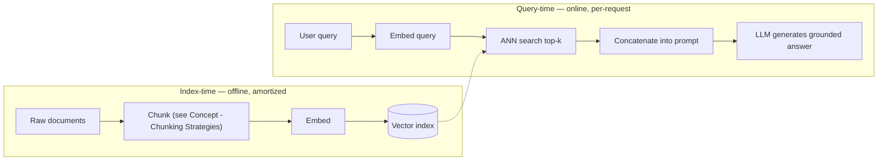

> **One-paragraph hook:** A pretrained LLM's knowledge is frozen at its training cutoff and baked into its weights. It can't know about your internal wiki, yesterday's news, or the contract you uploaded five minutes ago. Retrieval-Augmented Generation fixes this without touching a weight: fetch relevant text from an external corpus at request time and give it to the model as context. It's the default answer to "the model doesn't know about our data." It's also the most over-claimed and under-engineered pattern in production LLM systems. The idea is simple; the execution is where almost everything goes wrong.

## The mechanism

The core loop: embed the query, run approximate-nearest-neighbor [[Concept - Semantic Search]] against a pre-built index to pull the top-k passages, concatenate them into the prompt, and generate an answer conditioned on them. It deliberately swaps **parametric recall** (the model reciting facts memorized in its weights during pretraining) for **non-parametric recall**. The facts live in an external store you can inspect and update, and the model's job shrinks to reading comprehension over whatever was retrieved.

The original RAG formulation (Lewis et al. 2020, Facebook AI) treated retrieval as a probabilistic step. A Dense Passage Retriever (DPR) produces a distribution over top-k documents $z$, and a BART generator's output distribution is marginalized over them:

$$p(y \mid x) = \sum_{z \in \text{top-}k} p_\eta(z \mid x)\, p_\theta(y \mid x, z)$$

Retriever and generator were both differentiable and fine-tuned jointly. That architecture is now mostly of historical interest. The RAG that dominates production in 2026 is simpler and decoupled: a frozen, off-the-shelf LLM plus a separately built [[Concept - Embedding Models|vector search]] index, joined by prompt concatenation instead of marginalization. Nobody backprops through the retriever anymore. Retrieval and generation are trained (if at all) independently, which gives up a little end-to-end optimality for far easier engineering: you can swap the retriever, the index or the LLM on its own.

The decoupling splits the system into two phases with very different cost and latency:

Index-time work (chunking, embedding, indexing) happens once per document and is amortized over every later query. Query-time work (embed the query, search, generate) happens on every request and sits directly in the user-facing latency budget. That asymmetry is why RAG teams obsess far more over index quality (get it right once) than over query-time cleverness (pay for it every time).

## In practice

RAG solves five concrete problems that fine-tuning handles poorly or not at all. Knowledge-cutoff staleness. Private or proprietary corpora the model never saw. Hallucination, reduced by grounding in retrieved text. Attribution, since the answer can cite the exact source passage. And cost: indexing a document costs cents in embedding compute, against GPU-hours of fine-tuning to bake in the same fact, which still won't be reliably recalled from the weights afterward. That cost gap is the crux of [[Decision - Fine-Tuning vs RAG vs Prompting]]. RAG is almost always the cheaper, more auditable way to add new or private knowledge; keep fine-tuning for teaching behavior, format or style.

The key rule of thumb here: **retrieval is the bottleneck, not generation**. A frontier LLM handed the right three paragraphs produces an excellent answer. The same model handed the wrong three paragraphs produces a *confident* wrong answer, because nothing in generation signals "this context is irrelevant." The model does its job and answers from what it was given. Teams that spend their tuning budget on prompt-engineering the generator while running a mediocre retriever are optimizing the wrong stage. [[Concept - RAG Evaluation]] shows how to catch this by scoring retrieval and generation separately.

RAG isn't always the right tool. Skip it for reasoning-heavy tasks with no dependence on external facts (arithmetic, code logic, puzzles), where retrieval adds latency and noise and no signal. Skip it for corpora small enough to fit in the context window, where you'd pay embedding and index-maintenance costs for something one prompt already solves. And skip flat top-k retrieval for highly relational data where the answer means synthesizing across many documents instead of pulling isolated passages. That case motivates graph-structured approaches like [[Breakdown - Microsoft GraphRAG]].

## Failure modes

- **Garbage retrieval, confident output.** The generator can't detect that its context is wrong or insufficient, so bad retrieval yields a fluent wrong answer, not a visibly uncertain one. Detect it by evaluating retrieval recall/precision separately from answer quality, not by reading answers and guessing which stage failed.
- **Stale index.** Documents change but embeddings and index aren't recomputed, so the system confidently serves outdated facts. It's an operations failure, not a modeling one, and it compounds quietly until someone notices an answer citing a policy that changed six months ago.
- **Context stuffing without curation.** Maximizing top-k "to be safe" adds distractor passages that measurably degrade answers. More retrieved text isn't more signal; irrelevant chunks compete with relevant ones for the model's attention, closely related to [[Concept - Context Rot]] in long prompts generally.
- **Treating RAG as a hallucination cure.** It reduces one *class* of hallucination (missing knowledge). It does nothing about a model overriding correct retrieved context with its parametric prior, or confidently building an unsupported claim on top of real context.

## The non-obvious

RAG relocates hallucination; it doesn't eliminate it. Teams that ship RAG as a hallucination-elimination feature get burned within weeks. A model can retrieve exactly the right passage and still answer wrong, by ignoring it in favor of its parametric belief or by elaborating beyond what it supports. So serious RAG evaluation is two-stage, with retrieval metrics and generation faithfulness scored separately, and a single end-to-end "did the answer sound right" check isn't enough. It's also why production RAG systems increasingly borrow agentic patterns (deciding whether to retrieve, re-querying on low confidence; see [[Concept - Agent Memory Systems]] and [[Deep Dive - RAG Architectures]]) instead of running retrieval as one unconditional step before every generation.

## Connections

- [[Deep Dive - RAG Architectures]] — the full taxonomy of naive, advanced, modular, and agentic RAG system designs that this note deliberately stays above.
- [[Concept - Semantic Search]] — the ANN retrieval mechanism that implements the "retrieve" half of the loop.
- [[Decision - Fine-Tuning vs RAG vs Prompting]] — the cost/use-case framework for when RAG beats baking knowledge into weights.
- [[Concept - Agent Memory Systems]] — retrieval used as an agent's long-term memory store is the same mechanism applied to a different consumer.
- [[Concept - Context Rot]] — explains why dumping more retrieved passages into the prompt has diminishing and eventually negative returns.
- [[Concept - Embedding Models]] — the component that turns text into the vectors semantic retrieval searches over.
- [[Concept - RAG Evaluation]] — how to detect whether a RAG failure is a retrieval problem or a generation problem.
- [[Concept - Chunking Strategies]] — the index-time decision that determines what units of text are even retrievable.
- [[Breakdown - Microsoft GraphRAG]] — the alternative architecture for corpora where flat top-k retrieval structurally cannot answer the question.

## Sources

- Lewis et al. (2020) — Retrieval-Augmented Generation for Knowledge-Intensive NLP Tasks. The original RAG paper: DPR retriever + BART generator with retrieval marginalized as a latent variable.
- Guu et al. (2020) — REALM: Retrieval-Augmented Language Model Pretraining. Contemporary work that pulled retrieval into pretraining itself rather than inference-time augmentation.
