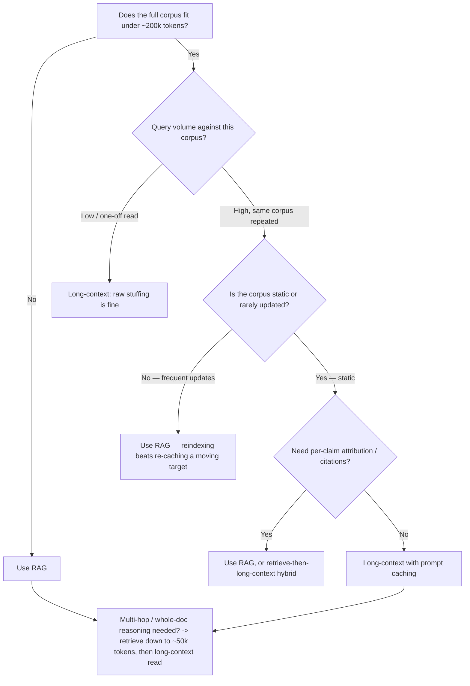

# Decision - RAG vs Long-Context Windows

> **The decision:** for a given corpus and query workload, do you retrieve relevant passages into a bounded prompt, or stuff the whole corpus into a long-context window and let attention do the work? **Default for the 80% case:** use [[Concept - Retrieval-Augmented Generation]]. Most corpora are large, growing, and queried often enough that retrieval's cost and freshness advantages dominate, and you can spot the exceptions (small static corpora, one-off deep reads) in advance.

## Decision flow

## Tradeoff matrix

| Criterion | RAG (retrieve + generate) | Long-context (raw stuffing) | Long-context (prompt-cached) | Hybrid (retrieve-then-stuff) |
|---|---|---|---|---|
| Corpus size ceiling | Effectively unbounded (index scales independently of window) | Bounded by the model's context window (order of 100k–1M+ tokens as of 2026) | Same window ceiling, but repeated reads amortize | Unbounded corpus, bounded window per query |
| Cost per query | Cheap embedding + ANN lookup (sub-cent, single-digit ms) plus generation over a small context | Full prefill cost over every token in the window, every call | Fresh-token cost paid once; cached-token reads priced far below fresh input (order of a 10x discount under schemes like Anthropic prompt caching, roughly similar under Gemini context caching) — *(as of 2026)* | Cheap retrieval cost plus prefill over the retrieved subset (tens of k tokens, not the whole corpus) |
| Latency (prefill) | Low; only retrieved tokens are prefilled | Scales with window size; a 200k-token prefill dominates end-to-end latency | Cache hit skips re-computation of the [[Concept - KV Cache]] for cached tokens, cutting effective prefill | Low-to-moderate, bounded by the retrieved-down size |
| Multi-fact accuracy | Curated evidence avoids diluting the model's attention with irrelevant tokens | Degrades on facts placed mid-window even well inside the nominal window (lost-in-the-middle) | Same degradation as raw stuffing; caching fixes cost, not accuracy | Retrieval curation plus long-context coherence on the retrieved subset |
| Freshness / updates | Reindex changed documents; index and generation stay decoupled | Every update invalidates the whole cached context, forcing a full re-cache | Same re-cache-on-update cost as raw long-context | Reindex changed documents; no context re-cache needed |
| Attribution / citations | Native: you know which chunk supported which claim | Weak: the model has to self-report which part of a huge blob it used | Same weakness as raw long-context | Native, inherited from the retrieval step |
| Engineering complexity | Higher: chunking, embedding, index, [[Concept - Rerankers|reranking]] pipeline | Lower: no index to build or maintain | Lower, plus cache-key/session management | Highest: both a retrieval pipeline and a long-context budget to manage |

## The details that flip the decision

- **Multi-hop, whole-document reasoning.** When no single chunk holds the answer (e.g. "summarize how this contract's obligations change across all twelve amendments"), long-context or a retrieve-then-stuff hybrid beats naive top-$k$ RAG, because the evidence is spread out. Query type decides the winner as much as corpus size does.
- **Regulatory or compliance need for per-claim citation.** This pushes toward RAG even when the corpus fits in the window. Attribution means knowing which passage backed which claim, and raw long-context generation can't guarantee that without an extra extraction step.
- **Spiky, repeated-read access.** The same large document read thousands of times a day (a support macro, a product spec) is where prompt caching changes the math most. [[Concept - Prompt Caching]] amortizes the fixed prefill cost across repeated reads and narrows the cost gap with RAG even at large context sizes. It narrows the gap; lost-in-the-middle is still there.
- **Continuously growing corpora** (a live ticket system, a document store with daily uploads) favor RAG by design. Reindexing new documents is cheap and incremental. Re-caching an ever-changing long-context blob means the cache keeps invalidating and you pay fresh prefill on every update anyway.
- **Reasoning models.** Chain-of-thought output tokens stack on top of the input tokens paid for prefill, so stuffing a large window into a reasoning model multiplies the cost gap with RAG instead of adding to it. Full accounting in [[Concept - Cost Engineering for LLM Applications]].

The mature 2026 answer is both. Retrieve down from an unbounded corpus to a bounded budget (on the order of tens of thousands of tokens), then give that curated subset to a long-context model. Not pure top-3-chunk RAG, and not raw whole-corpus stuffing. Retrieval feeds the window instead of competing with it.

## Connections

- [[Concept - Retrieval-Augmented Generation]] — the retrieval-side alternative this decision is choosing between; assumes the reader already knows the RAG loop.
- [[Decision - Fine-Tuning vs RAG vs Prompting]] — the adjacent decision on whether to bake knowledge into weights at all, upstream of this retrieve-vs-stuff choice.
- [[Concept - Context Rot]] — the mechanism behind why raw long-context stuffing degrades even within the nominal window, not just beyond it.
- [[Concept - Prompt Caching]] — the specific economics that narrow, but do not close, long-context's cost disadvantage against RAG.
- [[Concept - KV Cache]] — why prefill cost scales with context length in the first place: every token adds an entry to the cache that attention must read.
- [[Concept - Cost Engineering for LLM Applications]] — the general framework for computing the break-even point between these options for a specific workload.
- [[Lore - The RAG Is Dead Debate]] — the recurring folklore claim this decision note is the sober, mechanism-level answer to.

## Sources

- Liu et al. (2023) — Lost in the Middle: How Language Models Use Long Contexts. Established that recall degrades for information placed mid-context even well within the nominal window, the empirical basis for RAG's multi-fact accuracy advantage over raw stuffing.
- Google DeepMind (2024) — Gemini 1.5 Technical Report. The near-perfect single-needle-in-a-haystack results that fueled the "long context replaces RAG" argument this decision weighs against real multi-fact workloads.
