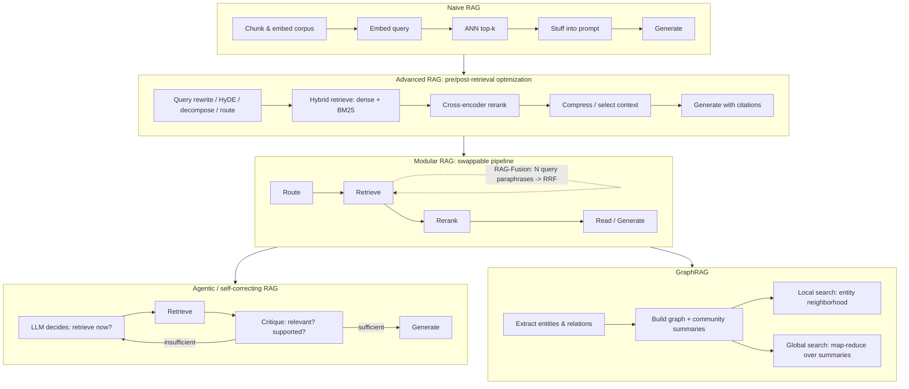

> **One-paragraph hook:** "RAG" the word covers everything from a single embed-and-stuff call to a multi-turn agentic loop that critiques its own retrievals and traverses a knowledge graph. Treating all of it as one architecture is the most common mistake in the field — teams either stay stuck on a naive pipeline that a five-line query rewrite would fix, or reach for agentic self-correction on queries that never needed more than a reranker. This note maps the taxonomy so the choice is deliberate rather than accidental.

## The mechanism

**Naive RAG** is the loop everyone builds first: chunk the corpus, embed the chunks, embed the query, run approximate nearest-neighbor search for the top-$k$ chunks, concatenate them into the prompt, generate. It is [[Concept - Retrieval-Augmented Generation|RAG's core loop]] with nothing added, and it carries four documented failure points baked into its simplicity: bad chunk boundaries that fragment or amputate context (see [[Concept - Chunking Strategies]]), no reranking so precision is whatever the first-stage retriever happened to surface, no query understanding so a badly-phrased or vocabulary-mismatched query silently under-retrieves, and raw context stuffing that dumps top-$k$ chunks into the prompt in retrieval order regardless of whether that order helps the generator.

**Advanced RAG** patches naive RAG at two points in the pipeline without changing its overall shape. Pre-retrieval optimizations rewrite the problem before it ever hits the index: query rewriting, HyDE (generate a hypothetical answer and embed *that*), decomposition of multi-part questions, and routing to select which index or tool applies — all covered mechanically in [[Concept - Query Transformation for Retrieval]]. Post-retrieval optimizations fix what comes back: [[Concept - Rerankers|cross-encoder reranking]] for precision, context compression to drop irrelevant tokens before generation, and fusing multiple candidate lists via [[Concept - Hybrid Search and Reciprocal Rank Fusion|RRF]]. Advanced RAG also covers what happens to the chunks themselves before they're ever indexed — [[Concept - Contextual Retrieval]] prepends document-level context to each chunk so its embedding and BM25 terms don't lose the surrounding document's identity.

**Modular RAG** (Gao et al. 2023's survey framing) reconceives the pipeline as swappable modules — retrieve, rerank, read, route — rather than a fixed sequence, so components can be reordered, run in parallel, or looped. RAG-Fusion is the canonical modular pattern: generate several query paraphrases, retrieve for each in parallel, and RRF-fuse the resulting lists into one ranking before reranking — multi-query retrieval and rank fusion composed as two independently swappable modules.

**Iterative and recursive architectures** break the single-shot retrieve-then-generate assumption entirely. FLARE (Jiang et al. 2023) monitors next-token confidence during generation and pauses to retrieve, using the tentative next sentence as the query, whenever confidence drops — retrieval on demand rather than up front. IRCoT interleaves retrieval with chain-of-thought steps, retrieving fresh evidence between reasoning hops rather than once at the start (see [[Concept - Chain-of-Thought and Why It Works]] for the reasoning-side mechanics IRCoT interleaves with). RAPTOR (Sarthi et al. 2024) builds a recursive summarization tree over the corpus — clusters of chunks are summarized, clusters of summaries are summarized again — and retrieves at whichever level of abstraction the query needs, giving global-question answers naive chunk retrieval structurally cannot.

**Self-correcting architectures** add an explicit critique step. Self-RAG (Asai et al. 2023) trains reflection tokens — Retrieve, IsRelevant, IsSupported, IsUseful — directly into the model so it learns when to retrieve, whether retrieved evidence is relevant, and whether its own output is grounded, gating each decision rather than always retrieving unconditionally. CRAG (Yan et al. 2024) takes a lighter-weight approach: a small retrieval evaluator classifies retrieved documents as correct, ambiguous, or incorrect, and triggers a web-search fallback or knowledge refinement step when retrieval quality looks poor. Both of these sit inside [[Concept - Agentic Retrieval]], which owns the RAG-specific control logic for when and what to retrieve mid-generation.

**GraphRAG architectures** replace flat chunk retrieval with explicit structure: an LLM extracts entities and relationships into a knowledge graph, and community detection over that graph produces summaries at multiple levels of abstraction, so questions that no single chunk answers ("what are the main themes across this corpus") get answered by a map-reduce pass over precomputed community summaries rather than a doomed top-$k$ chunk search. [[Breakdown - Microsoft GraphRAG]] covers this lineage's implementation in full detail; this note places it as the graph-structured branch of the taxonomy.

## Architecture / walkthrough

Tracing a single query through the modular pipeline makes the module boundaries concrete: **route** classifies the query and picks an index or decides retrieval isn't needed at all (a factual chit-chat question shouldn't trigger a corpus search); **retrieve** runs one or more retrieval strategies — possibly RAG-Fusion's multi-query-then-RRF — against the chosen index; **rerank** re-scores the fused candidate set with a cross-encoder for precision; **read/generate** produces the answer, ideally with citations back to specific retrieved chunks. Each stage is independently swappable and independently testable — the modular framing exists precisely so that a regression can be isolated to one module rather than the whole pipeline.

## Evolution

The lineage starts with Lewis et al. (2020)'s original RAG, which is architecturally distinct from everything downstream: a DPR retriever and a BART generator trained jointly, with retrieval treated as a latent variable marginalized over documents — end-to-end differentiable retrieval, not a frozen-model-plus-vector-search pipeline. That approach lost out to the simpler "frozen LLM + off-the-shelf vector search" pattern once general-purpose LLMs got good enough that retraining a retriever jointly with the generator stopped being worth the engineering cost — naive RAG in the 2022–2023 sense is architecturally simpler than the paper that coined the term.

2023 is when the field split into everything downstream of naive RAG. Query transformation techniques (HyDE, multi-query, decomposition) and reranking became the default "advanced RAG" recipe. Gao et al.'s 2023 survey gave the modular framing its name, formalizing what practitioners were already doing ad hoc: treating retrieve/rerank/read as swappable, composable stages. FLARE and Self-RAG, both 2023, opened the iterative and self-correcting branches respectively, moving control of retrieval timing and quality assessment into the model itself rather than a fixed pipeline schedule.

2024 brought RAPTOR's hierarchical summarization tree, CRAG's lightweight retrieval evaluator, and Microsoft's GraphRAG — three independent answers to the same underlying problem, that flat top-$k$ chunk retrieval cannot answer questions whose evidence is distributed across the whole corpus rather than localized to one passage. LazyGraphRAG (2024) then walked back GraphRAG's own cost by deferring expensive entity extraction to query time — evidence that even within the graph branch, the field keeps re-discovering that upfront complexity has to earn its cost.

What's being replaced: naive RAG as a production target (it survives only as a starting point or a component inside something bigger); rigid single-shot retrieval as an assumption (iterative and agentic architectures made "retrieve once, generate once" the exception, not the rule for hard queries). What isn't being replaced: hybrid search plus reranking remains the load-bearing core of nearly every architecture in this taxonomy — even agentic and graph systems retrieve using dense-plus-lexical search and a reranker somewhere inside their loop.

## In practice

The practical selection rule is to match architectural complexity to query type, not to the newest paper. Most production systems that work well are "advanced RAG" — hybrid retrieval, one reranking pass, one query rewrite — not agentic or graph-structured, because most production query distributions are dominated by single-hop, single-fact lookups that a well-tuned advanced pipeline answers correctly and cheaply. Reach for iterative/self-correcting architectures only once you have evidence (from [[Concept - RAG Evaluation]] on your own golden set, not a demo) that the failure mode is specifically multi-hop reasoning or retrieval-confidence uncertainty that a single retrieval pass structurally cannot fix. Reach for GraphRAG only when the query distribution genuinely includes global, corpus-wide sensemaking questions — it is expensive to index and stays a poor fit for simple factual lookups that a flat index answers just as well for a fraction of the cost.

## Failure modes

- **Naive RAG's four failure points compound silently**: a bad chunk boundary plus no reranking plus no query understanding plus raw stuffing means a wrong answer could be caused by any of four independent stages, and without the two-stage evaluation discipline from [[Concept - RAG Evaluation]] you cannot tell which. Detect by ablating one stage at a time against a golden set.
- **Modular orchestration bugs**: once retrieve/rerank/read become independently swappable modules, module-interface mismatches appear — a reranker expecting a different candidate-count than retrieval provides, or a router misclassifying and skipping retrieval on a query that needed it. Detect via per-module logging, not just end-to-end traces.
- **Agentic runaway loops and cost blowup**: self-correcting architectures that re-retrieve on low confidence can loop indefinitely on genuinely ambiguous queries, and each iteration is a full LLM-plus-retrieval round trip. Fix with a hard iteration cap and cost/latency monitoring per query, not just per session.
- **GraphRAG extraction error propagation**: entity and relationship extraction errors at index time get baked into community summaries and silently degrade every downstream query that touches that part of the graph, with no per-query signal that anything is wrong. Detect by spot-auditing extracted entities against source documents, not by trusting the query-time output alone.

## The non-obvious

Most teams jump straight to agentic or self-correcting RAG believing it is strictly better than the boring baseline — more retrieval, more critique, more control has to mean more accuracy. In practice it multiplies latency and cost for queries that never needed the extra machinery, and the field's actual dirty secret is that "advanced RAG" — hybrid search, one rerank pass, one query rewrite — covers the overwhelming majority of production traffic. The fancy architectures earn their cost only after the boring baseline has been properly tuned against a real eval set and still measurably falls short on a specific, named query type. Reaching for RAPTOR or Self-RAG before you've added a reranker to your naive pipeline is optimizing the wrong end of the stack.

## Connections

- [[Concept - Retrieval-Augmented Generation]] — the core loop this entire taxonomy is built on top of; the down-link into the surface-level entry point.
- [[Concept - Chunking Strategies]] — naive RAG's chunk-boundary failure point, and the first place most architecture upgrades should look before adding pipeline complexity.
- [[Concept - Rerankers]] — the single highest-ROI addition when moving from naive to advanced RAG.
- [[Concept - Hybrid Search and Reciprocal Rank Fusion]] — the fusion mechanism RAG-Fusion's modular pattern is built on.
- [[Concept - Query Transformation for Retrieval]] — the pre-retrieval half of advanced RAG (HyDE, decomposition, routing, multi-query).
- [[Concept - Contextual Retrieval]] — an index-time advanced-RAG technique that fixes isolated-chunk context loss before retrieval ever runs.
- [[Concept - Agentic Retrieval]] — owns the RAG-specific control logic (Self-RAG, CRAG, FLARE) that this note places within the taxonomy.
- [[Breakdown - Microsoft GraphRAG]] — the full implementation detail behind this note's GraphRAG branch.
- [[Deep Dive - The Agent Loop]] — the general agent orchestration machinery that agentic RAG architectures plug into (Agents domain).
- [[Concept - Chain-of-Thought and Why It Works]] — the reasoning mechanism IRCoT interleaves retrieval with (Prompting & Context domain).
- [[Concept - RAG Evaluation]] — the measurement discipline that should drive which architecture tier is actually warranted for a given query distribution.
- [[Concept - Agent Memory Systems]] — RAPTOR's hierarchical summary tree and agentic retrieval's iterative context accumulation both overlap conceptually with agent memory design (Agents domain).

## Sources

- Lewis et al. (2020) — Retrieval-Augmented Generation for Knowledge-Intensive NLP Tasks. The original RAG paper: DPR retriever plus BART generator with retrieval as a marginalized latent variable.
- Gao et al. (2023) — Retrieval-Augmented Generation for Large Language Models: A Survey. The paper that formalized the naive/advanced/modular RAG framing used throughout this taxonomy.
- Jiang et al. (2023) — Active Retrieval Augmented Generation (FLARE). Retrieval triggered by dropping next-token confidence rather than a fixed schedule.
- Asai et al. (2023) — Self-RAG: Learning to Retrieve, Generate, and Critique through Self-Reflection. Trained reflection tokens gate retrieval and groundedness self-critique.
- Yan et al. (2024) — Corrective Retrieval Augmented Generation (CRAG). A lightweight retrieval evaluator triggers web-search fallback on low-confidence retrieval.
- Sarthi et al. (2024) — RAPTOR: Recursive Abstractive Processing for Tree-Organized Retrieval. Recursive summarization tree retrieved at multiple abstraction levels.
