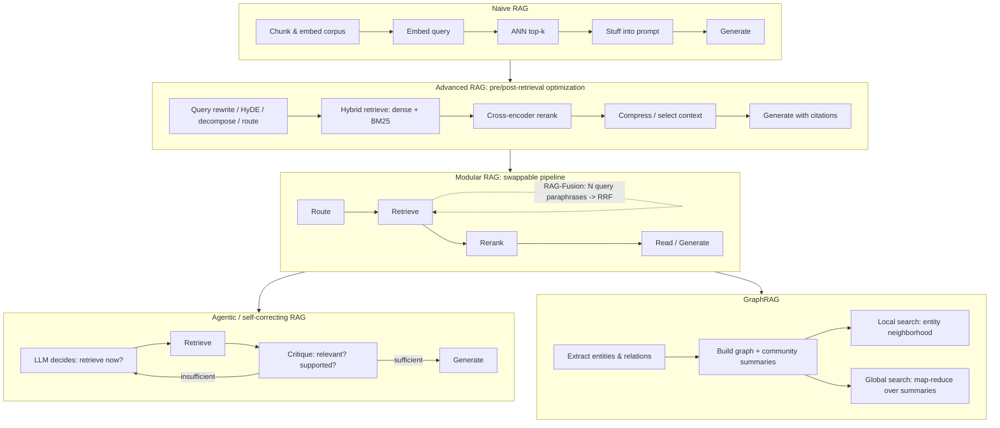

> **One-paragraph hook:** "RAG" covers everything from a single embed-and-stuff call to a multi-turn agentic loop that critiques its own retrievals and walks a knowledge graph. Treating all of that as one architecture is the most common mistake in the field. Teams either stay stuck on a naive pipeline that a five-line query rewrite would fix, or reach for agentic self-correction on queries that never needed more than a reranker. This note maps the taxonomy so the choice is deliberate.

## The mechanism

**Naive RAG** is the loop everyone builds first: chunk the corpus, embed the chunks, embed the query, run approximate nearest-neighbor search for the top-$k$ chunks, concatenate them into the prompt, generate. It's [[Concept - Retrieval-Augmented Generation|RAG's core loop]] with nothing added, and its simplicity comes with four documented failure points:

- bad chunk boundaries that fragment or amputate context (see [[Concept - Chunking Strategies]]);
- no reranking, so precision is whatever the first-stage retriever happened to surface;
- no query understanding, so a badly phrased or vocabulary-mismatched query silently under-retrieves;
- raw context stuffing that dumps the top-$k$ chunks into the prompt in retrieval order whether or not that order helps the generator.

**Advanced RAG** patches naive RAG at two points and keeps its overall shape. Pre-retrieval optimizations reshape the problem before it reaches the index: query rewriting, HyDE (generate a hypothetical answer and embed *that*), decomposition of multi-part questions, and routing to pick the right index or tool. [[Concept - Query Transformation for Retrieval]] covers the mechanics. Post-retrieval optimizations fix what comes back: [[Concept - Rerankers|cross-encoder reranking]] for precision, context compression to drop irrelevant tokens before generation, and fusing multiple candidate lists with [[Concept - Hybrid Search and Reciprocal Rank Fusion|RRF]]. Advanced RAG also covers what happens to chunks before they're indexed. [[Concept - Contextual Retrieval]] prepends document-level context to each chunk so its embedding and BM25 terms keep the surrounding document's identity.

**Modular RAG** (the framing from Gao et al. 2023's survey) treats the pipeline as swappable modules (retrieve, rerank, read, route) instead of a fixed sequence, so components can be reordered, run in parallel, or looped. RAG-Fusion is the canonical modular pattern: generate several query paraphrases, retrieve for each in parallel, and RRF-fuse the lists into one ranking before reranking. Multi-query retrieval and rank fusion become two modules you can swap independently.

**Iterative and recursive architectures** drop the single-shot retrieve-then-generate assumption. FLARE (Jiang et al. 2023) watches next-token confidence during generation and, when it drops, pauses to retrieve using the tentative next sentence as the query: retrieval on demand, not up front. IRCoT interleaves retrieval with chain-of-thought steps, pulling fresh evidence between reasoning hops instead of once at the start ([[Concept - Chain-of-Thought and Why It Works]] covers the reasoning side). RAPTOR (Sarthi et al. 2024) builds a recursive summarization tree over the corpus. Clusters of chunks get summarized, clusters of summaries get summarized again, and retrieval happens at whatever level of abstraction the query needs. That answers global questions naive chunk retrieval can't reach.

**Self-correcting architectures** add an explicit critique step. Self-RAG (Asai et al. 2023) trains reflection tokens (Retrieve, IsRelevant, IsSupported, IsUseful) into the model so it learns when to retrieve, whether the evidence is relevant, and whether its own output is grounded. Each decision is gated; retrieval isn't unconditional. CRAG (Yan et al. 2024) is lighter. A small retrieval evaluator labels retrieved documents correct, ambiguous or incorrect, and triggers a web-search fallback or knowledge refinement when retrieval looks poor. Both belong under [[Concept - Agentic Retrieval]], which owns the RAG-specific logic for when and what to retrieve mid-generation.

**GraphRAG architectures** replace flat chunk retrieval with explicit structure. An LLM extracts entities and relationships into a knowledge graph, and community detection over the graph produces summaries at several levels of abstraction. Questions no single chunk answers ("what are the main themes across this corpus") then get a map-reduce pass over precomputed community summaries instead of a doomed top-$k$ chunk search. [[Breakdown - Microsoft GraphRAG]] has the full implementation; here it's the graph-structured branch of the taxonomy.

## Architecture / walkthrough

One query through the modular pipeline shows the module boundaries. **Route** classifies the query and picks an index, or decides retrieval isn't needed (factual chit-chat shouldn't trigger a corpus search). **Retrieve** runs one or more strategies against the chosen index, possibly RAG-Fusion's multi-query-then-RRF. **Rerank** re-scores the fused candidates with a cross-encoder for precision. **Read/generate** writes the answer, ideally with citations back to specific retrieved chunks. Each stage can be swapped and tested on its own, which is the point of the modular framing: a regression can be isolated to one module instead of the whole pipeline.

## Evolution

The lineage starts with Lewis et al. (2020)'s original RAG, which is architecturally unlike everything after it. A DPR retriever and a BART generator were trained jointly, with retrieval as a latent variable marginalized over documents: end-to-end differentiable retrieval, not a frozen model plus vector search. It lost to the simpler "frozen LLM + off-the-shelf vector search" pattern once general-purpose LLMs got good enough that jointly retraining a retriever stopped being worth the engineering. Naive RAG in the 2022–2023 sense is simpler than the paper that coined the term.

In 2023 the field split into everything downstream of naive RAG. Query transformation (HyDE, multi-query, decomposition) and reranking became the default "advanced RAG" recipe. Gao et al.'s 2023 survey named the modular framing and formalized what practitioners were already doing ad hoc, treating retrieve/rerank/read as swappable stages. FLARE and Self-RAG, both 2023, opened the iterative and self-correcting branches, moving control of retrieval timing and quality assessment into the model and out of a fixed pipeline schedule.

2024 brought RAPTOR's hierarchical summarization tree, CRAG's lightweight retrieval evaluator, and Microsoft's GraphRAG. They're three independent answers to one problem: flat top-$k$ chunk retrieval can't answer questions whose evidence is spread across the whole corpus. LazyGraphRAG (2024) then walked back GraphRAG's own cost by deferring expensive entity extraction to query time, a sign that even within the graph branch the field keeps relearning that upfront complexity has to earn its keep.

What's being replaced: naive RAG as a production target (it survives as a starting point or a component inside something bigger), and single-shot retrieval as an assumption (for hard queries, iterative and agentic architectures made "retrieve once, generate once" the exception). What isn't: hybrid search plus reranking remains the core of nearly every architecture here. Even agentic and graph systems retrieve with dense-plus-lexical search and a reranker somewhere in their loop.

## In practice

Match architectural complexity to query type, not to the newest paper. Most production systems that work well are "advanced RAG" (hybrid retrieval, one reranking pass, one query rewrite), not agentic or graph-structured. Most production query distributions are dominated by single-hop, single-fact lookups that a well-tuned advanced pipeline answers correctly and cheaply. Reach for iterative or self-correcting architectures only when you have evidence, from [[Concept - RAG Evaluation]] on your own golden set and not a demo, that the failure is specifically multi-hop reasoning or retrieval-confidence uncertainty a single pass can't fix. Reach for GraphRAG only when the query distribution really includes global, corpus-wide sensemaking questions. It's expensive to index and a poor fit for simple factual lookups a flat index answers as well for a fraction of the cost.

## Failure modes

- **Naive RAG's four failure points compound silently.** Bad chunk boundaries, no reranking, no query understanding and raw stuffing mean a wrong answer could come from any of four independent stages, and without the two-stage evaluation discipline from [[Concept - RAG Evaluation]] you can't tell which. Ablate one stage at a time against a golden set.
- **Modular orchestration bugs.** Once retrieve/rerank/read are swappable, interface mismatches show up: a reranker expecting a different candidate count than retrieval provides, or a router that misclassifies and skips retrieval on a query that needed it. Log per module, not just end-to-end traces.
- **Agentic runaway loops and cost blowup.** Self-correcting architectures that re-retrieve on low confidence can loop indefinitely on ambiguous queries, and each iteration is a full LLM-plus-retrieval round trip. Set a hard iteration cap and monitor cost and latency per query, not just per session.
- **GraphRAG extraction errors propagate.** Entity and relationship extraction errors at index time get baked into community summaries and degrade every downstream query touching that part of the graph, with no per-query signal. Spot-audit extracted entities against source documents; don't trust query-time output alone.

## The non-obvious

Most teams jump to agentic or self-correcting RAG believing it's strictly better than the boring baseline: more retrieval, more critique, more control must mean more accuracy. In practice it multiplies latency and cost on queries that never needed the machinery. The field's dirty secret is that "advanced RAG" (hybrid search, one rerank pass, one query rewrite) covers the overwhelming majority of production traffic. The fancy architectures earn their cost only after the boring baseline has been properly tuned against a real eval set and still measurably falls short on a specific, named query type. Reaching for RAPTOR or Self-RAG before adding a reranker to your naive pipeline optimizes the wrong end of the stack.

## Connections

- [[Concept - Retrieval-Augmented Generation]] — the core loop this entire taxonomy is built on top of; the down-link into the surface-level entry point.
- [[Concept - Chunking Strategies]] — naive RAG's chunk-boundary failure point, and the first place most architecture upgrades should look before adding pipeline complexity.
- [[Concept - Rerankers]] — the single highest-ROI addition when moving from naive to advanced RAG.
- [[Concept - Hybrid Search and Reciprocal Rank Fusion]] — the fusion mechanism RAG-Fusion's modular pattern is built on.
- [[Concept - Query Transformation for Retrieval]] — the pre-retrieval half of advanced RAG (HyDE, decomposition, routing, multi-query).
- [[Concept - Contextual Retrieval]] — an index-time advanced-RAG technique that fixes isolated-chunk context loss before retrieval ever runs.
- [[Concept - Agentic Retrieval]] — owns the RAG-specific control logic (Self-RAG, CRAG, FLARE) that this note places within the taxonomy.
- [[Breakdown - Microsoft GraphRAG]] — the full implementation detail behind this note's GraphRAG branch.
- [[Deep Dive - The Agent Loop]] — the general agent orchestration machinery that agentic RAG architectures plug into (Agents domain).
- [[Concept - Chain-of-Thought and Why It Works]] — the reasoning mechanism IRCoT interleaves retrieval with (Prompting & Context domain).
- [[Concept - RAG Evaluation]] — the measurement discipline that should drive which architecture tier is actually warranted for a given query distribution.
- [[Concept - Agent Memory Systems]] — RAPTOR's hierarchical summary tree and agentic retrieval's iterative context accumulation both overlap conceptually with agent memory design (Agents domain).

## Sources

- Lewis et al. (2020) — Retrieval-Augmented Generation for Knowledge-Intensive NLP Tasks. The original RAG paper: DPR retriever plus BART generator with retrieval as a marginalized latent variable.
- Gao et al. (2023) — Retrieval-Augmented Generation for Large Language Models: A Survey. The paper that formalized the naive/advanced/modular RAG framing used throughout this taxonomy.
- Jiang et al. (2023) — Active Retrieval Augmented Generation (FLARE). Retrieval triggered by dropping next-token confidence rather than a fixed schedule.
- Asai et al. (2023) — Self-RAG: Learning to Retrieve, Generate, and Critique through Self-Reflection. Trained reflection tokens gate retrieval and groundedness self-critique.
- Yan et al. (2024) — Corrective Retrieval Augmented Generation (CRAG). A lightweight retrieval evaluator triggers web-search fallback on low-confidence retrieval.
- Sarthi et al. (2024) — RAPTOR: Recursive Abstractive Processing for Tree-Organized Retrieval. Recursive summarization tree retrieved at multiple abstraction levels.
