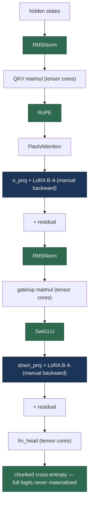

# Breakdown - Unsloth

> Unsloth is an open-source fine-tuning accelerator built by Daniel and Michael Han (Unsloth AI), first released late 2023. It is not a new training algorithm — it is a set of drop-in patches to Hugging Face's forward/backward that make single-GPU [[Deep Dive - LoRA|LoRA]]/[[Concept - QLoRA|QLoRA]] fine-tuning roughly twice as fast and 50-80% lighter on VRAM **with numerically identical loss curves**. Numbers here are as of 2024-2025; the accuracy-neutral claim is what distinguishes it from the many "fast but different" training hacks.

## The headline numbers

| Metric | Claim (single GPU, as of 2024-2025) |
|---|---|
| Training speed | ~2x faster than HF `transformers` + `peft` baseline; more on some configs |
| VRAM | 50-80% reduction (enables longer sequences / larger models on the same card) |
| Accuracy | **0% degradation** — loss curves numerically overlay the reference implementation |
| Scope | Single-GPU LoRA / QLoRA / full FT of Llama, Mistral, Qwen, Gemma, Phi families |
| License | Apache-2.0 open tier is single-GPU; multi-GPU/multi-node historically gated behind a paid tier |

The "0% accuracy loss" is the load-bearing claim. Approximate speedups (aggressive low precision, dropped terms) are easy; the reason Unsloth gets adopted is that it is algebraically exact — you can overlay its training loss on the vanilla HF run and they match step-for-step, so there is no quality tradeoff to reason about.

## How it actually works

Unsloth monkey-patches the model so that the memory-bandwidth-bound "glue" operations run as fused [[Concept - Triton]] kernels while the heavy matmuls stay on cuBLAS / [[Concept - Tensor Cores|tensor cores]]. Green nodes below are where Unsloth replaces eager PyTorch with a fused kernel or a hand-written backward:

The insight is a [[Concept - The Roofline Model|roofline]] one: RMSNorm, RoPE, SwiGLU, and cross-entropy are elementwise/reduction ops with low arithmetic intensity, so they are memory-bandwidth-bound. Eager PyTorch runs each as several separate kernel launches, every one doing a full round-trip through [[Concept - GPU Memory Hierarchy|HBM]]. Fusing a chain of them into one kernel that keeps intermediates in registers/SRAM cuts the HBM traffic by the number of ops fused — which is where most of the speed and memory come from, because the matmuls were never the bottleneck on these steps.

## The clever parts

- **Manual autograd for the LoRA path.** For the adapter branch $y = \frac{\alpha}{r}(xA^\top)B^\top$, define the rank-$r$ bottleneck $h = xA^\top$. HF's generic autograd conservatively retains full-size activations to build the graph; Unsloth hand-writes the backward so it recomputes the *tiny* $h$ on the fly instead of storing large intermediates, and — because the base $W$ is **frozen** — it skips computing $\partial L/\partial W$ entirely. Cheap recompute traded for a large memory saving on the hottest layers.
- **Fused Triton kernels for the bandwidth-bound ops.** [[Concept - RMSNorm and LayerNorm|RMSNorm]], [[Concept - Rotary Position Embeddings (RoPE)|RoPE]], SwiGLU, and the cross-entropy head are rewritten as fused kernels (the same craft as [[Concept - Kernel Fusion|kernel fusion]] shown in [[Snippet - A Minimal FlashAttention Kernel in Triton]]). Attention itself is left to [[Deep Dive - FlashAttention]] — Unsloth doesn't try to beat cuBLAS or FlashAttention, it removes the eager-mode overhead *around* them.
- **Chunked cross-entropy — the single biggest memory win.** The logits tensor from the LM head is `[batch·seq, vocab]`; at Llama-3's 128k vocab and an 8k sequence that is $8192 \times 128256 \times 2\text{B} \approx 2.1\text{GB}$ in bf16 — and you also need the [[Concept - Softmax|softmax]] over it and a same-shape gradient, so materializing all three costs ~6GB just for the loss head, often more than the entire rest of the step at long context. Unsloth computes the [[Concept - Entropy and Cross-Entropy|cross-entropy]] in chunks over the sequence so the full `[·, vocab]` logits are **never materialized**, only per-chunk. This is the dominant term in the [[Reference - Memory Math for Transformers|activation-memory budget]] at long context.
- **Smart gradient checkpointing.** Checkpointed activations are offloaded to CPU over pinned memory with async copies, and redundant upcast copies are avoided — more VRAM headroom for a small, hideable latency cost.

## What it got wrong / what's dated

- **Single-GPU by design.** The open-source path is single-GPU; full multi-GPU / multi-node training was historically gated behind a paid tier (as of 2024-2025). If you're already at 8×H100 with FSDP/DeepSpeed, Unsloth's niche (fit a real fine-tune on one card) matters less.
- **It monkey-patches HF internals.** Speed comes from replacing specific `transformers`/`peft` functions, so it is brittle across version bumps — pin `transformers`, `peft`, and `unsloth` together or expect breakage.
- **It must chase fast-moving architectures.** Every new model family or attention/activation variant needs bespoke kernels; day-one support for a fresh release often lags, and unsupported paths silently fall back to slow eager mode. See [[Reference - Fine-Tuning Hyperparameters]] for which knobs still apply on the fallback path.
- **Kernels assume specific dtypes/layouts.** Exotic combinations (some 4-bit + ZeRO-3 sharding setups, unusual head dims) hit sharp edges the fused paths don't cover.

## What to steal

- **Fuse the bandwidth-bound glue, leave matmuls to cuBLAS.** Norm/RoPE/activation kernels are where fusion pays; don't waste effort re-implementing GEMMs the vendor already tuned for tensor cores.
- **Never materialize full-vocab logits.** Chunk the cross-entropy — this generalizes to any large-vocabulary model and is now formalized as Cut Cross-Entropy (Wijmans et al. 2024).
- **Hand-write the backward for the hot low-rank path** and exploit the frozen base to skip its gradient entirely.
- **Make "numerically identical to the reference" a hard constraint.** Verify by overlaying loss curves; a trainer that is fast but quietly changes the loss is worse than useless, because you can no longer trust any downstream eval. The exact config Unsloth wraps is in [[Snippet - QLoRA Fine-Tune Configuration]].

## Connections
- [[Concept - QLoRA]] — the 4-bit fine-tuning workload Unsloth is most often used to accelerate; it fuses away QLoRA's dequant-per-matmul overhead.
- [[Deep Dive - LoRA]] — the low-rank branch whose backward Unsloth hand-writes.
- [[Snippet - QLoRA Fine-Tune Configuration]] — the vanilla HF config Unsloth is a near-drop-in replacement for.
- [[Reference - Fine-Tuning Hyperparameters]] — the knobs that still apply whether or not Unsloth's fused path is active.
- [[Deep Dive - FlashAttention]] — the attention kernel Unsloth builds on rather than replaces.
- [[Concept - GPU Memory Hierarchy]] — fusion's whole payoff is cutting HBM round-trips by keeping intermediates in SRAM/registers.
- [[Concept - Tensor Cores]] — where Unsloth deliberately leaves the heavy matmuls, optimizing only the glue around them.
- [[Concept - The Roofline Model]] — why fusing the memory-bound norm/RoPE/CE ops (not the compute-bound matmuls) is the right target.
- [[Reference - Memory Math for Transformers]] — quantifies why the `[seq, vocab]` logits tensor dominates the activation budget.
- [[Concept - Rotary Position Embeddings (RoPE)]] — one of the elementwise ops fused into a single Triton kernel.
- [[Concept - RMSNorm and LayerNorm]] — another fused-kernel target on the memory-bound path.
- [[Concept - Softmax]] — the vocab-wide softmax inside cross-entropy that chunking avoids materializing.
- [[Concept - Entropy and Cross-Entropy]] — the loss whose chunked computation is Unsloth's biggest memory win.
- [[Concept - Triton]] — the language Unsloth's fused kernels are written in.
- [[Concept - Kernel Fusion]] — the general technique underlying Unsloth's speedups.
- [[Snippet - A Minimal FlashAttention Kernel in Triton]] — a worked example of the exact kernel craft Unsloth applies to norm/RoPE/CE.

## Sources
- Han & Han (2023-) — *Unsloth* (unsloth.ai, github.com/unslothai/unsloth). The library; engineering is documented in code, blog posts, and release notes rather than a paper.
- Wijmans et al. (2024) — *Cut Your Losses in Large-Vocabulary Language Models.* Formalizes the never-materialize-the-logits chunked cross-entropy that Unsloth ships.
- Dao et al. (2022) — *FlashAttention.* The attention kernel Unsloth composes with rather than reimplements.
