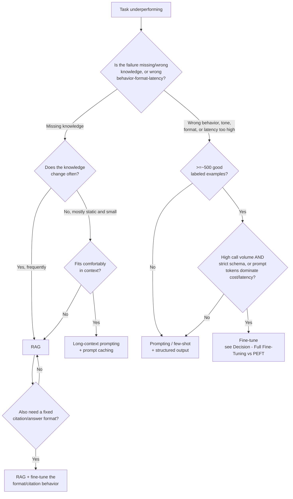

# Decision - Fine-Tuning vs RAG vs Prompting

> Default for the 80% case: **start with prompting, escalate to RAG if the failure is missing knowledge, and escalate to fine-tuning only if the failure is behavior, format, or per-call cost/latency that prompting can't fix.** Most teams reach for fine-tuning first and pay in engineering time and lost iteration speed.

## Decision flow

The deciding question is almost always: **is the gap knowledge or behavior?** If the model doesn't know something, gradient updates won't fix that reliably, cheaply or safely (see [[Concept - What Fine-Tuning Can and Cannot Teach]]), so route to [[Deep Dive - RAG Architectures|RAG]]. If the model knows enough but answers in the wrong shape, length or tone, or too slowly because the prompt is huge, that's a behavior/format/latency gap, and fine-tuning is built for it.

## Tradeoff matrix

| Approach | Engineering cost | Per-call cost | Latency | Update speed | Best for |
|---|---|---|---|---|---|
| Prompting / few-shot | ~$0, minutes to iterate | High; long prompts repeat every call | Extra prefill time for long prompts, mitigated by [[Concept - Prompt Caching]] | Instant | Low volume, fast iteration, exploratory tasks |
| RAG | Retrieval infra + indexing pipeline (days-weeks) | Retrieval cost + moderate prompt | + retrieval latency, tens to low-hundreds of ms | Near-instant: re-index and it's live | Facts that exist outside the model, especially ones that change |
| Fine-tuning (PEFT) | Data curation + a training run (hours, tens-hundreds of $ in compute) | Low; prompt shrinks once the behavior is baked in | No extra latency once the adapter is merged | Slow; needs a new training run | Stable behavior/format at scale, high call volume |
| Fine-tuning (full) | Data curation + a larger training run (GPU-days, hundreds-thousands of $) | Lowest per call | None | Slow and expensive | Large behavior/domain shift, single deployed model, need max quality |

A fine-tune's one-time training cost runs from tens of dollars (a small PEFT run on a rented GPU) to several thousand (larger full fine-tunes). It buys a *permanently* shorter prompt, and at high call volume those savings compound in a way prompting and RAG's per-call costs never do.

Combining approaches is common and often the right answer, not a compromise. Fine-tune the citation/output-format behavior and let RAG supply the facts, so the model reliably wraps retrieved content in the right structure instead of improvising. Fine-tuning can also bake repeated few-shot exemplars into the weights, permanently cutting the tokens spent re-sending the same examples every call. That's a different lever from [[Concept - Prompt Caching]], which speeds up a repeated prefix but still pays to transmit and prefill it once per session.

## The details that flip the decision

- **Strict output schema at high call volume flips to fine-tuning.** If every request needs perfectly formed structured output and the alternative is fighting [[Playbook - Reliable Structured Output|prompted structured output]] reliability at scale, baking the schema into the weights removes a whole class of parsing failures and stops the token cost of repeated formatting instructions.
- **Never fine-tune on rapidly changing data.** If the source of truth updates daily or per user, RAG's near-instant re-index beats a retraining cycle every time. Fine-tuning facts that are stale by ship time is a recurring, avoidable cost.
- **Fewer than ~500 good examples usually means prompting or RAG wins.** Below that, a fine-tune underfits or overfits to the quirks of a small set, and a well-built prompt with a handful of few-shot examples gets most of the same behavior for a fraction of the cost ([[Concept - Chain-of-Thought and Why It Works]] covers structuring the reasoning in those examples).
- **The most common wasted fine-tuning project is "fine-tune the model on our documentation" to teach it facts.** That's a knowledge gap disguised as a fine-tuning problem. Read [[Concept - What Fine-Tuning Can and Cannot Teach]] before spending budget on it.
- **Cost engineering can flip it either way.** Once you're optimizing [[Concept - Cost Engineering for LLM Applications|per-token spend]] at scale, a fine-tune-shortened prompt or [[Concept - Semantic Caching]] on repeated near-duplicate queries can dominate the decision regardless of the knowledge/behavior question. Model the real call-volume economics before committing to a training run.

## Connections
- [[Concept - What Fine-Tuning Can and Cannot Teach]] — the mechanistic reason knowledge gaps route to RAG, not fine-tuning.
- [[Decision - Full Fine-Tuning vs PEFT]] — the next decision once this one lands on "fine-tune."
- [[Deep Dive - RAG Architectures]] — the mechanism behind the RAG branch of this decision.
- [[Concept - Prompt Caching]] — mitigates the prompting branch's per-call token cost without a training run.
- [[Playbook - Reliable Structured Output]] — the prompted alternative to fine-tuning a fixed output schema, and the fallback if it isn't reliable enough.
- [[Concept - Chain-of-Thought and Why It Works]] — relevant to what a good prompt-first attempt looks like before escalating.
- [[Concept - Cost Engineering for LLM Applications]] — the framework for turning this decision's cost row into real dollar figures at your call volume.
- [[Concept - Semantic Caching]] — another lever that can close the cost gap prompting has against fine-tuning, without training anything.

## Sources
This is a distilled practitioner decision framework rather than a single citable result; the mechanisms behind each branch are cited in their own linked notes (RAG mechanics in [[Deep Dive - RAG Architectures]], the knowledge/behavior distinction in [[Concept - What Fine-Tuning Can and Cannot Teach]]).
