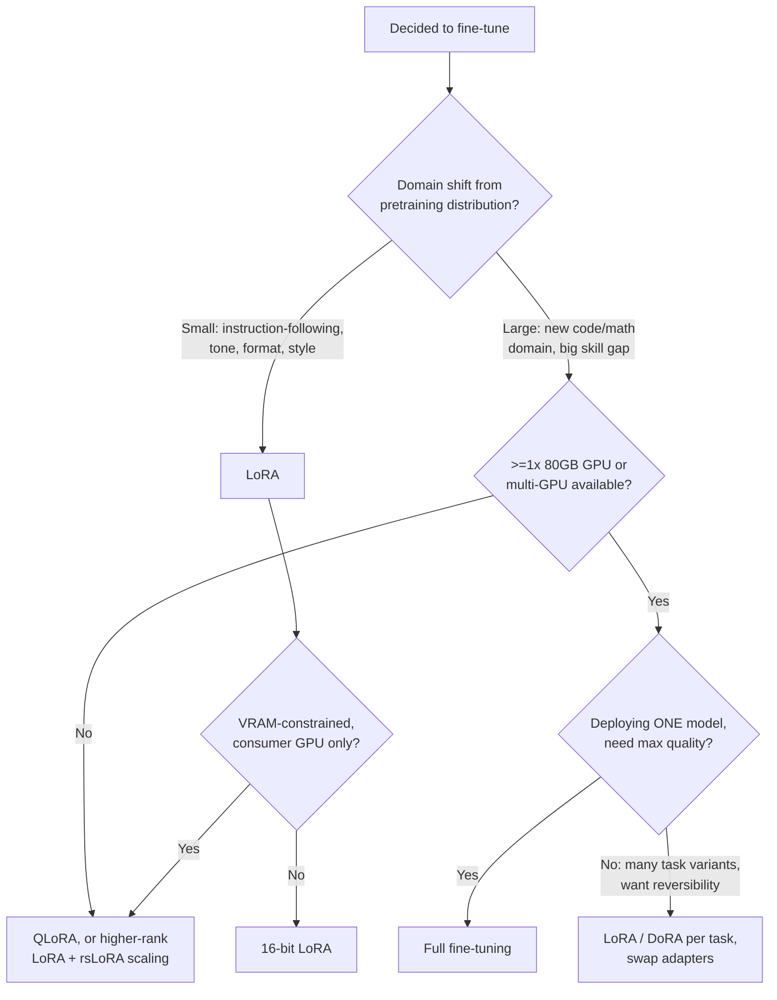

# Decision - Full Fine-Tuning vs PEFT

> Default for the 80% case: **use LoRA (or QLoRA if VRAM-constrained).** Reach for full fine-tuning only when the domain shift is large, you have the hardware, you're deploying exactly one model, and you need the last few points of quality that PEFT leaves on the table.

## Decision flow

## Tradeoff matrix

| Approach | Memory footprint (7B, bf16 base) | Quality | Reversibility / forgetting | Best for |
|---|---|---|---|---|
| Full fine-tuning | ~14GB weights + ~14GB grads + ~56GB fp32 master+moments ≈ 84GB → needs an 80GB A100 ([[Concept - GPU Memory Hierarchy]]) with offload or multi-GPU | Highest — the quality ceiling; wins measurably on large domain shift (code, math) | Hard to roll back; full weight movement carries real [[Concept - Catastrophic Forgetting]] risk | Large domain shift, single deployed model, need the last few points |
| LoRA (16-bit) | Base ~14GB + adapter optimizer state in the low tens of MB | Near full FT on instruction/style adaptation; measurably lags on large shift ([[Concept - Why LoRA Underperforms Full Fine-Tuning]]) | Trivial — drop the adapter, base is untouched; acts as its own regularizer against forgetting | Limited GPU budget, many task variants, want reversibility |
| QLoRA (4-bit NF4 base) | Fits under 16GB total — a single consumer GPU | Slightly below 16-bit LoRA due to quantization error, at a training-speed cost from on-the-fly dequantization | Trivial, same as LoRA | The most memory-constrained setups; democratized single-GPU fine-tuning |

The memory numbers matter more than they look: full fine-tuning's optimizer state alone (fp32 master weight plus two fp32 Adam moments, per [[Concept - Adam and AdamW]] under [[Concept - Mixed Precision Training]]) is what forces multi-GPU or offload — see [[Reference - Memory Math for Transformers]] for the general formula. PEFT doesn't shrink that arithmetic incrementally; it removes almost all of it, because only the adapter's parameters are tracked by the optimizer.

## The details that flip the decision

- **Large domain shift flips toward full fine-tuning.** Biderman et al. 2024 ("LoRA Learns Less and Forgets Less") found that on continued pretraining into code and math domains, LoRA underperforms full fine-tuning substantially — the low-rank update simply doesn't have enough capacity to represent a large new skill or knowledge distribution, whereas on instruction fine-tuning (small shift from the base's existing capabilities) the gap between LoRA and full FT is small.
- **Deploying exactly one model with no need for task variants flips toward full fine-tuning**, since PEFT's main structural advantage — many small adapters sharing one frozen base — doesn't apply when there's only one deployment target and you can afford to own the hardware cost.
- **Limited GPU budget, many task variants, or a need for cheap rollback flip toward PEFT.** A frozen base plus swappable LoRA adapters lets you maintain many task-specific behaviors without N full copies of the model, and reverting a bad fine-tune is deleting an adapter file, not re-deploying a multi-GPU job.
- **QLoRA vs. 16-bit LoRA vs. full FT is its own sub-decision inside "choose PEFT":** QLoRA is the biggest memory saver at a real training-speed cost (dequantizing the 4-bit base on every matmul); 16-bit LoRA is preferable when you have the VRAM and want full training throughput; full FT is worth its cost only when the two points above (domain shift, single-deployment) both hold.
- **Non-obvious flip: LoRA is not automatically faster per training step than full fine-tuning.** [[Deep Dive - LoRA]] barely changes the number of forward-pass FLOPs — the frozen weight matrix still has to be multiplied through in full; the win is in optimizer, gradient, and (with checkpointing) activation *memory*, not compute. If your bottleneck is GPU-hours rather than GPU-memory, PEFT's advantage shrinks or disappears, and the decision should be re-evaluated on wall-clock cost rather than assumed.

## Connections
- [[Deep Dive - LoRA]] — the full mechanism behind the PEFT branch of this decision, including why it doesn't cut forward-pass compute.
- [[Concept - QLoRA]] — the 4-bit variant that answers the "no 80GB GPU available" branch of the flowchart.
- [[Concept - Catastrophic Forgetting]] — why full fine-tuning's reversibility cost is real and PEFT's frozen base mitigates it.
- [[Concept - Why LoRA Underperforms Full Fine-Tuning]] — the mechanistic account of exactly where and why the quality row of the tradeoff matrix favors full FT.
- [[Reference - PEFT Method Comparison]] — the broader lookup table this note's tradeoff matrix is a narrowed slice of.
- [[Reference - Fine-Tuning Hyperparameters]] — the concrete LR/rank/epoch numbers once you've picked a side of this decision.
- [[Reference - Memory Math for Transformers]] — the formulas behind the memory-footprint column above.
- [[Concept - GPU Memory Hierarchy]] — the hardware context for why 80GB is the practical threshold for full fine-tuning a 7B model.
- [[Concept - Mixed Precision Training]] — the training regime the byte-per-parameter estimates assume.
- [[Concept - Adam and AdamW]] — the optimizer whose fp32 master-and-moments state is the actual driver of full fine-tuning's memory cost.
- [[Concept - Data Parallelism and ZeRO]] — the standard way to make full fine-tuning fit when a single GPU isn't enough.
- [[Concept - Supervised Fine-Tuning (SFT)]] — the objective typically run through either side of this decision.

## Sources
- Biderman et al. 2024 — "LoRA Learns Less and Forgets Less." The primary evidence for the domain-shift quality gap between LoRA and full fine-tuning, and for LoRA's regularizing effect against forgetting.
