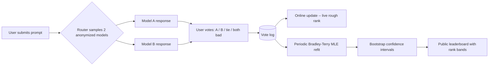

> Chatbot Arena launched in 2023 from UC Berkeley's LMSYS project (Chiang et al. 2024) as a crowdsourced, anonymous, pairwise head-to-head chat leaderboard. By 2024-25 it was the field's default "what do real users prefer" cross-check against every closed-form benchmark in [[Reference - LLM Benchmark Landscape]], with more than 2-3 million votes, and as its influence over model launches grew it spun out into an independent company called LMArena. Its core bet is that a big enough sample of real users voting on real, unrehearsed prompts is harder to game than any static test set. The bet held well enough that the industry came to rely on it, and shakily enough to set off a detailed 2025 governance controversy over who gets to see results before the public. *(as of 2026)*

## The headline numbers

- **>2-3 million pairwise votes** by 2024-25, growing continuously instead of being a fixed-size test set.
- Ratings come from **online updates** for a rough live rank, periodically refit with a full **Bradley-Terry maximum-likelihood** pass and **bootstrap confidence intervals** (Chiang et al. 2024).
- A **Style Control** regression shipped in 2024 that separates response length and markdown-formatting cues from substance. Applying it materially reorders the leaderboard.
- **"The Leaderboard Illusion"** (Singh et al. 2025) alleges private multi-variant testing and selective score disclosure favoring large labs. It's disputed, but detailed enough that the Arena team had to respond publicly.

## How it works

A user submits a prompt. The platform samples two anonymized models and shows both responses side by side, hiding model identity until after the vote to prevent brand-name bias. The user picks a winner, a tie, or "both bad," and the vote is logged. Ratings are computed two ways: a fast online update keeps a rough live rank current, and a periodic batch refit turns the full vote history into a proper **Bradley-Terry** rating,

$$P(A \text{ beats } B) = \sigma(\beta_A - \beta_B) = \frac{1}{1 + e^{-(\beta_A - \beta_B)}}$$

fitting each model's latent strength $\beta$ by maximum likelihood over every recorded pairwise outcome. It's the same model [[Concept - LLM-as-Judge]] uses to aggregate pairwise judge verdicts, and the one behind [[Concept - Reward Models]] trained on pairwise human preference. Bootstrap resampling over the vote log gives per-model confidence intervals, so the public leaderboard shows overlapping rank bands instead of a false strict ordering between models that are statistically indistinguishable. [[Concept - Statistical Rigor in Model Evaluation]] argues every benchmark number needs that discipline.

## The clever parts

1. **Real-world, uncurated prompts.** Prompts come from actual users doing actual tasks, not benchmark authors writing questions by hand. A static benchmark's prompt set can't match that ecological validity.
2. **Fresh, private prompts resist contamination.** Each session's prompts are written in the moment, not published in advance, so the arena works as a [[Concept - Private and Dynamic Benchmarks|living benchmark]]. It's hard to memorize or contaminate by construction, not by policy, unlike a static public benchmark exposed to [[Concept - Benchmark Contamination]].
3. **Category slicing.** Coding, hard prompts, longer queries and multi-turn conversations are tracked as separate leaderboard slices from the same vote stream, so one dataset answers several ranking questions instead of collapsing into one number.
4. **Style Control.** The 2024 regression separates response length and markdown-formatting confidence cues from the win probability to isolate substance. Switching it on reorders the board, which shows how much the raw ranking had been rewarding surface polish.
5. **Bootstrap confidence intervals by default.** Reporting a rank band per model instead of a bare point estimate is a rare case of a public leaderboard putting statistical honesty in its main interface, not a footnote.

## What it got wrong / what's dated

The rater and prompt pool is self-selected. Arena's users skew toward technically sophisticated, English-speaking, coding-heavy power users, not a representative sample of how the broader public uses deployed models. Bradley-Terry assumes transitivity, and real preference data doesn't fully cooperate: human pairwise judgments over models can be cyclic (A beats B beats C beats A), and the fit has no way to detect or flag it. The length and formatting confound went uncorrected for roughly a year before Style Control shipped. For that period a substantial share of Arena's influence on launch decisions rewarded verbose, confidently formatted answers over correct ones, which is what [[Concept - Goodhart's Law in Model Evaluation]] predicts once labs tune generations toward a number. There are credible reports that labs can sometimes fingerprint a target model's stylistic tells inside an anonymized battle and adjust behavior, undermining the anonymity the design depends on. And the 2025 "Leaderboard Illusion" critique alleges that large labs get privileged access to test many private model variants and publish only the best one, plus asymmetric API-level access to scored battle data. That's a governance problem, separate from the statistical ones above and compounding them.

## What to steal

For any internal preference leaderboard (a bake-off between your own fine-tunes, prompt variants or system-prompt candidates), use pairwise voting plus Bradley-Terry aggregation plus bootstrap confidence intervals. It's cheap to compute and honest about uncertainty in a way a raw win-rate table isn't. Arena's own history gives two rules you shouldn't skip if you copy it. Control for length and formatting confounds from day one; waiting a year to find out you were ranking verbosity instead of quality is what happened here. And publish your selection and disclosure methodology up front, because an arena's credibility rests on trust about what the public didn't see, which is what the 2025 critique attacks.

## Connections
- [[Reference - LLM Benchmark Landscape]] — places Arena's human-Elo row alongside the closed-form and LLM-judged benchmarks it's the cross-check for.
- [[Concept - Human Evaluation Methodology]] — Arena is the field's largest-scale live instance of the pairwise-preference study design this note describes generally.
- [[Concept - Reward Models]] — cross-domain (Post-Training): the same Bradley-Terry math, trained into a frozen scalar scorer instead of read live off ongoing votes.
- [[Concept - Statistical Rigor in Model Evaluation]] — the bootstrap-CI and rank-band reporting discipline Arena builds into its default public output.
- [[Concept - Direct Preference Optimization (DPO)]] — cross-domain (Post-Training): DPO's implicit reward is the identical pairwise-preference signal Arena collects, fit directly into policy weights rather than a separate rating.
- [[Concept - LLM-as-Judge]] — the cheap, automated substitute for exactly the kind of pairwise human judgment Arena runs at human scale.
- [[Reference - Model Genealogy]] — cross-domain (Ecosystem & History): Arena rank is a standard tracked column across model generations and releases.
- [[Lore - Benchmark Scandals]] — the 2025 governance critique is one entry in this note's catalogue of the field's benchmark-trust incidents.
- [[Concept - Private and Dynamic Benchmarks]] — Arena's fresh, user-generated prompt stream is the concrete example of a living benchmark this concept describes generally.
- [[Decision - Choosing an Evaluation Method]] — Arena sits at the "need real-world impact, high stakes, use human eval" branch of this note's decision flow.
- [[Concept - Goodhart's Law in Model Evaluation]] — the pre-Style-Control length and formatting gaming is a direct, dated instance of this note's general mechanism.
- [[Concept - Benchmark Contamination]] — Arena's fresh-prompt design is a structural answer to the contamination problem this note catalogues for static benchmarks.

## Sources
- Chiang, W.-L. et al. (2024) — "Chatbot Arena: An Open Platform for Evaluating LLMs by Human Preference." The rating methodology paper: online updates, Bradley-Terry MLE refit, bootstrap CIs.
- Singh, S. et al. (2025) — "The Leaderboard Illusion." Governance critique alleging private multi-variant testing and selective disclosure favoring large labs.
- Zheng, L. et al. (2023) — "Judging LLM-as-a-Judge with MT-Bench and Chatbot Arena." Companion paper introducing the arena methodology alongside the LLM-judge methodology.
