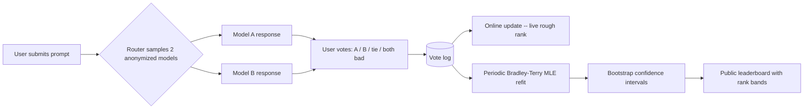

> Chatbot Arena launched in 2023 out of UC Berkeley's LMSYS project (Chiang et al. 2024) as a crowdsourced, anonymous, pairwise head-to-head chat leaderboard, and by 2024-25 had become the field's default "what do real users actually prefer" cross-check against every closed-form benchmark in [[Reference - LLM Benchmark Landscape]] — accumulating more than 2-3 million votes and, as its influence over model launches grew, spinning out into an independent company under the name LMArena. Its core bet is that a large enough sample of real users voting on real, unrehearsed prompts is harder to game than any static test set — a bet that held up well enough to become load-bearing for the industry, and shakily enough to trigger a detailed 2025 governance controversy over who gets to see results before the public does. *(as of 2026)*

## The headline numbers

- **>2-3 million pairwise votes** accumulated by 2024-25, growing continuously rather than being a fixed-size test set.
- Ratings computed via **online updates** for a rough live rank, then periodically refit with a full **Bradley-Terry maximum-likelihood** pass and **bootstrap confidence intervals** (Chiang et al. 2024).
- A **Style Control** regression shipped in 2024, explicitly decomposing response length and markdown-formatting cues from substance — and materially reordering the leaderboard when applied.
- **"The Leaderboard Illusion"** (Singh et al. 2025) alleges private multi-variant testing and selective score disclosure favoring large labs — a disputed but detailed governance critique that forced a public response from the Arena team.

## How it actually works

A user submits a prompt; the platform samples two anonymized models and shows both responses side by side, with model identity withheld until after the vote to prevent brand-name bias. The user picks a winner, a tie, or "both bad," and that vote is logged. Ratings are computed two ways: a fast online update keeps a rough live rank current, and a periodic batch refit converts the full accumulated vote history into a proper **Bradley-Terry** rating,

$$P(A \text{ beats } B) = \sigma(\beta_A - \beta_B) = \frac{1}{1 + e^{-(\beta_A - \beta_B)}}$$

fitting each model's latent strength $\beta$ by maximum likelihood over every recorded pairwise outcome — the identical model [[Concept - LLM-as-Judge]] uses when aggregating pairwise judge verdicts, and the same one behind [[Concept - Reward Models]] trained on pairwise human preference. Bootstrap resampling over the vote log produces per-model confidence intervals, so the public leaderboard reports overlapping rank bands rather than a false strict ordering between models that are statistically indistinguishable — the same discipline [[Concept - Statistical Rigor in Model Evaluation]] argues every benchmark number needs.

## The clever parts

1. **Real-world, uncurated prompt distribution.** Prompts come from actual users doing actual tasks, not benchmark authors hand-writing questions — genuine ecological validity that a static benchmark's prompt set cannot match.
2. **Fresh, private prompts as contamination resistance.** Because each session's prompts are generated in the moment rather than published in advance, the arena is effectively a [[Concept - Private and Dynamic Benchmarks|living benchmark]] — hard to memorize or contaminate against by construction, not by policy, unlike a static public benchmark exposed to [[Concept - Benchmark Contamination]].
3. **Category slicing.** Coding, hard prompts, longer queries, and multi-turn conversations are tracked as separate leaderboard slices from the same underlying vote stream, letting one dataset answer several different ranking questions instead of collapsing everything into one number.
4. **Style Control.** The 2024 regression explicitly decomposes response length and markdown-formatting confidence cues from the win probability, isolating substance — and it reorders the board when switched on, which is itself evidence of how much the raw ranking had been rewarding surface polish.
5. **Bootstrap confidence intervals as the default output.** Reporting a rank band per model, not a bare point estimate, is a rare instance of a public leaderboard building statistical honesty into its primary interface rather than as a footnote.

## What it got wrong / what's dated

The rater and prompt pool is self-selected: Arena's userbase skews toward technically sophisticated, English-speaking, coding-heavy power users, not a representative sample of how deployed models are actually used by the broader public. Bradley-Terry's transitivity assumption doesn't hold perfectly on real preference data — human pairwise judgments over models can be non-transitive (cyclic A-beats-B-beats-C-beats-A patterns), a violation the fitting procedure has no way to detect or flag. The length and formatting confound went uncorrected for roughly a year before Style Control shipped, meaning a substantial share of Arena's early influence on model launch decisions rewarded verbose, confidently-formatted answers over correctness — precisely the failure mode [[Concept - Goodhart's Law in Model Evaluation]] predicts once a number becomes an optimization target that labs tune generations toward. There are credible reports that labs can sometimes fingerprint a target model's stylistic tells within an anonymized battle and adjust behavior accordingly, undermining the anonymity the whole design depends on. And the 2025 "Leaderboard Illusion" critique alleges that large labs get privileged access to test many private model variants against the arena and disclose only the best-performing one publicly, plus asymmetric API-level access to scored battle data — a governance problem distinct from, but compounding, the statistical ones above.

## What to steal

Pairwise voting plus Bradley-Terry aggregation plus bootstrap confidence intervals is the right template for any preference leaderboard you build internally — a bake-off between your own fine-tunes, prompt variants, or system-prompt candidates — because it's cheap to compute and statistically honest about uncertainty in a way a raw win-rate table is not. Two lessons from Arena's own trajectory are non-negotiable if you copy the design: control for length and formatting confounds from day one, because waiting a year to discover you were ranking verbosity instead of quality is exactly what happened here; and publish your selection and disclosure methodology up front, because an arena's entire credibility rests on trust in what didn't get shown to the public, and that trust is exactly what the 2025 critique attacks.

## Connections
- [[Reference - LLM Benchmark Landscape]] — places Arena's human-Elo row alongside the closed-form and LLM-judged benchmarks it's the cross-check for.
- [[Concept - Human Evaluation Methodology]] — Arena is the field's largest-scale live instance of the pairwise-preference study design this note describes generally.
- [[Concept - Reward Models]] — cross-domain (Post-Training): the same Bradley-Terry math, trained into a frozen scalar scorer instead of read live off ongoing votes.
- [[Concept - Statistical Rigor in Model Evaluation]] — the bootstrap-CI and rank-band reporting discipline Arena builds into its default public output.
- [[Concept - Direct Preference Optimization (DPO)]] — cross-domain (Post-Training): DPO's implicit reward is the identical pairwise-preference signal Arena collects, fit directly into policy weights rather than a separate rating.
- [[Concept - LLM-as-Judge]] — the cheap, automated substitute for exactly the kind of pairwise human judgment Arena runs at human scale.
- [[Reference - Model Genealogy]] — cross-domain (Ecosystem & History): Arena rank is a standard tracked column across model generations and releases.
- [[Lore - Benchmark Scandals]] — the 2025 governance critique is one entry in this note's catalogue of the field's benchmark-trust incidents.
- [[Concept - Private and Dynamic Benchmarks]] — Arena's fresh, user-generated prompt stream is the concrete example of a living benchmark this concept describes generally.
- [[Decision - Choosing an Evaluation Method]] — Arena sits at the "need real-world impact, high stakes, use human eval" branch of this note's decision flow.
- [[Concept - Goodhart's Law in Model Evaluation]] — the pre-Style-Control length and formatting gaming is a direct, dated instance of this note's general mechanism.
- [[Concept - Benchmark Contamination]] — Arena's fresh-prompt design is a structural answer to the contamination problem this note catalogues for static benchmarks.

## Sources
- Chiang, W.-L. et al. (2024) — "Chatbot Arena: An Open Platform for Evaluating LLMs by Human Preference." The rating methodology paper: online updates, Bradley-Terry MLE refit, bootstrap CIs.
- Singh, S. et al. (2025) — "The Leaderboard Illusion." Governance critique alleging private multi-variant testing and selective disclosure favoring large labs.
- Zheng, L. et al. (2023) — "Judging LLM-as-a-Judge with MT-Bench and Chatbot Arena." Companion paper introducing the arena methodology alongside the LLM-judge methodology.
