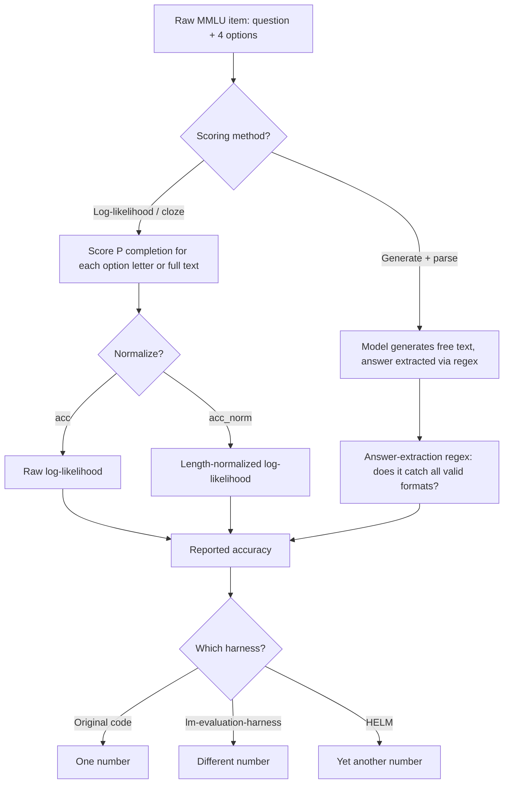

> MMLU (Massive Multitask Language Understanding) is a 57-subject multiple-choice benchmark introduced by Hendrycks et al. in 2021, built to measure broad factual and reasoning knowledge across STEM, humanities, social science, and professional exams. It became the default "how smart is this model" headline number on essentially every model card from 2021 through roughly 2024, at which point frontier models plateaued near saturation and its scoring methodology turned out to be far less standardized — and its labels far less clean — than the field had assumed. *(as of 2026)*

## The headline numbers

- **57 subjects**, spanning elementary mathematics, US history, computer science, law, medicine, and more — roughly organized into STEM, humanities, social sciences, and "other" (professional/applied) clusters.
- **~14,000 test multiple-choice questions**, 4 options each, drawn from real-world sources (exam questions, textbooks) rather than crowd-written.
- **Random baseline: 25%** (4-way MCQ). **Estimated human expert baseline: ~89.8%.**
- Frontier models reached roughly **86–90%** by 2024 and have since plateaued — the benchmark is effectively saturated at the top of the leaderboard, which is what drove the creation of harder successors.
- **Label error rate: ~6.5%** overall on re-annotation, with some individual subjects (virology, notably) exceeding 50% error — meaning the achievable ceiling on those subjects is well below 100% regardless of model quality.

## How it actually works

Each item is a question stem plus four answer options; the standard evaluation protocol is 5-shot (five worked examples prepended to the prompt) with the model scored on whether it selects the correct option. The scoring mechanism, however, is where MMLU stops being a single well-defined thing:

The same model, the same weights, the same 14k questions can produce materially different reported MMLU scores depending on: whether you score the log-likelihood of the option letter token versus the full answer text; whether you use 0-shot or 5-shot; whether a chat template is applied for instruction-tuned models; and which harness implementation (original Hendrycks et al. code, EleutherAI's [[Deep Dive - Designing an Eval Harness]]-standard lm-evaluation-harness, or Stanford HELM) is running the eval. This is not a hypothetical concern — it is the documented 2023 Open LLM Leaderboard MMLU discrepancy, where HuggingFace, the original authors' code, and HELM produced different numbers for the same released model, prompting HuggingFace to publish a post dissecting exactly which implementation choices caused the gap.

## The clever parts

1. **Breadth over depth as a design choice.** 57 subjects sampled from real exams gives MMLU coverage no single hand-built benchmark could match cheaply — it substitutes breadth for the deep, adversarial construction of narrower benchmarks, which is exactly why it became the default "general knowledge" proxy despite testing recognition (MCQ) rather than production.
2. **Sourcing from real exams, not synthetic generation.** Because items came from actual professional and academic exams rather than being crowd-written or LLM-generated, the difficulty distribution reflects real human assessment standards — at the cost of the questions being freely available on the web and therefore contamination-prone (see [[Concept - Benchmark Contamination]]).
3. **Log-likelihood scoring as the default protocol.** Scoring the probability the model assigns to each option rather than requiring free-form generation avoids answer-parsing failures and makes weak base models scoreable — but it also means MMLU numbers measure something closer to calibrated preference over tokens than "the model correctly reasoned to and stated the answer," a gap made explicit in [[Concept - Answer Scoring and Normalization]].
4. **Subject-level granularity as a diagnostic tool.** Reporting per-subject accuracy (not just an aggregate) lets researchers see where a model's knowledge is uneven — a model can score 90% aggregate while being near-random on a specific weak subject, invisible in the top-line number alone.

## What it got wrong / what's dated

The scoring underspecification is the biggest structural flaw: MMLU was published without a single canonical implementation, so "MMLU score" was never actually one well-defined quantity across papers — a problem that took roughly two years and a public leaderboard controversy to surface widely. The label-quality problem compounds it: MMLU-Redux (Gema et al. 2024) re-annotated a sample of the test set and found approximately 6.5% of questions contain outright errors — wrong ground truth, ambiguous phrasing, or multiple defensible correct answers — with some subjects like virology exceeding 50% error rate, meaning a model correctly identifying the *actually* correct answer would be marked wrong by the original key. Contamination is now assumed rather than merely suspected: MMLU has circulated on GitHub, HuggingFace datasets, and countless blog explainers since 2021, so it is embedded to some degree in most large pretraining corpora, and public MMLU scores on any model with a late-2021-or-later training cutoff should be treated as partly memorized rather than purely measuring generalization. Finally, MCQ log-likelihood scoring inherits [[Concept - Multiple-Choice Symbol Binding and Position Bias]] — permuting option order can shift a model's accuracy by double-digit points independent of content, meaning some fraction of any reported MMLU delta between models is a scoring artifact rather than a knowledge difference.

## What to steal

Subject breadth at low marginal cost is genuinely reusable: sourcing from existing structured knowledge sources (exams, certifications, textbooks) rather than commissioning new questions is a cheap way to get wide coverage. But the three fixes MMLU's own lineage teaches are non-negotiable if you build something similar: **clean your labels** before trusting the ceiling (budget for a re-annotation pass — MMLU-Redux found 6.5% failure without looking that hard); **pin and disclose your scoring method** (log-likelihood vs generation, acc vs acc_norm, shot count, chat template) so your number is reproducible by someone else's harness, not just your own; and **report per-subject or per-cluster confidence intervals** (see [[Concept - Statistical Rigor in Model Evaluation]]) before declaring a delta between two models real, especially on the smaller subjects where item counts per subject can be in the low hundreds.

## Connections
- [[Concept - Answer Scoring and Normalization]] — the log-likelihood-vs-generation and acc-vs-acc_norm choices that make "MMLU score" underspecified are exactly this note's subject.
- [[Concept - Multiple-Choice Symbol Binding and Position Bias]] — the option-order and letter-binding confounds that inject double-digit-point noise into MMLU's MCQ format specifically.
- [[Concept - Benchmark Contamination]] — MMLU's web ubiquity since 2021 makes it a canonical example of assumed, not merely suspected, contamination.
- [[Concept - Statistical Rigor in Model Evaluation]] — per-subject item counts are small enough that subject-level deltas need the confidence-interval discipline this note describes.
- [[Reference - LLM Benchmark Landscape]] — places MMLU in the wider comparison table alongside its successors (MMLU-Pro, GPQA) and saturation status.
- [[Concept - Byte-Pair Encoding]] — tokenization choices (Training at Scale domain) directly affect log-likelihood scoring of option letters and leading-space handling in MMLU's cloze format.
- [[Deep Dive - Designing an Eval Harness]] — the general harness-implementation-variance problem this note's Open LLM Leaderboard discrepancy is a concrete instance of.
- [[Concept - Softmax]] — log-likelihood option scoring is a softmax over candidate-token logits (Neural Networks domain), the literal mechanism behind MMLU's default scoring protocol.
- [[Concept - The Emergent Abilities Debate]] — MMLU's saturation trajectory (near-random to ~90% plateau) is one of the datasets cited in arguments about apparent capability discontinuities.
- [[Reference - Model Genealogy]] — MMLU scores across model generations are one of the standard columns in tracking model lineage and capability progression over time.

## Sources
- Hendrycks, D. et al. (2021) — "Measuring Massive Multitask Language Understanding." The original MMLU paper: 57 subjects, ~14k questions, construction and baseline methodology.
- Gema, A. P. et al. (2024) — "Are We Done with MMLU?" (MMLU-Redux). Re-annotation finding ~6.5% overall label error rate, with some subjects far higher.
- HuggingFace (2023) — "What's Going On with the Open LLM Leaderboard?" Documents the cross-harness MMLU scoring discrepancy between the original code, lm-evaluation-harness, and HELM.
- TIGER-Lab (2024) — MMLU-Pro. 10-option, harder-distractor, reasoning-heavy successor built to un-saturate the benchmark.
