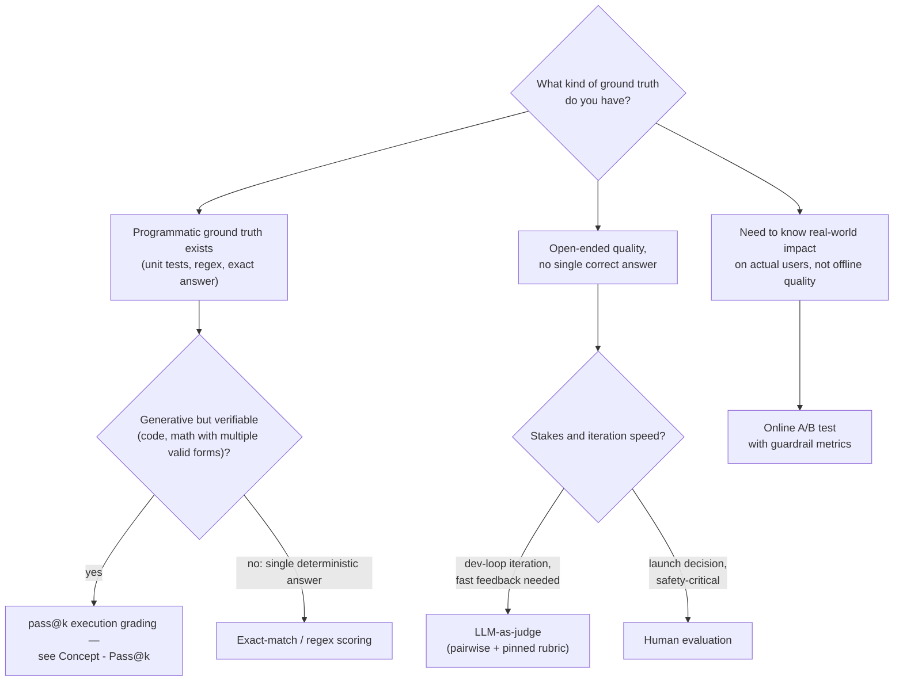

# Decision - Choosing an Evaluation Method

> The method follows from what kind of ground truth you have, not from what's cheapest or most impressive: default to execution-based or exact-match wherever a verifier exists, reach for [[Concept - LLM-as-Judge]] for fast open-ended dev-loop iteration, and escalate to [[Concept - Human Evaluation Methodology|human evaluation]] the moment a launch or safety decision is on the line. That covers the 80% case; the rest turns on stakes, traffic availability, and how gameable the open-ended surface is.

## Decision flow

## Tradeoff matrix

| Method | Cost per sample | Latency | Correlation with true quality | Gameable? | Needs |
|---|---|---|---|---|---|
| Execution-based (unit tests, code run) | Near-free, deterministic | Seconds | High — unfakeable by surface-form tricks | Yes, if the verifier/test suite is weak | A real verifier for the task |
| Exact-match / regex | Near-free, deterministic | Milliseconds | High only when the task genuinely has one correct answer | Yes, via lucky substring matches or answer-format quirks | A programmatically checkable ground truth |
| LLM-as-judge | ~$0.001–0.01 | Seconds | Calibrated judge ≈ human-human agreement (~80%) on easy pairs; collapses on hard reasoning | Yes — position, length, self-preference biases; adversarial phrasing | A rubric, a pinned judge snapshot, ideally a cross-family judge |
| Human evaluation | ~$0.5–5 | Days | The gold reference other methods are validated against | Harder to game, but rater drift/fatigue and pool mismatch still bite | Trained raters, agreement tracking (kappa/alpha) |
| Online A/B | Traffic-dependent, not per-sample | Days to weeks | Measures actual real-world impact, not a proxy | Confounded by novelty effects and segment mix, not "gamed" in the same sense | Sufficient traffic, guardrail metrics, a randomization unit |

Reliability ranking for correlation with true quality, roughly: human ≈ execution > calibrated LLM-judge > naive LLM-judge >> lexical overlap (BLEU/ROUGE — effectively dead as a quality metric because it correlates poorly with human judgment on open-ended generation).

## The details that flip the decision

- **A calibrated LLM-judge collapses exactly where you need it most: hard reasoning and adversarial phrasing.** A fluent-but-wrong answer reliably fools a judge the same way it fools an inattentive human skimmer — see [[Gotchas - LLM-as-Judge Evaluations]]. If your task's failure mode *is* subtle wrongness, don't trust a judge without validating it against held-out human labels on that specific hard slice first (see [[Concept - Meta-Evaluation of LLM Judges]]).
- **Execution-based grading is only as good as the verifier.** A weak or flaky test suite gives false credit for wrong code, and math answer-matching gives false negatives on mathematically equivalent but differently-formatted answers (`1/2` vs `0.5`). Verifier quality caps the entire method regardless of how sophisticated the model is.
- **Human evaluation is required, not optional, when subtlety or safety dominates** — a launch decision, a safety-critical refusal boundary, or any case where the cost of a false "pass" materially outweighs the cost of running humans. Mismatched rater pools (crowd raters grading PhD-level knowledge) silently invalidate the result — see [[Concept - Human Evaluation Methodology]].
- **Online A/B is confounded by novelty effects and segment mix**, not by adversarial gaming — a new feature can look better purely because it's new, and a rollout skewed toward power users doesn't generalize. Guardrail metrics and holdout duration need to be long enough to wash out novelty before trusting the result.
- **Reporting pass@k against a competitor's pass@1 (or vice versa) is a real, recurring inflation** seen in some reasoning-model launch comparisons — the two measure capability-with-retries and single-shot deployment behavior respectively, and are not the same number. See [[Concept - Pass@k and Sampling-Based Evaluation]].
- **Don't pick once — combine.** The 80%-case default is a starting point per method, not a permanent choice: cheap LLM-judge for CI gating and fast iteration, a sampled human audit on top of it, and online A/B as the final arbiter before broad rollout. See [[Playbook - Building a Production Eval Suite]] for how this combination gets wired into an actual pipeline.

## Connections

- [[Concept - Benchmark Taxonomy]] — the underlying taxonomy of scoring paradigms (log-likelihood, generate+parse, execution, judged, human) this decision routes between; read that first for the general framework.
- [[Concept - LLM-as-Judge]] — full mechanics, modes, and bias catalogue for the branch this decision routes to for fast open-ended iteration.
- [[Concept - Human Evaluation Methodology]] — full study-design and reliability-statistics treatment for the branch this decision routes to for launch/safety-critical calls.
- [[Concept - Pass@k and Sampling-Based Evaluation]] — the metric family behind the "verifiable but generative" branch, and the capability-vs-deployment conflation flagged above.
- [[Playbook - Building a Production Eval Suite]] — how to actually operationalize the "combine, don't choose once" principle into a running pipeline with CI gates and online A/B.
- [[Decision - Fine-Tuning vs RAG vs Prompting]] — a sibling decision (owned by domain 12) you typically make *using* the evaluation method this decision selects, not before it.
- [[Concept - Cost Engineering for LLM Applications]] — the cost-per-sample numbers in the tradeoff matrix above feed directly into the budget tradeoffs this note (owned by domain 16) covers in depth.
- [[Concept - Meta-Evaluation of LLM Judges]] — how to validate that the LLM-judge branch is actually trustworthy on your task's difficulty distribution before routing to it over human evaluation.
- [[Gotchas - LLM-as-Judge Evaluations]] — the concrete pitfall catalogue behind the "judge collapses on hard reasoning" flip factor above.

## Sources
- Chen et al. (2021) — Evaluating Large Language Models Trained on Code. Source of the pass@k estimator underlying the execution-based branch.
- Zheng et al. (2023) — Judging LLM-as-a-Judge with MT-Bench and Chatbot Arena. Source of the ~80% judge-vs-human agreement figure cited in the tradeoff matrix.
