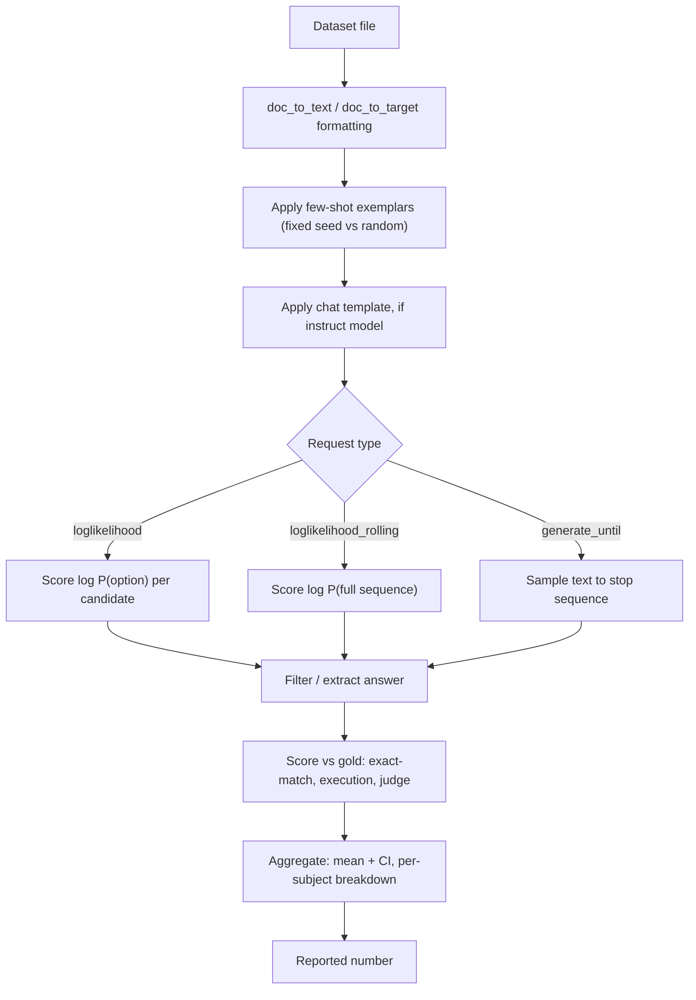

# Deep Dive - Designing an Eval Harness

> An eval harness sits between a raw dataset file and the decimal number that ends up on a leaderboard slide or a launch blog post, and it's where most of the silent, unreported decisions that determine "SOTA" get made. Hold the dataset and the weights fixed and the reported score can still move by ten or twenty points depending on prompt formatting, scoring method, and which of the field's competing harness implementations ran the eval. A harness is a stack of configuration choices, each of which moves the number. This note is about naming and pinning every one of them.

## The mechanism

A harness runs roughly the same eight-stage pipeline for every (model, task) pair:

- **load** the dataset;
- **format** each item into a prompt via a `doc_to_text`/`doc_to_target` template, which keeps shared formatting logic separate from one dataset's odd fields;
- **apply few-shot exemplars** (fixed or randomly sampled, in fixed or randomized order);
- **apply the model's chat template** if it's instruction-tuned ([[Concept - Chat Templates and Special Tokens]]);
- **issue a request** in one of three shapes;
- **filter/extract** an answer from what came back;
- **score** each item against the gold label;
- **aggregate** item scores into a reported number, ideally with a [[Concept - Statistical Rigor in Model Evaluation|confidence interval]] instead of a bare mean.

The request shape is the first fork, and everything downstream follows from it. **`loglikelihood`** requests score the log-probability of each candidate continuation given the context. MCQ formats like MMLU and HellaSwag use this: the harness computes $\log P(\text{option}_i \mid \text{context})$ for each option via a forward pass and a [[Concept - Softmax]] over the vocabulary at each position, then picks (or normalizes across) the top option. The acc-vs-acc_norm details that follow belong to [[Concept - Answer Scoring and Normalization]]. **`loglikelihood_rolling`** scores the log-probability of a whole sequence with no held-out completion; it's the perplexity-style request for the few pure language-modeling tasks. **`generate_until`** samples free text with [[Concept - Sampling and Decoding Parameters|decoding parameters]] and a stop sequence, then passes the raw string to answer extraction (regex, `\boxed{}` parsing, code execution) before scoring. Almost every modern generate-and-parse or execution-based benchmark uses it.

Mixing the two families in one comparison is a category error. One model's `loglikelihood` MCQ score and another's `generate_until` MCQ score on identical questions are different measurements. The first tests calibrated preference over fixed tokens, the second whether the model can produce and articulate the answer.

## Architecture / walkthrough



Follow one MMLU item through. Loaded as raw JSON, `doc_to_text` turns it into a stem plus four lettered options. Few-shot formatting prepends five worked examples in a fixed order. If the model is instruction-tuned, the chat template wraps it in the expected turn structure with the right special tokens. The harness then issues four `loglikelihood` requests, one per option letter, reads back four log-probabilities, and reports the argmax (or length-normalized argmax) as the answer. Each of those five transformations is a place where two harnesses running "the same benchmark" can silently diverge, which is the reproducibility problem this note ends on.

## Evolution

Before standardization, evaluation meant **ad-hoc per-paper scripts**. Every lab hand-rolled loading, formatting and scoring, usually documented only as far as a methods paragraph, and results were frequently unreproducible even by the original authors a year later.

**EleutherAI's lm-evaluation-harness** (Gao et al., first released around 2020-21 to evaluate GPT-Neo and GPT-J) standardized tasks as YAML specs with `doc_to_text`/`doc_to_target` fields. Adding a benchmark became roughly twenty lines of config instead of custom Python. It became the de facto standard, and it's the engine that computed the numbers on the Hugging Face Open LLM Leaderboard.

**Stanford HELM** (Liang et al. 2022) went the other way. It evaluates every (scenario, metric) pair (accuracy, calibration, robustness, fairness, efficiency) and produces a holistic matrix designed to resist optimizing toward one column. **OpenAI Evals** (2023) is a lighter framework for chat-style and instruction-following evals, where a custom eval is a YAML-plus-function pair. **UK AISI Inspect** (2024) targets agentic and tool-use evals, with multi-step transcripts in place of single request/response pairs, as the hardest benchmarks outgrew a single `loglikelihood` or `generate_until` call. The **BigCode evaluation harness** specializes in execution-based code benchmarks (the HumanEval/MBPP family) and treats sandboxed execution as a core request type.

The progression: ad-hoc number, standardized number, multi-metric matrix, multi-step agentic transcript. Each step follows where the hardest-to-measure capability moved.

## In practice

A real invocation is `lm_eval --model hf --model_args pretrained=<checkpoint> --tasks mmlu --num_fewshot 5 --apply_chat_template --batch_size auto`, and each flag changes the reported number: shot count, whether the chat template is applied, and batch size (which interacts with padding and can shift logits enough to matter at the margin). A minimal YAML task spec shows the same fields:

```yaml
task: my_custom_mcq
dataset_path: my_org/my_dataset
doc_to_text: "{{question}}\nA. {{choice_a}}\nB. {{choice_b}}\nAnswer:"
doc_to_target: "{{answer_letter}}"
output_type: loglikelihood
metric_list:
  - metric: acc_norm
```

The most expensive silent mistake here is the chat template. Running an instruction-tuned model without its chat template, or a base model with one, can swing scores by roughly **10-20 points** on the same task. The model was fine-tuned to expect a specific turn structure and special-token layout, and departing from it degrades every downstream capability at once without failing loudly.

[[Breakdown - MMLU]] is the case study for what happens when these choices go unpinned: the same released weights and the same 14k questions, scored differently by the original authors' code, lm-evaluation-harness and HELM. That's the documented 2023 Open LLM Leaderboard MMLU discrepancy. Often the only documentation of these details is the harness's own source repository and issue tracker. [[Reference - Where Real AI Knowledge Lives]] makes the case for that kind of primary-source diligence on anything moving this fast, over trusting a marketing chart's footnote.

## Failure modes

- **Wrong or missing chat template.** An instruct model scores far below its known capability on a task it should find easy. To detect it, read the fully rendered prompt string the harness sent. The bug is invisible from the YAML.
- **Answer-extraction regex misses valid formats.** A `generate_until` parser expects `"The answer is (C)"`, the model writes `"C."` or `"c"`, and correct answers get scored as failures. Audit a sample of items marked wrong by hand; a cluster of near-miss format variants instead of real errors gives it away.
- **Generation truncated below chain-of-thought length.** `max_new_tokens` or a stop sequence cuts the model off before its stated final answer, especially on reasoning-heavy tasks that need hundreds of tokens of working. Look for raw generations that end mid-sentence.
- **Batch-size and padding nondeterminism.** Different batch sizes change padding and kernel batching enough to shift logits at the margin, so the same model can score slightly differently across `batch_size` settings. That variance has nothing to do with the model. Re-run the same config twice; a delta bigger than floating-point noise means a nondeterminism source, not a capability change.
- **Tokenizer leading-space logprob quirks.** `" A"` and `"A"` are different tokens in most byte-pair-encoding tokenizers ([[Concept - Byte-Pair Encoding]]). Get the leading-space convention wrong in a `loglikelihood` request and you silently compare the wrong token's probability, which can flip which MCQ option a model seems to "prefer." It's one instance of the confound in [[Concept - Multiple-Choice Symbol Binding and Position Bias]].

[[Gotchas - Benchmark Harness Pitfalls]] has the full catalogue with symptom/cause/fix/detection for each. This section is a preview.

## The non-obvious

The biggest misunderstanding about harnesses is treating a leaderboard as cross-comparable when it's only **self-consistent**. Within one harness, one pinned version and one task config, you can trust that model A's 62.3 beats model B's 58.1 by a real margin (modulo the caveats in [[Concept - Statistical Rigor in Model Evaluation]]). A paper's self-reported 62.3 and your harness's 62.3 on the same released weights aren't guaranteed to be the same measurement. They can differ by more than the gap between the two models you care about, purely from unpinned formatting, shot count or scoring method. [[Concept - Prompt Format Sensitivity in Evaluation]] documents spreads of similar size from formatting alone, on top of the harness-level variance here.

So: **pin everything**. Harness version, prompt template, shot count, scoring method, decoding seed. Any axis you didn't pin is an active, unmeasured source of variance.

## Connections
- [[Concept - Answer Scoring and Normalization]] — owns the acc-vs-acc_norm and log-likelihood-vs-generation scoring arcana this note deliberately stays out of but depends on at the request-type fork.
- [[Concept - Prompt Format Sensitivity in Evaluation]] — the formatting-level variance (separators, casing, few-shot order) layered on top of the harness-level variance this note describes.
- [[Gotchas - Benchmark Harness Pitfalls]] — the full symptom/cause/fix/detection catalogue this note's Failure modes section previews.
- [[Concept - Multiple-Choice Symbol Binding and Position Bias]] — the specific MCQ confound that tokenizer leading-space handling and option-order interact with inside the harness.
- [[Concept - Byte-Pair Encoding]] — cross-domain (Training at Scale): the tokenization layer whose leading-space and merge behavior directly determines which token a `loglikelihood` request actually scores.
- [[Concept - Softmax]] — cross-domain (Neural Networks): the literal mechanism scoring each option in a `loglikelihood` request.
- [[Concept - Statistical Rigor in Model Evaluation]] — the confidence-interval discipline that should sit at the harness's aggregation stage, not an afterthought applied later.
- [[Concept - Sampling and Decoding Parameters]] — cross-domain (Inference & Serving): the temperature/top-p settings that govern every `generate_until` request.
- [[Reference - Where Real AI Knowledge Lives]] — cross-domain (Ecosystem & History): why a harness's own source and issue tracker, not its paper, is where these implementation details actually live.
- [[Concept - Chat Templates and Special Tokens]] — cross-domain (Prompting & Context): the single highest-variance formatting choice this note names, worth 10-20 points when mishandled.
- [[Breakdown - MMLU]] — the concrete, documented case study of this note's reproducibility-crisis claim: one benchmark, three harnesses, three different numbers.
- [[Checklist - Trusting a Benchmark Number]] — the consumer-side pre-flight check for verifying that someone else's harness was configured the way this note recommends.
- [[Playbook - Building a Production Eval Suite]] — applies this note's harness-design discipline (pinning, scoring method choice) to a shipped product's CI-gating suite rather than a research leaderboard.

## Sources
- Gao, L. et al. (2021) — "A Framework for Few-Shot Language Model Evaluation" (EleutherAI lm-evaluation-harness). The standardized YAML task-spec design that became the de facto harness.
- Liang, P. et al. (2022) — "Holistic Evaluation of Language Models" (HELM). The scenario-by-metric matrix alternative to a single leaderboard number.
- UK AISI (2024) — "Inspect." A harness built for multi-step, agentic, and tool-use evaluation transcripts.
- Hugging Face (2023) — "What's Going On with the Open LLM Leaderboard?" Documents the cross-harness MMLU scoring discrepancy between the original code, lm-evaluation-harness, and HELM.
