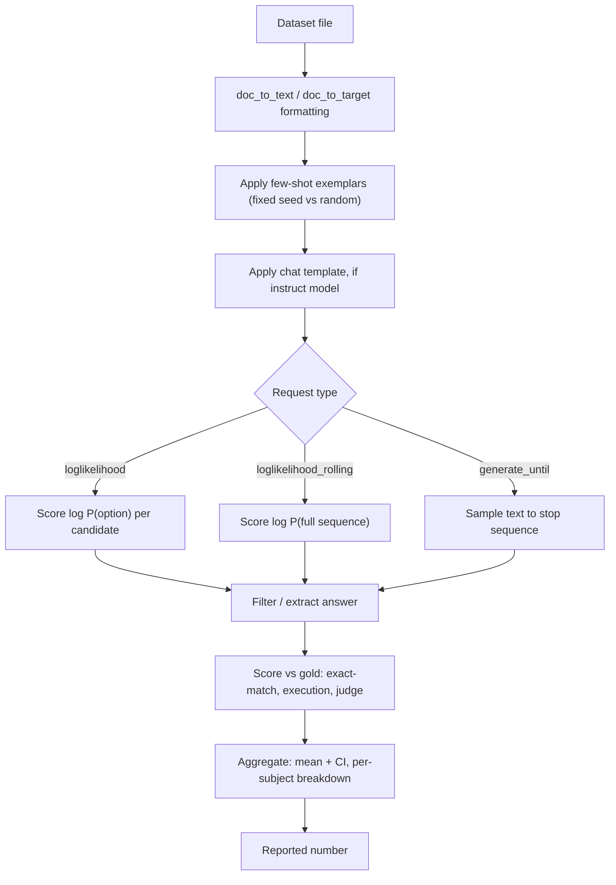

# Deep Dive - Designing an Eval Harness

> An eval harness is the piece of infrastructure standing between a raw dataset file and the single decimal number that ends up on a leaderboard slide or a launch blog post — and it is where almost every silent, unreported decision that actually determines "SOTA" gets made. Hold the dataset and the model weights completely fixed and the reported score can still move by ten or twenty points depending on prompt formatting, scoring method, and which of the field's several competing harness implementations ran the eval. The harness is not a neutral measuring instrument; it is a stack of load-bearing configuration choices, and the central discipline of this note is learning to name and pin every one of them.

## The mechanism

An eval harness executes roughly the same eight-stage pipeline for every (model, task) pair: **load** the dataset; **format** each item into a prompt via a `doc_to_text`/`doc_to_target` template that separates shared formatting logic from one dataset's idiosyncratic fields; **apply few-shot exemplars** (fixed or randomly sampled, in a fixed or randomized order); **apply the model's chat template**, if it is instruction-tuned (see [[Concept - Chat Templates and Special Tokens]]); **issue a request** to the model in one of three shapes; **filter/extract** an answer from whatever came back; **score** each item against the gold label; and **aggregate** item scores into a reported number — ideally with a [[Concept - Statistical Rigor in Model Evaluation|confidence interval]], not a bare mean.

The request shape is the first fork that determines everything downstream. **`loglikelihood`** requests score the model's log-probability of each candidate continuation given the context — the shape used for MCQ formats like MMLU and HellaSwag, where the harness computes $\log P(\text{option}_i \mid \text{context})$ for every option via a forward pass and a [[Concept - Softmax]] over the vocabulary at each position, then picks (or normalizes across) the highest-scoring option; the acc-vs-acc_norm arcana this comparison opens up is deliberately owned by [[Concept - Answer Scoring and Normalization]], not this note. **`loglikelihood_rolling`** scores the log-probability of an entire sequence with no held-out completion — the perplexity-style request used for the small set of pure language-modeling tasks. **`generate_until`** samples free text from the model using [[Concept - Sampling and Decoding Parameters|decoding parameters]] and a stop sequence, then hands the raw string to an answer-extraction step (regex, `\boxed{}` parsing, code execution) before scoring — the shape almost every modern generation-and-parse or execution-based benchmark uses. Mixing these two families in a single comparison is a category error: one model's `loglikelihood` MCQ score and another model's `generate_until` MCQ score on the identical question set are not the same measurement, because they interrogate different capabilities (calibrated preference over fixed tokens versus the ability to actually produce and articulate the answer).

## Architecture / walkthrough



Tracing one item through the pipeline makes the failure surface concrete: an MMLU question loaded as raw JSON becomes, after `doc_to_text`, a stem plus four lettered options; after few-shot formatting it gains five worked examples prepended in a fixed order; after chat-template application (if the model is instruction-tuned) it is wrapped in the model's expected turn structure with the right special tokens; the harness then issues four `loglikelihood` requests, one per option letter, reads back four log-probabilities, and reports the argmax (or the length-normalized argmax) as the model's answer. Every one of those five transformation steps is a place where two harnesses running "the same benchmark" can silently diverge — which is exactly the reproducibility problem this note ends on.

## Evolution

Before any of this was standardized, evaluation was **ad-hoc per-paper scripts**: every lab hand-rolled its own loading, formatting, and scoring code, usually undocumented beyond what fit in a methods paragraph, so results were frequently unreproducible even by the original authors a year later. **EleutherAI's lm-evaluation-harness** (Gao et al., first released around 2020-21 to evaluate GPT-Neo and GPT-J) fixed this by standardizing tasks as YAML specs with `doc_to_text`/`doc_to_target` fields, turning "add a new benchmark" into writing roughly twenty lines of config instead of custom Python — it became the de facto standard and, not incidentally, the literal engine computing the numbers on the Hugging Face Open LLM Leaderboard. **Stanford HELM** (Liang et al. 2022) took the opposite philosophy: rather than one accuracy per task, evaluate every (scenario, metric) pair — accuracy, calibration, robustness, fairness, efficiency — producing a holistic matrix explicitly designed to resist optimizing toward a single column. **OpenAI Evals** (2023) shipped a lighter-weight framework aimed at chat-style and instruction-following evals, where writing a custom eval is a YAML-plus-function pair rather than a full task class. **UK AISI Inspect** (2024) targets agentic and tool-use evals — multi-step transcripts rather than single request/response pairs — as more of the field's hardest benchmarks moved past what one `loglikelihood` or `generate_until` call can capture. The **BigCode evaluation harness** specializes in execution-based code benchmarks (the HumanEval/MBPP family), with sandboxed code execution as a first-class request type rather than an answer-extraction afterthought. The trajectory is legible: single ad-hoc number → standardized single number → holistic multi-metric matrix → multi-step agentic transcript, tracking where the field's hardest-to-measure capability moved next.

## In practice

A real invocation looks like `lm_eval --model hf --model_args pretrained=<checkpoint> --tasks mmlu --num_fewshot 5 --apply_chat_template --batch_size auto`, and every one of those flags is a configuration choice that changes the reported number: the shot count, whether the chat template is applied at all, and the batch size (which interacts with padding and can shift logits by enough to matter at the margin). A minimal YAML task spec exposes the same load-bearing fields directly:

```yaml
task: my_custom_mcq
dataset_path: my_org/my_dataset
doc_to_text: "{{question}}\nA. {{choice_a}}\nB. {{choice_b}}\nAnswer:"
doc_to_target: "{{answer_letter}}"
output_type: loglikelihood
metric_list:
  - metric: acc_norm
```

The single most expensive silent mistake in this list is the chat template: running an instruction-tuned model without applying its chat template — or running a base model with one — can swing scores by roughly **10-20 points** on the same task, because the model was fine-tuned to expect a specific turn structure and special-token layout, and departing from it degrades every downstream capability at once rather than failing loudly. [[Breakdown - MMLU]] is the canonical case study in what happens when these choices go unpinned across implementations: the same released weights, the same 14k questions, scored differently by the original authors' code, by lm-evaluation-harness, and by HELM — the documented 2023 Open LLM Leaderboard MMLU discrepancy. A harness's own source repository and issue tracker are frequently the only place these implementation details are actually documented — the kind of primary-source diligence [[Reference - Where Real AI Knowledge Lives]] argues you need for anything that moves this fast, rather than trusting a marketing chart's footnote.

## Failure modes

- **Wrong or missing chat template.** Symptom: an instruct model scores far below its known capability on a task it should handle easily. Detection: eyeball the fully-rendered prompt string the harness actually sent, not just the task config — the bug is invisible from the YAML alone.
- **Answer-extraction regex misses valid formats.** A `generate_until` task's parser expects `"The answer is (C)"` but the model wrote `"C."` or `"c"` — those get scored as failures despite being correct. Detection: manually audit a sample of the items marked wrong; a cluster of near-miss format variants, not genuine errors, is the tell.
- **Generation truncated below chain-of-thought length.** A `max_new_tokens` or stop-sequence setting cuts the model off before it reaches its own stated final answer, especially on reasoning-heavy tasks where the model needs hundreds of tokens of working before concluding. Detection: inspect raw generations for ones that end mid-sentence rather than at a natural stop point.
- **Batch-size and padding nondeterminism.** Different batch sizes change padding and kernel batching behavior enough to shift logits at the margin, so the same model can report slightly different scores across runs with different `batch_size` settings — a source of run-to-run variance that has nothing to do with the model. Detection: re-run the same config twice; any delta larger than expected floating-point noise indicates a nondeterminism source, not a real capability change.
- **Tokenizer leading-space logprob quirks.** `" A"` and `"A"` are different tokens for most byte-pair-encoding tokenizers (see [[Concept - Byte-Pair Encoding]]), and getting the leading-space convention wrong in a `loglikelihood` request silently compares the wrong token's probability, which can flip which MCQ option a model appears to "prefer" — a specific instance of the broader confound covered in [[Concept - Multiple-Choice Symbol Binding and Position Bias]].

[[Gotchas - Benchmark Harness Pitfalls]] is the full aggregated catalogue of these failure modes with symptom/cause/fix/detection for each; this section is the preview, that note is the reference.

## The non-obvious

The single biggest thing practitioners misunderstand about eval harnesses is treating a leaderboard as cross-comparable when it is only ever **self-consistent**. Within one harness, one pinned version, one task config, you can trust that model A's 62.3 beats model B's 58.1 by a real margin (modulo the statistical caveats in [[Concept - Statistical Rigor in Model Evaluation]]). But a paper's self-reported 62.3 and your own harness's 62.3 on the same released weights are not guaranteed to be the same measurement at all — they can differ by more than the gap between the two models you actually care about comparing, purely from unpinned formatting, shot count, or scoring-method differences. [[Concept - Prompt Format Sensitivity in Evaluation]] documents spreads of similar magnitude from formatting alone, on top of the harness-level variance described here. The design principle that follows: **pin everything** — harness version, prompt template, shot count, scoring method, decoding seed — and treat any axis you didn't pin as an active, unmeasured source of variance, not a detail beneath your attention.

## Connections
- [[Concept - Answer Scoring and Normalization]] — owns the acc-vs-acc_norm and log-likelihood-vs-generation scoring arcana this note deliberately stays out of but depends on at the request-type fork.
- [[Concept - Prompt Format Sensitivity in Evaluation]] — the formatting-level variance (separators, casing, few-shot order) layered on top of the harness-level variance this note describes.
- [[Gotchas - Benchmark Harness Pitfalls]] — the full symptom/cause/fix/detection catalogue this note's Failure modes section previews.
- [[Concept - Multiple-Choice Symbol Binding and Position Bias]] — the specific MCQ confound that tokenizer leading-space handling and option-order interact with inside the harness.
- [[Concept - Byte-Pair Encoding]] — cross-domain (Training at Scale): the tokenization layer whose leading-space and merge behavior directly determines which token a `loglikelihood` request actually scores.
- [[Concept - Softmax]] — cross-domain (Neural Networks): the literal mechanism scoring each option in a `loglikelihood` request.
- [[Concept - Statistical Rigor in Model Evaluation]] — the confidence-interval discipline that should sit at the harness's aggregation stage, not an afterthought applied later.
- [[Concept - Sampling and Decoding Parameters]] — cross-domain (Inference & Serving): the temperature/top-p settings that govern every `generate_until` request.
- [[Reference - Where Real AI Knowledge Lives]] — cross-domain (Ecosystem & History): why a harness's own source and issue tracker, not its paper, is where these implementation details actually live.
- [[Concept - Chat Templates and Special Tokens]] — cross-domain (Prompting & Context): the single highest-variance formatting choice this note names, worth 10-20 points when mishandled.
- [[Breakdown - MMLU]] — the concrete, documented case study of this note's reproducibility-crisis claim: one benchmark, three harnesses, three different numbers.
- [[Checklist - Trusting a Benchmark Number]] — the consumer-side pre-flight check for verifying that someone else's harness was configured the way this note recommends.
- [[Playbook - Building a Production Eval Suite]] — applies this note's harness-design discipline (pinning, scoring method choice) to a shipped product's CI-gating suite rather than a research leaderboard.

## Sources
- Gao, L. et al. (2021) — "A Framework for Few-Shot Language Model Evaluation" (EleutherAI lm-evaluation-harness). The standardized YAML task-spec design that became the de facto harness.
- Liang, P. et al. (2022) — "Holistic Evaluation of Language Models" (HELM). The scenario-by-metric matrix alternative to a single leaderboard number.
- UK AISI (2024) — "Inspect." A harness built for multi-step, agentic, and tool-use evaluation transcripts.
- Hugging Face (2023) — "What's Going On with the Open LLM Leaderboard?" Documents the cross-harness MMLU scoring discrepancy between the original code, lm-evaluation-harness, and HELM.
