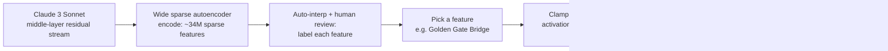

> Golden Gate Claude is Anthropic's May 2024 public demo of a Claude 3 Sonnet checkpoint with one internal feature — the Golden Gate Bridge — pinned to an artificially high value, so the model steered every conversation toward the bridge regardless of topic. It shipped alongside "Scaling Monosemanticity: Extracting Interpretable Features from Claude 3 Sonnet" (Templeton et al., 2024), the first paper to train a [[Concept - Sparse Autoencoders|sparse autoencoder]] at production scale on a deployed frontier model rather than a toy or small research model. The bridge obsession is the memorable part; the actual result is that a lab could catalog millions of human-interpretable directions inside a shipping model and then causally drive its behavior by turning a single dial.

## The headline numbers

- Anthropic, **May 2024**. Templeton et al., "Scaling Monosemanticity: Extracting Interpretable Features from Claude 3 Sonnet."
- SAE trained on activations from a single middle layer of the residual stream of **Claude 3 Sonnet**, a production-scale, deployed model — not a research toy.
- The largest dictionary trained scaled up to **~34 million learned features**, at the time the widest SAE dictionary extracted from a real deployed LLM.
- Feature **34M/31164353** encodes "Golden Gate Bridge" — clamping it to a large fixed value during every forward pass produced the public demo: the model working the bridge into unrelated answers, at the extreme claiming to *be* the bridge.
- First public demonstration that a single SAE feature, identified purely from unsupervised dictionary learning, could be used to causally steer a production model's output at deployment time.

## How it actually works

The pipeline is the standard SAE recipe scaled to production: collect residual-stream activations from a single middle layer of Claude 3 Sonnet over a large corpus, train a wide, sparsely-activating autoencoder to reconstruct those activations through a much larger hidden dimension than the residual stream itself, then use automated interpretation (having a model describe what makes each feature fire) plus human review to attach a human-readable label to each of the millions of resulting directions. The steering step is [[Concept - Activation Steering]] applied at feature granularity: instead of editing weights, clamp the chosen feature's coefficient to an artificially large constant every time the SAE runs during inference, then let the decoder write that inflated activation back into the residual stream where the rest of the model — attention layers, later MLPs, unembedding — processes it as if the model itself had decided the concept was overwhelmingly relevant. The intervention is causal, not correlational: clamping validates that the feature *does* what its auto-interp label claims, which is the whole epistemic move that makes SAE features trustworthy rather than just plausible-looking clusters.

## The clever parts

1. **Feature completeness as a measured quantity, not a vibe.** The paper doesn't just claim features are interpretable — it operationalizes *specificity* (does the feature only fire for the concept it's labeled with?) and *influence* (does clamping it actually change downstream behavior in the predicted direction?) as metrics, turning "this feature means X" into a falsifiable, tested claim rather than a caption on an activation histogram.
2. **Safety-relevant features surfaced directly in a production model.** The dictionary contained findable, labelable directions for deception, sycophancy, [[Concept - Refusal Mechanics|unsafe and backdoored code]], bioweapons-adjacent content, and power-seeking — not constructed as a targeted safety probe, but simply present in an unsupervised catalog of what the model represents. That these concepts exist as legible directions at all is the load-bearing safety result.
3. **Feature-space geometry that mirrors human semantics.** Nearest neighbors of the Golden Gate Bridge feature in the learned direction space cluster around other San Francisco landmarks and physical bridges — the SAE's geometry, learned with no semantic supervision, reproduces the kind of similarity structure you'd expect from a human ontology, evidence the features are tracking real concepts rather than training artifacts.
4. **SAE scaling laws.** The team characterized how reconstruction quality and feature interpretability trade off against dictionary width and compute, which is what let them push confidently to tens of millions of features on a real deployed model instead of guessing at a dictionary size.
5. **A public demo as an evaluation instrument.** Letting anyone talk to the bridge-obsessed model converted an internals paper into something a non-researcher could verify by hand — arguably the single most effective piece of interpretability outreach the field had produced up to that point.

## What it got wrong / what's dated

Thirty-four million features is still an **undercomplete** dictionary — later estimates and follow-up work make clear this maps only a fraction of the concepts a frontier model actually represents, and the whole extraction was scoped to **one middle layer**, saying nothing about how that layer's features are computed from earlier ones or feed into later ones. That cross-layer gap is precisely what [[Concept - Attribution Graphs|attribution graphs]] were built to close roughly a year later. Subsequent interpretability work also complicated the clean "one feature, one concept" story this paper implied: **feature splitting** (a single real concept fragmenting into many redundant, narrower SAE features as dictionary width increases) and **feature absorption** (a broad feature silently swallowing a narrower one, so the narrower concept looks absent from the dictionary when it's actually folded into a bigger direction) both show that monosemanticity is a target the training pressure approaches, not a property it fully delivers.

## What to steal

The SAE-plus-clamping recipe is a generic audit-and-steer tool: train the dictionary, label features (automated + human spot-check), then validate any feature you care about by clamping it and checking the causal effect, rather than trusting the label alone. The deeper transferable result is the existence proof itself — safety-relevant concepts inside a frontier, deployed model are not diffuse or unreachable; they are findable, low-dimensional, and directly manipulable directions, which is the enabling capability every later steering- and probing-based safety technique in this domain builds on.

## Connections
- [[Concept - Sparse Autoencoders]] — the exact dictionary-learning method this paper scaled to production size on a deployed frontier model.
- [[Concept - Activation Steering]] — the general technique this paper's feature-clamping demo is a specific, famous instance of.
- [[Concept - Superposition]] — the phenomenon SAEs exist to undo, and the reason a dictionary this wide was necessary to pull individual concepts back out.
- [[Concept - Refusal Mechanics]] — one of the safety-relevant feature families this extraction surfaced, alongside deception and unsafe-code features.
- [[Deep Dive - Mechanistic Interpretability]] — the overarching research program this result is a landmark, production-scale entry within.
- [[Concept - Attribution Graphs]] — the 2025 successor method that fixed this paper's single-layer, representation-only scope by tracing computation across layers.
- [[Snippet - Ablating the Refusal Direction]] — the sibling steering technique (subtracting a direction instead of clamping it) built on the same feature-as-direction logic this paper established.
- [[Reference - Model Genealogy]] — cross-domain (19) grounding for where Claude 3 Sonnet sits in Anthropic's model lineage.
- [[Concept - Scaling Laws]] — cross-domain (04) grounding for the dictionary-width-vs-quality scaling relationship the SAE scaling-law finding is a direct instance of.
- [[Concept - Jailbreak Taxonomy]] — the safety-relevant features this dictionary surfaced (deception, unsafe code) are exactly the concepts jailbreaks try to route around.

## Sources
- Templeton, A. et al. (2024) — "Scaling Monosemanticity: Extracting Interpretable Features from Claude 3 Sonnet" (Anthropic). Primary source for the SAE architecture, scale, feature-completeness metrics, safety-relevant features, and the Golden Gate Bridge feature and demo described above.
