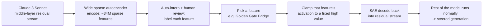

> Golden Gate Claude was Anthropic's May 2024 public demo of a Claude 3 Sonnet checkpoint with one internal feature, the Golden Gate Bridge, pinned to an artificially high value. The model steered every conversation toward the bridge whatever the topic. It shipped with "Scaling Monosemanticity: Extracting Interpretable Features from Claude 3 Sonnet" (Templeton et al., 2024), the first paper to train a [[Concept - Sparse Autoencoders|sparse autoencoder]] at production scale on a deployed frontier model instead of a toy or small research model. People remember the bridge obsession. The result that matters is that a lab could catalog millions of human-interpretable directions inside a shipping model and then causally drive its behavior by turning one dial.

## The headline numbers

- Anthropic, **May 2024**. Templeton et al., "Scaling Monosemanticity: Extracting Interpretable Features from Claude 3 Sonnet."
- The SAE was trained on activations from one middle layer of the residual stream of **Claude 3 Sonnet**, a production-scale deployed model.
- The largest dictionary reached **~34 million learned features**, at the time the widest SAE dictionary extracted from a real deployed LLM.
- Feature **34M/31164353** encodes "Golden Gate Bridge." Clamping it to a large fixed value on every forward pass produced the public demo: the model worked the bridge into unrelated answers and, at the extreme, claimed to *be* the bridge.
- It was the first public demonstration that a single SAE feature, found purely by unsupervised dictionary learning, could causally steer a production model's output at deployment time.

## How it actually works

It's the standard SAE recipe at production scale. Collect residual-stream activations from one middle layer of Claude 3 Sonnet over a large corpus. Train a wide, sparsely activating autoencoder to reconstruct them through a hidden dimension much larger than the residual stream. Then label each of the millions of resulting directions using automated interpretation (a model describes what makes each feature fire) plus human review.

Steering is [[Concept - Activation Steering]] at feature granularity. No weights change. Each time the SAE runs during inference, the chosen feature's coefficient is clamped to a large constant, and the decoder writes the inflated activation back into the residual stream. The rest of the model (attention layers, later MLPs, unembedding) processes it as if the model had decided the concept was overwhelmingly relevant. Because the intervention is causal, clamping confirms that the feature *does* what its auto-interp label says, and that confirmation is what makes SAE features trustworthy instead of plausible-looking clusters.

## The clever parts

1. **Feature quality gets measured.** The paper operationalizes *specificity* (does the feature fire only for its labeled concept?) and *influence* (does clamping it change downstream behavior in the predicted direction?) as metrics. "This feature means X" becomes a falsifiable, tested claim instead of a caption on an activation histogram.
2. **Safety-relevant features show up directly in a production model.** The dictionary had findable, labelable directions for deception, sycophancy, [[Concept - Refusal Mechanics|unsafe and backdoored code]], bioweapons-adjacent content and power-seeking. Nobody built a targeted safety probe for them; they were simply present in an unsupervised catalog of what the model represents. That these concepts exist as legible directions at all is the main safety result.
3. **Feature geometry mirrors human semantics.** The Golden Gate Bridge feature's nearest neighbors in direction space are other San Francisco landmarks and physical bridges. Geometry learned with no semantic supervision reproduces the similarity structure of a human ontology, which is evidence the features track real concepts and not training artifacts.
4. **SAE scaling laws.** The team measured how reconstruction quality and interpretability trade off against dictionary width and compute. That's what let them go to tens of millions of features on a deployed model with confidence instead of guessing a dictionary size.
5. **The public demo worked as an evaluation.** Letting anyone talk to the bridge-obsessed model turned an internals paper into something a non-researcher could check by hand. It was arguably the most effective interpretability outreach the field had produced to that point.

## What it got wrong / what's dated

Thirty-four million features is still an **undercomplete** dictionary. Later estimates and follow-up work make clear it maps only a fraction of the concepts a frontier model represents. The extraction also covered **one middle layer**, and says nothing about how that layer's features are computed from earlier ones or feed later ones. [[Concept - Attribution Graphs|Attribution graphs]] were built roughly a year later to close that cross-layer gap.

Later interpretability work also complicated the clean "one feature, one concept" story the paper implied. With **feature splitting**, one real concept fragments into many redundant, narrower SAE features as the dictionary widens. With **feature absorption**, a broad feature silently swallows a narrower one, so the narrower concept looks absent when it's folded into a bigger direction. Both show that training pushes toward monosemanticity without fully getting there.

## What to steal

SAE-plus-clamping is a generic audit-and-steer tool. Train the dictionary, label features (automated plus human spot checks), and validate any feature you care about by clamping it and checking the causal effect instead of trusting the label. The bigger result is the existence proof. Safety-relevant concepts inside a deployed frontier model aren't diffuse or out of reach. They're findable, low-dimensional, directly manipulable directions, and every later steering- and probing-based safety technique in this domain builds on that.

## Connections
- [[Concept - Sparse Autoencoders]] — the exact dictionary-learning method this paper scaled to production size on a deployed frontier model.
- [[Concept - Activation Steering]] — the general technique this paper's feature-clamping demo is a specific, famous instance of.
- [[Concept - Superposition]] — the phenomenon SAEs exist to undo, and the reason a dictionary this wide was necessary to pull individual concepts back out.
- [[Concept - Refusal Mechanics]] — one of the safety-relevant feature families this extraction surfaced, alongside deception and unsafe-code features.
- [[Deep Dive - Mechanistic Interpretability]] — the overarching research program this result is a landmark, production-scale entry within.
- [[Concept - Attribution Graphs]] — the 2025 successor method that fixed this paper's single-layer, representation-only scope by tracing computation across layers.
- [[Snippet - Ablating the Refusal Direction]] — the sibling steering technique (subtracting a direction instead of clamping it) built on the same feature-as-direction logic this paper established.
- [[Reference - Model Genealogy]] — cross-domain (19) grounding for where Claude 3 Sonnet sits in Anthropic's model lineage.
- [[Concept - Scaling Laws]] — cross-domain (04) grounding for the dictionary-width-vs-quality scaling relationship the SAE scaling-law finding is a direct instance of.
- [[Concept - Jailbreak Taxonomy]] — the safety-relevant features this dictionary surfaced (deception, unsafe code) are exactly the concepts jailbreaks try to route around.

## Sources
- Templeton, A. et al. (2024) — "Scaling Monosemanticity: Extracting Interpretable Features from Claude 3 Sonnet" (Anthropic). Primary source for the SAE architecture, scale, feature-completeness metrics, safety-relevant features, and the Golden Gate Bridge feature and demo described above.
