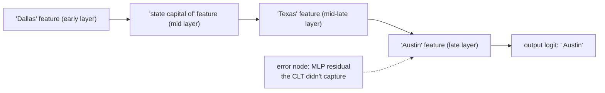

> **One-paragraph hook:** [[Concept - Sparse Autoencoders]] tell you *what* concepts a model represents at a given layer. They say nothing about *how* those representations turn into the next layer's, or into the output token. Attribution graphs fill that gap. Anthropic's 2025 "Circuit Tracing" and its companion "On the Biology of a Large Language Model" build a per-prompt causal graph of which interpretable features drive which others, layer by layer, all the way to the logits. That turns [[Concept - Activation Patching|one-intervention-at-a-time patching]] into a full computational trace you can read like a circuit diagram. It's the closest interpretability has come to a wiring schematic of a frontier model reasoning on a real input, and it produced the first direct evidence that a model's stated chain-of-thought isn't always the computation happening underneath.

## The mechanism

SAEs can't trace computation because of what they're trained on. An SAE reconstructs a layer's *activations*, so it probes representation, not computation. It tells you a "Texas" feature is present at layer 20 and nothing about which earlier features made it fire. **Cross-layer transcoders (CLTs)** are built for that harder job. A CLT at layer $l$ is trained to *approximate the function computed by the MLP block* instead of reconstructing $l$'s residual-stream activation. It reads from the residual stream at and before layer $l$ and predicts the MLP's output, under the same sparsity penalty an SAE uses:

$$
\text{CLT}_l(\mathbf{x}_{\le l}) \approx \text{MLP}_l(\mathbf{x}_l), \qquad \mathcal{L} = \|\text{MLP}_l(\mathbf{x}_l) - \text{CLT}_l(\mathbf{x}_{\le l})\|_2^2 + \lambda \sum_i |\mathbf{h}_i|
$$

Swap every real MLP for its CLT and you have a **replacement model**: the same attention layers, with MLP computation now running through a wide, sparse, interpretable bottleneck. A CLT's hidden units are sparse features with linear read/write weights, so you can differentiate straight through the replacement model and get an exact linear attribution of how much each upstream feature contributed to each downstream feature's activation. That includes features many layers apart, since a CLT can read from every earlier layer.

To build an **attribution graph** for one prompt, run it through the replacement model, record every active feature at every layer and position, and draw a weighted edge $i \to j$ whenever feature $i$'s activation contributes linearly to feature $j$'s (or to an output logit). Two bookkeeping devices keep the graph honest. **Error nodes** hold the residual between the real MLP's output and the CLT's reconstruction at each position, and a large one flags where the replacement model is a poor stand-in. **Graph pruning** drops low-weight paths so a human, or the interactive visualization tool the researchers built for this, can follow the handful of paths that matter to the output.

## In practice

The findings read more like biology than a systems paper, hence the companion paper's title. Multi-hop factual retrieval shows up as a literal chain: a "Dallas" feature drives a "state capital of" feature, which drives "Texas," which drives "Austin." The model computes an intermediate fact (Texas) it never emits as a token before answering. Poetry generation shows real lookahead. Features for a candidate rhyme word activate *before* the line ending in it is written, so the model picks the destination and writes toward it instead of improvising word by word. Multilingual competence traces back to shared, language-agnostic features that route into language-specific output features only at the very end, which gives a mechanistic account of cross-language transfer. There's also a documented hallucination mechanism. A "known entity" feature that should gate whether the model knows enough to answer can misfire on an unfamiliar name that merely resembles a familiar pattern. That suppresses the default "I don't know" pathway and lets a confident, made-up answer through.

The safety-relevant case is refusal. Attribution graphs trace how a harmful-request feature routes through intermediate layers into a refusal-decision feature, a mechanistic version of what [[Concept - Refusal Mechanics]] describes at the concept level. They also show how some jailbreak prompts work: they activate alternate paths that route *around* the harmful-request feature entirely instead of suppressing it.

## Failure modes

- **Per-prompt cost.** A graph explains one input's computation, and there's no shortcut to a graph of the whole model. Building and pruning a readable graph for a single prompt takes a lot of work, which limits how much of a model's behavior the method can cover today.
- **Faithfulness is assumed, not proven.** The trace is only as good as the CLT's approximation of the real MLP. Error-node size is the built-in detector: a large error node means the "explanation" for that step is unreliable. But nothing guarantees the replacement model computes the same thing as the original where errors look small. [[Gotchas - Interpreting Model Internals]] lists this completeness/faithfulness gap as the open risk across the whole toolkit.
- **Attention is out of scope.** CLTs replace MLP computation. The graphs mostly take attention patterns as given without explaining *why* a token was attended to, so much of a transformer's routing stays untraced. That gets worse with [[Concept - Mixture of Experts Architecture|MoE routing]], where the active computational path itself changes discretely per token.

## The non-obvious

The biggest finding is a negative one: a model's verbalized chain-of-thought isn't a complete record of its computation. The poem-planning result (a rhyme-word feature active before the line leading to it is generated) and the Dallas→Texas→Austin trace both show the model computing intermediate results it never states, sometimes working out an answer's structure before writing any of the relevant tokens. That undercuts treating [[Concept - Chain-of-Thought and Why It Works|chain-of-thought output]] as a transparent log of reasoning for oversight. The graph shows computation the transcript doesn't report, in both directions: sometimes richer than the stated reasoning, sometimes decoupled from it.

## Connections
- [[Concept - Sparse Autoencoders]] — the representation-learning primitive CLTs generalize from reconstructing activations to approximating MLP computation.
- [[Deep Dive - Mechanistic Interpretability]] — the overarching research program attribution graphs are the current state of the art within.
- [[Concept - Activation Patching]] — the single-intervention causal primitive that attribution graphs scale into a full per-prompt DAG of causal effects.
- [[Breakdown - Golden Gate Claude]] — the earlier, representation-only SAE landmark this method extends from "what features exist" to "how they compute."
- [[Gotchas - Interpreting Model Internals]] — where this method's faithfulness/completeness caveats and other interpretability pitfalls are cataloged.
- [[Concept - Refusal Mechanics]] — the concept-level account of refusal that attribution graphs give a mechanistic, feature-level trace of.
- [[Concept - Mixture of Experts Architecture]] — cross-domain (03) grounding for why per-token discrete routing is an open extension the CLT-replacement approach hasn't fully absorbed.
- [[Concept - The Residual Stream]] — cross-domain (03) grounding for the substrate CLTs read from and write into at every layer.
- [[Concept - Chain-of-Thought and Why It Works]] — cross-domain (09) grounding for the reasoning-transparency claim that attribution-graph evidence directly complicates.

## Sources
- Anthropic (2025) — "Circuit Tracing: Revealing Computational Graphs in Language Models." Introduces cross-layer transcoders, the replacement-model construction, and attribution-graph tooling described above.
- Anthropic (2025) — "On the Biology of a Large Language Model." The companion paper delivering the multi-hop reasoning, poetry-planning, multilingual, hallucination, and refusal-circuit findings.
