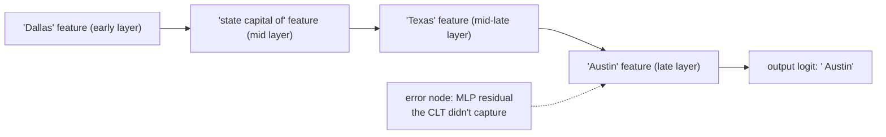

> **One-paragraph hook:** [[Concept - Sparse Autoencoders]] tell you *what* concepts a model represents at a given layer; they say nothing about *how* those representations turn into the next one, or into the final output token. Attribution graphs close that gap. Anthropic's 2025 "Circuit Tracing" and companion "On the Biology of a Large Language Model" build a per-prompt causal graph of which interpretable features drive which other features, layer by layer, all the way to the logits — turning [[Concept - Activation Patching|one-intervention-at-a-time patching]] into a full computational trace you can read like a circuit diagram. It is the closest interpretability has come to an actual wiring schematic of a frontier model's reasoning on a real input, and it is the method that produced the first direct evidence that a model's stated chain-of-thought is not always the computation actually happening underneath it.

## The mechanism

The blocker to tracing computation with SAEs is architectural: an SAE is trained to reconstruct a layer's *activations*, which makes it a representation probe, not a computation probe. It tells you a "Texas" feature is present at layer 20; it says nothing about what combination of earlier features caused it to fire. **Cross-layer transcoders (CLTs)** are built for the harder job. A CLT at layer $l$ is trained not to reconstruct $l$'s residual-stream activation, but to *approximate the function computed by the MLP block* — reading from the residual stream at (and before) layer $l$ and predicting the MLP's output, under the same sparsity penalty an SAE uses:

$$
\text{CLT}_l(\mathbf{x}_{\le l}) \approx \text{MLP}_l(\mathbf{x}_l), \qquad \mathcal{L} = \|\text{MLP}_l(\mathbf{x}_l) - \text{CLT}_l(\mathbf{x}_{\le l})\|_2^2 + \lambda \sum_i |\mathbf{h}_i|
$$

Swap every real MLP for its CLT and you get a **replacement model**: same attention layers, but MLP computation now runs through a wide, sparse, interpretable bottleneck. Because a CLT's hidden units are themselves sparse features with linear read/write weights, you can differentiate straight through the replacement model and get an exact, linear attribution of how much each upstream feature contributed to each downstream feature's activation — including features many layers apart, since a CLT is allowed to read from every earlier layer, not just its own.

An **attribution graph** for one prompt is built by running it through the replacement model, recording every active feature at every layer and position, then drawing a weighted edge $i \to j$ whenever feature $i$'s activation has nonzero linear contribution to feature $j$'s activation (or to an output logit). Two bookkeeping devices make the graph trustworthy rather than decorative: **error nodes**, which capture the residual between the real MLP's output and the CLT's reconstruction at each position (large error nodes flag where the replacement model is a poor stand-in for the real one), and **graph pruning**, which discards low-weight paths so a human — or an interactive visualization tool the researchers built for exactly this — can follow the handful of paths that actually matter to the output.

## In practice

The findings read less like a systems paper and more like biology, which is the point of the companion paper's title. Multi-hop factual retrieval shows up as a literal chain: a "Dallas" feature drives a "state capital of" feature, which drives a "Texas" feature, which drives "Austin" — the model visibly computing an intermediate fact (Texas) it never emits as a token before answering. Poetry generation shows genuine lookahead: features corresponding to a candidate rhyme word activate *before* the line that will end in it is written, meaning the model plans the destination and writes toward it rather than improvising word-by-word. Multilingual competence traces back to shared, language-agnostic features that route into language-specific output features only at the very end — a mechanistic account of transfer across languages. And a documented hallucination mechanism: a "known entity" feature that's supposed to gate whether the model has enough information to answer can misfire — activating on an unfamiliar name that merely resembles a familiar pattern — which suppresses the default "I don't know" pathway and lets a confident, fabricated answer through.

The safety-relevant case is refusal itself: attribution graphs trace how a harmful-request feature routes through intermediate layers into a refusal-decision feature, giving a mechanistic account of the behavior that [[Concept - Refusal Mechanics]] describes at the concept level — and showing concretely how certain jailbreak prompts work by activating alternate paths that route *around* the harmful-request feature entirely rather than suppressing it.

## Failure modes

- **Per-prompt cost.** A graph explains one input's computation; there is no shortcut to a graph of the whole model. Building and pruning a readable graph for a single prompt is labor-intensive, which caps how much of a model's behavior this method can currently cover.
- **Faithfulness is assumed, not proven.** The whole trace is only as good as the CLT's approximation of the real MLP. Error-node magnitude is the built-in detector — a large error node at a step means the "explanation" for that step is unreliable — but there is no general guarantee the replacement model computes the same thing as the original for inputs where errors look small. This completeness/faithfulness gap is exactly what [[Gotchas - Interpreting Model Internals]] catalogs as the open risk across the whole toolkit.
- **Attention is out of scope.** CLTs replace MLP computation; the graphs largely take attention patterns as given rather than explaining *why* a given token was attended to, which understates how much of a transformer's routing behavior — increasingly complicated in architectures with [[Concept - Mixture of Experts Architecture|MoE routing]], where the active computational path itself changes discretely per token — remains untraced.

## The non-obvious

The most consequential finding is negative: the model's verbalized chain-of-thought is not a complete record of its computation. The poem-planning result — a rhyme-word feature active before the line that leads into it is generated — and the Dallas→Texas→Austin trace both show the model computing intermediate results it never states, sometimes computing an answer's structure before any of the relevant tokens have been written. This directly undercuts the practice of treating [[Concept - Chain-of-Thought and Why It Works|chain-of-thought output]] as a transparent log of a model's reasoning for oversight purposes: the graph shows there is a computation happening that the transcript doesn't report, in either direction — sometimes richer than the stated reasoning, sometimes decoupled from it.

## Connections
- [[Concept - Sparse Autoencoders]] — the representation-learning primitive CLTs generalize from reconstructing activations to approximating MLP computation.
- [[Deep Dive - Mechanistic Interpretability]] — the overarching research program attribution graphs are the current state of the art within.
- [[Concept - Activation Patching]] — the single-intervention causal primitive that attribution graphs scale into a full per-prompt DAG of causal effects.
- [[Breakdown - Golden Gate Claude]] — the earlier, representation-only SAE landmark this method extends from "what features exist" to "how they compute."
- [[Gotchas - Interpreting Model Internals]] — where this method's faithfulness/completeness caveats and other interpretability pitfalls are cataloged.
- [[Concept - Refusal Mechanics]] — the concept-level account of refusal that attribution graphs give a mechanistic, feature-level trace of.
- [[Concept - Mixture of Experts Architecture]] — cross-domain (03) grounding for why per-token discrete routing is an open extension the CLT-replacement approach hasn't fully absorbed.
- [[Concept - The Residual Stream]] — cross-domain (03) grounding for the substrate CLTs read from and write into at every layer.
- [[Concept - Chain-of-Thought and Why It Works]] — cross-domain (09) grounding for the reasoning-transparency claim that attribution-graph evidence directly complicates.

## Sources
- Anthropic (2025) — "Circuit Tracing: Revealing Computational Graphs in Language Models." Introduces cross-layer transcoders, the replacement-model construction, and attribution-graph tooling described above.
- Anthropic (2025) — "On the Biology of a Large Language Model." The companion paper delivering the multi-hop reasoning, poetry-planning, multilingual, hallucination, and refusal-circuit findings.
