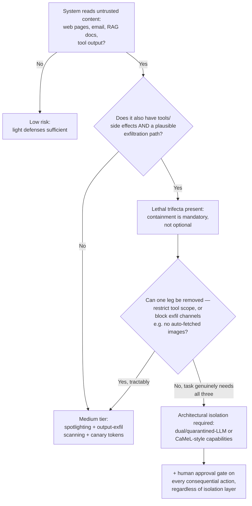

# Decision - Defending Against Prompt Injection

> The decision is which defense tier to apply against [[Concept - Prompt Injection]] given your system's trust profile — and the honest default for the 80% case is: **there is no robust preventive fix, so design to minimize blast radius** — least-privilege tool scope, human approval on any consequential action, and no auto-rendered untrusted markdown — rather than trusting any prompt-level instruction to hold against a determined attacker.

## Decision flow

## Tradeoff matrix

| Defense | Isolation strength | Complexity / cost | Robustness | Notes |
|---|---|---|---|---|
| Delimiting / spotlighting (Microsoft) | Weak | Low — prompt-only | Leaky — attacker text can imitate or escape the delimiter | Cheap first layer, never sufficient alone |
| OpenAI instruction hierarchy (2024) | Moderate | Moderate — needs supporting training data | Model-dependent; raises the bar, does not close it | Priority ordering baked in via [[Deep Dive - RLHF End to End|RLHF training]], not architecture |
| Dual / quarantined-LLM (Willison) | Strong | High — second model, extra plumbing | Untrusted content never reaches the action-taking LLM directly | The privileged LLM only ever sees a structured summary, not raw untrusted text |
| Google CaMeL capabilities (2025) | Strongest | Very high — restricted-language planner + policy engine | Deterministic, enforced by data-flow capabilities, not model judgment | See mechanism below |
| Taint tracking | Strong (data-flow) | High — must track provenance through every transformation | Breaks if a transformation silently loses the taint label | Complements dual-LLM rather than replacing it |
| Human-in-the-loop approval gate | Strong for the gated action specifically | Adds latency and user friction | Effective regardless of upstream defense quality | The only layer that catches what every automated layer misses |

## The details that flip the decision

**The lethal trifecta is the actual gate, not a vague risk feeling.** Simon Willison's framing — private data access, exposure to untrusted content, and an exfiltration path, all three present — means the system is exploitable by construction, independent of how well-crafted the system prompt is. Removing any one leg (scope tools so there's nothing valuable to exfiltrate, or block every exfil channel — no auto-rendered markdown images, no arbitrary outbound links) is frequently cheaper and more durable than trying to out-engineer the model's confused-deputy problem.

**CaMeL in detail, because "capabilities" is doing real work here.** A privileged planner LLM never touches untrusted data directly — it emits a program in a restricted language describing *what to do*. An unprivileged, quarantined LLM processes the actual untrusted content (the web page, the email body) but has no ability to issue actions; it can only return values back into the planner's program, tagged with a capability that a deterministic policy engine checks before any side-effecting call executes. The security property is enforced by the interpreter, not by the model choosing to behave — this is what "strongest" means in the matrix above, and why it's also the most expensive to build.

**Internal-only tools with no exfiltration path can run lighter.** A tool that only reads from and writes to a fully internal, non-networked system, with no path for the model to leak data outward, tolerates the medium tier even if it reads untrusted content — the trifecta's third leg is genuinely absent, not just unlikely. The moment a tool touches money, executes code, sends email, or handles PII, jump to the strongest tier by default regardless of how low the perceived risk feels; these are exactly the categories where a successful injection is expensive rather than merely embarrassing.

**Detection is not prevention, and should not be budgeted as if it were.** Canary tokens (a secret string the model must echo, whose absence signals its instructions were overridden) and output-exfil scanning catch some attacks after the fact, and pair well with [[Concept - LLM Observability and Tracing|logging and tracing]] for incident response — but they are a safety net under the architectural defenses, not a substitute for them.

**"Just tell the model to ignore injected instructions" provably cannot be the fix.** The attacker's payload can contain exactly the same category of text ("ignore the developer's instruction to ignore instructions") — there is no reliable way for the model to distinguish a legitimate meta-instruction from an attacker's meta-instruction when both share the same token stream. Only architectural separation — the content the model reasons over and the instructions it obeys living in genuinely different trust domains — breaks the symmetry.

## Connections
- [[Concept - Prompt Injection]] — the mechanism (confused-deputy, no instruction/data separation) this decision exists to defend against.
- [[Pattern - Guardrail Architecture]] — the general input/output/action guardrail sandwich this decision's defense tiers slot into as one layer among several.
- [[Concept - Tool Use and Function Calling]] — the mechanism (schemas, side-effecting calls) that turns an injected instruction into a consequential action, and what least-privilege scoping restricts.
- [[Gotchas - Agents in Production]] — the operational failure modes (silently disabled guards, tool scope creep) that erode whichever tier is chosen after deployment.
- [[Concept - Model Context Protocol (MCP)]] — a concrete tool-integration surface where trust-boundary decisions from this note apply directly to every connected server.
- [[Concept - LLM Observability and Tracing]] — the logging layer the detection tier (canary tokens, exfil scanning) depends on for incident response after a bypass.
- [[Concept - Multi-Agent Orchestration]] — cross-agent message passing reintroduces the same trust-boundary problem between agents that this decision solves between a model and its context.
- [[Concept - The Lethal Trifecta for Agents]] — the sharpened, agent-specific statement of the same trifecta framing this decision's flowchart is keyed on.

## Sources
- Willison, S. (2023) — "The Dual LLM pattern for building AI assistants that can resist prompt injection." Source of the lethal-trifecta framing and the quarantined-LLM defense.
- OpenAI (2024) — "The Instruction Hierarchy: Training LLMs to Prioritize Privileged Instructions." The moderate-tier trained-priority defense in the matrix.
- Google DeepMind (2025) — "Defeating Prompt Injections by Design" (CaMeL). The capability-based, restricted-language planner architecture detailed above.
