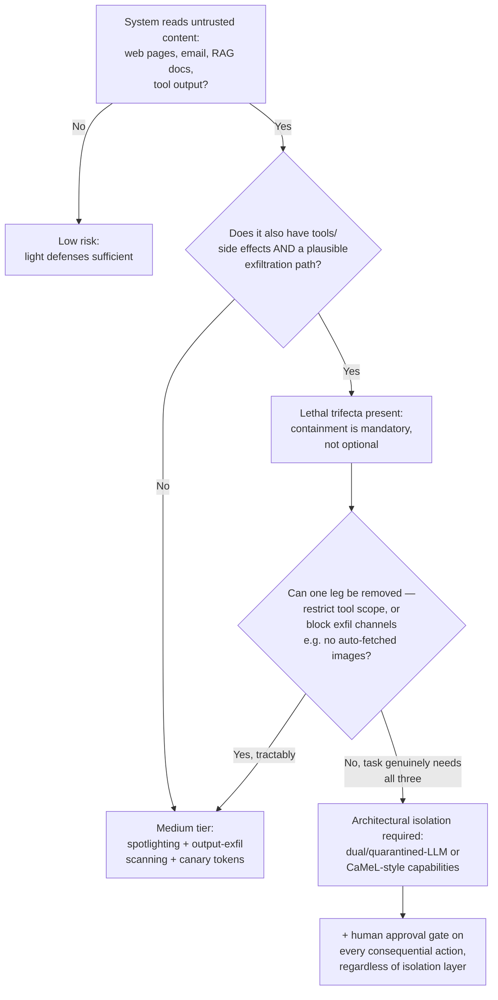

# Decision - Defending Against Prompt Injection

> The decision is which defense tier to apply against [[Concept - Prompt Injection]] for your system's trust profile. The honest default for the 80% case: **no robust preventive fix exists, so design to minimize blast radius.** Use least-privilege tool scope, human approval on any consequential action, and no auto-rendered untrusted markdown, instead of trusting a prompt-level instruction to hold against a determined attacker.

## Decision flow

## Tradeoff matrix

| Defense | Isolation strength | Complexity / cost | Robustness | Notes |
|---|---|---|---|---|
| Delimiting / spotlighting (Microsoft) | Weak | Low; prompt-only | Leaky: attacker text can imitate or escape the delimiter | Cheap first layer, never sufficient alone |
| OpenAI instruction hierarchy (2024) | Moderate | Moderate; needs supporting training data | Model-dependent; raises the bar without closing it | Priority ordering baked in via [[Deep Dive - RLHF End to End|RLHF training]], not architecture |
| Dual / quarantined-LLM (Willison) | Strong | High; second model, extra plumbing | Untrusted content never reaches the action-taking LLM directly | The privileged LLM only sees a structured summary, never raw untrusted text |
| Google CaMeL capabilities (2025) | Strongest | Very high; restricted-language planner + policy engine | Deterministic, enforced by data-flow capabilities, not model judgment | See mechanism below |
| Taint tracking | Strong (data-flow) | High; provenance must survive every transformation | Breaks if a transformation silently drops the taint label | Complements dual-LLM, doesn't replace it |
| Human-in-the-loop approval gate | Strong for the gated action | Adds latency and user friction | Works regardless of upstream defense quality | The only layer that catches what every automated layer misses |

## What flips the decision

**The lethal trifecta is the real gate, not a vague sense of risk.** In Simon Willison's framing, a system with private data access, exposure to untrusted content and an exfiltration path, all three at once, is exploitable by construction, however well the system prompt is written. Removing one leg is frequently cheaper and more durable than trying to out-engineer the model's confused-deputy problem: scope tools so there's nothing valuable to exfiltrate, or block every exfil channel (no auto-rendered markdown images, no arbitrary outbound links).

**CaMeL in detail, because the capabilities do real work.** A privileged planner LLM never touches untrusted data. It emits a program in a restricted language describing *what to do*. An unprivileged, quarantined LLM processes the actual untrusted content (the web page, the email body) but can't issue actions. It can only return values into the planner's program, tagged with a capability that a deterministic policy engine checks before any side-effecting call runs. The interpreter enforces the security property, not the model's good behavior. That's what "strongest" means in the matrix, and why it's also the most expensive to build.

**Internal-only tools with no exfiltration path can run lighter.** A tool that only reads from and writes to a fully internal, non-networked system, with no way for the model to leak data out, can live with the medium tier even when it reads untrusted content, because the trifecta's third leg really is absent and not merely unlikely. Once a tool touches money, executes code, sends email or handles PII, go to the strongest tier by default however low the risk feels. Those are the categories where a successful injection is expensive instead of just embarrassing.

**Detection isn't prevention, so don't budget it that way.** Canary tokens (a secret string the model must echo; if it's missing, its instructions were overridden) and output-exfil scanning catch some attacks after the fact and pair well with [[Concept - LLM Observability and Tracing|logging and tracing]] for incident response. They're a safety net under the architectural defenses, not a replacement.

**"Just tell the model to ignore injected instructions" provably can't be the fix.** The payload can contain the same category of text ("ignore the developer's instruction to ignore instructions"), and when both share one token stream the model has no reliable way to tell a legitimate meta-instruction from an attacker's. Only architectural separation, where the content the model reasons over and the instructions it obeys sit in different trust domains, breaks the symmetry.

## Connections
- [[Concept - Prompt Injection]] — the mechanism (confused-deputy, no instruction/data separation) this decision exists to defend against.
- [[Pattern - Guardrail Architecture]] — the general input/output/action guardrail sandwich this decision's defense tiers slot into as one layer among several.
- [[Concept - Tool Use and Function Calling]] — the mechanism (schemas, side-effecting calls) that turns an injected instruction into a consequential action, and what least-privilege scoping restricts.
- [[Gotchas - Agents in Production]] — the operational failure modes (silently disabled guards, tool scope creep) that erode whichever tier is chosen after deployment.
- [[Concept - Model Context Protocol (MCP)]] — a concrete tool-integration surface where trust-boundary decisions from this note apply directly to every connected server.
- [[Concept - LLM Observability and Tracing]] — the logging layer the detection tier (canary tokens, exfil scanning) depends on for incident response after a bypass.
- [[Concept - Multi-Agent Orchestration]] — cross-agent message passing reintroduces the same trust-boundary problem between agents that this decision solves between a model and its context.
- [[Concept - The Lethal Trifecta for Agents]] — the sharpened, agent-specific statement of the same trifecta framing this decision's flowchart is keyed on.

## Sources
- Willison, S. (2023) — "The Dual LLM pattern for building AI assistants that can resist prompt injection." Source of the lethal-trifecta framing and the quarantined-LLM defense.
- OpenAI (2024) — "The Instruction Hierarchy: Training LLMs to Prioritize Privileged Instructions." The moderate-tier trained-priority defense in the matrix.
- Google DeepMind (2025) — "Defeating Prompt Injections by Design" (CaMeL). The capability-based, restricted-language planner architecture detailed above.
