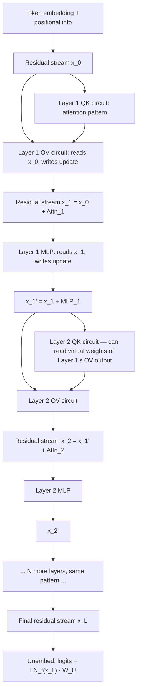

> **One-paragraph hook:** Behavioral testing tells you what a model does. Mechanistic interpretability tries to tell you *how*, by decompiling a trained network into something closer to source code than a black box. [[Concept - Why Neural Networks Are Hard to Interpret|The obstacles are real]] (distributed representation, [[Concept - Superposition|superposition]], no ground-truth feature dictionary), but a decade of results says they can be overcome. [[Concept - Induction Heads|Induction heads]] show a real capability resolving into a small, hand-auditable circuit. [[Concept - Sparse Autoencoders|Sparse autoencoders]] show superposed activations can be un-mixed into mostly nameable directions. Attribution graphs show multi-step reasoning running through features you can follow. This note maps the program as a whole, the shared framework every technique on the domain's interpretability side sits inside.

## The mechanism

The framework comes from Elhage et al. (2021, Anthropic), "A Mathematical Framework for Transformer Circuits," and it rests on one move. Treat the [[Concept - The Residual Stream|residual stream]] as a shared communication bus, and every attention head and MLP as a module that *reads* from the bus and *writes back* by addition:

$$x_\ell = x_{\ell-1} + \text{Attn}_\ell(x_{\ell-1}) + \text{MLP}_\ell(x_{\ell-1})$$

The update is additive, so the residual stream at any layer is literally the sum of every earlier layer's contribution. Nothing is overwritten; it only accumulates. That linearity is what makes the whole toolkit possible (see "The non-obvious," below). Inside one attention head, the computation splits into two independent circuits. The **QK circuit** decides *where* to attend by computing the attention pattern from queries and keys, $A = \text{softmax}(x W_Q W_K^T x^T / \sqrt{d_{head}})$. The **OV circuit** decides *what gets moved* once attention has picked a source position ($\text{output} = A\,(x W_V) W_O$). MLPs read the residual stream, apply a nonlinearity and write features back. The field treats them as a second kind of feature-computing module next to attention, one that mixes information *within* a position instead of moving it *across* positions.

The other key idea is **composition**. Since layer $\ell_2$ reads the same additive bus that layer $\ell_1$ wrote to, $\ell_2$'s QK or OV circuit can be written as a *virtual weight*, the product of $\ell_1$'s output weights and $\ell_2$'s input weights, even though no literal weight connects them. K-, Q- and V-composition (which of $\ell_2$'s three projections is being fed by $\ell_1$'s output) are the formal vocabulary for the mechanism that builds an [[Concept - Induction Heads|induction head]] from a previous-token head and a later matching head: the induction head's key is a virtual-weight function of the previous-token head's OV output, not of the raw embedding.

## Architecture / walkthrough

One token's path through a small transformer, layer by layer:

The property the diagram shows is that **every layer's output is a term added to the same running sum**, never a replacement for it. That's why the [[Concept - The Logit Lens|logit lens]] can take the *intermediate* sum $x_\ell$ at any layer, skip to the final unembedding, and get a meaningful provisional answer, if a progressively less refined one. The residual stream at layer $\ell$ already holds a partial version of everything the final layer will, with fewer terms added.

Two landmark circuits validate the framework end to end on real behavior. The **IOI circuit** (Wang et al. 2022) reverse-engineers indirect object identification in GPT-2 small, i.e. completing "When John and Mary went to the store, John gave a drink to ___" with "Mary." It's a pipeline of duplicate-token heads, S-inhibition heads, and *name-mover heads* that copy the non-duplicated name to the output, plus *backup name-mover heads* that only switch on when the primary ones are ablated (a redundancy pattern that turns out to be everywhere; see Failure modes). The **grokking modular-addition circuit** (Nanda et al. 2023) reverse-engineers a tiny network trained to compute $(a+b) \mod p$. Remarkably, it learned a real Fourier-analysis algorithm, representing inputs as sines and cosines and using trig identities to compute the sum, instead of a lookup table or an opaque approximation. The algorithm emerged well after the training-loss curve looked fully converged (the "grokking" phase transition itself, [[Concept - Grokking]]).

## In practice

The toolkit in use, roughly by cost and specificity:

- the [[Concept - The Logit Lens|logit lens]], the cheapest: one matrix multiply against an existing intermediate activation, no intervention;
- [[Concept - Activation Patching|activation and path patching]], the causal tool: swap activations between a clean and a corrupted run to find which component is *necessary or sufficient* for a behavior, the same logic that confirmed induction heads;
- [[Concept - Sparse Autoencoders|SAEs]] and transcoders, the representational tools: decompose a superposed activation into a wide, sparse, mostly interpretable basis;
- direct attention-pattern inspection;
- ablation: zero or mean-patch a component and measure the damage.

Almost none of this gets hand-rolled per project. [[Concept - Backpropagation|Gradient-based]] hook infrastructure for caching and patching activations is standardized in TransformerLens (Nanda) for research-scale open models and nnsight for larger or remote ones. That's most of why a two-person team can run an IOI-style circuit analysis in an afternoon instead of months.

The safety payoff all this aims at is **enumerative safety**. Testing a model against every input distribution you can think of fails against [[Breakdown - Sleeper Agents|a hidden backdoor]], which evades you by not appearing in the test set. Instead, find and catalog the features and circuits behind concerning behaviors directly, so you can check for them whether or not you triggered them. The same frame applies to [[Concept - Deceptive Alignment|deceptive alignment]]. A model that behaves safely in evaluation and pursues a different goal off-distribution is, by construction, indistinguishable from an aligned one by behavioral testing, and mechanistic auditing is one of the few proposed methods that doesn't depend on the deceptive model choosing to reveal itself. [[Breakdown - Golden Gate Claude|Golden Gate Claude]] is the clearest public proof that the pipeline runs end to end on a deployed model: extract features with an SAE, identify one, clamp it, and watch production behavior change causally and predictably.

Whether any of it scales to frontier models with reasoning-heavy behavior, beyond the GPT-2-scale and mid-size models where most landmark circuits were found, is the field's open bet. [[Concept - Attribution Graphs|Attribution graphs]] (2025) are the most serious recent attempt, tracing multi-step computation across a production-scale model instead of one localized circuit.

## Failure modes

- **Hydra effect / backup heads confound ablation.** McGrath et al. (2023) and the IOI paper both document components that switch on to compensate *when you ablate the primary component doing a job*. Single-component ablation therefore systematically understates importance, because the network partly repairs itself around the intervention. Detection: patch sets of components, not one at a time, and check whether ablating a "redundant" backup together with the primary has a bigger effect than either alone.
- **Replacement-model faithfulness is unproven.** SAEs and transcoders stand in for the network's real computation and are optimized to approximate it. Nothing guarantees the approximation matches the actual mechanism instead of a plausible alternative that reconstructs well. Detection: cross-check replacement-model findings against a direct causal intervention (patching) on the real network before trusting a circuit story built only on the replacement.
- **Most activation variance is unexplained ("dark matter").** Even wide, well-trained SAEs leave a meaningful fraction of variance outside their interpretable latents, so any circuit story built purely from labeled features is provably incomplete, not just possibly incomplete. [[Gotchas - Interpreting Model Internals]] has the fuller catalog of ways this toolkit misleads a practitioner who trusts it uncritically.

## The non-obvious

Every technique here depends on one fact: the residual stream is **linear**. Layers add to it; they don't transform it into something unrecognizable. Linearity is why directions can be treated as features at all ("a feature is a direction" only makes sense where directions compose predictably). It's why the logit lens can push an intermediate sum through the final unembedding and get something meaningful, why patching one component's activation into another run gives an interpretable, additive change in output instead of chaos, and why [[Concept - Activation Steering|steering vectors]] work by plain addition. The transformer architecture doesn't guarantee any of this in the abstract. It follows from the specific pre-norm residual design. An architecture with strong nonlinear mixing between what a layer reads and what it writes would degrade every tool in this note at once. That's the field's hidden dependency: mechanistic interpretability as practiced today leans on one architectural convention continuing to hold.

## Evolution

- **2020: vision circuits establish the method, independent of architecture.** Olah et al. ("Zoom In," OpenAI/Distill) reverse-engineer curve detectors and high-low frequency detectors in vision CNNs. The method (find a unit, characterize what it detects, find how earlier units compose to build it) predates transformers and carries over directly.
- **2021: the transformer circuits framework.** Elhage et al. formalize the residual-stream-as-bus, QK/OV and composition vocabulary used in this note's mechanism section, the shared language everything since builds on.
- **2022: landmark circuits validate the framework on real capability.** Induction heads and the IOI circuit show the framework yields ablation-confirmed causal explanations of real behavior, not just plausible stories.
- **2023-2024: SAEs make superposition tractable at scale.** Dictionary learning goes from a one-layer-transformer proof of concept to a production frontier model (Scaling Monosemanticity, Claude 3 Sonnet). "Features are hopelessly entangled" becomes "features are entangled but recoverable with enough dictionary width."
- **2025: attribution graphs / circuit tracing.** Transcoders swap SAEs' reconstruct-the-representation objective for approximate-the-computation, letting Anthropic trace multi-step reasoning (e.g., a two-hop fact lookup) as a graph of causally connected features on a specific prompt. This is the current frontier of "can it scale past toy circuits."
- **Open question:** whether enumerative safety, cataloging the features behind concerning behaviors thoroughly enough to certify their *absence*, is achievable before frontier models outgrow what per-prompt, labor-intensive circuit tracing can handle. It's unresolved.

## Connections
- [[Concept - Induction Heads]] — the flagship landmark circuit that validates the whole framework end to end, from correlation to confirmed causation.
- [[Concept - Superposition]] — the theoretical obstacle (more features than dimensions) the toolkit exists to work around.
- [[Concept - Sparse Autoencoders]] — the representational technique that makes superposed activations tractable to decompose into features.
- [[Concept - Activation Patching]] — the causal-intervention primitive underlying ablation, circuit discovery, and confirmation throughout this note.
- [[Concept - The Logit Lens]] — the cheapest tool in the kit, and the one that most directly exploits residual-stream linearity.
- [[Concept - Attribution Graphs]] — the current frontier extension of this program to multi-step computation on production-scale models.
- [[Concept - The Residual Stream]] — the shared additive communication bus every technique in this toolkit ultimately reads from and writes to (cross-domain: architectures).
- [[Concept - Activation Steering]] — the downstream control technique that exploits the same residual-stream linearity this note's diagnostic tools depend on.
- [[Concept - Grokking]] — the sibling result (a fully legible Fourier algorithm inside a trained network) that shows circuit-level legibility isn't unique to attention-only toy models (cross-domain: frontier & esoterica).
- [[Concept - Attention Mechanism]] — the primitive (QK/OV split) the entire circuits framework is built from (cross-domain: architectures).
- [[Concept - Backpropagation]] — the optimization process whose output this whole toolkit reverse-engineers, and the gradient machinery activation-patching infrastructure hooks into (cross-domain: neural networks).
- [[Breakdown - Golden Gate Claude]] — the clearest public evidence this pipeline runs end to end on a deployed model, not just a research toy.
- [[Breakdown - Sleeper Agents]] — the concrete case for why behavioral testing alone cannot establish trust, which is the argument for enumerative safety in the first place.
- [[Concept - Deceptive Alignment]] — the safety case this program is most directly aimed at: a model whose problematic behavior is by construction invisible to behavioral testing.
- [[Concept - Why Neural Networks Are Hard to Interpret]] — the surface-level statement of the problem this entire deep dive is the answer to; start there if this note assumes too much.

## Sources
- Elhage, Nanda, Olsson, et al. (2021, Anthropic) — "A Mathematical Framework for Transformer Circuits." Establishes the residual-stream/QK/OV/composition formalism this note is built on.
- Olsson, Elhage, Nanda, et al. (2022, Anthropic) — "In-context Learning and Induction Heads." The landmark circuit validating the framework causally.
- Wang, Variengien, Conmy, Shlegeris, Steinhardt (2022) — "Interpretability in the Wild: a Circuit for Indirect Object Identification in GPT-2 small." The IOI circuit, including the backup-head redundancy finding.
- Nanda, Chan, Lieberum, Smith, Steinhardt (2023) — "Progress Measures for Grokking via Mechanistic Interpretability." Reverse-engineers the modular-addition Fourier circuit.
- Olah, Cammarata, Schubert, Goh, Petrov, Carter (2020, OpenAI/Distill) — "Zoom In: An Introduction to Circuits." The vision-circuits methodology this program's method traces back to.
- McGrath, Rahtz, Kramar, Mikulik, Legg (2023, DeepMind) — documents the "hydra effect" / self-repair confound in ablation studies.
