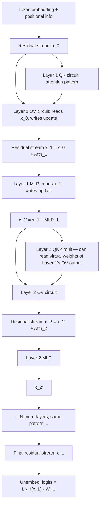

> **One-paragraph hook:** Behavioral testing tells you what a model does; mechanistic interpretability tries to tell you *how* — to decompile a trained network back into something closer to source code than to a black box. [[Concept - Why Neural Networks Are Hard to Interpret|The obstacles are real]] (distributed representation, [[Concept - Superposition|superposition]], no ground-truth feature dictionary), but the field has a decade of accumulating counter-evidence that the obstacles are not insurmountable: [[Concept - Induction Heads|induction heads]] show a real capability resolving into a small, hand-auditable circuit; [[Concept - Sparse Autoencoders|sparse autoencoders]] show superposed activations can be un-mixed into mostly-nameable directions; attribution graphs show multi-step reasoning tracing through features you can actually follow. This note is the map of the program as a whole — the shared framework every technique in this domain's interpretability wing sits inside.

## The mechanism

The organizing framework comes from Elhage et al. (2021, Anthropic), "A Mathematical Framework for Transformer Circuits," and it reduces to one central move: treat the [[Concept - The Residual Stream|residual stream]] as a shared communication bus, and every attention head and MLP as a module that *reads* from that bus and *writes back* to it by addition:

$$x_\ell = x_{\ell-1} + \text{Attn}_\ell(x_{\ell-1}) + \text{MLP}_\ell(x_{\ell-1})$$

Because the update is additive, the residual stream at any layer is literally the sum of every earlier layer's contribution — nothing is overwritten, only accumulated. This linearity is what makes the whole toolkit possible (see "The non-obvious," below). Within one attention head, the computation splits cleanly into two independent circuits: the **QK circuit** decides *where* to attend (it computes the attention pattern from queries and keys, $A = \text{softmax}(x W_Q W_K^T x^T / \sqrt{d_{head}})$), and the **OV circuit** decides *what gets moved* once attention has picked a source position ($\text{output} = A\,(x W_V) W_O$). MLPs read the residual stream, apply a nonlinearity, and write features back — the field treats them as a second class of feature-computing module alongside attention, distinct in that they mix information *within* a position rather than moving it *across* positions.

The framework's other key idea is **composition**: because layer $\ell_2$ reads the same additive bus that layer $\ell_1$ wrote to, $\ell_2$'s QK or OV circuit can be expressed as a *virtual weight* — the product of $\ell_1$'s output weights and $\ell_2$'s input weights — even though no literal weight connects them directly. K-composition, Q-composition, and V-composition (which of $\ell_2$'s three projections is being fed by $\ell_1$'s output) are the formal vocabulary for exactly the mechanism that builds an [[Concept - Induction Heads|induction head]] out of a previous-token head and a later matching head: the induction head's key is a virtual-weight function of the previous-token head's OV output, not of the raw embedding.

## Architecture / walkthrough

Tracing one token's path through a small transformer, layer by layer:

The load-bearing property visible in this diagram is that **every layer's output is a term added to the same running sum**, never a replacement of it — which is exactly why a technique like the [[Concept - The Logit Lens|logit lens]] can take the *intermediate* sum $x_\ell$ at any layer, skip straight to the final unembedding step, and get a meaningful (if progressively less refined) provisional answer: the residual stream at layer $\ell$ already contains a partial version of everything the final layer will contain, just with fewer terms added in.

Two landmark circuits validate this framework end to end on real behavior. The **IOI circuit** (Wang et al. 2022) reverse-engineers indirect object identification in GPT-2 small — the task of completing "When John and Mary went to the store, John gave a drink to ___" with "Mary" — into a pipeline of duplicate-token heads, S-inhibition heads, and *name-mover heads* that copy the non-duplicated name to the output, plus *backup name-mover heads* that only activate when the primary ones are ablated (a redundancy pattern that turns out to be pervasive, see Failure modes). The **grokking modular-addition circuit** (Nanda et al. 2023) reverse-engineers a tiny network trained to compute $(a+b) \mod p$ and finds, remarkably, that it has learned a genuine Fourier-analysis algorithm — representing inputs as sines and cosines and using trigonometric identities to compute the sum — not a lookup table or an opaque approximation, discovered well after the training-loss curve looked fully converged (the "grokking" phase transition itself, [[Concept - Grokking]]).

## In practice

The toolkit in active use, roughly in order of cost and specificity: the [[Concept - The Logit Lens|logit lens]] (cheapest — one matrix multiply against an existing intermediate activation, no intervention needed); [[Concept - Activation Patching|activation and path patching]] (causal — swap activations between a clean and corrupted run to localize which component is *necessary or sufficient* for a behavior, the same causal-intervention logic that confirmed induction heads); [[Concept - Sparse Autoencoders|SAEs]] and transcoders (representational — decompose a superposed activation into a wide, sparse, mostly-interpretable basis); direct attention-pattern inspection; and ablation (zero or mean-patch a component and measure the damage). Almost none of this is hand-rolled per project — [[Concept - Backpropagation|gradient-based]] hook infrastructure for caching and patching activations is standardized in TransformerLens (Nanda) for research-scale open models and nnsight for larger or remote models, which is most of why a two-person team can run an IOI-style circuit analysis in an afternoon rather than months.

The safety payoff this is all building toward is called **enumerative safety**: rather than testing a model against every input distribution you can think of (which [[Breakdown - Sleeper Agents|a hidden backdoor]] can simply evade by not appearing in your test set), find and catalog the features and circuits responsible for concerning behaviors directly, so you can check for their presence regardless of whether you happened to trigger them. This is also the frame for using interpretability on [[Concept - Deceptive Alignment|deceptive alignment]] specifically: a model that behaves safely in evaluation but pursues a different goal off-distribution is, by construction, a case where behavioral testing cannot distinguish it from a genuinely aligned model — mechanistic auditing is one of the only proposed methods that doesn't rely on the deceptive model choosing to reveal itself. [[Breakdown - Golden Gate Claude|Golden Gate Claude]] is the clearest public proof that this pipeline runs end to end on a deployed model, not just a research toy: extract features with an SAE, identify one, clamp it, watch production behavior change causally and predictably.

Whether any of this scales to genuinely frontier-scale models with reasoning-heavy behavior, rather than the GPT-2-scale and mid-size models most landmark circuits were found in, remains the field's open bet — a bet [[Concept - Attribution Graphs|attribution graphs]] (2025) represent the most serious recent attempt to win, by tracing multi-step computation across a production-scale model rather than a single localized circuit.

## Failure modes

- **The hydra effect / backup heads confound ablation.** McGrath et al. (2023) and the IOI paper both document components that only activate to compensate *when you ablate the primary component doing a job* — meaning single-component ablation systematically understates a component's true importance, because the network partially repairs itself around the intervention. Detection: patch sets of components, not one at a time, and check whether ablating a "redundant" backup alongside the primary produces a larger effect than either alone.
- **Faithfulness of replacement models is unproven.** SAEs and transcoders are stand-ins for the network's true computation, optimized to approximate it — nothing guarantees the approximation is faithful to the actual mechanism rather than a plausible-looking alternative that happens to reconstruct well. Detection: cross-check findings from a replacement model against a direct causal intervention (patching) on the real network before trusting a circuit story derived only from the replacement.
- **Most activation variance remains unexplained ("dark matter").** Even well-trained, wide SAEs leave a meaningful fraction of variance unaccounted for by their interpretable latents, which means any circuit story built purely from labeled features is provably incomplete by construction, not just possibly incomplete. See [[Gotchas - Interpreting Model Internals]] for the fuller catalog of ways this toolkit misleads a practitioner who trusts it uncritically.

## The non-obvious

Every technique in this note's toolkit is downstream of one structural fact: the residual stream is **linear** — layers add to it, they don't transform it into something unrecognizable. Linearity is why directions can be treated as features at all (a feature is "a direction," a claim that only makes sense in a space where directions compose predictably), why the logit lens can project an intermediate sum through the final unembedding and get something meaningful, why patching one component's activation into another run produces an interpretable, additive change in the output rather than chaos, and why [[Concept - Activation Steering|steering vectors]] work by simple addition. None of this is guaranteed by the transformer architecture in the abstract — it's a consequence of the specific pre-norm residual design choice. A hypothetical architecture with strong nonlinear mixing between what a layer reads and what it writes (rather than clean addition) would degrade every tool in this note simultaneously, which is the field's quiet dependency: mechanistic interpretability, as currently practiced, is somewhat parasitic on a particular architectural convention continuing to hold.

## Evolution

- **2020 — vision circuits establish the method, not the architecture.** Olah et al. ("Zoom In," OpenAI/Distill) reverse-engineer curve detectors and high-low frequency detectors in vision CNNs — the methodology (find a unit, characterize what it detects, find how earlier units compose to build it) predates transformers entirely and transfers directly.
- **2021 — the transformer circuits framework.** Elhage et al. formalize the residual-stream-as-bus, QK/OV, and composition vocabulary this note's mechanism section uses — the shared language everything since builds on.
- **2022 — landmark circuits validate the framework on real capability.** Induction heads and the IOI circuit show the framework produces genuine, ablation-confirmed causal explanations of real model behavior, not just plausible narratives.
- **2023-2024 — SAEs make superposition tractable at scale.** Dictionary learning goes from a one-layer-transformer proof of concept to a production frontier model (Scaling Monosemanticity, Claude 3 Sonnet), turning "features are hopelessly entangled" into "features are entangled but recoverable with enough dictionary width."
- **2025 — attribution graphs / circuit tracing.** Transcoders replace SAEs' reconstruct-the-representation objective with approximate-the-computation, letting Anthropic trace multi-step reasoning (e.g., a two-hop fact lookup) as a graph of causally connected features on a specific prompt — the current frontier of "can this scale past toy circuits."
- **What's next / open question:** whether enumerative safety — cataloging the features responsible for concerning behaviors comprehensively enough to certify their *absence* — is achievable before frontier models grow past what per-prompt, labor-intensive circuit tracing can keep up with. This is unresolved, not solved.

## Connections
- [[Concept - Induction Heads]] — the flagship landmark circuit that validates the whole framework end to end, from correlation to confirmed causation.
- [[Concept - Superposition]] — the theoretical obstacle (more features than dimensions) the toolkit exists to work around.
- [[Concept - Sparse Autoencoders]] — the representational technique that makes superposed activations tractable to decompose into features.
- [[Concept - Activation Patching]] — the causal-intervention primitive underlying ablation, circuit discovery, and confirmation throughout this note.
- [[Concept - The Logit Lens]] — the cheapest tool in the kit, and the one that most directly exploits residual-stream linearity.
- [[Concept - Attribution Graphs]] — the current frontier extension of this program to multi-step computation on production-scale models.
- [[Concept - The Residual Stream]] — the shared additive communication bus every technique in this toolkit ultimately reads from and writes to (cross-domain: architectures).
- [[Concept - Activation Steering]] — the downstream control technique that exploits the same residual-stream linearity this note's diagnostic tools depend on.
- [[Concept - Grokking]] — the sibling result (a fully legible Fourier algorithm inside a trained network) that shows circuit-level legibility isn't unique to attention-only toy models (cross-domain: frontier & esoterica).
- [[Concept - Attention Mechanism]] — the primitive (QK/OV split) the entire circuits framework is built from (cross-domain: architectures).
- [[Concept - Backpropagation]] — the optimization process whose output this whole toolkit reverse-engineers, and the gradient machinery activation-patching infrastructure hooks into (cross-domain: neural networks).
- [[Breakdown - Golden Gate Claude]] — the clearest public evidence this pipeline runs end to end on a deployed model, not just a research toy.
- [[Breakdown - Sleeper Agents]] — the concrete case for why behavioral testing alone cannot establish trust, which is the argument for enumerative safety in the first place.
- [[Concept - Deceptive Alignment]] — the safety case this program is most directly aimed at: a model whose problematic behavior is by construction invisible to behavioral testing.
- [[Concept - Why Neural Networks Are Hard to Interpret]] — the surface-level statement of the problem this entire deep dive is the answer to; start there if this note assumes too much.

## Sources
- Elhage, Nanda, Olsson, et al. (2021, Anthropic) — "A Mathematical Framework for Transformer Circuits." Establishes the residual-stream/QK/OV/composition formalism this note is built on.
- Olsson, Elhage, Nanda, et al. (2022, Anthropic) — "In-context Learning and Induction Heads." The landmark circuit validating the framework causally.
- Wang, Variengien, Conmy, Shlegeris, Steinhardt (2022) — "Interpretability in the Wild: a Circuit for Indirect Object Identification in GPT-2 small." The IOI circuit, including the backup-head redundancy finding.
- Nanda, Chan, Lieberum, Smith, Steinhardt (2023) — "Progress Measures for Grokking via Mechanistic Interpretability." Reverse-engineers the modular-addition Fourier circuit.
- Olah, Cammarata, Schubert, Goh, Petrov, Carter (2020, OpenAI/Distill) — "Zoom In: An Introduction to Circuits." The vision-circuits methodology this program's method traces back to.
- McGrath, Rahtz, Kramar, Mikulik, Legg (2023, DeepMind) — documents the "hydra effect" / self-repair confound in ablation studies.
