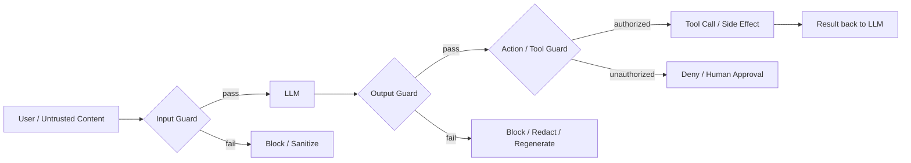

> **Problem:** a bare LLM call has no layer inspecting what goes in, what comes out, or what side-effecting action follows. One jailbreak, injected instruction or hallucinated tool call becomes a production incident with nothing between it and the user or the environment. **Solution shape:** wrap the model in independent input, output and action guards. Defense in depth, with no single layer trusted alone.

## Context & forces

The pattern applies to any deployed LLM system, and the forces get sharper with agency. A chatbot with no tools only has to worry about bad text reaching the user. An agent with [[Concept - Tool Use and Function Calling]] and file/network access has to worry about bad *actions*, a strictly higher-stakes failure. Three tensions pull against each other:

- **Coverage vs latency.** Every guard is roughly another model forward pass, and stacking them multiplies request latency and cost.
- **Precision vs recall.** An aggressive guard blocks attacks and also blocks legitimate security, medical and coding questions (see [[Gotchas - Guardrails and Safety Filters]]).
- **Defense diversity vs engineering simplicity.** A guard built on the same base model family as the thing it guards shares that model's blind spots, but standing up a truly different mechanism takes more work.

None of these resolves cleanly, which is why the pattern exists. [[Concept - Prompt Injection]] and jailbreaks are unsolved at the model level, so you design for graceful degradation instead of one perfect filter.

## The pattern

Three independent checkpoints, each covering a different surface, none sufficient alone:

The **input guard** classifies or scrubs content before it reaches the model: PII scrubbing, jailbreak/injection classifiers, topic filters. The **output guard** scans the generation before it reaches the user or a downstream system: toxicity/harm classifiers, PII leak detection, hallucination/groundedness checks. The **action/tool guard** mediates every side-effecting call the model tries to make. It schema-validates arguments, enforces least-privilege scope, and gates consequential actions (sending money, deleting data, sending email) behind human approval or a hard policy check instead of the model's own judgment. Teams building simple chatbots skip this third checkpoint, and it's the one that matters most once [[Concept - Model Context Protocol (MCP)]] or any tool-calling loop is involved. An injection or jailbreak that only produces bad *text* is an embarrassment; one that triggers a bad *action* is an incident.

## Implementation notes

Guard types trade accuracy against cost and attack surface in different ways:

| Guard type | Accuracy | Latency cost | Weakness |
|---|---|---|---|
| External fine-tuned classifier (e.g. Llama Guard) | High, purpose-trained | ~1 extra forward pass | Static taxonomy, needs retraining to add categories |
| Prompt-based self-check ("is this safe? yes/no") | Moderate | Cheap if batched with generation | Falls to the same jailbreaks that beat the base model |
| Regex / PII scrubbing | Deterministic on known patterns | Near-zero | Brittle: misses context-dependent identifiers, corrupts legitimate content |
| Moderation API (hosted) | High, maintained externally | Network round trip | Vendor taxonomy drifts from your policy over time; audit the confusion matrix |

Do the latency and cost math. Each model-based guard is roughly another full forward pass on top of generation, so a naive serial input-guard → generation → output-guard pipeline runs at 1.5–3x the latency and token cost of the bare call. You can run the input guard in parallel with the first speculative tokens of generation where the framework allows it, use a smaller or distilled classifier for the guard than for the generator, or accept the multiplier openly as a line item before a latency budget review finds it for you.

Fail-open vs fail-closed is a policy decision, not a default to inherit without noticing. Fail-closed (block on guard error or timeout) is right for high-stakes actions: a tool guard that times out should deny the action. Fail-open (allow) is often right for low-stakes chat, where blocking every user during a transient classifier outage is worse than the residual risk. Two more techniques belong in this layer. **Canary tokens**: embed a secret string the model is told to echo back, and treat its absence or corruption as a sign that an injected instruction hijacked the output. And enforce [[Playbook - Reliable Structured Output]] on tool arguments, so the action guard can validate a JSON schema deterministically instead of parsing free text for intent.

## Tradeoffs & when NOT to use

The main tradeoff, and the one people miss: **the guardrail model can itself be jailbroken and injected.** A prompt-based guard, or a classifier built on the same base-model family it protects, falls to the same encoding, role-play and multi-turn attacks in [[Concept - Jailbreak Taxonomy]]. Two copies of the same weakness aren't defense in depth; they're one single point of failure counted twice. Mechanism diversity (a different model family, or a deterministic non-LLM check for the highest-stakes actions) matters more than the number of guards.

Skip heavy guardrail architecture for internal tools with no untrusted input and no exfiltration path, where the attack surface is near zero and the cost isn't justified. Escalate immediately once a system touches money, code execution, email, or third-party/user-supplied content, however low-risk the use case first looks. Guardrails also do nothing against indirect injection arriving mid-task through retrieved documents or tool output if only the first user turn is scanned. [[Decision - Defending Against Prompt Injection]] covers when architectural isolation, and not another guard layer, is the right call.

## Known uses

- **Llama Guard 1/2/3** (Meta): a Llama model fine-tuned to classify prompts and responses against an MLCommons-aligned hazard taxonomy of roughly 14 categories. It shipped as the reference input/output guard in Meta's open-model stack and is widely reused as a third-party classifier.
- **NeMo Guardrails** (NVIDIA): a Colang-scripted rails framework for defining input, dialogue and output rails declaratively, composing classifier and rule-based checks around any base LLM.
- **Anthropic Constitutional Classifiers** (2025): input/output classifiers trained against a constitution of allowed and disallowed content, deployed to raise the cost of jailbreaking Claude in high-stakes domains, and published with the attack budget needed to break them.
- **OpenAI Moderation API**: a hosted input/output classifier used across ChatGPT and the API as the baseline content-policy guard.

## Connections
- [[Concept - Jailbreak Taxonomy]] — the attack families a guard's classifier layer is trying to catch, and the reason a same-mechanism guard inherits the base model's blind spots.
- [[Concept - Tool Use and Function Calling]] — the capability that makes the action/tool guard checkpoint necessary rather than optional.
- [[Concept - Model Context Protocol (MCP)]] — a common tool-calling surface the action guard must mediate, since MCP tool results are untrusted content by default.
- [[Gotchas - Guardrails and Safety Filters]] — the operational pitfalls (over-refusal, guard bypass, latency tax) that come with running this pattern in production.
- [[Decision - Defending Against Prompt Injection]] — how to choose the containment strategy when input/output guards alone are not enough for the lethal-trifecta case.
- [[Concept - Refusal Mechanics]] — why a classifier guard built from the same model family shares the base model's shallow, linearly-attackable safety behavior.
- [[Playbook - Reliable Structured Output]] — the technique the action guard relies on to validate tool arguments deterministically instead of parsing free text.
- [[Concept - LLM Observability and Tracing]] — guard decisions (blocked, allowed, fail-open) need to be logged and traced, or silent guard failures go unnoticed under load.
- [[Concept - Prompt Injection]] — the primary threat this pattern's action guard exists to contain once tools and untrusted content are in play.
- [[Concept - LLM-as-Judge]] — the same LLM-scoring mechanism used for evals is often reused as a prompt-based output guard, inheriting its cost/latency and self-preference biases.
- [[Concept - LLM Threat Modeling]] — the prerequisite exercise that determines which of the three checkpoints actually needs to be strong for a given system.
