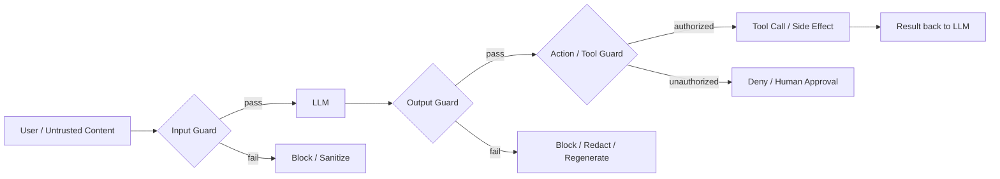

> **Problem:** a bare LLM call has no layer that inspects what goes in, what comes out, or what side-effecting action results — a single jailbreak, injected instruction, or hallucinated tool call becomes a production incident with nothing between it and the user or the environment. **Solution shape:** wrap the model in independent input, output, and action guards — defense in depth, with no single layer trusted alone.

## Context & forces

This pattern applies to any deployed LLM system, but the forces sharpen with agency: a chatbot with no tools only needs to worry about bad text reaching the user; an agent with [[Concept - Tool Use and Function Calling]] and file/network access needs to worry about bad *actions*, which is a strictly higher-stakes failure. The forces in tension are: **coverage vs latency** (every guard is roughly another model forward pass, and stacking them multiplies request latency and cost), **precision vs recall** (an aggressive guard blocks attacks but also blocks legitimate security, medical, and coding questions — see [[Gotchas - Guardrails and Safety Filters]]), and **defense diversity vs engineering simplicity** (a guard built on the same base model family as the thing it's guarding shares that model's blind spots, but standing up a genuinely different mechanism is more work). The pattern exists because none of these forces resolves cleanly — you architect for graceful degradation, not a single perfect filter, since [[Concept - Prompt Injection]] and jailbreaks are unsolved problems at the model level.

## The pattern

Three independent checkpoints, each mediating a different surface, none of which alone is sufficient:

**Input guard** classifies or scrubs content before it reaches the model — PII scrubbing, jailbreak/injection classifiers, topic filters. **Output guard** scans the generation before it reaches the user or a downstream system — toxicity/harm classifiers, PII leak detection, hallucination/groundedness checks. **Action/tool guard** mediates every side-effecting call the model attempts to make: schema-validate arguments, enforce least-privilege scope, and gate consequential actions (sending money, deleting data, sending email) behind human approval or a hard policy check rather than trusting the model's own judgment. This third checkpoint is the one teams building simple chatbots skip and the one that matters most once [[Concept - Model Context Protocol (MCP)]] or any tool-calling loop is in play, because an injection or jailbreak that only produces bad *text* is an embarrassment, while one that triggers a bad *action* is an incident.

## Implementation notes

Guard types trade accuracy for cost and attack surface differently:

| Guard type | Accuracy | Latency cost | Weakness |
|---|---|---|---|
| External fine-tuned classifier (e.g. Llama Guard) | High, purpose-trained | ~1 extra forward pass | Static taxonomy, needs retraining to add categories |
| Prompt-based self-check ("is this safe? yes/no") | Moderate | Cheap if batched with generation | Attackable by the same jailbreaks that beat the base model |
| Regex / PII scrubbing | Deterministic on known patterns | Near-zero | Brittle — misses context-dependent identifiers, corrupts legitimate content |
| Moderation API (hosted) | High, maintained externally | Network round trip | Vendor taxonomy drifts from your policy over time — audit the confusion matrix |

Latency and cost math is not optional to think through: each model-based guard is roughly another full forward pass on top of the generation itself, so a naive serial input-guard → generation → output-guard pipeline runs at 1.5–3x the latency and token cost of the bare call. Mitigate by running the input guard in parallel with the first speculative tokens of generation where the framework allows it, by using a smaller/distilled classifier for the guard than for the generator, or by accepting the multiplier explicitly as a cost-of-doing-business line item rather than discovering it in a latency budget review.

Fail-open vs fail-closed is a policy decision, not a default to inherit silently: fail-closed (block on guard error or timeout) is correct for high-stakes actions — a tool guard that times out should deny the action, not let it through — while fail-open (allow) is often the right choice for low-stakes chat, where blocking every user on a transient classifier outage is worse than the residual risk. Two additional concrete techniques belong in this layer: **canary tokens** — embed a secret string the model is instructed to echo back, and treat its absence or corruption as a signal that an injected instruction hijacked the output — and enforcing [[Playbook - Reliable Structured Output]] on tool arguments, so the action guard can validate a JSON schema deterministically instead of parsing free text for intent.

## Tradeoffs & when NOT to use

The central, non-obvious tradeoff: **the guardrail model is itself jailbreakable and injectable.** A prompt-based guard, or a classifier built on the same base-model family it's protecting, is defeated by the same encoding, role-play, and multi-turn attacks covered in [[Concept - Jailbreak Taxonomy]] — stacking two instances of the same weakness is not defense in depth, it is the same single point of failure counted twice. Mechanism diversity (a different model family, or a deterministic non-LLM check for the highest-stakes actions) matters more than guard *count*. Skip heavy guardrail architecture for internal tools with no untrusted input and no exfiltration path — the cost isn't justified when the attack surface is near zero — but escalate immediately once a system touches money, code execution, email, or third-party/user-supplied content, regardless of how low-risk the use case initially looks. Guardrails also do nothing against indirect injection arriving mid-task through retrieved documents or tool output if only the initial user turn is scanned — see [[Decision - Defending Against Prompt Injection]] for when architectural isolation, not another guard layer, is the right call.

## Known uses

- **Llama Guard 1/2/3** (Meta) — a Llama model fine-tuned to classify prompts and responses against an MLCommons-aligned hazard taxonomy of roughly 14 categories; shipped as the reference input/output guard in Meta's open-model stack and widely reused as a third-party classifier by other teams.
- **NeMo Guardrails** (NVIDIA) — a Colang-scripted rails framework that lets teams define input, dialogue, and output rails declaratively, composing classifier and rule-based checks around any base LLM.
- **Anthropic Constitutional Classifiers** (2025) — input/output classifiers trained against a constitution of allowed and disallowed content, deployed specifically to raise the cost of jailbreaking Claude on high-stakes domains, published with the attack budget required to break them.
- **OpenAI Moderation API** — a hosted output/input classifier used across ChatGPT and the API surface as the baseline content-policy guard.

## Connections
- [[Concept - Jailbreak Taxonomy]] — the attack families a guard's classifier layer is trying to catch, and the reason a same-mechanism guard inherits the base model's blind spots.
- [[Concept - Tool Use and Function Calling]] — the capability that makes the action/tool guard checkpoint necessary rather than optional.
- [[Concept - Model Context Protocol (MCP)]] — a common tool-calling surface the action guard must mediate, since MCP tool results are untrusted content by default.
- [[Gotchas - Guardrails and Safety Filters]] — the operational pitfalls (over-refusal, guard bypass, latency tax) that come with running this pattern in production.
- [[Decision - Defending Against Prompt Injection]] — how to choose the containment strategy when input/output guards alone are not enough for the lethal-trifecta case.
- [[Concept - Refusal Mechanics]] — why a classifier guard built from the same model family shares the base model's shallow, linearly-attackable safety behavior.
- [[Playbook - Reliable Structured Output]] — the technique the action guard relies on to validate tool arguments deterministically instead of parsing free text.
- [[Concept - LLM Observability and Tracing]] — guard decisions (blocked, allowed, fail-open) need to be logged and traced, or silent guard failures go unnoticed under load.
- [[Concept - Prompt Injection]] — the primary threat this pattern's action guard exists to contain once tools and untrusted content are in play.
- [[Concept - LLM-as-Judge]] — the same LLM-scoring mechanism used for evals is often reused as a prompt-based output guard, inheriting its cost/latency and self-preference biases.
- [[Concept - LLM Threat Modeling]] — the prerequisite exercise that determines which of the three checkpoints actually needs to be strong for a given system.
