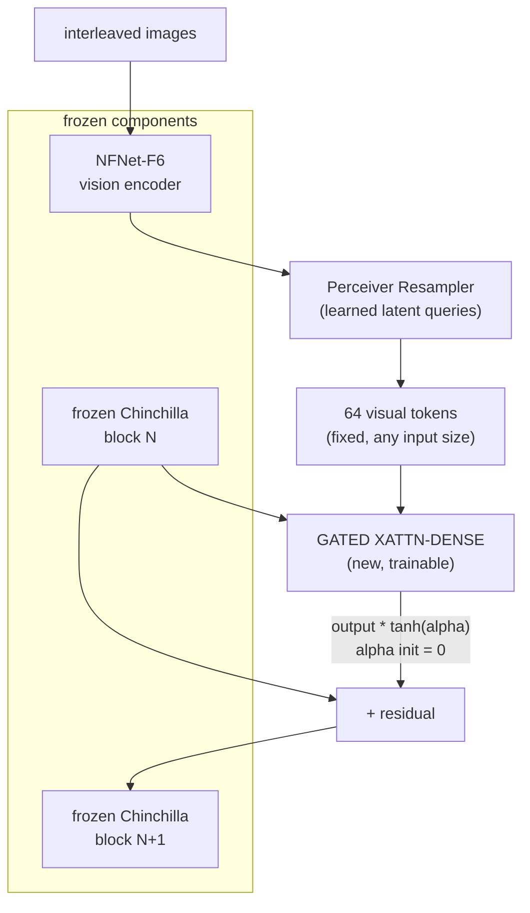

# Breakdown - Flamingo

> Flamingo (Alayrac et al. 2022, DeepMind, NeurIPS) is the VLM that proved you could graft vision onto a large frozen language model without retraining or damaging it, and get genuine in-context few-shot multimodal learning out the other side — show the model a few (image, answer) examples and it generalizes to a new image, the way GPT-3 generalizes over text. It set the template for [[Concept - VLM Architectures|cross-attention fusion]] VLMs and, after a few years where the simpler projector approach ([[Breakdown - LLaVA]]) dominated for its ease of training, its core idea returned in production form in Llama-3.2-Vision precisely because keeping the LLM frozen has real serving and safety advantages. *(as of 2026, architecturally superseded but its stability trick is still load-bearing folklore.)*

## The headline numbers

| Property | Value |
|---|---|
| Model family | Flamingo-3B, -9B, -80B (three sizes) |
| Vision encoder | NFNet-F6, frozen, pretrained with a contrastive image-text objective |
| LLM backbone | Chinchilla 1.4B / 7B / 70B, frozen, matched per model size |
| Visual token budget | Fixed 64 tokens per image regardless of resolution or image count (Perceiver Resampler) |
| New trainable modules | Perceiver Resampler + gated cross-attention-dense layers interleaved into the frozen LM |
| Training data | M3W (interleaved image-text web documents) + ALIGN- and LTIP-style image-text pairs |
| Headline result | Strong in-context few-shot performance across VQA/captioning benchmarks, competitive with task-specific fine-tuned SOTA using only a handful of in-context examples |

## How it actually works

Flamingo keeps two large pretrained models — a vision encoder and a language model — entirely frozen, and inserts new trainable layers *between* the LM's existing blocks that let visual information flow in without ever updating the LM's own weights.

**Perceiver Resampler.** A small stack of cross-attention layers with a fixed set of learned latent query vectors attends over however many vision-encoder features the input produced and compresses them to exactly 64 output tokens, always — one image, five images, or a video's worth of frames all collapse to the same fixed budget. This decouples the LLM's cost from the input's visual complexity, the opposite tradeoff from AnyRes tiling's linear scaling (see [[Concept - Any-Resolution Vision Encoding]]).

**GATED XATTN-DENSE layers.** Between existing frozen Chinchilla blocks, Flamingo inserts new [[Concept - Attention Mechanism|cross-attention]] layers where the LM's hidden states act as queries and the 64 visual tokens act as keys/values, followed by a dense (FFN) layer — both wrapped in a residual connection.

**Tanh gating — the stability trick.** The output of each new gated block is multiplied by `tanh(alpha)`, with `alpha` initialized to exactly zero. At initialization, `tanh(0) = 0`, so the new layers contribute nothing and the grafted model is mathematically identical to the original frozen LM. As training proceeds, `alpha` moves away from zero and the gate opens gradually. This is what makes it safe to bolt trainable layers onto an otherwise-frozen, already-good language model without an initial phase of destructive, high-variance updates flowing back through weights you're trying to preserve.

**Per-image causal masking.** In interleaved training data (a webpage with several images and surrounding text), each text token is masked to attend only to the single image immediately preceding it, not to all images in the document — which keeps the interleaved cross-attention coherent instead of blurring together unrelated images.

**Interleaved training on M3W.** Training on naturally interleaved image-text web documents, rather than only clean (image, caption) pairs, is what produces the in-context few-shot behavior: the model learns from data that already looks like "here's an example, here's another example, now here's a new case," so at inference time you can construct exactly that pattern in the prompt.

## The clever parts

1. **Zero-init tanh gating as a general module-grafting technique.** This is the same idea later reused in [[Concept - ControlNet and Spatial Conditioning for Diffusion|ControlNet's zero convolutions]] and [[Concept - Diffusion Transformers (DiT)|DiT's adaLN-zero]]: initialize any newly-inserted module so it contributes nothing at step zero, guaranteeing training starts from a known-good state and letting the new capability phase in smoothly.
2. **Perceiver Resampler decouples visual token count from input complexity.** A fixed 64-token budget per image means cost is predictable and multi-image/video sequences don't blow up context the way tiling-based tokenization does — the opposite design point from LLaVA-NeXT's AnyRes.
3. **Freezing both pretrained towers.** Neither the vision encoder nor the LLM is ever fine-tuned; only the new glue is trained. This preserves both models' pretrained capabilities intact and is dramatically cheaper than end-to-end training — a strategy that only works because of the gating trick above.
4. **Interleaved data unlocks in-context multimodal learning.** Training distribution shaped like the intended prompting pattern (interleaved examples) is what makes few-shot prompting work at inference — the multimodal analog of how large text LMs' [[Concept - Chain-of-Thought and Why It Works|in-context reasoning]] emerges from training data structure, not an explicit few-shot objective.

## What is dated / what's wrong

NFNet as a vision encoder was already a somewhat unusual choice by the time CLIP-style ViTs became the default, and Flamingo made no special provision for high-resolution or OCR-heavy input — a 64-token fixed budget is efficient but throws away exactly the fine detail AnyRes tiling exists to preserve. The added gated cross-attention layers are architecturally heavier and more complex to implement and train than a simple projector, which is a real part of why the field's center of gravity shifted to [[Breakdown - LLaVA|LLaVA]]-style projection for a few years: it's simpler to build, and open-source reproducibility mattered more than Flamingo's efficiency advantages. Cross-attention fusion returned in force in Llama-3.2-Vision specifically because keeping the LLM's weights untouched has concrete value (safety review, catastrophic-forgetting avoidance, easier versioning) that the field re-learned once the simplicity phase had run its course.

## What to steal

Zero-init gating for grafting any new module onto a pretrained model without destabilizing it; the resampler pattern for pinning a fixed compute/token budget regardless of input size; and interleaved multi-document training data whenever you want a model to generalize in-context rather than only from single (input, label) pairs.

## Connections
- [[Concept - VLM Architectures]] — Flamingo is the canonical instance of the cross-attention fusion family in the general VLM taxonomy.
- [[Concept - Vision-Language Connectors]] — the Perceiver Resampler is a connector variant that fixes the token budget regardless of image count or resolution.
- [[Concept - Attention Mechanism]] — the gated cross-attention layers are a direct, gated extension of the base attention formula applied across modalities.
- [[Concept - RMSNorm and LayerNorm]] — the newly inserted gated blocks have to respect the frozen LM's existing normalization/residual-stream conventions to avoid destabilizing it.
- [[Breakdown - LLaVA]] — the projector-style alternative that displaced cross-attention fusion for a few years on the strength of training simplicity.
- [[Concept - Chain-of-Thought and Why It Works]] — Flamingo's headline in-context few-shot capability is the multimodal precursor to the same in-context-learning substrate CoT prompting later exploits in text-only LLMs.
- [[Concept - Native and Any-to-Any Multimodal Models]] — cross-attention fusion is one endpoint of the fusion-family spectrum that native early-fusion any-to-any models sit at the opposite end of.
- [[Concept - Scaling Laws]] — the three-size Flamingo family (3B/9B/80B) is a direct study in how cross-modal few-shot capability scales with frozen-LM size.
- [[Gotchas - Vision-Language Models]] — Flamingo predates but anticipates several cataloged VLM pitfalls, including multi-image masking bugs.
- [[Concept - KV Cache]] — the gated cross-attention layers require their own K/V projections over the visual tokens, an additional cache structure beyond the LM's own text KV cache.
- [[Concept - Any-Resolution Vision Encoding]] — the Resampler's fixed 64-token budget is the opposite design point from AnyRes tiling's linear-in-resolution token scaling.
- [[Concept - ControlNet and Spatial Conditioning for Diffusion]] — reuses the same zero-init-gate grafting trick (zero convolutions) to attach a trainable module to a frozen base model without destabilizing it.
- [[Concept - Diffusion Transformers (DiT)]] — adaLN-zero conditioning is the same zero-initialized-gate idea applied to conditioning injection in a diffusion transformer.

## Sources
- Alayrac et al. (2022) — "Flamingo: a Visual Language Model for Few-Shot Learning" (NeurIPS 2022) — architecture, tanh gating, Perceiver Resampler, M3W interleaved training, few-shot results.
- Jaegle et al. (2021) — "Perceiver: General Perception with Iterative Attention" — the latent-query cross-attention architecture the Resampler adapts.
