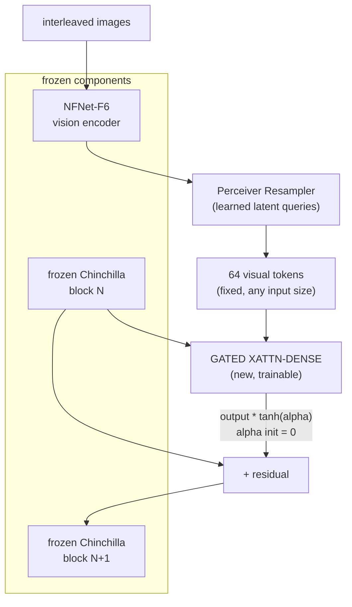

# Breakdown - Flamingo

> Flamingo (Alayrac et al. 2022, DeepMind, NeurIPS) showed you could graft vision onto a large frozen language model without retraining or damaging it and get real in-context few-shot multimodal learning. Show it a few (image, answer) examples and it generalizes to a new image, the way GPT-3 generalizes over text. It set the template for [[Concept - VLM Architectures|cross-attention fusion]] VLMs. The simpler projector approach ([[Breakdown - LLaVA]]) then dominated for a few years because it was easier to train, but Flamingo's core idea came back in production form in Llama-3.2-Vision, since keeping the LLM frozen has real serving and safety advantages. *(as of 2026, architecturally superseded, but its stability trick is still folklore people rely on.)*

## The headline numbers

| Property | Value |
|---|---|
| Model family | Flamingo-3B, -9B, -80B (three sizes) |
| Vision encoder | NFNet-F6, frozen, pretrained with a contrastive image-text objective |
| LLM backbone | Chinchilla 1.4B / 7B / 70B, frozen, matched per model size |
| Visual token budget | Fixed 64 tokens per image regardless of resolution or image count (Perceiver Resampler) |
| New trainable modules | Perceiver Resampler + gated cross-attention-dense layers interleaved into the frozen LM |
| Training data | M3W (interleaved image-text web documents) + ALIGN- and LTIP-style image-text pairs |
| Headline result | Strong in-context few-shot performance across VQA/captioning benchmarks, competitive with task-specific fine-tuned SOTA from a handful of in-context examples |

## How it works

Two large pretrained models, a vision encoder and a language model, stay fully frozen. New trainable layers go *between* the LM's existing blocks and let visual information flow in without touching the LM's own weights.

**Perceiver Resampler.** A small stack of cross-attention layers with a fixed set of learned latent queries attends over however many vision-encoder features came in and compresses them to 64 output tokens, every time. One image, five images or a video's worth of frames all land in the same budget. The LLM's cost no longer depends on how visually complex the input is, which is the opposite tradeoff from AnyRes tiling's linear scaling (see [[Concept - Any-Resolution Vision Encoding]]).

**GATED XATTN-DENSE layers.** Between the frozen Chinchilla blocks sit new [[Concept - Attention Mechanism|cross-attention]] layers. The LM's hidden states are the queries and the 64 visual tokens are the keys/values. A dense (FFN) layer follows, and both are wrapped in a residual connection.

**Tanh gating.** This is the stability trick. Each new gated block's output is multiplied by `tanh(alpha)`, and `alpha` starts at zero. Since `tanh(0) = 0`, the new layers add nothing at initialization and the grafted model is mathematically identical to the frozen LM. During training `alpha` drifts away from zero and the gate opens gradually. You can bolt trainable layers onto a frozen, already-good language model without an early phase of destructive, high-variance updates flowing back through the weights you want to keep.

**Per-image causal masking.** Interleaved training data (a webpage with several images and text around them) masks each text token so it only attends to the image immediately before it, not every image in the document. Otherwise the cross-attention blurs unrelated images together.

**Interleaved training on M3W.** The in-context few-shot behavior comes from training on naturally interleaved image-text web documents, not only clean (image, caption) pairs. That data already looks like "here's an example, here's another, now a new case," so at inference you can build the same pattern in the prompt.

## The clever parts

Zero-init tanh gating works as a general way to graft modules. [[Concept - ControlNet and Spatial Conditioning for Diffusion|ControlNet's zero convolutions]] and [[Concept - Diffusion Transformers (DiT)|DiT's adaLN-zero]] reuse it: initialize any inserted module so it contributes nothing at step zero, training starts from a known-good state, and the new capability phases in smoothly.

The Perceiver Resampler cuts the link between visual token count and input complexity. With 64 tokens per image, cost is predictable and multi-image or video sequences don't blow up context the way tiling does. LLaVA-NeXT's AnyRes sits at the opposite design point.

Neither pretrained tower is ever fine-tuned. Only the new glue trains, so both models keep their pretrained capabilities and training costs far less than end-to-end. This only works because of the gating trick.

Interleaved data is what makes multimodal in-context learning possible. A training distribution shaped like the intended prompt (interleaved examples) makes few-shot prompting work at inference. It's the multimodal analog of how [[Concept - Chain-of-Thought and Why It Works|in-context reasoning]] in large text LMs comes from the structure of the training data and not from an explicit few-shot objective.

## What's dated or wrong

NFNet was already an unusual encoder choice once CLIP-style ViTs became the default. Flamingo also did nothing special for high-resolution or OCR-heavy input: a fixed 64-token budget is efficient, but it throws away the fine detail AnyRes tiling exists to keep. The gated cross-attention layers are heavier and harder to implement and train than a simple projector. That's a big part of why the field moved to [[Breakdown - LLaVA|LLaVA]]-style projection for a few years. It was simpler to build, and open-source reproducibility mattered more than Flamingo's efficiency. Cross-attention fusion came back in Llama-3.2-Vision because leaving the LLM's weights untouched has concrete value (safety review, avoiding catastrophic forgetting, easier versioning), which the field re-learned once the simplicity phase ran its course.

## What to steal

Zero-init gating, to graft a new module onto a pretrained model without destabilizing it. The resampler, to pin a fixed compute/token budget whatever the input size. Interleaved multi-document training data, whenever you want a model to generalize in-context and not only from single (input, label) pairs.

## Connections
- [[Concept - VLM Architectures]] — Flamingo is the canonical instance of the cross-attention fusion family in the general VLM taxonomy.
- [[Concept - Vision-Language Connectors]] — the Perceiver Resampler is a connector variant that fixes the token budget regardless of image count or resolution.
- [[Concept - Attention Mechanism]] — the gated cross-attention layers are a direct, gated extension of the base attention formula applied across modalities.
- [[Concept - RMSNorm and LayerNorm]] — the newly inserted gated blocks have to respect the frozen LM's existing normalization/residual-stream conventions to avoid destabilizing it.
- [[Breakdown - LLaVA]] — the projector-style alternative that displaced cross-attention fusion for a few years on the strength of training simplicity.
- [[Concept - Chain-of-Thought and Why It Works]] — Flamingo's headline in-context few-shot capability is the multimodal precursor to the same in-context-learning substrate CoT prompting later exploits in text-only LLMs.
- [[Concept - Native and Any-to-Any Multimodal Models]] — cross-attention fusion is one endpoint of the fusion-family spectrum that native early-fusion any-to-any models sit at the opposite end of.
- [[Concept - Scaling Laws]] — the three-size Flamingo family (3B/9B/80B) is a direct study in how cross-modal few-shot capability scales with frozen-LM size.
- [[Gotchas - Vision-Language Models]] — Flamingo predates but anticipates several cataloged VLM pitfalls, including multi-image masking bugs.
- [[Concept - KV Cache]] — the gated cross-attention layers require their own K/V projections over the visual tokens, an additional cache structure beyond the LM's own text KV cache.
- [[Concept - Any-Resolution Vision Encoding]] — the Resampler's fixed 64-token budget is the opposite design point from AnyRes tiling's linear-in-resolution token scaling.
- [[Concept - ControlNet and Spatial Conditioning for Diffusion]] — reuses the same zero-init-gate grafting trick (zero convolutions) to attach a trainable module to a frozen base model without destabilizing it.
- [[Concept - Diffusion Transformers (DiT)]] — adaLN-zero conditioning is the same zero-initialized-gate idea applied to conditioning injection in a diffusion transformer.

## Sources
- Alayrac et al. (2022) — "Flamingo: a Visual Language Model for Few-Shot Learning" (NeurIPS 2022) — architecture, tanh gating, Perceiver Resampler, M3W interleaved training, few-shot results.
- Jaegle et al. (2021) — "Perceiver: General Perception with Iterative Attention" — the latent-query cross-attention architecture the Resampler adapts.
