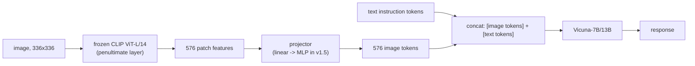

# Breakdown - LLaVA

> LLaVA (Large Language and Vision Assistant, Liu et al. 2023, NeurIPS) is the open-source vision-language model that made building a competent VLM a reproducible weekend project rather than a DeepMind-scale undertaking. It matters less for architectural novelty — it wires a frozen vision encoder into a frozen-then-unfrozen LLM through a small connector, the simplest thing that could work — and more for the training-data trick that made it work at all: using text-only GPT-4 to synthesize multimodal instruction data. LLaVA-1.5 (2024) and LLaVA-NeXT (2024) iterated the recipe into the reference baseline nearly every subsequent open VLM (Qwen-VL, InternVL, Idefics) is implicitly benchmarked against. *(as of 2026, superseded on raw quality but still the canonical teaching example and default "Family B" reference point.)*

## The headline numbers

| Property | Value |
|---|---|
| Vision encoder | Frozen [[Concept - CLIP and Contrastive Vision-Language Training|CLIP]] ViT-L/14, 336px, 576 tokens/image, penultimate-layer features |
| Connector | LLaVA v1: single linear layer. LLaVA-1.5: 2-layer MLP |
| LLM | Vicuna-7B / 13B (LLaMA-based instruction-tuned chat model) |
| Stage-1 data | 558K image-caption pairs (feature alignment only) |
| Stage-2 data | 158K GPT-4-generated visual instruction samples + academic-task data |
| Stage-1/2 compute | ~1 day on 8×A100 for the 7B model |
| LLaVA-1.5 result | SOTA on 11 of 12 benchmarks using only ~1.2M total public data points |
| LLaVA-NeXT (1.6) addition | [[Concept - Any-Resolution Vision Encoding|AnyRes tiling]] for higher effective resolution and OCR |

## How it actually works

LLaVA is a [[Concept - VLM Architectures|projector-style VLM]]: a frozen vision tower produces a fixed set of patch tokens, a small trainable connector maps them into the LLM's embedding space, and those tokens are prepended into the token stream as a soft visual prefix that the LLM attends over like any other tokens.

**Stage 1 — feature alignment.** Freeze both the CLIP encoder and the LLM; train *only* the connector on 558K image-caption pairs. The objective is purely to teach the projector to map CLIP's feature space into something the LLM's embedding space can interpret as tokens — a cheap, stable warm-up before touching the expensive LLM weights.

**Stage 2 — visual instruction tuning.** Unfreeze the LLM (the encoder stays frozen) and run [[Concept - Supervised Fine-Tuning (SFT)|supervised fine-tuning]] on the 158K instruction samples plus academic VQA-style data. This is where the model learns to actually follow multimodal instructions rather than just caption images.

The data-generation trick behind stage 2 is the paper's real contribution: rather than pay for human-annotated multimodal conversations, the authors fed text-only GPT-4 *symbolic* representations of images — existing COCO captions and bounding boxes, never the pixels — and prompted it to synthesize three kinds of training targets: multi-turn conversation, detailed description, and complex reasoning. GPT-4 never saw an image; it hallucinated plausible visual conversations from structured metadata, and that synthesized data turned out to be enough to teach a real VLM to follow instructions about real images.

## The clever parts

1. **Visual instruction data distilled from a text-only teacher.** Using GPT-4 to generate instruction-following targets from caption/box metadata is a form of [[Concept - Knowledge Distillation|knowledge distillation]] with an unusual twist — the teacher never observes the modality it's teaching about, only a lossy symbolic proxy for it. This is also a canonical case of [[Concept - Synthetic Training Data|synthetic training data]] making a training regime tractable that human annotation would have made prohibitively expensive.
2. **Freeze-then-unfreeze staging.** Training the connector alone first, on frozen towers, prevents the classic failure of end-to-end training from scratch: a randomly-initialized projector feeding garbage into the LLM would otherwise corrupt the LLM's pretrained weights before the projector has learned anything useful.
3. **A dumb connector, staged correctly, beats a clever one trained badly.** LLaVA-1.5's bump from a linear layer to a 2-layer MLP was a small architectural change; the larger quality gains came from data and staging discipline, not connector sophistication — a lesson that outran the contemporaneous push toward complex query-based resamplers (see [[Concept - Vision-Language Connectors]]).
4. **Penultimate-layer features, not the last layer.** LLaVA uses CLIP's second-to-last transformer layer rather than its final layer, because the final layer is over-specialized to the contrastive objective (maximizing image-text cosine similarity) and discards spatial/local detail a generative LLM needs.
5. **AnyRes as a bolt-on, not a redesign.** LLaVA-NeXT added [[Concept - Any-Resolution Vision Encoding|tiling]] on top of the existing pipeline rather than retraining a new encoder, showing the two-stage recipe composes with later resolution fixes.

## What it got wrong / what's dated

The frozen CLIP encoder caps everything downstream: no amount of LLM-side SFT recovers fine text or small objects CLIP's 336px training resolution never resolved, which is why OCR and dense counting remained weak until AnyRes tiling was bolted on. 576 tokens per image was already a meaningful chunk of a 2048-4096 context window, and grounding/counting stayed weak because nothing in the recipe explicitly supervises spatial precision. Hallucination is a persistent issue — a strong LLM prior plus SFT data that describes prototypical scenes teaches the model to describe what's *usually* there rather than what's actually in this image (see [[Gotchas - Vision-Language Models]]). LLaVA's benchmark-topping numbers also carry the same [[Concept - Benchmark Contamination|contamination]] risk as most VLM leaderboards, since GPT-4-generated data and academic benchmarks share underlying image sources.

## What to steal

The freeze-then-unfreeze two-stage recipe, distilling instruction data from a stronger (even cross-modally blind) teacher model, the simple MLP connector, and the penultimate-layer feature choice are all directly reusable defaults for building a VLM from an off-the-shelf encoder and LLM — see [[Playbook - Training a VLM from a Vision Encoder and an LLM]] for the generalized procedure this Breakdown is a concrete instance of.

## Connections
- [[Concept - VLM Architectures]] — LLaVA is the textbook instantiation of the projector/prefix family in the general VLM taxonomy.
- [[Concept - Vision-Language Connectors]] — LLaVA's linear-to-MLP connector upgrade is the concrete case study the general connector note builds on.
- [[Concept - CLIP and Contrastive Vision-Language Training]] — the frozen vision tower LLaVA wires into the LLM.
- [[Concept - Supervised Fine-Tuning (SFT)]] — stage-2 instruction tuning is a direct multimodal application of SFT.
- [[Concept - Synthetic Training Data]] — the 158K instruction set is GPT-4-synthesized data, a canonical synthetic-data case study.
- [[Concept - Knowledge Distillation]] — using GPT-4 to generate training targets from image metadata is a distillation move despite the teacher never seeing pixels.
- [[Concept - Any-Resolution Vision Encoding]] — LLaVA-NeXT's AnyRes tiling is exactly this technique applied to the LLaVA pipeline.
- [[Gotchas - Vision-Language Models]] — LLaVA exhibits several cataloged pitfalls firsthand: the frozen-encoder ceiling, hallucination, and token-budget pressure.
- [[Concept - Benchmark Contamination]] — LLaVA's benchmark numbers carry the same contamination concerns endemic to VLM leaderboards.
- [[Playbook - Training a VLM from a Vision Encoder and an LLM]] — LLaVA's two-stage recipe is the concrete case the generic playbook is modeled on.

## Sources
- Liu et al. (2023) — "Visual Instruction Tuning" (NeurIPS 2023) — introduces LLaVA, the GPT-4-distilled instruction dataset, and the two-stage training recipe.
- Liu et al. (2024) — "Improved Baselines with Visual Instruction Tuning" — LLaVA-1.5: MLP connector, 336px CLIP, SOTA with ~1.2M public data.
- Liu et al. (2024) — "LLaVA-NeXT: Improved reasoning, OCR, and world knowledge" — AnyRes tiling and expanded SFT data.
