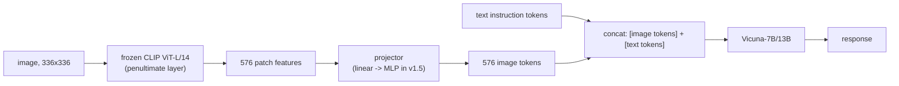

# Breakdown - LLaVA

> LLaVA (Large Language and Vision Assistant, Liu et al. 2023, NeurIPS) turned building a competent VLM from a DeepMind-scale project into a reproducible weekend one. The architecture is plain: a frozen vision encoder wired into a frozen-then-unfrozen LLM through a small connector, the simplest thing that could work. Its importance comes from the training-data trick that made it work at all, text-only GPT-4 synthesizing multimodal instruction data. LLaVA-1.5 (2024) and LLaVA-NeXT (2024) refined the recipe into the reference baseline that nearly every later open VLM (Qwen-VL, InternVL, Idefics) is implicitly benchmarked against. *(as of 2026, superseded on raw quality but still the standard teaching example and default "Family B" reference point.)*

## The headline numbers

| Property | Value |
|---|---|
| Vision encoder | Frozen [[Concept - CLIP and Contrastive Vision-Language Training|CLIP]] ViT-L/14, 336px, 576 tokens/image, penultimate-layer features |
| Connector | LLaVA v1: single linear layer. LLaVA-1.5: 2-layer MLP |
| LLM | Vicuna-7B / 13B (LLaMA-based instruction-tuned chat model) |
| Stage-1 data | 558K image-caption pairs (feature alignment only) |
| Stage-2 data | 158K GPT-4-generated visual instruction samples + academic-task data |
| Stage-1/2 compute | ~1 day on 8×A100 for the 7B model |
| LLaVA-1.5 result | SOTA on 11 of 12 benchmarks using only ~1.2M total public data points |
| LLaVA-NeXT (1.6) addition | [[Concept - Any-Resolution Vision Encoding|AnyRes tiling]] for higher effective resolution and OCR |

## How it works

LLaVA is a [[Concept - VLM Architectures|projector-style VLM]]. A frozen vision tower produces a fixed set of patch tokens, a small trainable connector maps them into the LLM's embedding space, and they get prepended to the token stream as a soft visual prefix the LLM attends over like any other tokens.

**Stage 1: feature alignment.** Freeze the CLIP encoder and the LLM and train *only* the connector on 558K image-caption pairs. The only goal is teaching the projector to map CLIP's feature space into something the LLM's embedding space reads as tokens. It's a cheap, stable warm-up before the expensive LLM weights move.

**Stage 2: visual instruction tuning.** Unfreeze the LLM (the encoder stays frozen) and run [[Concept - Supervised Fine-Tuning (SFT)|supervised fine-tuning]] on the 158K instruction samples plus academic VQA-style data. Here the model learns to follow multimodal instructions instead of only captioning images.

The paper's main contribution is the data generation behind stage 2. Human-annotated multimodal conversations are expensive, so the authors gave text-only GPT-4 *symbolic* descriptions of images (existing COCO captions and bounding boxes, never pixels) and prompted it for three kinds of targets: multi-turn conversation, detailed description and complex reasoning. GPT-4 never saw an image. It made up plausible visual conversations from structured metadata, and that was enough to teach a real VLM to follow instructions about real images.

## The clever parts

1. **Instruction data distilled from a text-only teacher.** Generating instruction-following targets with GPT-4 from caption/box metadata is [[Concept - Knowledge Distillation|knowledge distillation]] with an odd twist: the teacher never observes the modality it teaches, only a lossy symbolic proxy. It's also a standard case of [[Concept - Synthetic Training Data|synthetic training data]] making a regime affordable that human annotation would have priced out.
2. **Freeze-then-unfreeze staging.** Training the connector alone on frozen towers first avoids the classic failure of end-to-end training from scratch, where a randomly initialized projector feeds garbage into the LLM and corrupts its pretrained weights before the projector has learned anything.
3. **A dumb connector, staged correctly, beats a clever one trained badly.** LLaVA-1.5's move from a linear layer to a 2-layer MLP was a small change. The bigger gains came from data and staging discipline. That lesson outlasted the push at the time toward complex query-based resamplers (see [[Concept - Vision-Language Connectors]]).
4. **Penultimate-layer features.** LLaVA takes CLIP's second-to-last transformer layer. The final layer is over-specialized to the contrastive objective (maximizing image-text cosine similarity) and drops the spatial/local detail a generative LLM needs.
5. **AnyRes bolted on.** LLaVA-NeXT added [[Concept - Any-Resolution Vision Encoding|tiling]] on top of the existing pipeline without retraining a new encoder, which shows the two-stage recipe composes with later resolution fixes.

## What it got wrong / what's dated

The frozen CLIP encoder caps everything downstream. No amount of LLM-side SFT recovers fine text or small objects that CLIP's 336px training resolution never resolved, so OCR and dense counting stayed weak until AnyRes tiling was bolted on. 576 tokens per image already ate a meaningful chunk of a 2048-4096 context window. Grounding and counting were weak too, since nothing in the recipe supervises spatial precision directly.

Hallucination never went away. A strong LLM prior plus SFT data describing prototypical scenes teaches the model to describe what's *usually* there instead of what's in this image (see [[Gotchas - Vision-Language Models]]). And LLaVA's benchmark-topping numbers carry the same [[Concept - Benchmark Contamination|contamination]] risk as most VLM leaderboards, because GPT-4-generated data and academic benchmarks share underlying image sources.

## What to steal

The freeze-then-unfreeze two-stage recipe, distilling instruction data from a stronger teacher (even one blind to the modality), the simple MLP connector and the penultimate-layer features. All four are reusable defaults when you build a VLM from an off-the-shelf encoder and LLM. [[Playbook - Training a VLM from a Vision Encoder and an LLM]] has the general procedure this Breakdown is one instance of.

## Connections
- [[Concept - VLM Architectures]] — LLaVA is the textbook instantiation of the projector/prefix family in the general VLM taxonomy.
- [[Concept - Vision-Language Connectors]] — LLaVA's linear-to-MLP connector upgrade is the concrete case study the general connector note builds on.
- [[Concept - CLIP and Contrastive Vision-Language Training]] — the frozen vision tower LLaVA wires into the LLM.
- [[Concept - Supervised Fine-Tuning (SFT)]] — stage-2 instruction tuning is a direct multimodal application of SFT.
- [[Concept - Synthetic Training Data]] — the 158K instruction set is GPT-4-synthesized data, a canonical synthetic-data case study.
- [[Concept - Knowledge Distillation]] — using GPT-4 to generate training targets from image metadata is a distillation move despite the teacher never seeing pixels.
- [[Concept - Any-Resolution Vision Encoding]] — LLaVA-NeXT's AnyRes tiling is exactly this technique applied to the LLaVA pipeline.
- [[Gotchas - Vision-Language Models]] — LLaVA exhibits several cataloged pitfalls firsthand: the frozen-encoder ceiling, hallucination, and token-budget pressure.
- [[Concept - Benchmark Contamination]] — LLaVA's benchmark numbers carry the same contamination concerns endemic to VLM leaderboards.
- [[Playbook - Training a VLM from a Vision Encoder and an LLM]] — LLaVA's two-stage recipe is the concrete case the generic playbook is modeled on.

## Sources
- Liu et al. (2023) — "Visual Instruction Tuning" (NeurIPS 2023) — introduces LLaVA, the GPT-4-distilled instruction dataset, and the two-stage training recipe.
- Liu et al. (2024) — "Improved Baselines with Visual Instruction Tuning" — LLaVA-1.5: MLP connector, 336px CLIP, SOTA with ~1.2M public data.
- Liu et al. (2024) — "LLaVA-NeXT: Improved reasoning, OCR, and world knowledge" — AnyRes tiling and expanded SFT data.
