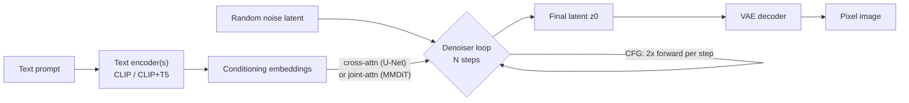

> **What it is:** Stable Diffusion is the open-weights text-to-image model family built by CompVis, Stability AI, and Runway on the [[Concept - Latent Diffusion|latent diffusion]] recipe, first released August 2022. It matters because it was the first high-quality text-to-image system anyone outside a frontier lab could download, fine-tune, and run on a single consumer GPU — and every subsequent open image-generation ecosystem (LoRA fine-tuning, ControlNet, Civitai) grew directly out of it. *(current as of 2026; FLUX.1 from Black Forest Labs, the SD3 spiritual successor built by ex-Stability researchers, is the open state of the art as of 2025)*

## The headline numbers

| Version | Year | Backbone | Params | Latent | Text encoder(s) | Resolution | Objective |
|---|---|---|---|---|---|---|---|
| SD1.x | 2022 | U-Net | 860M | 4-ch, 8x VAE (0.18215 scale) | CLIP ViT-L (77-token cap) | 512px | $\epsilon$-pred, linear schedule |
| SD2 | 2022 | U-Net | ~865M | 4-ch, 8x VAE | OpenCLIP-H | 768px | $\epsilon$/v-pred |
| SDXL | 2023 | U-Net | 2.6B | 4-ch, 8x VAE (0.13025 scale) | CLIP-L + OpenCLIP-bigG (concat) | 1024px | $\epsilon$-pred + refiner stage |
| SD3 | 2024 | MMDiT | 2B–8B (by size) | 16-ch VAE | CLIP-L + CLIP-bigG + T5-XXL | 1024px+ | rectified flow |
| FLUX.1 | 2024 | DiT | 12B | 16-ch VAE | CLIP + T5-XXL | 1024px+ | flow matching, guidance-distilled variants |

Training scale for the original release: SD1.4 trained on a LAION-2B-en aesthetic subset for approximately 150,000 A100-hours — *folklore, weakly sourced:* on the order of $600K in compute, per [[Lore - The Stable Diffusion Release and Its Aftermath]].

## How it actually works

Every version decomposes into the same three pieces, first formalized by [[Concept - Latent Diffusion]]: an **autoencoder** that compresses pixels into a small latent, a **text conditioner** that turns a prompt into a sequence of embeddings, and a **denoiser** that runs [[Deep Dive - Diffusion Models|iterative denoising]] in latent space steered by those embeddings.

For SD1.x/2/SDXL, the denoiser is a convolutional U-Net; the CLIP text encoder's token embeddings serve as keys/values in [[Concept - Attention Mechanism|cross-attention]] layers threaded through every resolution level, exactly as described in the latent diffusion note. SDXL adds a second, larger text encoder (OpenCLIP-bigG) concatenated with the first for richer conditioning, plus a separate **refiner** model that runs a handful of extra high-noise-avoiding steps to sharpen final detail. SD3 replaces the U-Net with an [[Concept - Diffusion Transformers (DiT)|MMDiT]] backbone — text and image tokens keep separate weight streams but attend jointly — and swaps the training objective to [[Concept - Flow Matching|rectified flow]], adding T5-XXL as a third text encoder specifically to fix legible-text rendering that CLIP alone handles poorly. At inference, all versions apply [[Concept - Classifier-Free Guidance]] (doubling the per-step cost) and a [[Concept - Diffusion Samplers and Schedulers|sampler]] such as DPM-Solver++ to reach a finished latent in 20-50 steps (fewer for FLUX's guidance-distilled schnell variant), then decode once through the VAE.

## The clever parts

1. **Latent compression as the entire enabling trick.** Running diffusion at $64\times64\times4$ instead of $512\times512\times3$ is a ~48x reduction in elements processed per step — this single decision is why SD1.5 trains and infers on a single consumer GPU rather than needing a lab-scale cluster.
2. **Cross-attention text conditioning.** Threading the text embedding into the U-Net as cross-attention keys/values at every spatial resolution lets the prompt steer both coarse composition and fine local detail, rather than only setting a global style vector.
3. **SDXL's size/crop conditioning embeddings.** SD1.x trained on square-cropped images, which taught the model to assume subjects are centered and cropped — visible in the ubiquitous "close-up cropped face" bias of SD1.x outputs. SDXL instead conditions the model on the *original image size and crop offset* as an explicit input, so the model learns "here is what a cropped-vs-full composition looks like" and can be told at inference to generate full, uncropped compositions — fixing a data artifact by exposing it as a controllable variable rather than trying to eliminate it from training data.
4. **SD3's dual-stream MMDiT plus T5.** Separate per-modality weight streams with joint attention, combined with a real language-model text encoder (T5-XXL) rather than CLIP alone, produced the first Stable Diffusion generation capable of rendering short strings of legible text reliably — a persistent, embarrassing failure mode in every prior version.
5. **16-channel latents in SD3/FLUX.** Doubling the SD1.x/SDXL latent channel count from 4 to 16 recovers detail (hands, small text, fine texture) that the earlier 8x-compression-at-4-channels bottleneck structurally could not represent, directly addressing the fidelity ceiling documented in [[Concept - Latent Diffusion]].
6. **Rectified flow as the training objective.** Regressing directly against a straight-line velocity target ($x_1 - x_0$) rather than DDPM's noise-schedule bookkeeping is a simpler loss that empirically scales better and produces straighter ODE trajectories — straighter paths integrate accurately in fewer steps, which is part of why FLUX's distilled variants reach good quality at 1-4 steps.

## What it got wrong / what's dated

SD1.x's 4-channel, 8x-compressed VAE is a hard fidelity ceiling that no amount of denoiser improvement can fix — hands, faces, and small text were reliably broken until the 16-channel SD3/FLUX latent arrived. The CLIP text encoder's 77-token context cap silently truncates long or detailed prompts. Data provenance became a genuine liability rather than a footnote: LAION-5B, the web-scraped dataset underlying training, was pulled in 2023 after Stanford researchers found CSAM in it, and Getty Images v. Stability AI and Andersen v. Stability AI became defining copyright test cases for the whole field — see [[Lore - The Stable Diffusion Release and Its Aftermath]] for the full timeline. SD3's 2024 release also came with a restrictive commercial license that triggered enough community backlash to help push open-model momentum toward FLUX.1, built by ex-Stability researchers at Black Forest Labs.

## What to steal

The VAE-plus-conditioner-plus-denoiser decomposition is a reusable blueprint for *any* modality-conditioned generative system, not just images — it cleanly separates "what compressed representation do we generate in" from "how is generation steered" from "what does the generative process itself look like," and each piece can be upgraded independently (exactly how SD3 swapped the denoiser and kept the conditioning philosophy). SDXL's size/crop conditioning is a broader pattern worth stealing on its own: when your training data has a systematic bias you can't fully remove, consider conditioning the model on the bias explicitly rather than fighting it, so the model learns to represent the biased and unbiased cases as separate controllable modes. And SD3's multi-encoder text conditioning — concatenating a contrastive vision-language encoder with a real language model — is a good default whenever a system needs both semantic image-text alignment and genuine language understanding (long prompts, legible text, complex instructions) that a CLIP-style encoder alone can't provide.

## Connections
- [[Concept - Latent Diffusion]] — the foundational architectural pattern (compressed autoencoder + diffusion in latent space) every Stable Diffusion version is an instance of.
- [[Deep Dive - Diffusion Models]] — the DDPM math SD1.x/2/SDXL train against before SD3 moves to flow matching.
- [[Concept - Diffusion Transformers (DiT)]] — the MMDiT backbone SD3 and FLUX adopt in place of the U-Net.
- [[Concept - Flow Matching]] — the rectified-flow training objective SD3 and FLUX use instead of DDPM's noise-prediction loss.
- [[Concept - CLIP and Contrastive Vision-Language Training]] — the text encoder family (CLIP-L, OpenCLIP-H/bigG) used across every SD version, later supplemented by T5 in SD3.
- [[Lore - The Stable Diffusion Release and Its Aftermath]] — the release history, LAION-5B/CSAM reckoning, and copyright litigation this breakdown treats as out of scope.
- [[Concept - Classifier-Free Guidance]] — the inference-time technique every version applies to trade diversity for prompt adherence.
- [[Reference - Vision Encoders and Multimodal Models]] — the lookup table with exact per-version parameter counts, latent channels, and scaling constants.
- [[Concept - Diffusion Samplers and Schedulers]] — the solver choice (DDIM, DPM-Solver++) applied at inference on top of any SD checkpoint.
- [[Gotchas - Diffusion Training and Sampling]] — the exact scaling-constant, fp16-VAE-NaN, and zero-terminal-SNR failure modes specific to this model family.
- [[Deep Dive - LoRA]] — the dominant lightweight customization method the open-source SD ecosystem standardized on for style and subject fine-tuning.
- [[Concept - Attention Mechanism]] — the cross-attention operation that injects text conditioning into the U-Net, and the joint attention MMDiT generalizes it to.

## Sources
- Rombach, Blattmann, Lorenz, Esser, Ommer (2022) — High-Resolution Image Synthesis with Latent Diffusion Models. The architecture behind SD1.x.
- Podell et al. (2023) — SDXL: Improving Latent Diffusion Models for High-Resolution Image Synthesis. Dual text encoders, size/crop conditioning, refiner.
- Esser, Kulal, et al. (2024) — Scaling Rectified Flow Transformers for High-Resolution Image Synthesis (SD3). MMDiT and rectified flow.
- Black Forest Labs (2024) — FLUX.1 model release. DiT + flow matching successor built by ex-Stability researchers.
