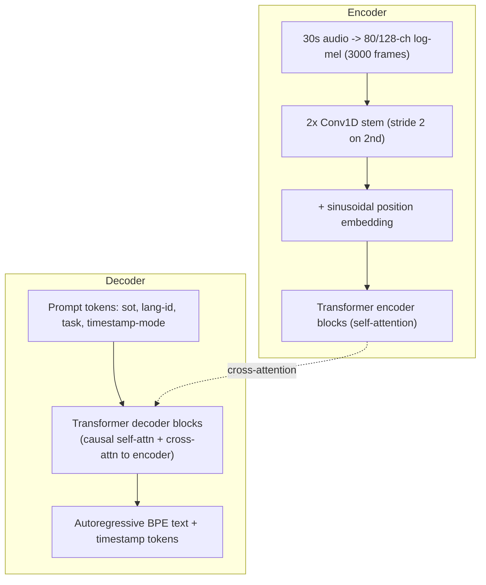

# Breakdown - Whisper

> Whisper is OpenAI's automatic speech recognition (and translation) model, released September 2022 (Radford et al., "Robust Speech Recognition via Large-Scale Weak Supervision"), with the large-v3 checkpoint following in late 2023. The architecture is a stock encoder-decoder transformer. What Whisper showed is that scale plus weak, noisy web supervision beats careful hand-labeled per-dataset training on robustness. It also shipped as open weights (MIT license) and immediately became the default ASR building block across the industry.

## The headline numbers

- **Training data:** 680,000 hours of audio with transcripts scraped from the internet, across 96 languages. No hand-labeling; heuristics filtered it, annotators didn't curate it.
- **Model sizes:** tiny (39M) → base → small → medium → large-v2/large-v3 (1.55B parameters).
- **Input:** 30-second audio chunks, 80-channel log-mel spectrogram (large-v3 moved to 128 mel bins and trained on more data than large-v2), 16kHz sample rate.
- **Sequence length:** 3,000 mel frames per 30s chunk, downsampled 2× by the convolutional stem to 1,500 encoder positions.
- **License:** MIT, fully open weights. That's a large part of why it became the industry-default ASR component and didn't stay a research curiosity.
- **Zero-shot:** no per-dataset fine-tuning. Evaluated directly across many ASR benchmarks, it closed much of the gap to the fine-tuned supervised systems of the time, and beat them on noisy/accented audio.

## How it works

Whisper is a vanilla encoder-decoder transformer (see [[Deep Dive - The Transformer]]). Everything new is in the data and training recipe; there's no new mechanism.

**Encoder.** Raw audio becomes an 80- or 128-channel log-mel spectrogram (see [[Concept - Audio Spectrograms and Mel Features]]) over a fixed 30-second window. A stem of two 1D convolutions, the second with stride 2, downsamples 3,000 mel frames to 1,500 positions and projects them to the hidden dimension. Sinusoidal position embeddings are added, and a standard stack of transformer encoder blocks with self-[[Concept - Attention Mechanism|attention]] processes the sequence.

**Decoder.** A standard transformer decoder generates tokens autoregressively from a shared multilingual byte-level BPE vocabulary (see [[Concept - Byte-Pair Encoding]]), the same tokenization family as GPT-2. Each block runs causal self-attention over the tokens generated so far and cross-attention over the full 1,500-position encoder output. At inference it's served with a growing [[Concept - KV Cache]] over the decoder's own generated tokens, like any autoregressive LM.

**Multitask token format.** This is the one real design contribution. Whisper doesn't train separate models for transcription, translation and language ID. One decoder does all of them, with special tokens prepended as a task selector: `<|startoftranscript|>`, a language-ID token (one of 99 languages), a task token (`<|transcribe|>` or `<|translate|>`; translate always targets English), and either `<|notimestamps|>` or interleaved timestamp tokens quantized to 20ms. It works like a chat template for audio. Same decoder, same weights, and the prefix tokens alone pick the behavior.

## The clever parts

1. **Data scale over architecture.** 680,000 hours of noisy, imperfectly transcribed web audio, filtered and not hand-curated, is the whole innovation. The bet is that at enough scale a boring architecture on messy real-world data generalizes better than a clever one on small clean datasets. [[Concept - Synthetic Training Data|Data-scale-first strategies]] make the same bet elsewhere; here it's weak supervision, not synthetic data.
2. **Four jobs, one decoder.** Transcribe, translate, detect language and optionally timestamp, all with one set of weights and one architecture, the task chosen by prompt tokens. No separate model families to maintain, and each task's data implicitly regularizes the others.
3. **Zero-shot robustness across datasets.** Never fine-tuned per benchmark, Whisper still handles accents, background noise and domain jargon better than earlier supervised systems tuned to single datasets. That comes from training on maximally diverse web audio, not filtered by domain, instead of one curated corpus.
4. **Long-form transcription with no streaming architecture.** The model only sees fixed 30-second chunks. Timestamp tokens let a sliding-window decode loop stitch chunks into long transcripts. It's an inference-time trick on a fixed-context model.
5. **One multilingual vocabulary for 96 languages** instead of per-language models, so cross-lingual data shares statistical strength through a common decoder.

## What it got wrong / what's dated

- **Hallucinating on silence and non-speech audio is its most infamous failure.** When the encoder signal is weak or missing (silence, music, background noise), the decoder, which is a fairly strong language model underneath, falls back on its LM prior. It emits fluent, plausible, entirely made-up text, or loops on a phrase. It isn't a bug in the usual sense. An LM decoder does this whenever the conditioning doesn't constrain it.
- **Repetition loops** are the same decoder degeneration text LLMs show under some [[Concept - Sampling and Decoding Parameters|decoding settings]], showing up in ASR.
- **Fixed 30-second chunking loses cross-chunk context.** A sentence or topic split across a boundary can lose coherence, and on long-form audio small per-chunk timestamp drift adds up over the transcript.
- **No built-in speaker diarization.** "Who said this" has to be bolted on externally (commonly with a separate model like pyannote), a real gap for meeting transcription.
- **Low-resource languages do proportionally worse**, roughly tracking their share of the 680k training hours. The weak-supervision bet pays off unevenly across languages.
- **large-v3's 128-mel-bin, more-data upgrade is an incremental data/capacity patch.** The whole lineage from tiny to large-v3 is the same encoder-decoder shape at different scales.

## What to steal

- **Weak supervision at scale beats small hand-labeled data**, as long as you filter noisy pairs well enough that the noise averages out instead of teaching the wrong thing.
- **Multitask special-token prompting** to fold several related tasks into one model and one training run.
- **The moat is data curation and scale.** Whisper's transformer is deliberately unremarkable; everything that sets it apart happens upstream of the model.
- **Voice-activity-detection (VAD) pre-filtering** is the standard production fix for silence hallucination. Strip non-speech segments before they reach the model.
- **faster-whisper (CTranslate2)** is the standard serving pattern: a quantized, kernel-fused reimplementation of the research checkpoint built for latency. You see the same thing wherever a research release becomes a production dependency.

## Connections
- [[Concept - Audio Spectrograms and Mel Features]] — Whisper's entire input pipeline, the log-mel front end this breakdown assumes throughout.
- [[Deep Dive - The Transformer]] — the base architecture; Whisper's contribution is entirely in data and training, not in modifying this.
- [[Concept - Attention Mechanism]] — the self-attention (encoder) and cross-attention (decoder-to-encoder) that do the actual sequence modeling.
- [[Concept - Neural Text-to-Speech and Audio Language Models]] — the generative counterpart to Whisper's recognition task; TTS evaluation commonly runs synthesized audio back through Whisper to measure intelligibility (WER).
- [[Concept - Sampling and Decoding Parameters]] — governs the decoder's autoregressive generation and directly affects repetition-loop behavior.
- [[Concept - Synthetic Training Data]] — a useful contrast case: Whisper's weak-supervision-from-scraped-data strategy versus LLM-distilled synthetic data as two different ways to avoid hand-labeling at scale.
- [[Reference - Vision Encoders and Multimodal Models]] — tabulates Whisper's model-size/mel-bin/language specs alongside other multimodal encoders for quick lookup.
- [[Concept - Byte-Pair Encoding]] — Whisper's decoder emits a multilingual byte-level BPE vocabulary, the same tokenization family as GPT-2.
- [[Concept - KV Cache]] — the decoder's autoregressive generation is served with a growing KV cache over previously emitted tokens, same as any transformer LM.
- [[Concept - Encoder-Decoder and Decoder-Only Architectures]] — Whisper is one of the few prominent 2022-era models that stuck with the classic encoder-decoder shape rather than going decoder-only.

## Sources
- Radford et al. (2022) — "Robust Speech Recognition via Large-Scale Weak Supervision" — the Whisper paper: architecture, 680k-hour weakly-supervised training data, multitask token format, zero-shot evaluation results.
- OpenAI (2023) — large-v3 model card / release notes — the 128-mel-bin upgrade and additional training data for the large-v3 checkpoint.
