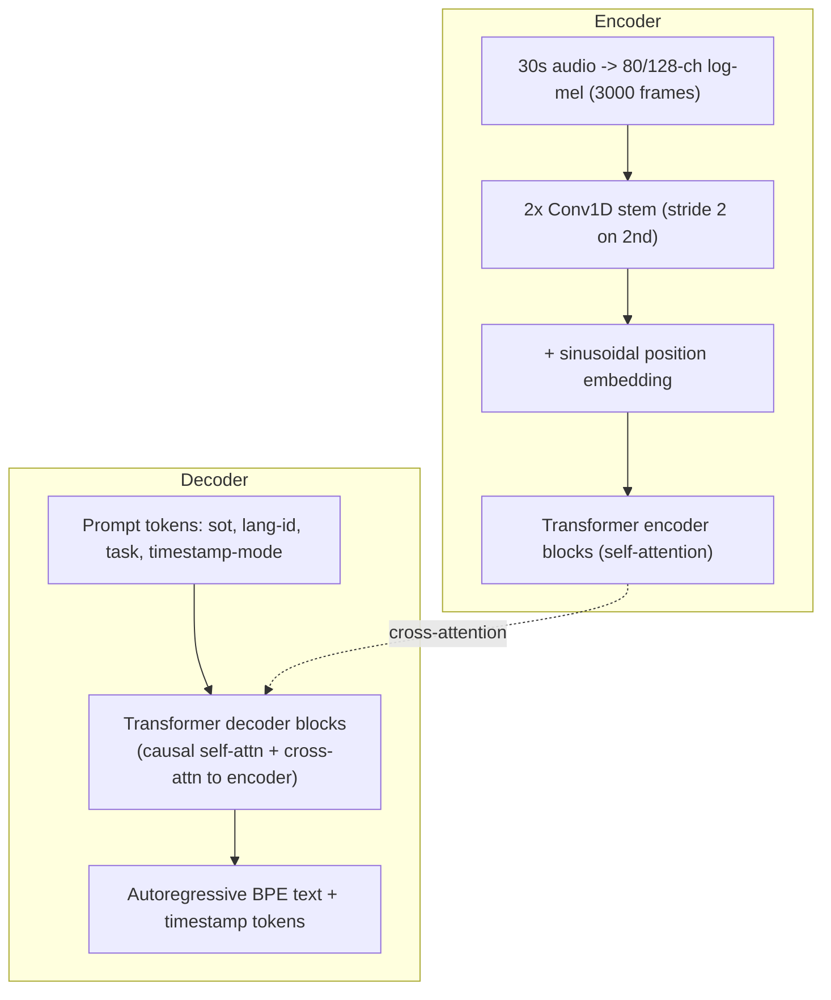

# Breakdown - Whisper

> Whisper is OpenAI's automatic speech recognition (and translation) model, released September 2022 (Radford et al., "Robust Speech Recognition via Large-Scale Weak Supervision"), with the large-v3 checkpoint following in late 2023. It matters not because the architecture is novel — it's a stock encoder-decoder transformer — but because it demonstrated that scale plus weak, noisy web supervision beats careful hand-labeled per-dataset training for robustness, and it shipped as open weights (MIT license) that immediately became the default ASR building block across the industry.

## The headline numbers

- **Training data:** 680,000 hours of audio paired with transcripts scraped from the internet, spanning 96 languages — no hand-labeling, filtered with heuristics rather than curated by annotators.
- **Model sizes:** tiny (39M) → base → small → medium → large-v2/large-v3 (1.55B parameters).
- **Input:** 30-second audio chunks, 80-channel log-mel spectrogram (large-v3 moved to 128 mel bins and trained on more data than large-v2), 16kHz sample rate.
- **Sequence length:** 3,000 mel frames per 30s chunk, downsampled 2× by the convolutional stem to 1,500 encoder positions.
- **License:** MIT — fully open weights, which is a large part of why it became the industry-default ASR component rather than staying a research curiosity.
- **Zero-shot:** no per-dataset fine-tuning — evaluated directly across many ASR benchmarks and closed much of the gap to (and beat, on noisy/accented audio) prior fine-tuned supervised systems of the time.

## How it actually works

Whisper is a vanilla encoder-decoder transformer (see [[Deep Dive - The Transformer]]) — the entire contribution is in the data and training recipe, not a new mechanism.

**Encoder side.** Raw audio is converted to an 80- or 128-channel log-mel spectrogram (see [[Concept - Audio Spectrograms and Mel Features]]) over a fixed 30-second window. Two 1D convolution layers form a stem — the second with stride 2 — which downsamples 3,000 mel frames to 1,500 positions and projects into the model's hidden dimension. Sinusoidal position embeddings are added, and a standard stack of transformer encoder blocks with self-[[Concept - Attention Mechanism|attention]] processes the sequence.

**Decoder side.** A standard transformer decoder autoregressively generates output tokens using a shared multilingual byte-level BPE vocabulary (see [[Concept - Byte-Pair Encoding]]) — the same tokenization family used by GPT-2. Each decoder block does causal self-attention over previously generated tokens plus cross-attention over the full 1,500-position encoder output. At inference this cross-attention is served with a growing [[Concept - KV Cache]] over the decoder's own generated tokens, same as any autoregressive LM.

**Multitask token format — the actual design contribution.** Rather than training separate models for transcription, translation, and language identification, Whisper unifies all of them into one decoder by using special tokens as a task selector, prepended to the sequence: `<|startoftranscript|>`, a language-ID token (one of 99 languages), a task token (`<|transcribe|>` or `<|translate|>` — translate always targets English), and either `<|notimestamps|>` or interleaved timestamp tokens quantized to 20ms granularity. This is functionally a chat-template-style prompt for audio: the same decoder, the same weights, different behavior selected entirely by which special tokens prefix the generation.

## The clever parts

1. **Data scale over architectural novelty.** 680,000 hours of noisy, imperfectly-transcribed web audio, filtered rather than hand-curated, is the entire innovation. The bet: at enough scale, a boring architecture trained on messy real-world data generalizes better than a clever architecture trained on small clean datasets — the same bet [[Concept - Synthetic Training Data|data-scale-first strategies]] make elsewhere in the field, here applied to weak (not synthetic) supervision.
2. **Multitask prompting unifies four jobs into one decoder.** Transcribe, translate, detect language, and optionally timestamp — one set of weights, one architecture, task selected entirely by prompt tokens. This avoids maintaining separate model families and lets each task's training data implicitly regularize the others.
3. **Zero-shot cross-dataset robustness.** Never fine-tuned per-benchmark, Whisper still generalizes across accents, background noise, and domain-specific jargon better than prior supervised systems tuned to individual datasets — the direct payoff of training on maximally diverse, unfiltered-by-domain web audio rather than a single curated corpus.
4. **Long-form transcription without a streaming architecture.** The model only ever sees fixed 30-second chunks, but timestamp tokens let a sliding-window decode loop stitch chunks into long-form transcripts — a purely inference-time trick layered on top of a fixed-context model rather than an architectural streaming mechanism.
5. **One shared multilingual vocabulary across 96 languages** instead of per-language models, letting cross-lingual data implicitly share statistical strength through a common decoder.

## What it got wrong / what's dated

- **Hallucination on silence and non-speech audio is the single most infamous failure.** When the encoder signal is weak or absent (silence, music, background noise), the decoder — which is, underneath, a fairly strong language model — falls back on its language-modeling prior and emits fluent, plausible, entirely fabricated text, or loops on a repeated phrase. This isn't a bug in the traditional sense; it's what an LM decoder does when the conditioning signal doesn't constrain it.
- **Repetition loops** are the same decoder-degeneration pathology text LLMs exhibit under certain [[Concept - Sampling and Decoding Parameters|decoding settings]], here surfacing in an ASR context.
- **30-second fixed chunking loses cross-chunk context** — a sentence or topic split across a chunk boundary can lose coherence, and long-form use compounds small per-chunk timestamp drift across the full transcript.
- **No built-in speaker diarization** — "who said this" has to be bolted on externally (commonly via a separate model like pyannote), a real gap for meeting-transcription use cases.
- **Low-resource languages perform proportionally worse**, roughly tracking their share of the 680k training hours — the weak-supervision bet has an uneven payoff across the language distribution.
- **large-v3's 128-mel-bin, more-data upgrade is an incremental data/capacity patch**, not a rethink of the architecture — the entire Whisper lineage from tiny to large-v3 is the same encoder-decoder shape at different scale.

## What to steal

- **Weak supervision at scale beats small hand-labeled data**, provided you can filter noisy pairs well enough that the noise averages out rather than teaching the wrong thing.
- **Multitask special-token prompting** to unify several related tasks into one model and one training run, instead of maintaining a model per task.
- **Architecture is not the moat — data curation and scale are.** Whisper's transformer is deliberately unremarkable; the differentiator is entirely upstream of the model.
- **Voice-activity-detection (VAD) pre-filtering** is the standard production fix for the silence-hallucination failure mode — strip non-speech segments before they ever reach the model.
- **faster-whisper (CTranslate2)** is the standard production serving pattern: a quantized, kernel-fused reimplementation of a research checkpoint built purely for latency, the same pattern seen across the field wherever a research release becomes a production dependency.

## Connections
- [[Concept - Audio Spectrograms and Mel Features]] — Whisper's entire input pipeline, the log-mel front end this breakdown assumes throughout.
- [[Deep Dive - The Transformer]] — the base architecture; Whisper's contribution is entirely in data and training, not in modifying this.
- [[Concept - Attention Mechanism]] — the self-attention (encoder) and cross-attention (decoder-to-encoder) that do the actual sequence modeling.
- [[Concept - Neural Text-to-Speech and Audio Language Models]] — the generative counterpart to Whisper's recognition task; TTS evaluation commonly runs synthesized audio back through Whisper to measure intelligibility (WER).
- [[Concept - Sampling and Decoding Parameters]] — governs the decoder's autoregressive generation and directly affects repetition-loop behavior.
- [[Concept - Synthetic Training Data]] — a useful contrast case: Whisper's weak-supervision-from-scraped-data strategy versus LLM-distilled synthetic data as two different ways to avoid hand-labeling at scale.
- [[Reference - Vision Encoders and Multimodal Models]] — tabulates Whisper's model-size/mel-bin/language specs alongside other multimodal encoders for quick lookup.
- [[Concept - Byte-Pair Encoding]] — Whisper's decoder emits a multilingual byte-level BPE vocabulary, the same tokenization family as GPT-2.
- [[Concept - KV Cache]] — the decoder's autoregressive generation is served with a growing KV cache over previously emitted tokens, same as any transformer LM.
- [[Concept - Encoder-Decoder and Decoder-Only Architectures]] — Whisper is one of the few prominent 2022-era models that stuck with the classic encoder-decoder shape rather than going decoder-only.

## Sources
- Radford et al. (2022) — "Robust Speech Recognition via Large-Scale Weak Supervision" — the Whisper paper: architecture, 680k-hour weakly-supervised training data, multitask token format, zero-shot evaluation results.
- OpenAI (2023) — large-v3 model card / release notes — the 128-mel-bin upgrade and additional training data for the large-v3 checkpoint.
