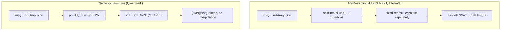

# Concept - Any-Resolution Vision Encoding

> **One-paragraph hook:** [[Concept - Vision Transformers]] are pretrained at one fixed resolution, 224 to 448px. A production VLM gets screenshots, documents and photos at any size and aspect ratio. Downsample a 4000×3000 photo of a receipt to 336px and the line-item text is gone from the pixel grid, and no language-model reasoning recovers what the vision encoder never saw. Any-resolution encoding is the family of techniques that close this gap. The token-count math they bring with them is the practical ceiling on how much a VLM can "see" before it blows its context budget.

## The mechanism

A ViT patchifies an image into a `(H/P) × (W/P)` grid of tokens for patch size `P`, and its learned position embeddings fit the grid it was trained on and nothing else. Two things break at a new resolution. Compute grows (more patches means more tokens means quadratic attention cost), and the position embeddings run out (a `24×24` grid of learned vectors has no entry for patch `(30, 17)`). Four approaches have become the standard toolkit.

**1. Tiling / AnyRes (LLaVA-NeXT, InternVL).** Cut the image into native-resolution tiles that each match the encoder's trained size, encode each tile separately through the unmodified ViT, and concatenate the tokens, typically with one downsized global thumbnail so the model keeps whole-image context. For a CLIP ViT-L/14 at 336px (576 tokens/tile), a 2×2 grid plus a thumbnail is `4×576 + 576 = 2880` tokens for one image. That's five times what LLaVA-1.5 spent on the whole image. InternVL's dynamic tiling picks the tile count and aspect ratio that best fit the source image in place of a fixed grid.

**2. Position-embedding interpolation.** The cheap fallback. Bicubically interpolate the learned 1D/2D position grid up to the new patch count so every position gets *some* embedding. It's good enough to ship, but the information is degraded (a position the model never trained on, guessed by interpolation), and it's a hard-to-detect source of accuracy loss whenever a VLM runs past its training resolution.

**3. NaViT, patch n' pack (Dehghani et al. 2023).** No resizing or tiling. Pack the patch sequences of several *variable-resolution* images into one training example, with attention masks so images can't attend across each other's boundaries and factorized (per-axis) position embeddings that generalize to unseen aspect ratios by construction. Fixed-canvas padding waste and resize/tile distortion both go away, because the ViT learns to handle any aspect ratio natively instead of getting a fix bolted on later.

**4. Native dynamic resolution with 2D-RoPE (Qwen2-VL).** Swap learned absolute position embeddings for a 2D extension of [[Concept - Rotary Position Embeddings (RoPE)|RoPE]] (multimodal RoPE, M-RoPE) that puts row/column position into the rotation angle instead of a lookup table. There's no fixed grid to interpolate away from, and an image costs `(H/P)(W/P)` tokens, which scales naturally with input size. Of the four, this is the closest to a principled fix, and it's how Qwen2-VL can treat video as "more patches over time" through the same mechanism.

## In practice

Practitioners budget against the token math: `image_tokens = (H/P)(W/P) / r^2`, where `r` is any connector-side reduction factor (see the pixel-shuffle in [[Concept - Vision-Language Connectors]]). One AnyRes-tiled high-res screenshot can take 2,000-4,000 tokens, as much as or more than a whole multi-turn text conversation. Production VLMs therefore cap the tile count (commonly 6-12 tiles) whatever the source resolution, silently dropping detail above the cap before one image can eat the context window. Qwen2-VL and InternVL both expose this as a `min_pixels`/`max_pixels` or tile-count knob the caller has to tune per use case. OCR-heavy document work wants more tiles and higher resolution; chat-with-a-photo wants fewer.

## Failure modes

- **Tiling seams.** A word or object that straddles a tile boundary is split across two separately encoded tiles, each seeing half of it. The OCR and grounding errors this causes look like random model mistakes, but they're deterministic given the tile grid.
- **Token-budget starvation.** AnyRes token counts scale with image resolution, not task difficulty. A high-res image can eat most of the context window and leave too little for the conversation, retrieved documents or multi-turn history. The symptom is earlier context being truncated or ignored in long sessions with images.
- **Interpolation degradation.** Position-embedding interpolation (approach 2) degrades gracefully instead of failing loudly, so accuracy loss at off-training resolutions slips through eval unless you test at multiple resolutions on purpose.
- **Aspect-ratio bucketing bias.** Fixed tile-grid choices (e.g., only square grids) consistently under-serve very wide or very tall images like panoramas and long documents. You only see it when the eval set matches production's real aspect-ratio distribution.

## The non-obvious

The ceiling on "how much can this VLM see" is usually the image-token explosion, not model capability. Teams that treat resolution as a free knob to crank for better OCR run into the KV-cache and latency cost of a few thousand extra tokens per image (see [[Concept - KV Cache]]). It looks like "the model got dumber". What happened is that image tokens starved out the text context, or prefill latency in the serving stack doubled. The fix is rarely "encode at higher resolution". It's almost always "spend the token budget better": smarter tiling, connector-side compression, or a native-resolution encoder that never needed whole-tile redundancy.

## Connections
- [[Concept - Vision Transformers]] — any-resolution techniques are all built on top of the fixed-grid ViT patchify math they're working around.
- [[Concept - Vision-Language Connectors]] — connector-side token reduction (pixel-shuffle) is the other lever on the same token-budget problem tiling creates.
- [[Concept - Rotary Position Embeddings (RoPE)]] — M-RoPE's 2D extension is the position-encoding fix that avoids bicubic interpolation entirely.
- [[Concept - VLM Architectures]] — any-resolution encoding is one of the core design axes in the broader VLM taxonomy.
- [[Gotchas - Vision-Language Models]] — the tiling-seam and token-budget-blowup failure modes documented here are cataloged there alongside the rest of VLM pathology.
- [[Concept - KV Cache]] — thousands of image tokens per image directly inflate the KV cache footprint at serving time, not just the prefill cost.
- [[Concept - Native and Any-to-Any Multimodal Models]] — native-resolution patchify without any pretrained encoder is the logical endpoint any-resolution tiling is reaching toward.
- [[Gotchas - Long-Context and Context Windows]] — tiling's token explosion competes directly with the text context budget, a VLM-specific instance of the same context-window pressure.

## Sources
- Liu et al. (2024) — "LLaVA-NeXT: Improved reasoning, OCR, and world knowledge" — introduces AnyRes tiling with a global thumbnail.
- Dehghani et al. (2023) — "Patch n' Pack: NaViT, a Vision Transformer for any Aspect Ratio and Resolution" — masked-attention packing of variable-resolution images with factorized position embeddings.
- Wang et al. (2024) — "Qwen2-VL: Enhancing Vision-Language Model's Perception of the World at Any Resolution" — native dynamic resolution with M-RoPE.
- Chen et al. (2024) — "How Far Are We to GPT-4V?" (InternVL 1.5) — dynamic aspect-ratio-matched tiling.
