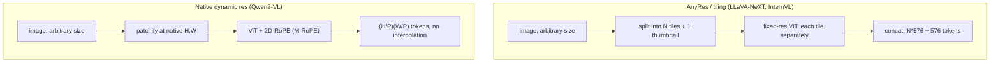

# Concept - Any-Resolution Vision Encoding

> **One-paragraph hook:** [[Concept - Vision Transformers]] are pretrained at one fixed resolution — 224 to 448px — but the images a production VLM actually receives are screenshots, documents, and photos at arbitrary size and aspect ratio. Downsample a 4000×3000 photo of a receipt to 336px and the line-item text simply stops existing in the pixel grid; no amount of language-model reasoning recovers information the vision encoder never saw. Any-resolution encoding is the family of techniques that close this gap, and the token-count math they introduce is the actual, practical ceiling on how much a VLM can "see" without blowing its context budget.

## The mechanism

A ViT patchifies an image into a `(H/P) × (W/P)` grid of tokens for patch size `P`, and its learned position embeddings are shaped for exactly the grid it was trained on. Two things break at a new resolution: the compute (more patches = more tokens = quadratic attention cost) and the position embeddings (a `24×24` grid of learned vectors has no entry for patch `(30, 17)`). Four approaches have converged on as the standard toolkit:

**1. Tiling / AnyRes (LLaVA-NeXT, InternVL).** Split the image into a grid of native-resolution tiles that each match the encoder's trained size, encode every tile independently through the unmodified ViT, and concatenate the resulting tokens — typically alongside one downsized global thumbnail so the model retains whole-image context. For a CLIP ViT-L/14 at 336px (576 tokens/tile), a 2×2 tile grid plus a thumbnail is `4×576 + 576 = 2880` tokens for a single image — five times what LLaVA-1.5 spent on the entire image. InternVL's dynamic tiling picks the tile count and aspect ratio that best matches the source image instead of a fixed grid.

**2. Position-embedding interpolation.** The cheap fallback: bicubically interpolate the learned 1D/2D position grid up to the new patch count so every position still gets *some* embedding. It works well enough to ship, but it's degraded information — a position the model never trained on, guessed by interpolation — and is a quiet, hard-to-detect source of accuracy loss whenever a VLM is pushed past its training resolution.

**3. NaViT — patch n' pack (Dehghani et al. 2023).** Instead of resizing or tiling, pack multiple *variable-resolution* images' patch sequences into one training example, using attention masking so images don't attend across each other's boundaries, and factorized (per-axis) position embeddings that generalize to unseen aspect ratios by construction. This eliminates both the padding waste of fixed-canvas training and the resize/tile distortion — the ViT is trained to natively handle any aspect ratio rather than bolted on after the fact.

**4. Native dynamic resolution with 2D-RoPE (Qwen2-VL).** Replace learned absolute position embeddings with a 2D extension of [[Concept - Rotary Position Embeddings (RoPE)|RoPE]] (multimodal RoPE, M-RoPE) that encodes row/column position directly in the rotation angle rather than a lookup table — so there is no fixed grid to interpolate away from, and the token count for a given image is exactly `(H/P)(W/P)`, varying naturally with input size. This is the closest thing to a principled fix among the four, and it's why Qwen2-VL treats video as just "more patches over time" through the same mechanism.

## In practice

The token math is what practitioners actually budget against: `image_tokens = (H/P)(W/P) / r^2` where `r` is any connector-side reduction factor (see [[Concept - Vision-Language Connectors]]'s pixel-shuffle). A single AnyRes-tiled screenshot at high resolution can consume 2,000-4,000 tokens — comparable to or larger than an entire multi-turn text conversation — which is why production VLMs cap the maximum tile count (commonly 6-12 tiles) regardless of source resolution, silently truncating detail above that cap rather than letting one image exhaust the context window. Qwen2-VL and InternVL both expose this as an explicit `min_pixels`/`max_pixels` or tile-count knob the caller must tune per use case: OCR-heavy document workloads push toward more tiles/higher resolution, chat-with-a-photo workloads push toward fewer.

## Failure modes

- **Tiling seams.** A word or object that happens to straddle a tile boundary gets split across two independently-encoded tiles, each seeing only half of it — a direct cause of OCR and grounding errors that looks like a random model mistake but is actually deterministic given the tile grid.
- **Token-budget starvation.** AnyRes token counts scale with image resolution, not with task difficulty; a high-res image can eat most of the context window, leaving too little room for the text conversation, retrieved documents, or multi-turn history — symptom is truncated or ignored earlier context in long sessions with images.
- **Interpolation degradation.** Position-embedding interpolation (approach 2) degrades gracefully rather than failing loudly, so accuracy loss at off-training resolutions is easy to miss in eval unless you specifically test at multiple resolutions.
- **Aspect-ratio bucketing bias.** Fixed tile-grid choices (e.g., only square grids) systematically under-serve very wide or very tall images (panoramas, long documents), a blind spot that only shows up when the eval set matches production's actual aspect-ratio distribution.

## The non-obvious

The image-token explosion, not model capability, is usually the real ceiling on "how much can this VLM see." Teams that treat resolution as a free knob to turn up for better OCR run straight into the KV-cache and latency cost of a few thousand extra tokens per image (see [[Concept - KV Cache]]) — the failure mode looks like "the model got dumber" when what actually happened is the text context got starved out by image tokens, or the serving stack's prefill latency doubled. The fix is rarely "encode at higher resolution"; it's almost always "spend the token budget more efficiently" (better tiling, connector-side compression, or a native-resolution encoder that doesn't need whole-tile redundancy in the first place).

## Connections
- [[Concept - Vision Transformers]] — any-resolution techniques are all built on top of the fixed-grid ViT patchify math they're working around.
- [[Concept - Vision-Language Connectors]] — connector-side token reduction (pixel-shuffle) is the other lever on the same token-budget problem tiling creates.
- [[Concept - Rotary Position Embeddings (RoPE)]] — M-RoPE's 2D extension is the position-encoding fix that avoids bicubic interpolation entirely.
- [[Concept - VLM Architectures]] — any-resolution encoding is one of the core design axes in the broader VLM taxonomy.
- [[Gotchas - Vision-Language Models]] — the tiling-seam and token-budget-blowup failure modes documented here are cataloged there alongside the rest of VLM pathology.
- [[Concept - KV Cache]] — thousands of image tokens per image directly inflate the KV cache footprint at serving time, not just the prefill cost.
- [[Concept - Native and Any-to-Any Multimodal Models]] — native-resolution patchify without any pretrained encoder is the logical endpoint any-resolution tiling is reaching toward.
- [[Gotchas - Long-Context and Context Windows]] — tiling's token explosion competes directly with the text context budget, a VLM-specific instance of the same context-window pressure.

## Sources
- Liu et al. (2024) — "LLaVA-NeXT: Improved reasoning, OCR, and world knowledge" — introduces AnyRes tiling with a global thumbnail.
- Dehghani et al. (2023) — "Patch n' Pack: NaViT, a Vision Transformer for any Aspect Ratio and Resolution" — masked-attention packing of variable-resolution images with factorized position embeddings.
- Wang et al. (2024) — "Qwen2-VL: Enhancing Vision-Language Model's Perception of the World at Any Resolution" — native dynamic resolution with M-RoPE.
- Chen et al. (2024) — "How Far Are We to GPT-4V?" (InternVL 1.5) — dynamic aspect-ratio-matched tiling.
