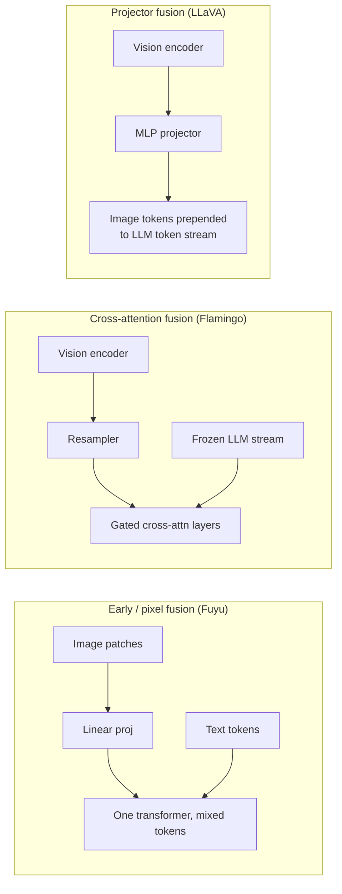

# Concept - Cross-Modal Representation Alignment

> **One-paragraph hook:** Before a model can caption an image, answer a question about a chart or transcribe speech, it has to solve a boring problem everything else depends on. An image, a sentence and a waveform have different dimensionality, different statistics and wildly different token counts, and the model wants to reason over all of them with one mechanism: attention over a shared representation. Cross-modal alignment is the umbrella name for how that projection happens. The choice you make here, contrastive shared space vs. fusion into a generative language model, is the biggest architectural fork in multimodal AI.

## The mechanism

A 224×224 image cut into 16×16 patches gives 196 raw-pixel tokens (the patchify math is in [[Concept - Vision Transformers]]). A sentence tokenized into subwords gives a handful of discrete IDs from a ~50K–150K vocabulary. For [[Concept - Attention Mechanism]] to run jointly over both, each modality's tokens have to be projected into the same $d$-dimensional space with comparable scale and variance. That projection *is* the alignment problem.

Two paradigms dominate:

1. **Contrastive alignment into a shared metric space.** Two independent encoders, one per modality, are trained so matched pairs land close together and mismatched pairs land far apart under cosine similarity. That's the [[Concept - CLIP and Contrastive Vision-Language Training]] recipe. With no decoder, it's excellent for retrieval and classification but can't generate fluent text about an image.
2. **Fusion into a generative LM.** Vision (or audio) features go into a decoder-only language model's token stream or attention layers, and the LM decodes text conditioned on them: the [[Concept - VLM Architectures]] family. Captioning, VQA and open-ended chat need this.

Fusion has its own taxonomy, split by *where* the other modality enters the LLM's compute graph:

The three differ on parameter count (early fusion adds none, cross-attention adds a parallel stack, a projector adds a small MLP), on whether the LLM's weights stay frozen (cross-attention and projector setups can freeze it; early fusion trains everything jointly from scratch), and on flexibility (early fusion handles arbitrary resolutions and future modalities most gracefully, but pretraining costs much more).

Aligned doesn't mean identical. A contrastive space trained for millions of steps still doesn't merge image and text into one cloud. Each modality's embeddings cluster in their own region, which [[Concept - The Modality Gap in Contrastive Models]] covers in detail. Contrastive training guarantees *relative* ordering (the matched pair is closer than any mismatched pair). It does not put the two modalities in the same subspace.

Relative ordering is all zero-shot transfer needs. Classification becomes "which text embedding is nearest to this image embedding?" A new class takes one new prompt string embedded through the frozen text tower. No gradient step, no labeled images. It's by design: the shared space was built for retrieval-style nearest-neighbor lookup, and zero-shot classification is retrieval with the label set as the corpus.

## In practice

Retrieval and classification systems (product search, content moderation, zero-shot tagging) want paradigm 1: embed once, index in a vector store, run approximate nearest-neighbor lookups. [[Concept - Embedding Models]] covers the general embed-and-index pattern. A system that has to *talk about* the image (describe it, reason over a chart, follow an instruction that references it) wants paradigm 2, since only a decoder produces open-ended text. Often you compose the two: a CLIP-style tower supplies frozen vision features, and a projector or cross-attention block (see [[Concept - Vision-Language Connectors]]) bridges into the LLM. Diffusion image models use a lighter version of the same idea on the generative side, with text embeddings conditioning image denoising through cross-attention instead of token concatenation ([[Concept - Classifier-Free Guidance]] covers that).

## Failure modes

The most common failure is **modality collapse**. Concatenate raw, unaligned vision features into an LLM's input without a proper alignment stage and the model learns to ignore the image and answer from language priors: the "blind VLM". Gradient descent finds it cheaper to exploit text-side dataset biases (captions correlate with common answers) than to learn to read pixels through an under-trained interface. Test it counterfactually. Swap the image for an unrelated one; if the answer doesn't change, the model isn't looking. The fix is always upstream. Either the encoder was never contrastively aligned, or the fusion module (projector or cross-attention) didn't get enough alignment-stage training before instruction tuning started.

## The non-obvious

If you feed raw CLIP or SigLIP features straight into an LLM and expect it to "figure out" the mapping, you're fighting the modality gap. The two towers were only ordered relative to each other, never pulled into one manifold, so even a linear or MLP projector has real work to do beyond resizing dimensions. It has to *bridge* a gap. That's why the fusion mechanism is the dominant lever on how well a VLM grounds its answers in the actual pixels, and far from a minor implementation detail.

## Connections
- [[Concept - CLIP and Contrastive Vision-Language Training]] — the canonical implementation of the contrastive-alignment paradigm and its InfoNCE mechanics.
- [[Concept - Vision Transformers]] — supplies the patchify-into-tokens step that alignment operates on for the vision side.
- [[Concept - VLM Architectures]] — the fusion-taxonomy families (cross-attention, projector, early-fusion) expanded in full.
- [[Concept - The Modality Gap in Contrastive Models]] — why "shared space" is never truly unified, even after successful contrastive training.
- [[Concept - Embedding Models]] — the general retrieval/embedding pattern that contrastive alignment specializes for two modalities.
- [[Concept - Attention Mechanism]] — the operation that alignment exists to make possible across heterogeneous token streams.
- [[Concept - Vision-Language Connectors]] — the concrete module (MLP, resampler, pixel-shuffle) that performs the bridging in projector-style fusion.
- [[Concept - Classifier-Free Guidance]] — the diffusion-side analog, where text conditions generation via cross-attention rather than token fusion.

## Sources
- Radford et al. (2021) — Learning Transferable Visual Models From Natural Language Supervision (CLIP): the contrastive-alignment paradigm and zero-shot transfer via nearest text embedding.
- Alayrac et al. (2022) — Flamingo: a Visual Language Model for Few-Shot Learning: cross-attention fusion into a frozen LLM.
- Liu et al. (2023) — Visual Instruction Tuning (LLaVA): projector fusion as the simplest and most reproduced pattern.
- Liang et al. (2022) — Mind the Gap: Understanding the Modality Gap in Multi-Modal Contrastive Representation Learning: the cone-separation finding referenced above.
