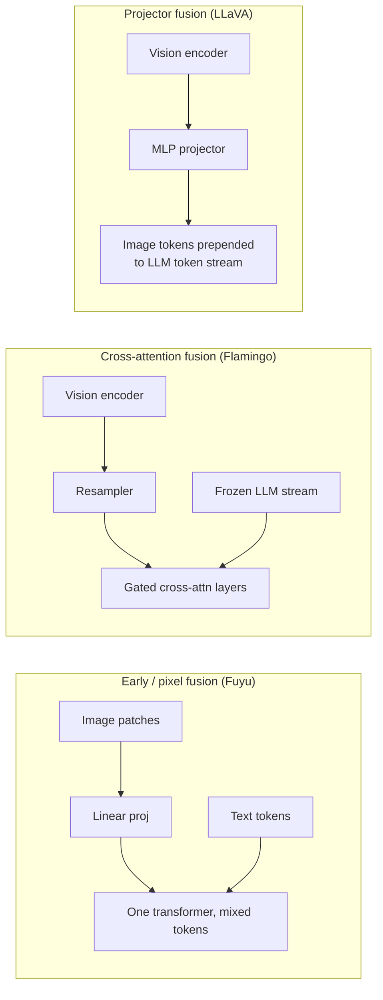

# Concept - Cross-Modal Representation Alignment

> **One-paragraph hook:** Before a model can caption an image, answer a question about a chart, or transcribe speech, it has to solve a boring but load-bearing problem: an image, a sentence, and a waveform have different dimensionality, different statistics, and wildly different token counts, yet the model wants to reason about all of them with the same mechanism — attention over a shared representation. Cross-modal alignment is the umbrella name for how that projection happens, and the specific choice you make here — contrastive shared space vs. fusion into a generative language model — is the single biggest architectural fork in multimodal AI.

## The mechanism

A 224×224 image split into 16×16 patches yields 196 raw-pixel tokens (see [[Concept - Vision Transformers]] for the patchify math); a sentence tokenized into subwords yields a handful of discrete IDs drawn from a ~50K–150K vocabulary. Before [[Concept - Attention Mechanism]] can operate jointly over both, every modality's tokens must be projected into the same $d$-dimensional space with comparable scale and variance — that projection *is* the alignment problem.

Two paradigms dominate:

1. **Contrastive alignment into a shared metric space.** Two independent encoders (one per modality) are trained so that matched pairs land close together and mismatched pairs land far apart under cosine similarity — the [[Concept - CLIP and Contrastive Vision-Language Training]] recipe. There is no decoder, so this paradigm is excellent for retrieval and classification but cannot generate fluent text about an image.
2. **Fusion into a generative LM.** Vision (or audio) features are injected into a decoder-only language model's token stream or attention layers, and the LM decodes text conditioned on them — the [[Concept - VLM Architectures]] family. This is what you need for captioning, VQA, and open-ended chat.

Within fusion there is a taxonomy, distinguished by *where* the other modality enters the LLM's compute graph:

The three points differ on param count (early fusion adds none, cross-attention adds a parallel stack, a projector adds a small MLP), whether the LLM's own weights stay frozen (cross-attention and projector setups can freeze the LLM; early fusion trains everything jointly from scratch), and flexibility (early fusion handles arbitrary resolutions and future modalities most gracefully, at the cost of much more expensive pretraining).

Alignment is not identity. Even a contrastive space trained for millions of steps does not merge image and text into one indistinguishable cloud — embeddings from each modality cluster into their own region, a phenomenon detailed in [[Concept - The Modality Gap in Contrastive Models]]. What contrastive training actually guarantees is *relative* ordering (the matched pair is closer than any mismatched pair), not that the two modalities occupy the same subspace.

That relative-ordering guarantee is exactly what makes zero-shot transfer work: classification becomes "which text embedding is nearest to this image embedding?" A new class needs only a new prompt string embedded through the frozen text tower — no gradient step, no labeled images. This is the mechanism, not a side effect: the shared space was built for retrieval-style nearest-neighbor lookup, and zero-shot classification is retrieval with the label set as the corpus.

## In practice

A retrieval or classification system (product search, content moderation, zero-shot tagging) wants paradigm 1 — embed once, index with a vector store, and do approximate nearest-neighbor lookups; see [[Concept - Embedding Models]] for the general embedding-and-index pattern this inherits. A system that needs to *talk about* the image — describe it, reason over a chart, follow an instruction referencing it — wants paradigm 2, because only a decoder can produce open-ended text. In practice the two are often composed: a CLIP-style tower supplies the frozen vision features, and a projector or cross-attention block (see [[Concept - Vision-Language Connectors]]) bridges into the LLM. On the generative side, diffusion image models use a lighter-weight version of the same idea — text embeddings condition image denoising via cross-attention rather than token concatenation, a pattern covered separately under [[Concept - Classifier-Free Guidance]].

## Failure modes

The most common failure is **modality collapse**: if you concatenate raw, unaligned vision features directly into an LLM's input without a proper alignment-training stage, the model learns to ignore the image and answer from language priors alone — the "blind VLM." It happens because gradient descent finds it cheaper to exploit dataset biases in the text (captions correlate with common answers) than to learn to actually read pixel information through an under-trained interface. You detect it with a counterfactual test: swap the image for an unrelated one and see if the answer changes; if it doesn't, the model isn't looking. The fix is always upstream — either the encoder was never contrastively aligned, or the fusion module (projector or cross-attention) wasn't given enough alignment-stage training before instruction tuning began.

## The non-obvious

Practitioners who feed raw CLIP or SigLIP features straight into an LLM and expect the LLM to "figure out" the mapping are fighting the modality gap: the two towers were never pulled into one manifold, only ordered relative to each other, so a linear or even MLP projector has real work to do beyond resizing dimensions — it has to learn to *bridge* a gap, not just relabel a space. This is why the choice of fusion mechanism is not a minor implementation detail but the dominant lever on how well a VLM grounds its answers in the actual pixels.

## Connections
- [[Concept - CLIP and Contrastive Vision-Language Training]] — the canonical implementation of the contrastive-alignment paradigm and its InfoNCE mechanics.
- [[Concept - Vision Transformers]] — supplies the patchify-into-tokens step that alignment operates on for the vision side.
- [[Concept - VLM Architectures]] — the fusion-taxonomy families (cross-attention, projector, early-fusion) expanded in full.
- [[Concept - The Modality Gap in Contrastive Models]] — why "shared space" is never truly unified, even after successful contrastive training.
- [[Concept - Embedding Models]] — the general retrieval/embedding pattern that contrastive alignment specializes for two modalities.
- [[Concept - Attention Mechanism]] — the operation that alignment exists to make possible across heterogeneous token streams.
- [[Concept - Vision-Language Connectors]] — the concrete module (MLP, resampler, pixel-shuffle) that performs the bridging in projector-style fusion.
- [[Concept - Classifier-Free Guidance]] — the diffusion-side analog, where text conditions generation via cross-attention rather than token fusion.

## Sources
- Radford et al. (2021) — Learning Transferable Visual Models From Natural Language Supervision (CLIP): the contrastive-alignment paradigm and zero-shot transfer via nearest text embedding.
- Alayrac et al. (2022) — Flamingo: a Visual Language Model for Few-Shot Learning: cross-attention fusion into a frozen LLM.
- Liu et al. (2023) — Visual Instruction Tuning (LLaVA): projector fusion as the simplest and most reproduced pattern.
- Liang et al. (2022) — Mind the Gap: Understanding the Modality Gap in Multi-Modal Contrastive Representation Learning: the cone-separation finding referenced above.
