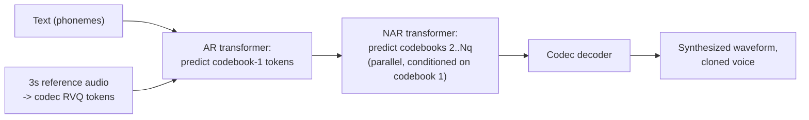

# Concept - Neural Text-to-Speech and Audio Language Models

> **One-paragraph hook:** Text-to-speech used to be a two-stage pipeline glued together from two model families. It's now converging on the recipe that won for text: tokenize the target signal, then train a language model (or a flow model) to predict it. Codec-language-model TTS like VALL-E can clone a voice from 3 seconds of reference audio with no fine-tuning. That's both the headline capability and the headline liability of this generation of systems.

## The mechanism

**The old pipeline.** Two separately trained stages. An *acoustic model* (Tacotron, FastSpeech) predicts a mel spectrogram (see [[Concept - Audio Spectrograms and Mel Features]]) from text, and a *vocoder* turns that spectrogram into a waveform. Early vocoders (WaveNet) generated audio autoregressively one sample at a time, which was correct but far too slow for real-time use. HiFi-GAN and its successors replaced that with a GAN-based feed-forward vocoder that produces the whole waveform in one pass, a small quality hit for orders-of-magnitude faster synthesis. The pipeline's basic limitation is that mel spectrograms discard phase (see [[Concept - Audio Spectrograms and Mel Features]]), so the vocoder's whole job is hallucinating plausible phase, an awkward and indirect target.

**The new pipeline: TTS as conditional language modeling over codec tokens.** Drop the continuous mel spectrogram. Make the discrete tokens from a [[Concept - Neural Audio Codecs and Residual Vector Quantization|neural audio codec]] the generation target, and train an ordinary autoregressive transformer to predict them conditioned on text.

**VALL-E** (Wang et al. 2023) is the reference architecture. Input text (as phonemes) and a 3-second reference clip, encoded into RVQ tokens by EnCodec, go into an autoregressive transformer that predicts the first codebook's token sequence. Predicting all $N_q$ codebooks autoregressively would be $N_q\times$ too slow, so a second, non-autoregressive transformer fills in the remaining codebooks in parallel, conditioned on the first codebook and the reference. VALL-E trained on roughly 60,000 hours of the LibriLight corpus, audiobook-scale data and not curated studio recordings. That's part of why 3-second zero-shot cloning works: there's enough speaker diversity in training that the model generalizes to unseen voices from a short prompt instead of memorizing a fixed speaker set.

**Why zero-shot cloning works at all.** Speaker identity (timbre, accent, speaking rate, prosodic style) lives almost entirely in *which* acoustic tokens the model emits. There's no separate embedding to extract and inject. Conditioning a plain autoregressive LM on a short prompt's tokens and letting it continue in the same "style" is [[Concept - In-Context Learning|in-context learning]] on audio tokens: no fine-tuning, no speaker-adaptation step, the same few-shot mechanism behind prompted behavior in text LLMs.

**Flow/diffusion TTS, the non-autoregressive alternative.** NaturalSpeech 2/3 (Microsoft), Voicebox (Meta, Le et al. 2023) and E2/F5-TTS apply [[Concept - Flow Matching]] directly to continuous mel or latent features. A velocity field learns to carry noise toward a target acoustic representation, conditioned on text and a speaker prompt, and generation integrates the flow ODE over a small fixed number of steps, in parallel across the whole sequence instead of left to right. Autoregressive error accumulation disappears. What you lose is the AR variant's natural fit with streaming and incremental generation.

**AudioLM's semantic/acoustic split** (Borsos et al. 2022) takes the codec-LM idea beyond speech. It first predicts low-rate *semantic* tokens (from a self-supervised model like w2v-BERT/HuBERT) for long-range coherence, then *acoustic* tokens (codec RVQ) conditioned on them for fine timbre. That separates "what to say and how it should flow" from "what it should sound like", and the identical mechanism handles non-speech audio continuation (piano).

**MusicGen** (Copet et al. 2023) applies the codec-LM recipe to music in a single stage. Where VALL-E splits AR and NAR, MusicGen offsets each of its $N_q$ codebook streams by a different number of timesteps (a "delay pattern"), so one autoregressive transformer emits all codebooks with a fixed diagonal dependency structure, conditioned on text and optionally a melody.

## In practice

The production-relevant numbers: VALL-E's headline result is that a 3-second reference clip is enough for recognizable zero-shot voice cloning with no per-speaker training. F5-TTS and E2-TTS are fully non-autoregressive flow-matching systems that generate a whole utterance's acoustic representation in parallel, not token by token. That removes AR-style sequential latency in exchange for a fixed multi-step ODE integration.

**Evaluation** has three legs. **WER** measures intelligibility: run the synthesized audio back through an ASR model (commonly [[Breakdown - Whisper|Whisper]]) and compare the transcript with the input text. **Speaker similarity** measures cloning fidelity as cosine similarity between speaker embeddings of the reference and generated audio. **MOS/CMOS** (mean opinion score / comparative MOS) are human naturalness ratings, needed because neither WER nor speaker similarity directly captures prosody quality or artifacts.

As of 2026 the practical options are commercial zero-shot voice cloning (ElevenLabs and similar) and OpenAI's voice models, next to open systems like F5-TTS and XTTS. Production systems generally add consent gating and watermarking on top of the underlying codec-LM or flow mechanism and don't ship the raw research recipe as is.

## Failure modes

- **AR instability on hard or out-of-distribution text.** Codec-LM AR decoding can skip words, repeat phrases or collapse into babble on unusual text (numbers, unfamiliar names, code-switched text). Text LLMs show the same decoding degeneration. It's a direct reason flow/diffusion TTS is often preferred when reliability matters more than AR's streaming-friendliness.
- **Flat or monotone prosody** in flow/diffusion systems when speaker/style conditioning is weak. Generating in parallel across the sequence can under-model long-range prosodic contour if the conditioning doesn't carry enough of it.
- **Prompt speaker leakage.** A short or noisy reference clip clones its acoustic environment along with the voice. Room reverb, background noise and microphone coloration all come back as if they belonged to the speaker.
- **Hallucinated words.** The mirror image of Whisper's silence hallucination: with a strong AR language-modeling prior, the model can insert plausible-sounding words the input text doesn't contain, especially at low guidance/conditioning strength.
- **Long-form drift.** Long generations lose voice consistency or drift in pace and pitch, from compounding small errors much like exposure bias in other autoregressive settings.
- **The dual-use problem is real.** 3-second zero-shot cloning is an actual fraud and non-consensual-impersonation vector (voice-cloning scam calls are the most visible case). That's what drives provider-side consent gating and audio watermarking research. This is a mechanism note, but the mechanism is the reason [[Concept - Jailbreak Taxonomy|misuse-resistance]] work exists for this model class in particular.

## The non-obvious

The biggest lesson from VALL-E: "speaker identity" never needed a dedicated speaker-embedding module bolted onto the architecture. It falls out for free once TTS is framed as in-context sequence continuation over discrete tokens. That transfers. Any modality with a good enough discrete tokenizer inherits the in-context-learning toolbox that text LLMs get almost by accident from the transformer, with no bespoke conditioning mechanism.

Folklore, weakly sourced: real-time multimodal systems with low-latency voice (GPT-4o's voice mode is the most cited example) are widely believed to route audio end to end through discrete codec tokens instead of a mel-spectrogram-plus-vocoder pipeline. Token-level generation fits into the same autoregressive decode loop already used for text, which keeps a separate, slower vocoder stage out of the latency-critical path. OpenAI hasn't published the mechanism, so treat this as informed inference from the architecture family, not a confirmed detail.

## Connections
- [[Concept - Neural Audio Codecs and Residual Vector Quantization]] — the discrete token vocabulary that codec-LM TTS systems (VALL-E, MusicGen) are trained to predict; this note is the direct downstream application of that tokenizer.
- [[Concept - Audio Spectrograms and Mel Features]] — the representation the old acoustic-model-plus-vocoder pipeline targeted before codec tokens replaced it, and still the target for flow-based TTS variants.
- [[Concept - Flow Matching]] — the non-autoregressive generative mechanism behind Voicebox, NaturalSpeech 2/3, and E2/F5-TTS, as an alternative to codec-LM autoregression.
- [[Breakdown - Whisper]] — the recognition-side counterpart; TTS systems are commonly evaluated by transcribing their output with Whisper and measuring WER against the input text.
- [[Concept - Native and Any-to-Any Multimodal Models]] — GPT-4o-style unified audio in/out systems are believed to build on exactly this codec-token generation mechanism, integrated into a single any-to-any transformer.
- [[Concept - Sampling and Decoding Parameters]] — governs the AR codec-LM's token-by-token generation and directly drives the skip/repeat/babble failure modes described above.
- [[Concept - Jailbreak Taxonomy]] — zero-shot voice cloning is a concrete real-world misuse vector, making misuse-resistance and provider-side gating a live concern for this model class specifically, not an abstract safety worry.
- [[Concept - KV Cache]] — the autoregressive stage of codec-LM TTS (predicting the first codebook, VALL-E-style) is served with a KV cache exactly like any other transformer decoder.
- [[Concept - In-Context Learning]] — the mechanism that makes zero-shot voice cloning from a short prompt work at all: conditioning on a short reference and continuing in the same style, without any parameter update.

## Sources
- Wang et al. (2023) — "Neural Codec Language Models are Zero-Shot Text to Speech Synthesizers" (VALL-E) — the reference codec-LM TTS architecture, 3-second zero-shot cloning, AR-first-codebook/NAR-rest scheme.
- Borsos et al. (2022) — "AudioLM: a Language Modeling Approach to Audio Generation" — the semantic-token/acoustic-token hierarchy generalizing codec-LM generation beyond speech.
- Copet et al. (2023) — "Simple and Controllable Music Generation" (MusicGen) — the single-stage delay-pattern codebook-interleaving scheme for music generation.
- Le et al. (2023) — "Voicebox: Text-Guided Multilingual Universal Speech Generation at Scale" (Meta) — flow-matching, non-autoregressive TTS as the alternative to codec-LM autoregression.
