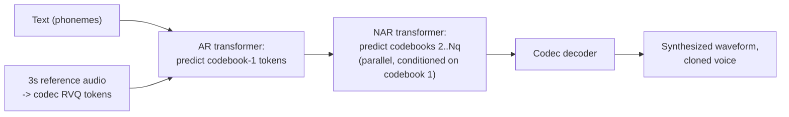

# Concept - Neural Text-to-Speech and Audio Language Models

> **One-paragraph hook:** Text-to-speech used to be a two-stage pipeline bolted together from two different model families. It's now converging on the same recipe that won for text: tokenize the target signal, then train a language model (or a flow model) to predict it. The result — codec-language-model TTS like VALL-E — can clone a voice from 3 seconds of reference audio with no fine-tuning, which is both the headline capability and the headline liability of this generation of systems.

## The mechanism

**The old pipeline.** Two independently-trained stages: an *acoustic model* (Tacotron, FastSpeech) predicts a mel spectrogram (see [[Concept - Audio Spectrograms and Mel Features]]) from text, then a *vocoder* converts that mel spectrogram into a waveform. Early vocoders (WaveNet) generated audio autoregressively one sample at a time — correct but far too slow for real-time use; HiFi-GAN and successors replaced this with a GAN-based feed-forward vocoder that generates a full waveform in one pass, trading a small quality hit for orders-of-magnitude faster synthesis. This pipeline's fundamental limitation: mel spectrograms discard phase (see [[Concept - Audio Spectrograms and Mel Features]]), so the vocoder's whole job is hallucinating plausible phase — an awkward, indirect target.

**The new pipeline: TTS as conditional language modeling over codec tokens.** Instead of predicting a continuous mel spectrogram, treat the discrete tokens from a [[Concept - Neural Audio Codecs and Residual Vector Quantization|neural audio codec]] as the generation target and train an ordinary autoregressive transformer to predict them, conditioned on text.

**VALL-E** (Wang et al. 2023) is the reference architecture. Given input text (as phonemes) and a 3-second reference audio clip encoded into RVQ tokens by EnCodec, an autoregressive transformer predicts the first codebook's token sequence, conditioned on both the text and the reference tokens. Because predicting all $N_q$ codebooks autoregressively would be $N_q\times$ too slow, a second, non-autoregressive transformer then predicts the remaining codebooks in parallel, conditioned on the first codebook and the reference. VALL-E was trained on roughly 60,000 hours of the LibriLight corpus — audiobook-scale data, not curated studio recordings — which is itself part of what makes 3-second zero-shot cloning possible: enough speaker diversity at training time that the model generalizes to unseen voices from a short prompt rather than memorizing a fixed speaker set.

**Why zero-shot cloning works at all.** Speaker identity — timbre, accent, speaking rate, prosodic style — lives almost entirely in *which* acoustic tokens the model chooses to emit, not in some separate embedding that has to be explicitly extracted and injected. Conditioning a plain autoregressive LM on a short prompt's tokens and letting it continue in the same "style" is exactly [[Concept - In-Context Learning|in-context learning]], just applied to audio tokens instead of text tokens — no fine-tuning, no speaker-adaptation step, the same few-shot mechanism that drives prompted behavior in text LLMs.

**Flow/diffusion TTS — the non-autoregressive alternative.** NaturalSpeech 2/3 (Microsoft), Voicebox (Meta, Le et al. 2023), and E2/F5-TTS instead apply [[Concept - Flow Matching]] directly to continuous mel or latent features: a velocity field is trained to transport noise toward a target acoustic representation, conditioned on text and a speaker prompt, generated by integrating the flow ODE over a fixed small number of steps — in parallel across the whole sequence, not left-to-right. This sidesteps autoregressive error accumulation entirely, at the cost of losing the AR variant's natural fit with streaming/incremental generation.

**AudioLM's semantic/acoustic split** (Borsos et al. 2022) generalizes the codec-LM idea beyond speech: predict low-rate *semantic* tokens (from a self-supervised model like w2v-BERT/HuBERT) first, for long-range coherence, then predict *acoustic* tokens (codec RVQ) conditioned on the semantic tokens, for fine timbral detail — separating "what to say and how it should flow" from "what it should sound like," and generalizing to non-speech audio continuation (piano) with the identical mechanism.

**MusicGen** (Copet et al. 2023) applies the codec-LM recipe to music with a single-stage design: rather than VALL-E's AR-then-NAR split, MusicGen offsets each of its $N_q$ codebook streams by a different number of timesteps (a "delay pattern"), letting one autoregressive transformer emit all codebooks with a fixed diagonal dependency structure, conditioned on text and optionally a melody.

## In practice

Production-relevant numbers: VALL-E's headline result is that a 3-second reference clip is sufficient for recognizable zero-shot voice cloning — no per-speaker training. F5-TTS and E2-TTS are fully non-autoregressive flow-matching systems, generating an entire utterance's acoustic representation in parallel rather than token-by-token, which removes AR-style sequential latency at the cost of a fixed multi-step ODE integration.

**Evaluation stack** has three legs: **WER** for intelligibility — run the synthesized audio back through an ASR model (commonly [[Breakdown - Whisper|Whisper]]) and compare the transcription against the input text; **speaker similarity** for cloning fidelity — cosine similarity between speaker embeddings of the reference and generated audio; and **MOS/CMOS** (mean opinion score / comparative MOS) — human ratings of naturalness, since neither WER nor speaker similarity captures prosody quality or artifacts directly.

As of 2026, commercial zero-shot voice cloning (ElevenLabs and similar) and OpenAI's voice models sit alongside open systems like F5-TTS and XTTS as the practical options; production systems generally layer consent gating and watermarking on top of the underlying codec-LM or flow mechanism rather than shipping the raw research recipe unmodified.

## Failure modes

- **AR instability on hard or out-of-distribution text.** Codec-LM AR decoding can skip words, repeat phrases, or degrade into babble on unusual text (numbers, unfamiliar names, code-switched text) — the same decoding-degeneration pathology text LLMs exhibit, here applied to audio tokens, and a direct reason flow/diffusion TTS is often preferred where reliability matters more than the AR variant's streaming-friendliness.
- **Flat or monotone prosody** in flow/diffusion systems when speaker/style conditioning is weak — non-autoregressive generation in parallel across the sequence can under-model long-range prosodic contour if the conditioning signal doesn't carry enough of it.
- **Prompt speaker leakage.** A short or noisy reference clip clones its acoustic environment along with the voice — room reverb, background noise, microphone coloration all get reproduced as if they were part of the speaker's identity.
- **Hallucinated words** — the mirror image of Whisper's silence-hallucination failure: under a strong AR language-modeling prior, the model can insert plausible-sounding words not warranted by the input text, especially at low guidance/conditioning strength.
- **Long-form drift.** Extended generations lose voice consistency, or drift in pace and pitch, over long output sequences — a symptom of compounding small errors similar to exposure bias in other autoregressive generation settings.
- **The dual-use problem is not hypothetical.** 3-second zero-shot cloning is a genuine fraud and non-consensual-impersonation vector (voice-cloning scam calls being the most visible instance), which is the direct driver behind provider-side consent gating and audio watermarking research — this is a mechanism note, but the mechanism itself is why [[Concept - Jailbreak Taxonomy|misuse-resistance]] work exists for this model class specifically.

## The non-obvious

The single biggest lesson from VALL-E is that "speaker identity" was never something that needed a dedicated speaker-embedding module bolted onto the architecture — it falls out for free once you frame TTS as in-context sequence continuation over discrete tokens. This is a genuinely transferable insight: any modality where you can build a good enough discrete tokenizer inherits the entire in-context-learning toolbox that text LLMs get almost by accident from the transformer architecture, with no bespoke conditioning mechanism required.

Folklore, weakly sourced: real-time multimodal systems with low-latency voice (GPT-4o's voice mode being the most cited example) are widely believed to route audio end-to-end through discrete codec tokens rather than a mel-spectrogram-plus-vocoder pipeline, specifically because token-level generation composes naturally with the same autoregressive decode loop already used for text — avoiding a separate, slower vocoder stage sitting in the latency-critical path. OpenAI has not published the exact mechanism, so treat this as informed inference from the architecture family, not a confirmed detail.

## Connections
- [[Concept - Neural Audio Codecs and Residual Vector Quantization]] — the discrete token vocabulary that codec-LM TTS systems (VALL-E, MusicGen) are trained to predict; this note is the direct downstream application of that tokenizer.
- [[Concept - Audio Spectrograms and Mel Features]] — the representation the old acoustic-model-plus-vocoder pipeline targeted before codec tokens replaced it, and still the target for flow-based TTS variants.
- [[Concept - Flow Matching]] — the non-autoregressive generative mechanism behind Voicebox, NaturalSpeech 2/3, and E2/F5-TTS, as an alternative to codec-LM autoregression.
- [[Breakdown - Whisper]] — the recognition-side counterpart; TTS systems are commonly evaluated by transcribing their output with Whisper and measuring WER against the input text.
- [[Concept - Native and Any-to-Any Multimodal Models]] — GPT-4o-style unified audio in/out systems are believed to build on exactly this codec-token generation mechanism, integrated into a single any-to-any transformer.
- [[Concept - Sampling and Decoding Parameters]] — governs the AR codec-LM's token-by-token generation and directly drives the skip/repeat/babble failure modes described above.
- [[Concept - Jailbreak Taxonomy]] — zero-shot voice cloning is a concrete real-world misuse vector, making misuse-resistance and provider-side gating a live concern for this model class specifically, not an abstract safety worry.
- [[Concept - KV Cache]] — the autoregressive stage of codec-LM TTS (predicting the first codebook, VALL-E-style) is served with a KV cache exactly like any other transformer decoder.
- [[Concept - In-Context Learning]] — the mechanism that makes zero-shot voice cloning from a short prompt work at all: conditioning on a short reference and continuing in the same style, without any parameter update.

## Sources
- Wang et al. (2023) — "Neural Codec Language Models are Zero-Shot Text to Speech Synthesizers" (VALL-E) — the reference codec-LM TTS architecture, 3-second zero-shot cloning, AR-first-codebook/NAR-rest scheme.
- Borsos et al. (2022) — "AudioLM: a Language Modeling Approach to Audio Generation" — the semantic-token/acoustic-token hierarchy generalizing codec-LM generation beyond speech.
- Copet et al. (2023) — "Simple and Controllable Music Generation" (MusicGen) — the single-stage delay-pattern codebook-interleaving scheme for music generation.
- Le et al. (2023) — "Voicebox: Text-Guided Multilingual Universal Speech Generation at Scale" (Meta) — flow-matching, non-autoregressive TTS as the alternative to codec-LM autoregression.
