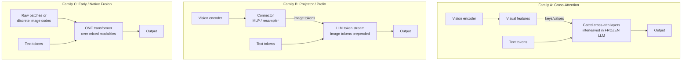

# Concept - VLM Architectures

> **One-paragraph hook:** A vision-language model is an LLM that can see. There are exactly three structural ways to wire the "seeing" into the "language," and which one you pick determines whether the LLM stays frozen, how many tokens an image costs, how many images you can juggle, and how hard training is. Get this taxonomy straight and every open VLM — LLaVA, Qwen2-VL, InternVL, Idefics, Flamingo, Chameleon, Fuyu — snaps into one of three boxes. Get it wrong and you will fight token-budget blowups and "blind" models that ignore the image.

## The mechanism

The universal problem: an image, after a [[Concept - Vision Transformers|vision encoder]], is a set of hundreds of $d$-dimensional feature vectors with completely different statistics and dimensionality from the LLM's text tokens (this mismatch is the [[Concept - Cross-Modal Representation Alignment|cross-modal alignment]] problem, and at the encoder→LLM seam it carries the [[Concept - The Modality Gap in Contrastive Models|modality gap]]). The three families differ in *where and how* those features meet the language model.

**Family A — Cross-attention (Flamingo, Llama-3.2-Vision).** Leave the pretrained LLM's self-attention stack untouched and insert *new* gated cross-attention layers between existing blocks. Visual features act as keys/values; text tokens are queries. The original LLM weights are frozen, so the language model is not disturbed and its text-only ability is preserved exactly. The gates are typically zero-initialized (tanh gating in [[Breakdown - Flamingo|Flamingo]]) so at the start of training the model *is* the original LLM and the visual pathway opens gradually. Strengths: LLM stays frozen (cheap to preserve a strong base), scales gracefully to many images (each image is a separate KV set, not tokens eating the context window). Costs: adds parameters and architectural complexity; the cross-attention layers must be trained from scratch. Llama-3.2-Vision revived this route in 2024 specifically to bolt vision onto Llama-3 without retraining the language weights.

**Family B — Projector / prefix (LLaVA, Qwen-VL, InternVL, Idefics2/3, PaliGemma — most open VLMs).** Run the vision encoder, pass its features through a [[Concept - Vision-Language Connectors|connector]] (an MLP or a resampler), and *prepend the resulting image tokens into the LLM's ordinary token stream* as soft prompts. The LLM sees image tokens and text tokens as one sequence and attends over them with its normal self-attention. This is the simplest and by far the most popular design — no new attention machinery, you reuse the entire LLM stack unchanged. The price: the LLM must be (at least partly) trained to interpret the image tokens, and every image consumes real context-window tokens.

**Family C — Early / native fusion (Fuyu, Chameleon, Gemini).** No separate pretrained vision encoder at all. Either image patches are linearly projected into token embeddings directly (Fuyu — patches straight in, any resolution) or images are tokenized into *discrete* codes that share the vocabulary with text (Chameleon), and a single transformer is trained from scratch over the mixed-modal stream. This is the cleanest conceptually and the hardest to train (see [[Concept - Native and Any-to-Any Multimodal Models]]), but it is where truly unified in-and-out multimodality lives.

## In practice

**The design axes that actually matter:**

- **Frozen vs unfrozen.** Family A freezes the LLM by construction. Family B usually freezes the *encoder* and trains the LLM. Freezing buys stability and data efficiency; unfreezing buys ceiling.
- **Image-token budget.** One 336px CLIP ViT-L/14 image = $24\times24 = 576$ tokens. That is already a large chunk of context per image, and multi-tile [[Concept - Any-Resolution Vision Encoding|any-resolution encoding]] pushes a single high-res image into the thousands of tokens — the dominant cost driver, straining both the [[Concept - KV Cache|KV cache]] and latency. Family A sidesteps this (images live in cross-attention, not the token stream); Family B pays it directly.
- **Attention pattern over image tokens.** Do image tokens attend *bidirectionally* among themselves (they are a set, not a sequence) or *causally* like text? Many projector VLMs leave the causal mask on image tokens; some get a bump from bidirectional intra-image attention.
- **Single vs interleaved.** Single-image-at-the-front (classic LLaVA) vs interleaved image-text (Flamingo/Idefics on webpage-like data), which is what enables multi-image reasoning, few-shot multimodal prompting, and video.

**The LLaVA-style training recipe (the default for Family B):**

1. **Stage 1 — alignment.** Freeze the encoder *and* the LLM; train *only* the connector on caption/interleaved pairs. This teaches the projector to speak the LLM's dialect without disturbing either strong pretrained component.
2. **Stage 2 — instruction tuning.** Unfreeze the LLM (keep the encoder frozen), and [[Concept - Supervised Fine-Tuning (SFT)|supervised-fine-tune]] on high-quality multimodal instructions. **Stage-2 data quality dominates final quality** — more than architecture choices, the instruction mix is what separates a good VLM from a mediocre one.

## Failure modes

- **The "blind" VLM.** Model answers from language priors and ignores the pixels. Detection: counterfactual image-swap — replace the image and see whether the answer changes; if not, the model is blind. Causes: weak alignment (undertrained connector), too-strong LLM prior, or text-heavy SFT.
- **OCR / small-text failure at low resolution.** 336px cannot resolve fine text. Fix: higher resolution or tiling — but watch the token cost.
- **Token-budget blowup.** AnyRes tiling produces thousands of image tokens, overflowing context, slowing prefill, and inflating cost. Symptom: truncated text context and latency spikes.
- **Object/attribute hallucination.** The VLM names plausible-but-absent objects (measured by the POPE benchmark), worsened by strong LLM priors and SFT data that describes prototypical scenes. See [[Gotchas - Vision-Language Models]].

## The non-obvious

The industry *oscillated* between families and the reason is instructive. Flamingo (cross-attention) came first because freezing a strong LLM was the only affordable way to add vision in 2022. LLaVA then showed the projector route was radically simpler and — with good instruction data — competitive, so 2023-2024 open VLMs went almost entirely Family B. Then Llama-3.2-Vision went *back* to cross-attention. Why? Because once you have an enormously valuable, safety-tuned frozen LLM, the projector route's requirement to fine-tune that LLM is a liability: you risk regressing its language and safety behavior. Cross-attention's "don't touch the LLM" property, initially a compute hack, became a *governance* feature. The right family is not fixed by architecture aesthetics; it is set by how precious and how frozen you need the language model to stay.

## Connections

- [[Concept - Vision-Language Connectors]] — the module inside Family B that maps encoder features to image tokens; the up-link that details the projector.
- [[Breakdown - LLaVA]] — the canonical Family B system and the two-stage recipe described here, reverse-engineered.
- [[Breakdown - Flamingo]] — the canonical Family A system with gated cross-attention and the Perceiver resampler.
- [[Concept - Any-Resolution Vision Encoding]] — how the image-token budget explodes when you feed high-res images; the token-count problem.
- [[Concept - Native and Any-to-Any Multimodal Models]] — Family C in depth, including training instabilities and unified generation.
- [[Deep Dive - The Transformer]] — the base architecture all three families extend; prerequisite mechanism.
- [[Concept - Supervised Fine-Tuning (SFT)]] — the stage-2 process whose data quality dominates VLM quality; the down-link.
- [[Concept - KV Cache]] — image tokens live in the KV cache in Family B, which is why token budget drives serving cost.
- [[Concept - Cross-Modal Representation Alignment]] — the domain-level framing of fusion strategies this taxonomy specializes.
- [[Concept - Vision Transformers]] — the encoder that produces the patch features all three families ingest; prerequisite down-link.
- [[Concept - The Modality Gap in Contrastive Models]] — the offset the Family B encoder→LLM seam must bridge; the deep reason a learned projector is needed.
- [[Gotchas - Vision-Language Models]] — the aggregated failure modes (blind VLM, token blowup, hallucination) this taxonomy's tradeoffs produce.

## Sources

- Liu et al. (2023) — *Visual Instruction Tuning* (LLaVA). The projector/prefix family and the two-stage freeze-then-unfreeze recipe.
- Alayrac et al. (2022) — *Flamingo: a Visual Language Model for Few-Shot Learning*. The gated cross-attention family and interleaved training.
- Bavishi et al. (2023) — *Fuyu-8B* (Adept). Encoder-free early fusion: patches projected straight into a decoder-only LLM.
- Team (2024) — *Chameleon: Mixed-Modal Early-Fusion Foundation Models* (Meta). Discrete-token native fusion with mixed-modal training.
