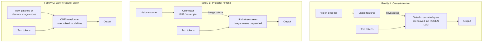

# Concept - VLM Architectures

> **One-paragraph hook:** A vision-language model is an LLM that can see. There are three structural ways to wire the "seeing" into the "language". The one you pick decides whether the LLM stays frozen, what an image costs in tokens, how many images you can handle, and how hard training is. With the taxonomy straight, every open VLM (LLaVA, Qwen2-VL, InternVL, Idefics, Flamingo, Chameleon, Fuyu) drops into one of three boxes. Without it you'll fight token-budget blowups and "blind" models that ignore the image.

## The mechanism

After a [[Concept - Vision Transformers|vision encoder]], an image is hundreds of $d$-dimensional feature vectors with statistics and dimensionality unlike the LLM's text tokens. That mismatch is the [[Concept - Cross-Modal Representation Alignment|cross-modal alignment]] problem, and at the encoder→LLM seam it comes with the [[Concept - The Modality Gap in Contrastive Models|modality gap]]. The three families differ in *where and how* those features meet the language model.

**Family A: cross-attention (Flamingo, Llama-3.2-Vision).** *New* gated cross-attention layers go between the untouched blocks of the pretrained LLM, with visual features as keys/values and text tokens as queries. The LLM weights stay frozen, so its text-only ability is preserved exactly. The gates are typically zero-initialized (tanh gating in [[Breakdown - Flamingo|Flamingo]]), so at the start of training the model *is* the original LLM and the visual pathway opens gradually. Upside: a strong frozen base is cheap to preserve, and many images scale well because each is a separate KV set, not tokens in the context window. Downside: more parameters and complexity, and the cross-attention layers train from scratch. Llama-3.2-Vision revived this route in 2024 to put vision on Llama-3 without retraining the language weights.

**Family B: projector / prefix (LLaVA, Qwen-VL, InternVL, Idefics2/3, PaliGemma; most open VLMs).** Run the vision encoder, pass its features through a [[Concept - Vision-Language Connectors|connector]] (an MLP or a resampler), and *prepend the resulting image tokens to the LLM's ordinary token stream* as soft prompts. The LLM attends over image and text tokens as one sequence with its normal self-attention. It's the simplest design and by far the most popular, since the whole LLM stack is reused unchanged. The cost is that the LLM has to be (at least partly) trained to read the image tokens, and every image eats real context-window tokens.

**Family C: early / native fusion (Fuyu, Chameleon, Gemini).** No separate pretrained vision encoder. Either image patches are projected linearly straight into token embeddings (Fuyu: patches in directly, any resolution), or images are tokenized into *discrete* codes that share the text vocabulary (Chameleon). One transformer trains from scratch over the mixed-modal stream. It's the cleanest conceptually and the hardest to train (see [[Concept - Native and Any-to-Any Multimodal Models]]), and it's where fully unified multimodal input and output lives.

## In practice

**The design axes that matter:**

- **Frozen vs. unfrozen.** Family A freezes the LLM by construction. Family B usually freezes the *encoder* and trains the LLM. Freezing buys stability and data efficiency; unfreezing buys a higher ceiling.
- **Image-token budget.** One 336px CLIP ViT-L/14 image = $24\times24 = 576$ tokens, already a big share of context. Multi-tile [[Concept - Any-Resolution Vision Encoding|any-resolution encoding]] pushes one high-res image into the thousands, the dominant cost driver for both the [[Concept - KV Cache|KV cache]] and latency. Family A avoids it (images live in cross-attention, outside the token stream); Family B pays it in full.
- **Attention pattern over image tokens.** Do image tokens attend to each other *bidirectionally* (they're a set, not a sequence) or *causally* like text? Many projector VLMs leave the causal mask on for image tokens; some gain a little from bidirectional intra-image attention.
- **Single vs. interleaved.** One image at the front (classic LLaVA) vs. interleaved image-text (Flamingo/Idefics on webpage-like data). Interleaving is what enables multi-image reasoning, few-shot multimodal prompting and video.

**The LLaVA-style training recipe (the Family B default):**

1. **Stage 1: alignment.** Freeze the encoder *and* the LLM and train *only* the connector on caption/interleaved pairs. The projector learns the LLM's dialect while both pretrained components stay put.
2. **Stage 2: instruction tuning.** Unfreeze the LLM (the encoder stays frozen) and [[Concept - Supervised Fine-Tuning (SFT)|supervised-fine-tune]] on high-quality multimodal instructions. **Stage-2 data quality dominates final quality.** The instruction mix separates a good VLM from a mediocre one more than architecture choices do.

## Failure modes

- **The "blind" VLM.** The model answers from language priors and ignores the pixels. Detect it with a counterfactual image swap: replace the image, and if the answer doesn't change, the model is blind. Causes: weak alignment (undertrained connector), an overly strong LLM prior, or text-heavy SFT.
- **OCR / small-text failure at low resolution.** 336px can't resolve fine text. Fix it with higher resolution or tiling, and watch the token cost.
- **Token-budget blowup.** AnyRes tiling produces thousands of image tokens that overflow context, slow prefill and inflate cost. Symptom: truncated text context and latency spikes.
- **Object/attribute hallucination.** The VLM names plausible objects that aren't there (the POPE benchmark measures this), made worse by strong LLM priors and SFT data that describes prototypical scenes. See [[Gotchas - Vision-Language Models]].

## The non-obvious

The industry *swung back and forth* between families, and the reason is worth knowing. Flamingo (cross-attention) came first because in 2022 freezing a strong LLM was the only affordable way to add vision. LLaVA then showed the projector route was much simpler and, with good instruction data, competitive, so 2023-2024 open VLMs went almost entirely Family B. Then Llama-3.2-Vision went *back* to cross-attention. Once you own a hugely valuable, safety-tuned frozen LLM, the projector route's need to fine-tune it is a liability: you risk regressing its language and safety behavior. Cross-attention's "don't touch the LLM" property started as a compute hack and became a *governance* feature. Architecture aesthetics don't pick the right family. How precious the language model is, and how frozen it has to stay, does.

## Connections

- [[Concept - Vision-Language Connectors]] — the module inside Family B that maps encoder features to image tokens; the up-link that details the projector.
- [[Breakdown - LLaVA]] — the canonical Family B system and the two-stage recipe described here, reverse-engineered.
- [[Breakdown - Flamingo]] — the canonical Family A system with gated cross-attention and the Perceiver resampler.
- [[Concept - Any-Resolution Vision Encoding]] — how the image-token budget explodes when you feed high-res images; the token-count problem.
- [[Concept - Native and Any-to-Any Multimodal Models]] — Family C in depth, including training instabilities and unified generation.
- [[Deep Dive - The Transformer]] — the base architecture all three families extend; prerequisite mechanism.
- [[Concept - Supervised Fine-Tuning (SFT)]] — the stage-2 process whose data quality dominates VLM quality; the down-link.
- [[Concept - KV Cache]] — image tokens live in the KV cache in Family B, which is why token budget drives serving cost.
- [[Concept - Cross-Modal Representation Alignment]] — the domain-level framing of fusion strategies this taxonomy specializes.
- [[Concept - Vision Transformers]] — the encoder that produces the patch features all three families ingest; prerequisite down-link.
- [[Concept - The Modality Gap in Contrastive Models]] — the offset the Family B encoder→LLM seam must bridge; the deep reason a learned projector is needed.
- [[Gotchas - Vision-Language Models]] — the aggregated failure modes (blind VLM, token blowup, hallucination) this taxonomy's tradeoffs produce.

## Sources

- Liu et al. (2023) — *Visual Instruction Tuning* (LLaVA). The projector/prefix family and the two-stage freeze-then-unfreeze recipe.
- Alayrac et al. (2022) — *Flamingo: a Visual Language Model for Few-Shot Learning*. The gated cross-attention family and interleaved training.
- Bavishi et al. (2023) — *Fuyu-8B* (Adept). Encoder-free early fusion: patches projected straight into a decoder-only LLM.
- Team (2024) — *Chameleon: Mixed-Modal Early-Fusion Foundation Models* (Meta). Discrete-token native fusion with mixed-modal training.
