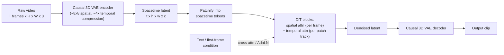

> **One-paragraph hook:** Video is images plus time, and the time part breaks every naive extension of image generation. Run a [[Deep Dive - Diffusion Models|diffusion model]] frame by frame and you get a flipbook that flickers, morphs and forgets what objects looked like two frames ago. The problem is modeling motion together with appearance without the compute exploding, and the whole design space (spacetime patches, factorized attention, causal 3D VAEs) exists to buy temporal consistency the hardware can afford.

## The mechanism

The dominant recipe as of 2024-25: compress video into a spacetime latent, patchify it, and denoise the whole clip at once with a diffusion transformer (DiT) conditioned on text (and optionally an image).

**1. Causal 3D VAE.** A raw clip of $T$ frames at $H \times W$ is far too big to diffuse in pixel space, so a video autoencoder compresses it in space *and* time, typically around 8x8 spatially and 4x temporally. It's [[Concept - Latent Diffusion|latent diffusion]]'s compression logic extended along the time axis (CogVideoX's 3D causal VAE is a public example of this ratio). "Causal" means the encoder only looks backward in time, like a causal LM, so a clip can be extended frame by frame without re-encoding what's already generated. A system can commit to 4 seconds and keep going without fixing clip length upfront.

**2. Spacetime patches.** The compressed latent, shape $t \times h \times w \times c$, is cut into patches the way [[Concept - Vision Transformers|Vision Transformers]] patchify images, except each patch is a small cube of space *and* time. Sora (OpenAI, 2024) calls these "spacetime patches" and treats them as tokens. Variable clip length, resolution and aspect ratio are handled the way [[Concept - Any-Resolution Vision Encoding|any-resolution vision encoding]] handles variable image size: pack a variable number of patch tokens into one sequence instead of resizing everything to a canonical shape (packing goes back to NaViT, Dehghani et al. 2023).

**3. Factorized attention.** This is what makes the approach affordable. Full attention over every spacetime token costs $O(N^2)$ with $N = t \cdot h \cdot w$, the [[Deep Dive - FlashAttention|attention]] quadratic-cost problem with an extra multiplicative axis. For an illustrative order of magnitude, a latent with $t=32$, $h=w=32$ has $N=32{,}768$ tokens, so full 3D attention is $N^2 \approx 1.07\times10^9$ pairwise interactions per layer. Split it into spatial attention (within each of $t$ frames, over its $hw$ tokens: $O(t(hw)^2)$) plus temporal attention (across $t$ frames, per spatial location: $O(hw\,t^2)$) and you get $t(hw)^2 + hw\,t^2 \approx 3.5\times10^7$, roughly 30x cheaper. So essentially every production video model (AnimateDiff, VideoLDM, Stable Video Diffusion, CogVideoX, Sora) interleaves spatial and temporal attention blocks instead of running joint 3D attention everywhere.

**4. Conditioning.** Text conditioning works as in image diffusion (cross-attention or AdaLN modulation from a text encoder). For image-to-video, where a clip continues from a given first frame, the conditioning frame's latent is concatenated into the input or injected through cross-attention. Stable Video Diffusion (Blattmann et al. 2023) is built around this.

The [[Concept - Flow Matching|flow matching]] objective has largely replaced DDPM-style noise prediction in these models. Meta Movie Gen, Veo and most 2024-25 systems train with flow matching instead of the original [[Concept - Diffusion Transformers (DiT)|DiT]] denoising loss, because it gives straighter, more sample-efficient probability paths. That matters more here than for images, since every extra sampling step is multiplied across the whole spacetime volume.

## In practice

There are two lineages. The **inflate-a-2D-model** lineage bolts temporal attention/conv layers onto a frozen or lightly tuned pretrained image U-Net and trains only the new temporal modules on video. AnimateDiff (Guo et al. 2023) keeps the base text-to-image model fully frozen and ships a portable "motion module"; VideoLDM (Blattmann et al. 2023, "Align your Latents") does the same for latent diffusion. Cheap, since no video model trains from scratch, but it inherits the image model's spatial biases and tops out on complex motion.

The **native video DiT** lineage trains a diffusion transformer over spacetime patches from the start: Sora, Kling (Kuaishou), Veo / Veo 2 (Google DeepMind), Meta Movie Gen (a 30B-parameter flow-matching model that also generates synchronized audio), CogVideoX (Yang et al. 2024, open-weight) and Mochi (Genmo, open-weight). These scale better with data and compute but cost far more to train from zero. The open-weight releases matter because most teams can't fine-tune or self-host anything else; the closed systems are API/product-only.

Generation cost drives every product decision. One clip can take minutes of GPU time even with sampling cut to a modest step count, because token count scales with clip length, resolution *and* frame count at once, where image generation only has resolution. That's why consumer products cap free-tier clips at 4-10 seconds and modest resolution and put longer or higher-resolution output behind paid tiers.

## Failure modes

Video inherits every image-diffusion pitfall in [[Gotchas - Diffusion Training and Sampling]], each compounded by the temporal axis.

- **Temporal flicker / morphing.** Appearance jitters frame to frame, or an object's shape drifts, while each frame on its own looks plausible. Detect with per-frame LPIPS or optical-flow discontinuity between consecutive decoded frames. It usually traces to under-trained or under-capacity temporal attention layers, not the spatial ones.
- **Object permanence failures.** An object vanishes or gets replaced by frame 40 with no occlusion event. Detect with simple object tracking; a track that breaks with no plausible occlusion is a permanence failure, not a tracker bug.
- **Physics violations.** Liquids that don't conserve volume, rigid bodies that pass through each other, cloth and hair that ignore motion. Whatever the "world simulator" marketing implies, this is clear evidence the model learned correlational appearance statistics and not a physics engine.
- **Hands and faces.** The image-diffusion failure, compounded by time. A hand that's merely odd in one frame becomes an uncanny, writhing mess across a clip, because temporal attention smooths inconsistent per-frame errors into motion instead of correcting them.
- **Drift over long clips.** Autoregressive extension (generate a chunk, condition the next on the last frame(s), repeat) accumulates error like rollout in any generative sequence model, and color, identity and layout degrade after enough extensions. Detect it by tracking CLIP similarity or FID between the first chunk and the Nth. A monotonic decline is drift, not noise.
- **Evaluation is unsolved.** VBench (Huang et al. 2024) breaks video quality into ~16 dimensions (subject consistency, motion smoothness, dynamic degree, aesthetic quality, etc.) because no single metric captures "does this look real". Even VBench correlates imperfectly with human preference on adversarial or stylized generations, so teams still lean heavily on human eval.

## The non-obvious

The causal 3D VAE sets a hard ceiling on temporal consistency that no diffusion training can lift. If its encode-decode roundtrip is lossy in time, that flicker is baked into every clip the diffusion model generates on top of it. Separate VAE reconstruction error from diffusion sampling error *before* touching the diffusion run, a move practitioners learn the hard way: push a held-out clip through the VAE alone, and if it flickers, the diffusion model was never going to fix it. Teams that skip this burn compute retraining a transformer to fix a bug one layer down.

folklore, weakly sourced: back-of-envelope estimates circulating among practitioners put one 10-second, moderate-resolution clip at one to three orders of magnitude more FLOPs than one high-resolution image. Spacetime token count and multi-step sampling multiply instead of adding, and that's plausibly the main reason video generation trailed image generation by roughly two years despite nearly identical diffusion/flow machinery.

## Connections

- [[Deep Dive - Diffusion Models]] — video DiTs are the spacetime extension of the same denoising framework; the base math (forward noising, reverse denoising, loss) is unchanged.
- [[Concept - Diffusion Transformers (DiT)]] — the spacetime-patch DiT backbone used by Sora and most native video models is a direct extension of the image DiT architecture.
- [[Concept - Flow Matching]] — the objective most 2024-25 video systems (Movie Gen, Veo) train with instead of DDPM-style noise prediction, chosen for sample efficiency since every extra step is expensive at spacetime scale.
- [[Concept - Latent Diffusion]] — video generation inherits the pixel-space-is-too-expensive argument wholesale; the causal 3D VAE is latent diffusion's compression idea extended into time.
- [[Concept - Any-Resolution Vision Encoding]] — the patch-packing trick that lets Sora handle variable duration/resolution/aspect ratio is the same mechanism used for variable image size.
- [[Deep Dive - FlashAttention]] — factorized spatial/temporal attention is a structural workaround for the same $O(N^2)$ HBM-bound attention cost that FlashAttention attacks at the kernel level; production systems need both.
- [[Concept - VQ-VAE and Discrete Visual Tokenization]] — the tokenization lineage (discrete or continuous latent codes for visual data) that video VAEs extend into the temporal axis.
- [[Concept - Scaling Laws]] — the "world simulator" framing rests on the same bet as LLM scaling: that scale plus data, without explicit physics priors, produces emergent world-consistent behavior — a bet that holds only partially, per the physics-violation failure mode above.
- [[Gotchas - Diffusion Training and Sampling]] — the up-link into the deeper, hard-won pitfalls of diffusion training and sampling that every video DiT inherits before the temporal axis adds its own failure modes on top.

## Sources

- OpenAI (2024) — "Video generation models as world simulators" (Sora technical report). Introduces spacetime patches and the DiT-over-video approach at scale.
- Blattmann et al. (2023) — "Align your Latents: High-Resolution Video Synthesis with Latent Diffusion Models" (VideoLDM). Inflates a pretrained image latent diffusion model with temporal layers.
- Blattmann et al. (2023) — "Stable Video Diffusion: Scaling Latent Video Diffusion Models to Large Datasets." Image-to-video conditioning and a three-stage (image pretrain, video pretrain, video finetune) training curriculum.
- Guo et al. (2023) — "AnimateDiff: Animate Your Personalized Text-to-Image Diffusion Models without Specific Tuning." Portable motion module bolted onto a frozen text-to-image backbone.
- Yang et al. (2024) — "CogVideoX: Text-to-Video Diffusion Models with An Expert Transformer." Open-weight native video DiT with a causal 3D VAE.
- Dehghani et al. (2023) — "Patch n' Pack: NaViT, a Vision Transformer for Any Aspect Ratio and Resolution." Source of the variable-shape patch-packing technique video DiTs reuse.
- Huang et al. (2024) — "VBench: Comprehensive Benchmark Suite for Video Generative Models." Multi-dimensional evaluation because no single metric captures video quality.
- Meta (2024) — "Movie Gen: A Cast of Media Foundation Models." 30B-parameter flow-matching video (and audio) generation system.
