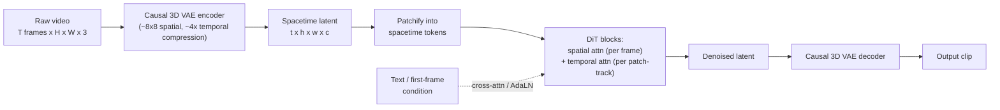

> **One-paragraph hook:** Video is images plus time, and that "plus time" breaks every naive extension of image generation: run a [[Deep Dive - Diffusion Models|diffusion model]] frame-by-frame and you get a flipbook that flickers, morphs, and forgets what objects looked like two frames ago. Video generation is the engineering problem of modeling motion jointly with appearance without the compute exploding — the entire design space (spacetime patches, factorized attention, causal 3D VAEs) exists to buy temporal consistency at a cost the hardware can actually pay.

## The mechanism

The dominant recipe as of 2024-25 is: compress video into a spacetime latent, patchify it, and denoise the whole clip at once with a diffusion transformer (DiT) conditioned on text (and optionally an image).

**1. Causal 3D VAE.** A raw clip of $T$ frames at $H \times W$ is far too large to diffuse in pixel space, so a video-specific autoencoder compresses it in space *and* time — typically around 8x8 spatially and 4x temporally, the same compression logic as [[Concept - Latent Diffusion|latent diffusion]] extended into the time axis (CogVideoX's 3D causal VAE is a public example of this ratio). "Causal" means the encoder only looks backward in time, like a causal LM, so a clip can be extended frame-by-frame without re-encoding everything already generated — that's what lets a system commit to 4 seconds and keep going rather than fixing clip length upfront.

**2. Spacetime patches.** The compressed latent — shape $t \times h \times w \times c$ — is cut into patches the same way [[Concept - Vision Transformers|Vision Transformers]] patchify images, except each patch spans a small cube of space *and* time. Sora (OpenAI, 2024) calls these "spacetime patches" and treats them exactly like tokens: variable clip length, resolution, and aspect ratio are handled the same way [[Concept - Any-Resolution Vision Encoding|any-resolution vision encoding]] handles variable image size — packing a variable number of patch-tokens into one sequence instead of resizing everything to a canonical shape (the packing technique traces to NaViT, Dehghani et al. 2023).

**3. Factorized attention.** This is what makes the approach tractable. Full attention over every spacetime token costs $O(N^2)$ where $N = t \cdot h \cdot w$ — the [[Deep Dive - FlashAttention|attention]] quadratic-cost problem with an extra multiplicative axis. Illustrative order of magnitude: a latent of $t=32$, $h=w=32$ has $N=32{,}768$ tokens, so full 3D attention costs $N^2 \approx 1.07\times10^9$ pairwise interactions per layer. Factorizing into spatial attention (within each of $t$ frames, over its $hw$ tokens: $O(t(hw)^2)$) plus temporal attention (across $t$ frames, per spatial location: $O(hw\,t^2)$) gives $t(hw)^2 + hw\,t^2 \approx 3.5\times10^7$ — roughly 30x cheaper. That's why essentially every production video model (AnimateDiff, VideoLDM, Stable Video Diffusion, CogVideoX, Sora) interleaves spatial and temporal attention blocks instead of doing joint 3D attention everywhere.

**4. Conditioning.** Text conditioning works as in image diffusion (cross-attention or AdaLN modulation from a text encoder). Image-to-video conditioning — continuing a clip from a given first frame — concatenates the conditioning frame's latent into the input or injects it via cross-attention; Stable Video Diffusion (Blattmann et al. 2023) is built around exactly this.

The [[Concept - Flow Matching|flow matching]] objective has largely replaced DDPM-style noise prediction for these models (Meta Movie Gen, Veo, and most 2024-25 systems train with flow matching rather than the original [[Concept - Diffusion Transformers (DiT)|DiT]] denoising loss) because it gives straighter, more sample-efficient probability paths — which matters more here than in image diffusion because every extra sampling step is multiplied across the whole spacetime volume.

## In practice

Two lineages exist. The **inflate-a-2D-model** lineage bolts temporal attention/conv layers onto a frozen or lightly-tuned pretrained image U-Net and trains only the new temporal modules on video: AnimateDiff (Guo et al. 2023) keeps the base text-to-image model completely frozen and ships a portable "motion module"; VideoLDM (Blattmann et al. 2023, "Align your Latents") does the same for latent diffusion. Cheap — no video model trained from scratch — but it inherits the image model's spatial biases and caps out on complex motion.

The **native video DiT** lineage trains a diffusion transformer over spacetime patches from the start: Sora, Kling (Kuaishou), Veo / Veo 2 (Google DeepMind), Meta Movie Gen (a 30B-parameter flow-matching model that also generates synchronized audio), CogVideoX (Yang et al. 2024, open-weight), and Mochi (Genmo, open-weight). These scale better with data and compute but cost far more to train from zero. The open-weight releases matter operationally — they're the only variant of this technology most teams can fine-tune or self-host, since the closed systems are API/product-only.

Generation cost shapes every product decision here: a single clip can take minutes of GPU time even after reducing sampling to a modest step count, because token count scales with clip length, resolution, *and* frame count simultaneously — unlike image generation, where only resolution matters. That's why consumer products cap free-tier clips at 4-10 seconds and modest resolution, gating longer or higher-resolution output behind paid tiers.

## Failure modes

Video inherits every practitioner pitfall already catalogued for image diffusion training and sampling in [[Gotchas - Diffusion Training and Sampling]], then compounds each one across the added temporal axis.

- **Temporal flicker / morphing** — frame-to-frame appearance jitters or an object's shape drifts even though each individual frame looks plausible. Detect with per-frame LPIPS or optical-flow discontinuity between consecutive decoded frames; usually traces to under-trained or under-capacity temporal attention layers, not the spatial ones.
- **Object permanence failures** — an object vanishes or is replaced by frame 40 with no occlusion event. Detect via simple object tracking across the decoded clip; a track that breaks without a plausible occlusion is a permanence failure, not a tracker bug.
- **Physics violations** — liquids that don't conserve volume, rigid bodies that interpenetrate, cloth/hair that doesn't respond to motion. Clear evidence the model learned correlational appearance statistics, not a physics engine, whatever the "world simulator" marketing implies.
- **Hands and faces** — the same failure as image diffusion, compounded by time: a hand merely odd in one frame becomes an uncanny, writhing mess across a clip because temporal attention smooths inconsistent per-frame errors into motion rather than correcting them.
- **Drift over long clips** — autoregressive extension (generate a chunk, condition the next on the last frame(s), repeat) accumulates error like rollout does in any generative sequence model; color, identity, and layout degrade after enough extensions. Detect by tracking CLIP-similarity or FID between the first chunk and the Nth — a monotonic decline is drift, not noise.
- **Evaluation is unsolved.** VBench (Huang et al. 2024) decomposes video quality into ~16 dimensions (subject consistency, motion smoothness, dynamic degree, aesthetic quality, etc.) because no single metric captures "does this look real," and even VBench correlates imperfectly with human preference on adversarial or stylized generations — teams still lean heavily on human eval.

## The non-obvious

The causal 3D VAE sets a hard ceiling on achievable temporal consistency that no amount of diffusion training can fix: if its encode-decode roundtrip is itself lossy in time, that flicker is baked into every clip the diffusion model produces on top of it. The debugging move practitioners learn the hard way is to isolate VAE reconstruction error from diffusion sampling error *before* touching the diffusion training run — reconstruct a held-out clip through the VAE alone, and if it flickers, the diffusion model was never going to fix it. Teams that skip this step burn compute retraining a transformer to fix a bug that lives one layer down.

folklore, weakly sourced: back-of-envelope estimates circulating among practitioners put a single 10-second, moderate-resolution clip at one to three orders of magnitude more FLOPs than one high-resolution image — spacetime token count and multi-step sampling multiply against each other rather than adding, which is plausibly the real reason video generation trailed image generation by roughly two years despite using nearly identical diffusion/flow machinery.

## Connections

- [[Deep Dive - Diffusion Models]] — video DiTs are the spacetime extension of the same denoising framework; the base math (forward noising, reverse denoising, loss) is unchanged.
- [[Concept - Diffusion Transformers (DiT)]] — the spacetime-patch DiT backbone used by Sora and most native video models is a direct extension of the image DiT architecture.
- [[Concept - Flow Matching]] — the objective most 2024-25 video systems (Movie Gen, Veo) train with instead of DDPM-style noise prediction, chosen for sample efficiency since every extra step is expensive at spacetime scale.
- [[Concept - Latent Diffusion]] — video generation inherits the pixel-space-is-too-expensive argument wholesale; the causal 3D VAE is latent diffusion's compression idea extended into time.
- [[Concept - Any-Resolution Vision Encoding]] — the patch-packing trick that lets Sora handle variable duration/resolution/aspect ratio is the same mechanism used for variable image size.
- [[Deep Dive - FlashAttention]] — factorized spatial/temporal attention is a structural workaround for the same $O(N^2)$ HBM-bound attention cost that FlashAttention attacks at the kernel level; production systems need both.
- [[Concept - VQ-VAE and Discrete Visual Tokenization]] — the tokenization lineage (discrete or continuous latent codes for visual data) that video VAEs extend into the temporal axis.
- [[Concept - Scaling Laws]] — the "world simulator" framing rests on the same bet as LLM scaling: that scale plus data, without explicit physics priors, produces emergent world-consistent behavior — a bet that holds only partially, per the physics-violation failure mode above.
- [[Gotchas - Diffusion Training and Sampling]] — the up-link into the deeper, hard-won pitfalls of diffusion training and sampling that every video DiT inherits before the temporal axis adds its own failure modes on top.

## Sources

- OpenAI (2024) — "Video generation models as world simulators" (Sora technical report). Introduces spacetime patches and the DiT-over-video approach at scale.
- Blattmann et al. (2023) — "Align your Latents: High-Resolution Video Synthesis with Latent Diffusion Models" (VideoLDM). Inflates a pretrained image latent diffusion model with temporal layers.
- Blattmann et al. (2023) — "Stable Video Diffusion: Scaling Latent Video Diffusion Models to Large Datasets." Image-to-video conditioning and a three-stage (image pretrain, video pretrain, video finetune) training curriculum.
- Guo et al. (2023) — "AnimateDiff: Animate Your Personalized Text-to-Image Diffusion Models without Specific Tuning." Portable motion module bolted onto a frozen text-to-image backbone.
- Yang et al. (2024) — "CogVideoX: Text-to-Video Diffusion Models with An Expert Transformer." Open-weight native video DiT with a causal 3D VAE.
- Dehghani et al. (2023) — "Patch n' Pack: NaViT, a Vision Transformer for Any Aspect Ratio and Resolution." Source of the variable-shape patch-packing technique video DiTs reuse.
- Huang et al. (2024) — "VBench: Comprehensive Benchmark Suite for Video Generative Models." Multi-dimensional evaluation because no single metric captures video quality.
- Meta (2024) — "Movie Gen: A Cast of Media Foundation Models." 30B-parameter flow-matching video (and audio) generation system.
