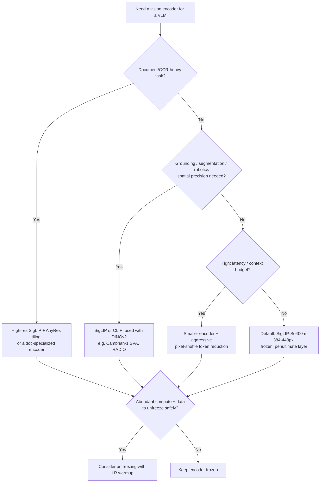

# Decision - Choosing a Vision Encoder for a VLM

> **The decision:** which pretrained vision tower feeds your [[Concept - VLM Architectures|VLM]]'s connector — this sits downstream of the [[Concept - Cross-Modal Representation Alignment]] paradigm choice (contrastive shared space vs. fusion into an LM); once you've picked fusion, this is the next decision. **Default for the 80% case (as of 2025):** SigLIP-So400m at 384–448px, frozen, penultimate-layer features.

## Decision flow

## Tradeoff matrix

Every encoder below is a [[Concept - Vision Transformers|Vision Transformer]] variant; they differ in training objective, scale, and native resolution.

| Encoder | Params | Native res | Language-aligned? | Strength | Weakness |
|---|---|---|---|---|---|
| CLIP ViT-L/14-336 ([[Concept - CLIP and Contrastive Vision-Language Training]]) | 304M | 336px | Yes | Legacy default, huge ecosystem support (LLaVA lineage) | Weaker OCR/detail than SigLIP at comparable scale; softmax-InfoNCE couples quality to global batch size |
| SigLIP-So400m/384 ([[Concept - SigLIP and the Sigmoid Contrastive Loss]]) | 400M | 384–448px | Yes | Modern default: stronger features, decouples from global batch size, good OCR at higher res | Still inherits weak compositionality from the contrastive-objective family |
| DINOv2-L/14 | 300M | 224–518px | No | Best pure dense/spatial features (segmentation, depth, correspondence) | Not language-aligned — weak alone for VQA; needs fusion with a CLIP/SigLIP tower |
| EVA-CLIP | up to ~4B | 224–448px | Yes | Very strong at scale, used in high-end open VLMs | Larger and more expensive to serve as a frozen tower |
| Fused (Cambrian-1 SVA, RADIO) | varies | varies | Mixed | Combines language alignment + spatial precision from multiple teachers | More complex connector; more encoder inference cost |

## The details that flip the decision

- **OCR / document understanding** flips the default toward high-resolution SigLIP with [[Concept - Any-Resolution Vision Encoding]] tiling, or a document-specialized encoder — 336px cannot resolve small glyphs no matter how good the downstream LLM is.
- **Grounding, segmentation, robotics** flips toward adding DINOv2: contrastively-trained encoders optimize for "which caption matches," not "where exactly is this edge," so their dense features are noisier for pixel-level tasks. Cambrian-1's spatial-vision-aggregator and RADIO (multi-teacher distillation) both exist specifically to import DINOv2-quality spatial features into a language-aligned setup.
- **Tight latency/context budget** flips toward a smaller encoder plus aggressive token reduction in the connector — pixel-shuffle/unshuffle (InternVL) merges 2×2 patch neighborhoods for a 4× token reduction, trading some fine detail for a much smaller image-token footprint; see [[Concept - Vision-Language Connectors]]. Fewer image tokens directly lowers prefill cost and time-to-first-token — see [[Concept - Latency, Throughput, and Cost in LLM Serving]] — so the "best" encoder on an academic benchmark is not always the best encoder for a latency-budgeted product.
- **Which feature layer:** the LLaVA finding that the *penultimate* ViT layer beats the *last* layer generalizes across CLIP and SigLIP — the last layer is over-specialized to the contrastive objective (maximizing global image-text similarity) and discards spatial detail the penultimate layer retains.
- **Frozen vs. tuned:** freezing is the safe default — it's what makes the LLaVA-style two-stage recipe ([[Playbook - Training a VLM from a Vision Encoder and an LLM]]) stable and data-efficient. Unfreezing can push perception quality further but risks degrading the encoder's pretrained features if the LR is too high or data too narrow — the same frozen-vs-adapt risk calculus as [[Decision - Fine-Tuning vs RAG vs Prompting]] for any pretrained-then-adapted component; it needs an LR warmup and enough data to be worth the instability risk.

## Connections
- [[Concept - Cross-Modal Representation Alignment]] — the shared-space-vs-fusion framing this decision sits inside; the encoder choice only matters because of how it feeds the fusion.
- [[Concept - CLIP and Contrastive Vision-Language Training]] — the legacy default encoder family and its contrastive training mechanism.
- [[Concept - SigLIP and the Sigmoid Contrastive Loss]] — the modern default and why its sigmoid loss trains better at the batch sizes practitioners actually use.
- [[Concept - Vision Transformers]] — the architecture underlying every encoder in the matrix; patch size and resolution choices originate here.
- [[Concept - Any-Resolution Vision Encoding]] — the mechanism that lets any of these encoders handle real-world image sizes, at a token-count cost.
- [[Concept - Vision-Language Connectors]] — the module downstream of this decision that must bridge whatever modality gap the chosen encoder leaves.
- [[Concept - VLM Architectures]] — the overall wiring this encoder plugs into; cross-attention vs. projector families constrain which encoders are practical.
- [[Decision - Fine-Tuning vs RAG vs Prompting]] — the general frozen-vs-adapt tradeoff this decision's "unfreeze or not" question is a specific instance of.
- [[Concept - Latency, Throughput, and Cost in LLM Serving]] — the serving-cost side of the resolution/token-budget tradeoff that an accuracy-only view misses.

## Sources
- Radford et al. (2021) — Learning Transferable Visual Models From Natural Language Supervision (CLIP). Establishes the dual-encoder contrastive baseline this decision compares against.
- Zhai et al. (2023) — Sigmoid Loss for Language Image Pre-Training (SigLIP). The modern default encoder's training objective.
- Oquab et al. (2023) — DINOv2: Learning Robust Visual Features without Supervision. The dense-feature alternative used for grounding-heavy tasks.
- Liu et al. (2023/2024) — LLaVA / LLaVA-1.5. Source of the penultimate-layer-features finding.
